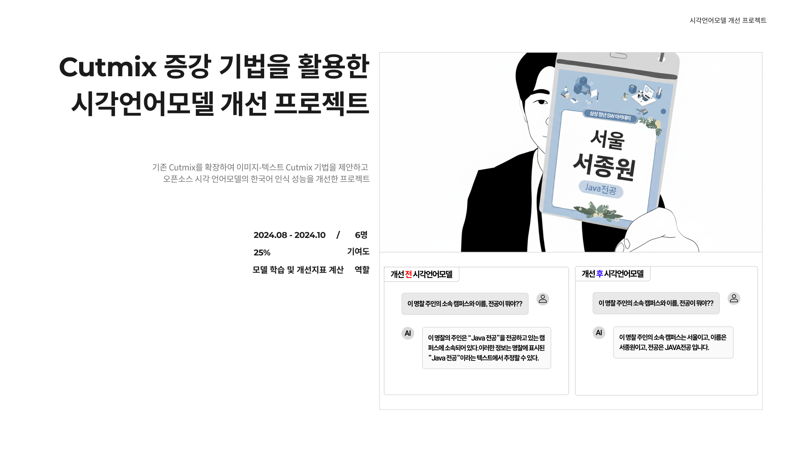

## 프로젝트 개요
- **기간 및 구성**: 24.08 - 24.10
- **주요 기술 스택**: Python, OpenAI API, Gradio
- **개요**: 오픈소스 VLM의 이미지 속 한국어 인식성능 저하 문제 해결
- **담당 역할**
  - **학습 데이터 합성, 대화, 텍스트 유형 설계**
  - Vast.ai 플랫폼 활용 **LoRA 기반 파인튜닝 수행**
  - OpenAI Batch API 활용 **실생활 평가용 데이터 구축**
  - OpenAI Batch API 활용 **평가 지표 산출**
  - Gradio 활용 **데모 페이지 제작** 및 **시나리오 테스트**