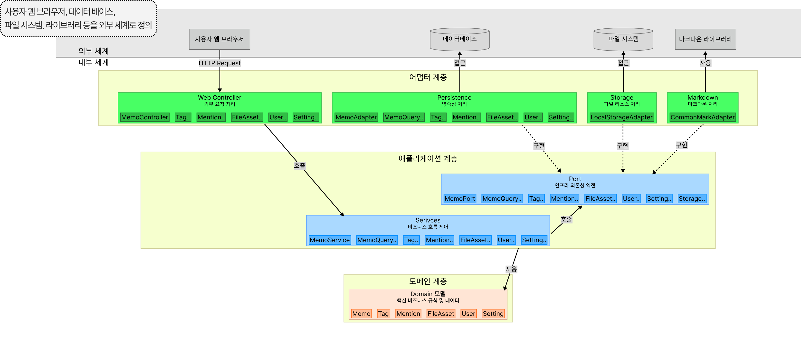

## 프로젝트 개요

- **기간 및 구성**: 25.03.04 - 25.05.31
- **주요 기술 스택**: Java, SpringBoot, MySQL, QueryDSL
- **개요**: 기존 그룹웨어는 게시판·그룹 중심이라 즉각적인 협업 메모 공유에 한계가 있습니다. 본 프로젝트는 벤치마킹 서비스의 장점인
  단순함, 간편함, 빠른 공유성을 결합하여, 별도의 그룹 설정 없이도 떠오르는 아이디어나 간단한 업무 내용을 즉시 메모하고 공유할 수 있는 기능을 구현
- **담당 역할**
  - MySQl DB 설계, 독립 환경 채점 서버 구현, GraphCodeBERT 미세조정 등 백엔드에 전반적인 기능 구현 및 Docker를 통한 패키징 및 AWS 배포를 맡아서 진행
  - Docker Compose 기반의 서비스 정의 및 컨테이너 오케스트레이션을 통해 DB, 채점 서버, UI 서비스를 일괄 패키징 및 관리
  - Docker 바인드 마운트를 활용하여 플러그인 파일 시스템 설계 및 구현, 폴더에 플러그인 추가 후 재부팅으로 간편하게 적용 가능하게 구현
  - linux 커널을 활용하는 샌드박스 도구를 통해 독립 환경 채점 환경 구현
  - Celery의 병렬성으로 인한 샌드박스 ID 동시 할당 문제 해결을 위해 Redis를 활용하여 연산 원자성을 보장하고 성능을 최적화했습니다. 이를 통해 6-core 서버 기준 동시 채점 수를 1개에서 6개로 확장
  - 논리적 오류 수정 기능을 위해 자연어-코드 영역의 논문을 20편 이상 읽어보고 GraphCodeBERT 미세조정을 하여 73.6 유사도를 기록하는 모델을 개발
