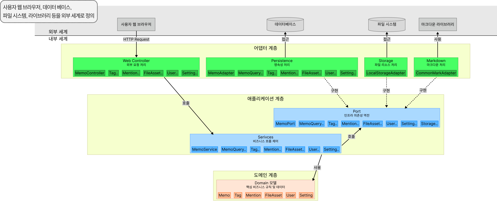

## 프로젝트 개요

- **기간 및 구성**: 25.03.04 - 25.05.31
- **주요 기술 스택**: Java, SpringBoot, MySQL, QueryDSL
- **개요**: 기존 그룹웨어는 게시판·그룹 중심이라 즉각적인 협업 메모 공유에 한계가 있습니다. 본 프로젝트는 벤치마킹 서비스의 장점인
  단순함, 간편함, 빠른 공유성을 결합하여, 별도의 그룹 설정 없이도 떠오르는 아이디어나 간단한 업무 내용을 즉시 메모하고 공유할 수 있는 기능을 구현
- **담당 역할**
  - 기존 하이웍스 그룹웨어 기능 및 오픈소스 Memos 분석, 공유 메모 기능 기획 및 요구사항 정의 
  - 기존 그룹웨어와의 연동성, 유지보수성을 고려한 ERD 및 시스템 아키텍처 설계
  - Adapter, Application, Domain 계층으로 구성한 의존성 분리 구조 설계 및 구현     
  - 커스텀 마크다운 문법을 설계하고 인라인 태그 및 사용자 멘션 파서, 렌더러 구현     
  - Personal / Mentioned / Everyone으로 구분되는 메모 공유 범위 및 접근 권한 정책 설계
  - 회사, 사용자, 멘션, 태그 조건을 조합한 QueryDSL 기반 메모 접근 제어 및 검색 로직 구현
