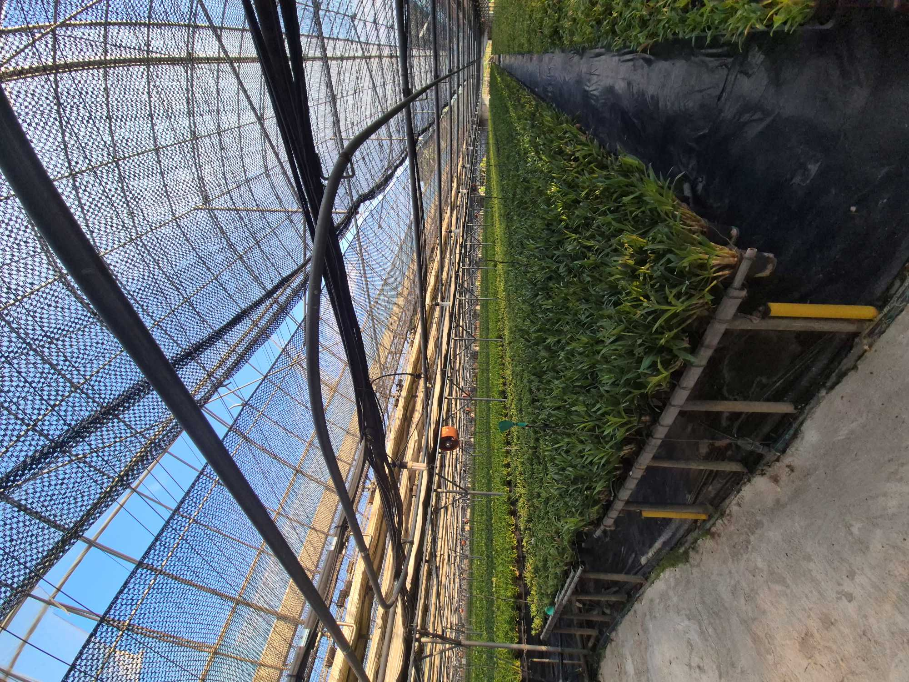

`Green-house`는 본가에서 운영하는 난 농장의 업무 흐름을 웹에서 관리하기 위해 만든 시스템이다.

20년 동안 머릿속 기억, 농정일지, 종이 전표로 관리되던 농장의 위치, 작업, 품종, 판매, 경매, 정산, 입금 흐름을 하나의 시스템으로 옮기는 것을 목표로 했다.

## 이후 운영 개선

베타 버전 배포 이후에는 실제 운영하면서 발견한 문제와 개선 과정을 별도 글로 정리할 예정이다.
