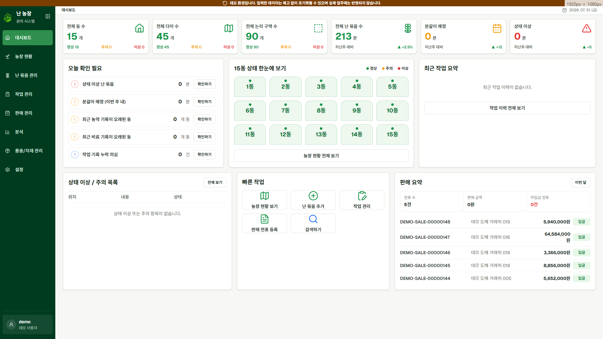
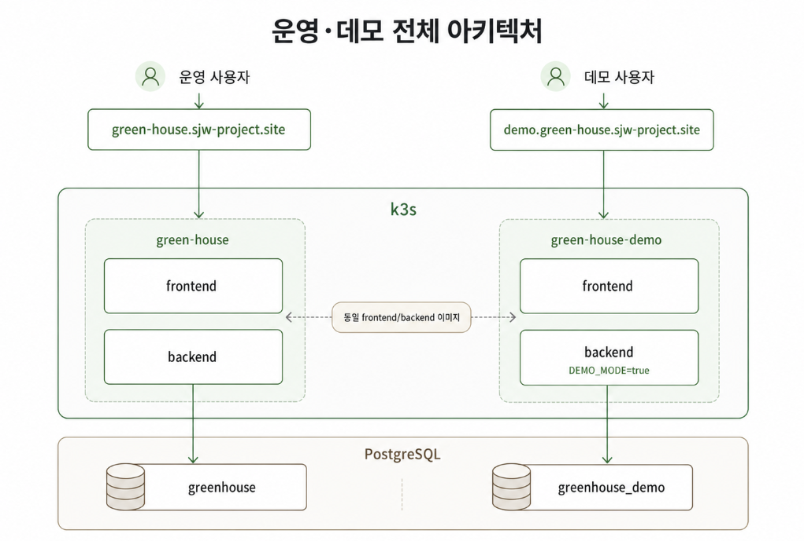
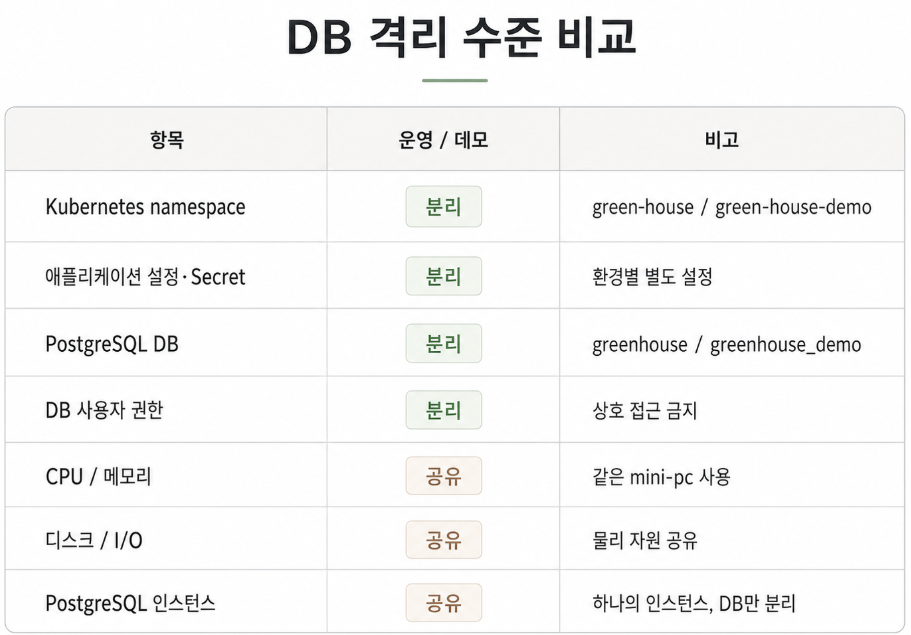
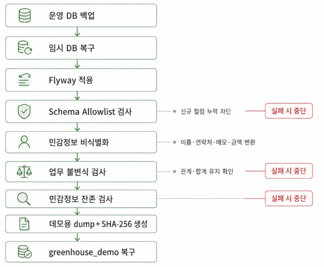
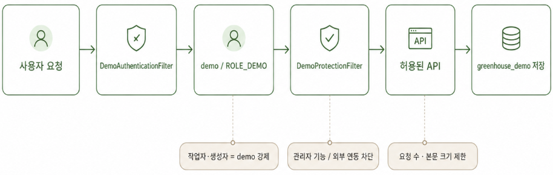

가족이 운영하는 농장의 업무를 디지털화하기 위해 농장 관리 시스템을 개발하고 있다.

농장 위치와 난 묶음, 작업 이력뿐 아니라 판매 전표, 경매 결과, 정산과 입금 내역까지 관리하는 시스템이다. 단순한 포트폴리오용 프로젝트가 아니라 실제 농장에서 사용하고 있기 때문에, 외부에 시스템을 보여주는 일은 생각보다 간단하지 않았다.

운영 서버를 그대로 공개하면 실제 데이터가 노출될 수 있다. 반대로 화면만 볼 수 있는 읽기 전용 계정을 제공하면 분갈이, 난 묶음 이동, 작업 실행처럼 이 시스템의 핵심 기능을 충분히 보여주기 어렵다.

따라서 다음 조건을 만족하는 별도의 데모 시스템을 구축했다.

* 운영 시스템과 같은 기능을 사용할 수 있어야 한다.
* 사용자가 데이터를 직접 생성하고 수정할 수 있어야 한다.
* 운영 데이터와 계정 정보는 노출되지 않아야 한다.
* 데모에서 발생한 부하나 잘못된 요청이 운영에 미치는 영향을 줄여야 한다.
* 일정 주기로 데이터를 초기 상태로 되돌릴 수 있어야 한다.
* 운영과 데모의 애플리케이션 버전이 달라지지 않아야 한다.


## 전체 구성

운영과 데모는 같은 미니 PC와 k3s 클러스터에서 실행하지만 Kubernetes namespace와 데이터베이스를 분리했다.

```text
k3s
├─ green-house
│  ├─ frontend
│  └─ backend
│
└─ green-house-demo
   ├─ frontend
   └─ backend

PostgreSQL
├─ greenhouse
└─ greenhouse_demo
```

운영과 데모는 동일한 프론트엔드·백엔드 이미지를 사용한다. 별도의 데모용 코드를 빌드하는 대신 런타임 환경변수인 `DEMO_MODE`로 동작을 구분했다.

이 방식은 운영과 데모의 기능 차이를 줄여준다. 동일한 커밋 SHA의 이미지를 배포하기 때문에 운영에는 있지만 데모에는 없거나, 데모에서만 동작하는 코드가 생길 가능성도 작아진다.




## 인증을 끄는 것과 데모 모드는 다르다

처음에는 데모 환경에서 기존의 `AUTH_ENABLED` 값을 끄는 방식을 고려했다.

하지만 인증을 비활성화하는 것만으로는 충분하지 않았다. 요청은 통과하지만 누가 작업을 생성했는지 나타내는 인증 주체가 존재하지 않기 때문이다. 일부 API에서는 작업자나 생성자 이름을 요청 본문으로 전달하고 있었기 때문에, 사용자가 임의의 이름을 기록할 수도 있었다.

이에 `DEMO_MODE=true`일 때 백엔드가 내부적으로 다음 인증 주체를 생성하도록 구성했다.

```text
username: demo
role: ROLE_DEMO
```

데모 환경에서 발생한 생성과 수정은 모두 `demo` 사용자의 작업으로 기록한다. 요청에서 작업자 이름을 보내더라도 필요한 값은 서버의 인증 주체를 기준으로 결정한다.

프론트엔드에서는 로그인 화면을 거치지 않고 바로 시스템에 접근하도록 했다. 화면 상단에는 현재 데모 환경이라는 점과 데이터가 초기화될 수 있다는 안내를 표시한다.

`AUTH_ENABLED=false`는 테스트 환경을 위한 설정으로 남기고, 공개 데모는 별도의 인증 정책을 가진 `DEMO_MODE`로 분리했다.


## 기능은 열어두되 운영 기능은 차단했다

데모의 목적은 화면을 구경하는 것이 아니라 시스템의 실제 업무 흐름을 체험하는 것이다.

따라서 다음과 같은 주요 기능은 사용할 수 있도록 했다.

* 난 묶음 등록과 이동
* 사용자 그룹과 자동 그룹 사용
* 작업 생성과 실행
* 분갈이, 분주, 합식 등 구조 변경 작업
* 판매 전표 작성
* 경매 결과와 정산 데이터 입력

반면 데모에서 실행할 이유가 없거나 외부 시스템에 영향을 줄 수 있는 기능은 차단했다.

* 계정과 권한 관리
* 운영 설정 변경
* 정산 자동화 설정 변경

버튼을 화면에서 숨기는 것만으로는 보호가 되지 않는다. 직접 API를 호출할 수도 있기 때문에 최종 차단은 백엔드에서 `ROLE_DEMO` 권한을 기준으로 수행한다.

또한 공개 쓰기 환경에서 데이터가 무제한으로 생성되지 않도록 다음 제한도 추가했다.

* 분당 요청 수 제한
* 분당 변경 요청 수 제한
* 일일 변경량 제한
* 요청 본문 크기 제한
* 데모 Hikari Connection Pool 제한
* PostgreSQL 사용자 연결 수 제한
* 쿼리와 잠금 대기 시간 제한


## 데이터베이스는 인스턴스가 아니라 DB 단위로 분리했다

처음에는 운영과 데모 PostgreSQL 인스턴스를 완전히 분리하는 방안도 검토했다.

그러나 두 인스턴스를 같은 미니 PC에서 실행한다면 CPU, 메모리, 디스크 I/O와 저장 공간은 여전히 공유한다. PostgreSQL 프로세스를 분리해도 물리 장애까지 격리되는 것은 아니었다.

현재 규모에서는 운영 복잡도와 자원 사용량을 고려해 하나의 PostgreSQL 인스턴스 안에서 DB를 분리하는 방식을 선택했다. 대신 계정과 권한은 분리했다.

* 데모 애플리케이션 계정은 `greenhouse_demo`에만 접속할 수 있다.
* 데모 계정에는 운영 DB 권한을 부여하지 않는다.
* 애플리케이션 계정과 마이그레이션·초기화 계정을 분리한다.
* `PUBLIC CONNECT`와 불필요한 Schema 생성 권한을 제거한다.
* `pg_hba.conf`에서 사용자와 DB 조합을 제한한다.

이 구조는 장애를 완전히 격리하지는 못한다. 데모에서 과도한 쿼리를 실행하거나 디스크를 모두 사용하면 운영에도 영향을 줄 수 있다.

따라서 DB 분리는 보안과 설정 실수를 막는 **논리적 격리**로 보고, 실제 자원 영향은 연결 수, 쿼리 제한, API 제한과 모니터링으로 통제했다.



## 실제 운영 데이터를 데모에 그대로 사용할 수는 없었다

농장 시스템에는 단순한 난 묶음 정보만 있는 것이 아니다.

* 작업자 이름
* 거래처명과 대표자명
* 전화번호와 주소
* 계좌 및 입금자 정보
* 자유 입력 메모
* 판매 수량과 단가
* 경매와 정산 내역
* JSON 형태로 저장된 작업 상세

이 중 일부 컬럼만 마스킹해서는 안전하다고 보기 어려웠다. 전화번호를 지우더라도 거래처명, 날짜, 희귀 품종과 금액 조합을 통해 실제 대상을 추정할 수 있기 때문이다.

그렇다고 모든 값을 무작위로 바꾸면 시스템의 업무 관계가 깨진다.

예를 들어 판매 데이터는 다음 관계를 유지해야 한다.

```text
수량 × 단가 = 품목 금액
품목 금액 합계 = 전표 총액
경매 결과 합계 = 정산 대상 금액
정산 금액 - 입금액 = 미수금
```

작업 데이터도 마찬가지다.

```text
작업 시작일 ≤ 작업 완료일
원본 난 묶음 → 분갈이 결과 난 묶음
작업 대상 → 실행 결과 → 작업 이력
```

따라서 단순 마스킹이 아니라 **업무 관계를 유지하는 비식별화 파이프라인**을 만들었다.

## 격리된 임시 DB에서 비식별화를 수행했다

비식별화 SQL을 운영 DB에 직접 실행하지 않는 것을 가장 중요한 원칙으로 정했다.

전체 처리 과정은 다음과 같다.

```text
운영 DB 백업
→ 격리된 곳에서 운영 백업본으로 임시 DB 복구
→ 최신 Flyway 마이그레이션 적용
→ 불필요한 데이터 제거
→ 민감 데이터 비식별화
→ 업무 관계와 합계 검증
→ 민감정보 잔존 검사
→ 데모용 dump 생성
→ greenhouse_demo에 복구
→ 임시 DB와 원본 백업 폐기
```

신규 테이블이나 컬럼이 생겼을 때 검사를 우회한 채 데모에 포함되지 않도록 Schema Allowlist도 만들었다.

허용 목록에 등록되지 않은 테이블이나 컬럼이 발견되면 비식별화 작업은 실패한다. 새 개인정보 컬럼이 추가되었는데 비식별화 스크립트를 수정하지 않고 넘어가는 상황을 방지하기 위한 장치다.

문자열은 공개 저장소에 고정 변환 규칙을 남기지 않도록 외부 Secret을 사용하는 HMAC 기반으로 변환한다. 같은 원본값은 같은 데모값으로 바뀌지만, 변환 키는 저장소와 dump에 포함하지 않는다.

날짜 이동량과 수량·단가 변환값도 실행 환경에서 주입한다.

```bash
export DEMO_ANONYMIZATION_KEY="외부에서 관리하는 키"
export DEMO_DATE_SHIFT_DAYS="-913"
export DEMO_QUANTITY_FACTOR="4"
export DEMO_PRICE_FACTOR="7"
```

이 값들은 예시이며 실제 실행값은 저장소 밖에서 관리한다.




## 품종명은 실제 경매 품종 목록으로 대체했다

사용자명과 거래처명은 관계를 유지할 수 있도록 결정적인 가명으로 변환했지만, 품종명은 `품종 001`, `품종 002` 같은 임의 문자열로 바꾸지 않았다.

이렇게 변환하면 개인정보 노출은 막을 수 있어도 실제 농장 시스템처럼 보이지 않고, 품종 검색이나 판매·경매 분석 화면의 현실성도 크게 떨어진다.

따라서 실제 경매장에서 수집한 공개 경매 데이터에서 품목별 품종명을 추출하고, 등급과 규격 표현을 제거한 뒤 중복을 정리한 품종 목록을 데모 변환 기준으로 사용했다.

```json
  {
    "item": "덴드로칠럼",
    "varieties": [
      "덴드로칠럼",
      "웬즐리"
    ]
  },
  {
    "item": "덴파레",
    "varieties": [
      "그린",
      "덴파레",
      "코코넛",
...
```

예를 들어 같은 원본 품종은 난 묶음, 입고 기록, 판매 품목과 경매 lot에서 항상 같은 데모 품종으로 변환된다.

```text
원본 품종 A
├─ 난 묶음
├─ 입고 기록
├─ 판매 전표 품목
└─ 경매 lot

→ 모두 동일한 데모 품종 B로 변환
```

이 방식으로 실제 운영 품종명은 제거하면서도 데모 화면에는 현실적인 난 품종과 판매 데이터가 표시되도록 했다.


## Kustomize Overlay로 운영과 데모 설정을 분리했다

운영과 데모는 대부분의 Kubernetes 리소스 구조가 같다.

두 환경의 매니페스트를 전부 복사하면 설정이 쉽게 달라진다. 따라서 공통 리소스는 `base`에 두고 데모에서 달라지는 부분만 Overlay로 관리했다.

```text
k8s/
├─ base/
└─ overlays/
   └─ demo/
      ├─ kustomization.yaml
      ├─ configmap-patch.yaml
      ├─ secret-patch.yaml
      ├─ postgres-endpoints-patch.yaml
      └─ network-policy.yaml
```

데모 Overlay에서는 다음 값을 변경한다.

* namespace
* `DEMO_MODE=true`
* 데모 DB 접속 정보
* 데모 도메인
* 데모 전용 Secret
* Connection Pool 크기
* 자원과 요청 제한

최종 렌더링 결과를 배포 전에 검사해 운영 namespace의 리소스가 포함되지 않는지도 확인했다.

## 최종 배포 구조

최종적으로 데모 환경은 다음과 같이 동작한다.

```text
사용자
→ 데모 도메인 접속
→ 로그인 없이 프론트엔드 진입
→ 백엔드에서 demo / ROLE_DEMO 인증 주체 생성
→ 허용된 업무 기능 실행
→ 모든 변경 작업자는 demo로 기록
→ greenhouse_demo에만 데이터 저장
→ 제한된 요청량과 DB 연결 사용
→ 주기적으로 검증된 기준 dump로 초기화
```

운영과 데모의 차이는 애플리케이션 코드가 아니라 런타임 설정과 권한 정책에 있다.

운영 환경은 기존 인증과 실제 DB를 사용하며, 데모 환경은 익명 데모 사용자와 비식별화된 DB를 사용한다. 외부 연동과 관리자 기능은 데모에서 차단된다.



## 결과

이번 작업은 단순히 애플리케이션을 한 세트 더 배포하는 것으로 끝나지 않았다.

실제 운영 시스템을 외부에 공개하려면 다음 문제를 함께 해결해야 했다.

* 운영과 데모의 인증 정책 분리
* 공개 쓰기 환경의 악용 방지
* DB 권한과 접속 경로 분리
* 개인정보뿐 아니라 업무 관계를 보존하는 비식별화
* 신규 컬럼 누락을 막는 Schema Allowlist
* 배포와 DB 초기화의 충돌 방지
* 실패한 데이터의 반출 차단
* 반복 실행과 운영 DB 오조작 방지

현재 데모 시스템은 운영과 같은 기능을 제공하면서도 별도의 namespace, DB, 계정, 권한과 비식별화 데이터를 사용한다. 사용자는 데이터를 직접 변경해 볼 수 있고, 변경된 데이터는 초기화 과정을 통해 기준 상태로 돌아간다.

완전한 물리적 장애 격리까지 달성한 구조는 아니다. 운영과 데모가 같은 미니 PC와 PostgreSQL 인스턴스를 사용하기 때문에 물리 자원은 공유한다.

다만 현재 트래픽과 운영 규모에서는 별도 인스턴스를 추가하는 것보다, 논리적 격리와 자원 제한, 검증 자동화를 확실히 적용하는 것이 더 현실적인 선택이었다.
