농장 관리 시스템의 정보와 실제 농장의 상태를 일치시키려면 사용자가 작업 내용을 계속 입력해야 한다. 물주기나 분갈이처럼 난의 상태에 영향을 주는 작업뿐 아니라 난 묶음의 위치가 바뀐 경우에도 기록이 필요하다.

구조 변경을 제때 기록하지 않으면 시스템에는 이전 위치가 남는다. 작업 기록이 누락되면 특정 난 묶음에 마지막으로 어떤 작업을 했는지도 확인하기 어려워진다. 누락이 쌓인 뒤에는 시스템의 기록과 실제 배치를 대조하는 별도의 정리 작업이 필요하다. 시스템이 업무를 돕기 위해 만들어졌지만, 정확한 상태를 유지하는 책임은 여전히 사용자에게 집중되어 있었다.

기록 자체가 기존 농장 업무에 추가된 일이라는 점도 문제였다. 키보드나 터치 조작에 익숙하지 않은 사용자는 입력을 어려워했고, 시스템을 처음 접한 사용자는 어떤 상황에서 무엇을 기록해야 하는지 판단하기 어려웠다. 사용법을 알아도 매일 작업 내용을 직접 남기는 일은 부담이 됐다.

이 차이를 줄이기 위해 두 방향을 함께 검토했다. 하나는 사용자가 더 쉽게 기록할 수 있도록 인터페이스를 개선하는 것이고, 다른 하나는 시스템이 농장 상태를 직접 수집하는 자동화된 모니터링을 만드는 것이었다.

사용자 인터페이스에서는 음성과 자연어 입력을 우선 생각했다. 음성으로 "오늘 버드로즈의 잡초를 정리했다"라고 말하면 자연어에서 작업 대상과 종류를 추출해 기록하는 방식이다. 화면에서 입력 항목을 하나씩 찾는 과정은 줄일 수 있다. 다만 음성은 사람의 말을 시스템 입력으로 바꾸는 수단일 뿐이다. 사용자가 기록을 시작해야 하고, 말하지 않은 작업은 여전히 남지 않는다.

자동화된 모니터링은 이 한계를 다른 방향에서 보완한다. 기존 시스템의 정보 흐름은 대부분 사용자에서 시스템으로 향했다. 모니터링 장치가 농장을 주기적으로 관찰하면 시스템이 먼저 현재 상태를 수집하고, 사용자에게 확인이 필요한 변화를 제시하는 반대 방향의 흐름을 만들 수 있다.

두 방향은 서로 대체하는 관계가 아니다. 사람이 설명해야 하는 작업은 편리한 입력 인터페이스로 받고, 카메라나 센서로 확인할 수 있는 상태는 자동으로 수집하는 구성이 필요했다. 이 글에서는 그중 자동화된 모니터링을 위한 이동 장치의 구상과 검토 과정을 다룬다. 모든 작업을 자동으로 판별하는 단계까지 한 번에 구현하기보다, 먼저 카메라와 센서를 필요한 위치로 이동시킬 기반이 가능한지 확인하기로 했다.

## 모니터링 방식 비교

모니터링 장치를 배치하는 방법을 고정형 모듈, 바닥 자율주행 로봇과 천장 레일 로봇으로 나누어 비교했다. 판단 기준은 난에 얼마나 가까이 접근할 수 있는지, 현재 온실을 얼마나 변경해야 하는지, 이동을 위해 새로 해결해야 할 문제가 무엇인지였다.

### 고정형 모니터링 모듈

가장 단순한 방법은 각 재배 구역에 카메라와 센서가 들어 있는 모듈 박스를 고정하는 것이었다. 이동 부품이 없으므로 정해진 위치의 온도, 습도와 영상을 반복해서 수집하기 쉽다. 일부 구역부터 설치해 모니터링 범위를 점진적으로 늘릴 수도 있다.

한계는 하나의 장치가 볼 수 있는 범위였다. 온실 전체의 환경값을 확인하는 목적이라면 적은 수의 장치로도 시작할 수 있지만, 개별 난의 잎이나 화분 상태를 확인하려면 촬영 거리가 가까워야 한다. 사각지대를 줄이기 위해 장치를 촘촘하게 배치하면 전원과 통신 배선, 장치별 설정과 유지보수 대상도 함께 늘어난다. 빠르게 시작하기에는 적합하지만 가까운 거리에서 여러 난을 관찰하려는 목표와는 차이가 있었다.

### 바닥 자율주행 로봇

바닥을 이동하는 자율주행 로봇은 카메라를 난 가까이 가져갈 수 있고 이동 경로도 비교적 자유롭게 정할 수 있다. 그러나 현재 온실은 이동 로봇을 전제로 만든 시설이 아니다. 바닥이 고르지 않고 통로 폭과 상태가 일정하지 않으며 작업 중 생기는 장애물도 고려해야 한다. 위치 추정과 경로 계획에 앞서 바퀴가 실제 바닥을 안정적으로 통과할 수 있는지부터 확인해야 했다. 모니터링 장치를 만들기 전에 바닥 환경에 대응하는 이동체 개발이 더 큰 과제가 될 가능성이 있었다.

### 천장 레일 로봇

온실 천장에는 화분과 자재를 나르는 행잉 트롤리를 이동시키는 레일이 이미 설치되어 있다. 레일은 농장의 대부분 구역으로 이어지고 재배대(다이) 위를 지난다. 카메라가 레일을 따라 움직이면 바닥 상태의 영향을 받지 않고 위에서 재배 구역에 접근할 수 있다. 이동 경로가 레일로 제한되므로 임의의 방향에서 들어오는 장애물보다 정해진 경로 위의 구조물에 집중할 수 있다는 점도 유리했다.

물론 기존 설비를 사용한다고 해서 그대로 주행할 수 있는 것은 아니었다. 이 레일은 모니터링 로봇이 아니라 행잉 트롤리를 위해 설치되었다. 트롤리와 레일 고정대가 같은 경로를 공유하고, 서로 떨어진 레일 사이를 자동으로 바꿔 탈 수 있는 장치도 없었다. 그럼에도 새로운 주행 공간을 바닥에 만드는 것보다 검토 범위를 구체적으로 제한할 수 있어 레일 방식을 우선하기로 했다.

레일 로봇이 곧바로 모든 작업을 자동 기록해 주는 것은 아니다. 카메라로 관찰할 수 없는 작업도 있고, 촬영한 상태를 실제 작업 기록으로 해석하는 과정도 별도로 필요하다. 우선 목표는 카메라와 센서를 이동시킬 기반을 만들고, 이후 음성 입력이나 상태 인식 기능을 붙일 수 있는지를 확인하는 것이었다.

## 기존 레일의 장애물

기존 레일을 사용하려면 세 가지 조건을 해결해야 했다.

* 레일 위에 놓인 행잉 트롤리와 행거 롤러를 통과하거나 피해야 한다.
* 레일을 천장에 연결하는 고정대와 로봇 본체가 충돌하지 않아야 한다.
* 서로 직접 이어지지 않은 메인 레일과 서브 레일 사이를 이동해야 한다.

이 중에서 가장 문제가 되는 행거 롤러를 통과하거나 피하는 문제에 집중했다.

이를 위해 뱀이 몸을 굽혀 장애물을 넘듯이 여러 관절을 가진 로봇이 행거 롤러를 통과하는 구조를 생각했다. 로봇의 여러 구동부가 관절로 연결되어 있고, 각 구동부가 차례로 레일을 잡거나 놓는 방식이다. 앞쪽 구동부가 장애물 너머의 레일을 먼저 잡은 뒤 가운데와 뒤쪽 구동부가 순서대로 행거 롤러를 넘어가면, 로봇 전체가 레일에서 떨어지지 않고 이동할 수 있다고 보았다.

말로 구상할 때는 가능해 보였지만, 각 구동부가 실제로 행거를 넘을 수 있는지는 판단하기 어려웠다. 특히 한쪽 구동부가 레일을 잡은 상태에서 나머지 관절을 움직일 공간이 있는지, 그 과정에서 행거와 레일 고정대에 부딪히지 않는지를 확인해야 했다.

실제 장치를 제작하기 전에 레일, 고정대와 행잉 트롤리를 3D로 구성하고 관절의 동작 범위를 살펴보기로 했다. 문제는 CAD 도구를 사용해 본 경험이 거의 없었다는 점이다. 먼저 머릿속의 구상을 3D 모델로 옮길 방법부터 찾아야 했다.

## CadQuery와 Onshape를 이용한 첫 시도

처음에는 ChatGPT로 CadQuery 코드를 작성하고, 생성한 형상을 Onshape로 불러와 확인했다.

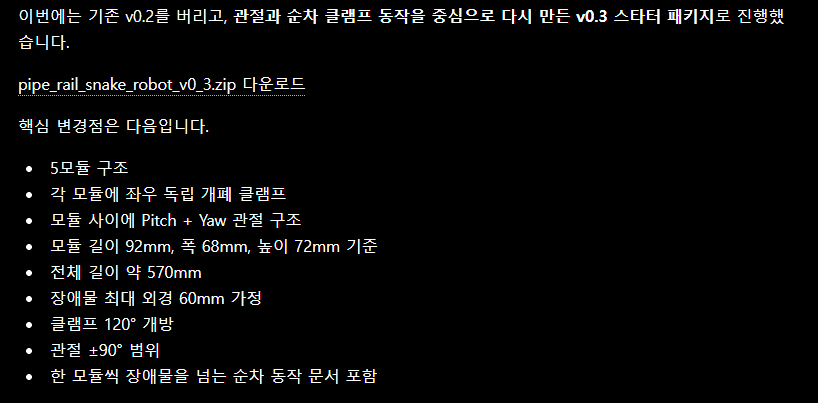

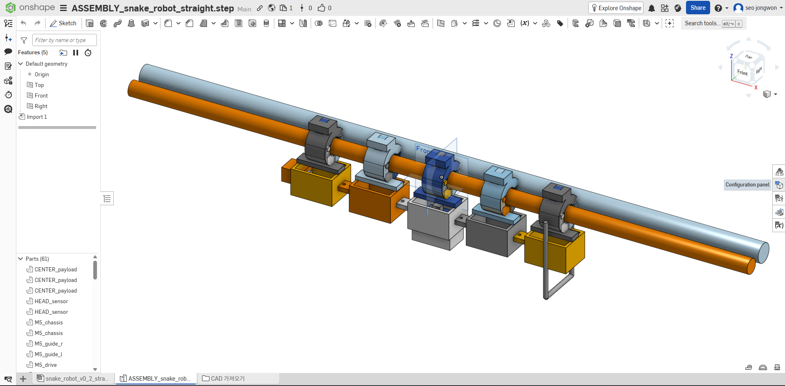

CadQuery는 파이썬 코드로 치수와 형상 생성 과정을 표현할 수 있어 대화로 초안을 만들기에는 적합했다. 생성된 모델은 Onshape로 가져가 실제 형상을 확인했다. 문제는 결과를 보고 수정하는 반복 과정이었다.

```text
요구사항 설명
→ CadQuery 코드 생성과 실행
→ 모델 파일을 Onshape로 가져오기
→ 여러 각도에서 형상 확인
→ 화면을 캡처해 수정할 부분 설명
→ 코드 수정 후 다시 가져오기
```

코드만 보면 형상이 의도대로 만들어졌는지 알기 어려웠고, 화면만으로는 어떤 매개변수를 바꿔야 하는지 다시 설명해야 했다. 모델의 각도나 부품 간격을 조금 바꿀 때도 코드와 CAD 화면 사이를 계속 오갔다. 대화, 코드 실행, 파일 불러오기와 화면 확인이 서로 분리되어 있어 작은 수정에도 여러 단계를 거쳐야 했다. 결국 이 방식으로는 설계를 빠르게 반복하기 어렵다고 판단해 작업을 잠시 중단했다.

이후 Codex의 브라우저 조작 기능으로 Onshape를 직접 다뤄 보았다.

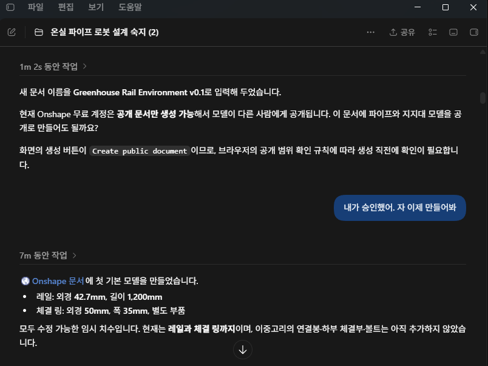

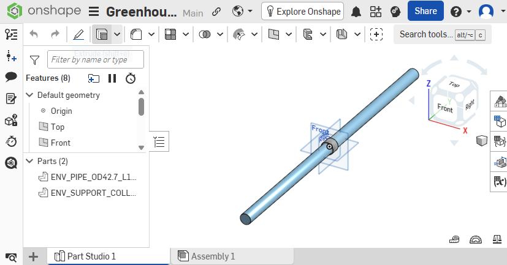

브라우저 조작으로 스케치를 선택하고 값을 입력해 모델을 변경하는 것 자체는 가능했다. CadQuery 방식과 달리 같은 화면에서 결과를 바로 확인할 수 있다는 점은 나아졌다. 하지만 브라우저 자동 조작에는 CAD 모델의 구조가 직접 전달되지 않는다. 매 단계에서 현재 화면을 읽고, 메뉴와 버튼의 위치를 찾고, 클릭이나 입력이 반영됐는지 다시 확인해야 했다.

3D CAD 화면은 시점에 따라 같은 부품도 다른 위치에 보인다. 작은 형상이나 겹쳐 있는 요소를 선택하려면 화면을 회전하거나 확대하는 과정도 필요하다. 따라서 단순한 치수 변경도 화면 확인과 조작 결과 검증을 여러 번 거쳤다. 이런 시각 정보가 대화 문맥에 반복해서 포함되면서 토큰 사용량도 커졌다. 브라우저 조작은 가능성을 확인하는 데에는 충분했지만, 여러 부품을 반복해서 수정하는 주된 작업 방식으로 사용하기에는 비용이 컸다.

## Fusion 360 연동을 통한 모델링

다른 방법을 찾던 중 Fusion 360을 로컬 MCP로 조작할 수 있는 연동 방식을 확인했다. 이를 Codex에 연결해 모델 생성과 수정 명령을 Fusion 360에 직접 전달했다. 화면에서 좌표를 찾아 클릭하는 대신 모델 생성에 필요한 명령을 호출하고, 그 결과를 Fusion 360 프로젝트에서 확인하는 흐름이었다.

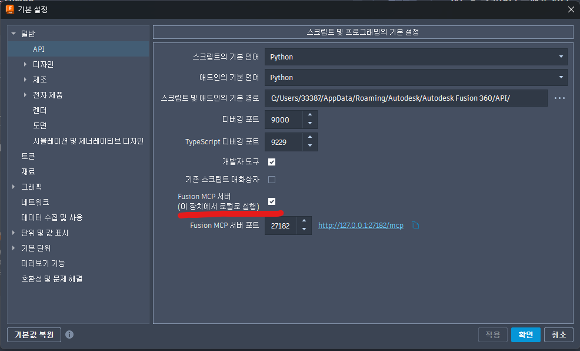

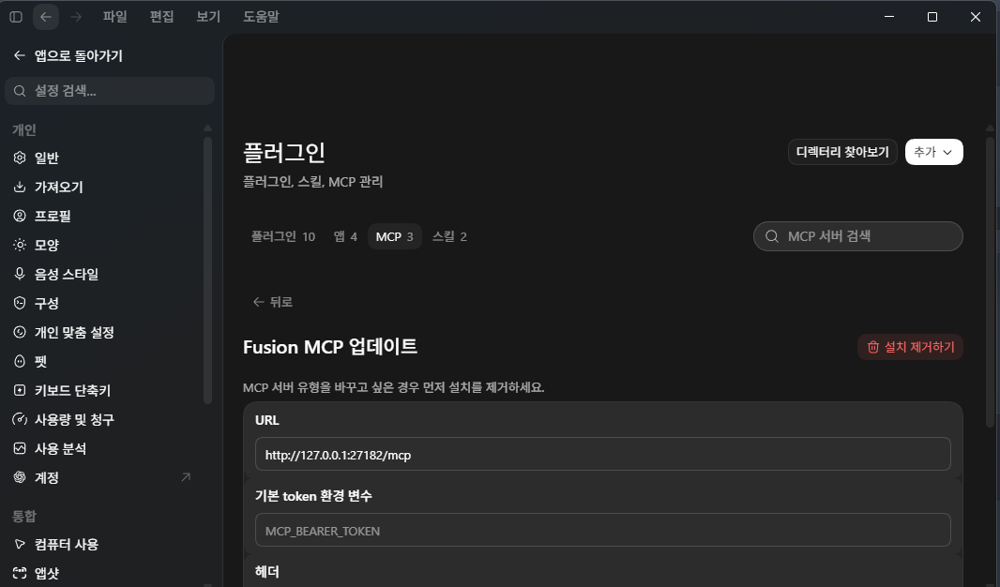

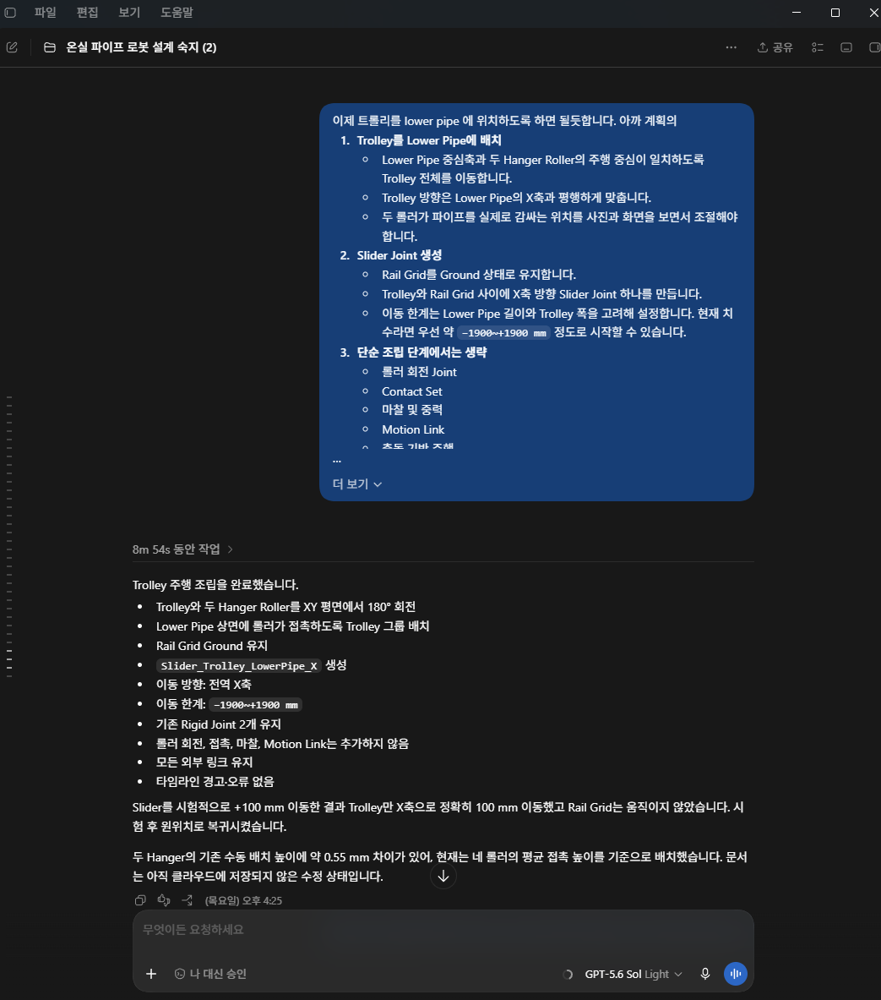

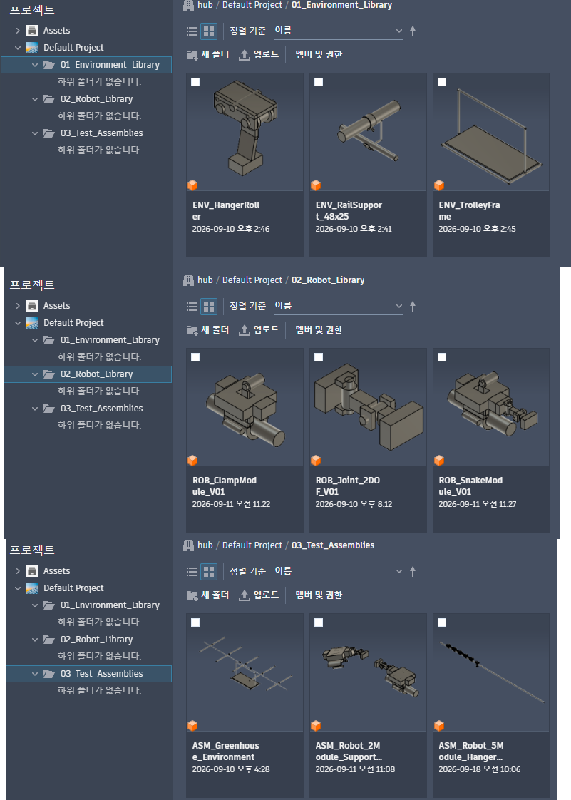

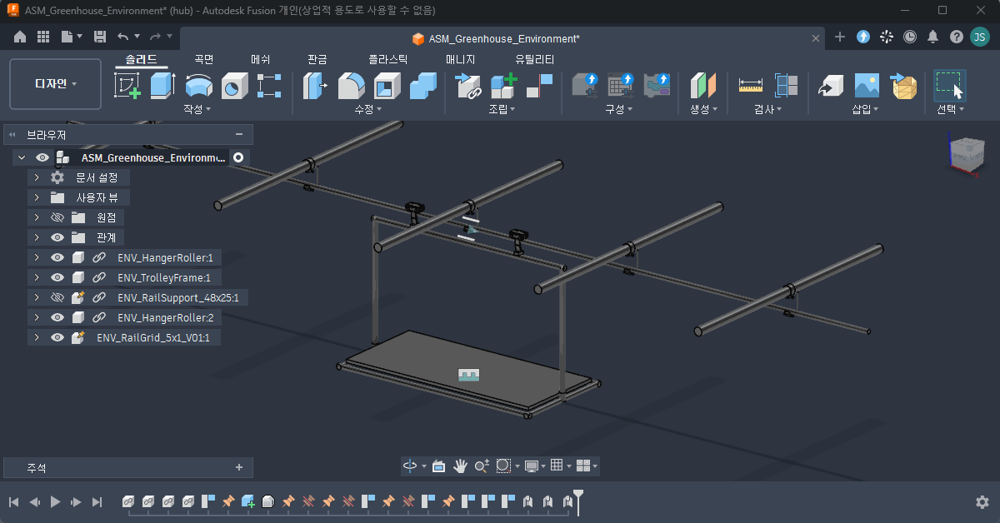

이 방식으로 레일과 고정대를 먼저 만들고, 행거 롤러가 포함된 행잉 트롤리를 배치했다. 이어서 레일을 잡는 구동부와 여러 관절로 이어진 로봇의 초기 형상을 추가했다. 각 부품을 별도로 구성했기 때문에 위치를 바꾸거나 동작을 적용하면서 서로 겹치는 구간을 확인할 수 있었다. 온실 환경과 로봇의 초기 모델을 하루 안에 구성했다.


완성한 동작 모델은 처음 구상했던 다관절 로봇의 통과 방식을 보여준다. 한쪽 구동부가 레일을 잡는 동안 다른 구동부가 관절을 움직여 행거 롤러를 넘고, 장애물 반대편의 레일을 다시 잡는다. 이 동작을 앞쪽부터 차례로 반복하면 로봇 전체가 레일에서 이탈하지 않고 행거 롤러를 통과할 수 있다고 보았다.

다만 이 GIF는 실제 로봇의 구동을 검증한 결과가 아니다. 구동부와 관절이 움직이는 순서, 그리고 부품 사이의 대략적인 간섭을 살펴보기 위해 구상을 단순화한 동작 모델이다.

실제 온실을 정밀하게 재현한 모델은 아니었다. 레일 주변의 모든 구조물이나 재료의 변형, 모터 출력과 하중까지 반영하지도 않았다. 이 단계의 목적은 제작 가능성을 확정하는 것이 아니라, 구상한 관절 동작에 필요한 공간이 물리적으로 존재하는지를 먼저 확인하는 것이었다. 부품 사이의 간섭과 로봇의 대략적인 동작 범위를 검토하기에는 충분했다.

## 실측에서 확인한 공간 부족

3D 모델로 검토할 수 있다는 것을 확인한 뒤 실제 농장의 레일과 행잉 트롤리를 측정했다.

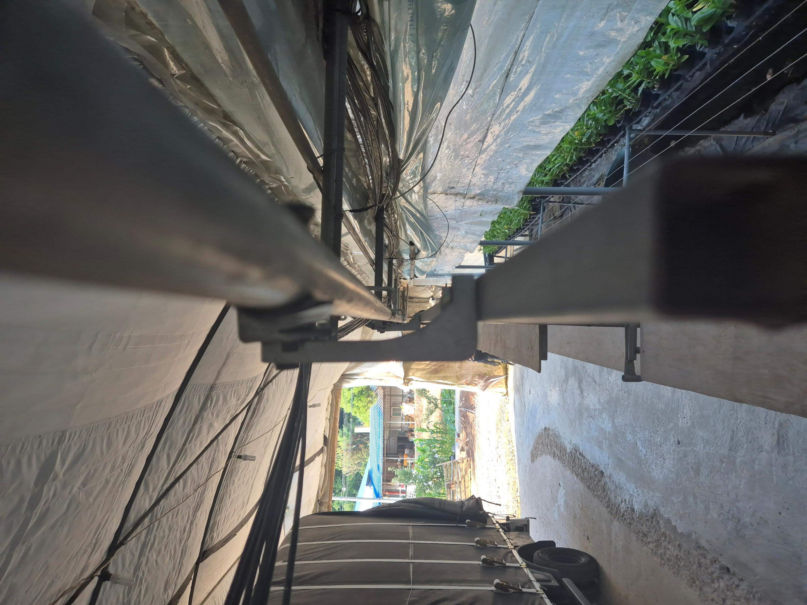

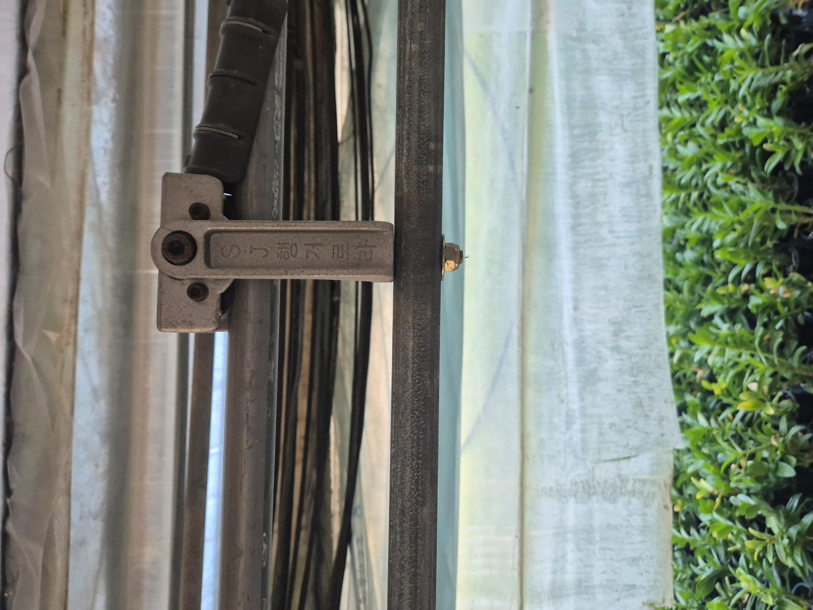

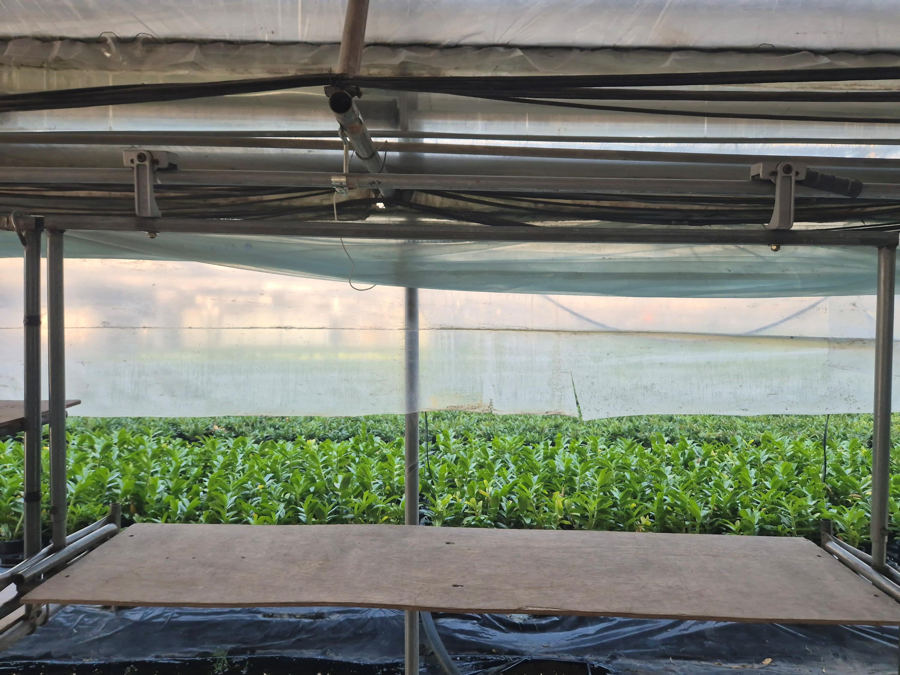

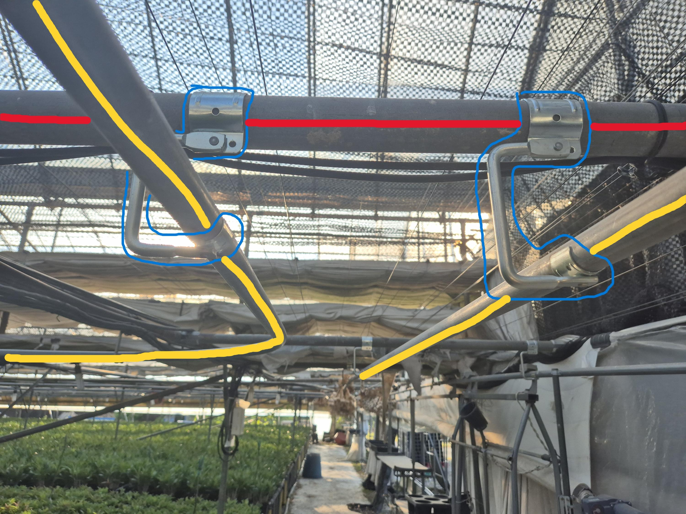

사진과 함께 레일의 폭, 행거 롤러 주변과 고정대 사이의 공간을 확인했다. 3D 모델의 비율을 실제 환경에 맞추고, 로봇이 통과해야 하는 최소 공간을 판단하기 위한 작업이었다. 이 과정에서 초기 구상의 한계가 드러났다. 행거가 레일 고정대와 같은 위치에 오면 두 구조물 사이의 여유 공간이 매우 좁았다.

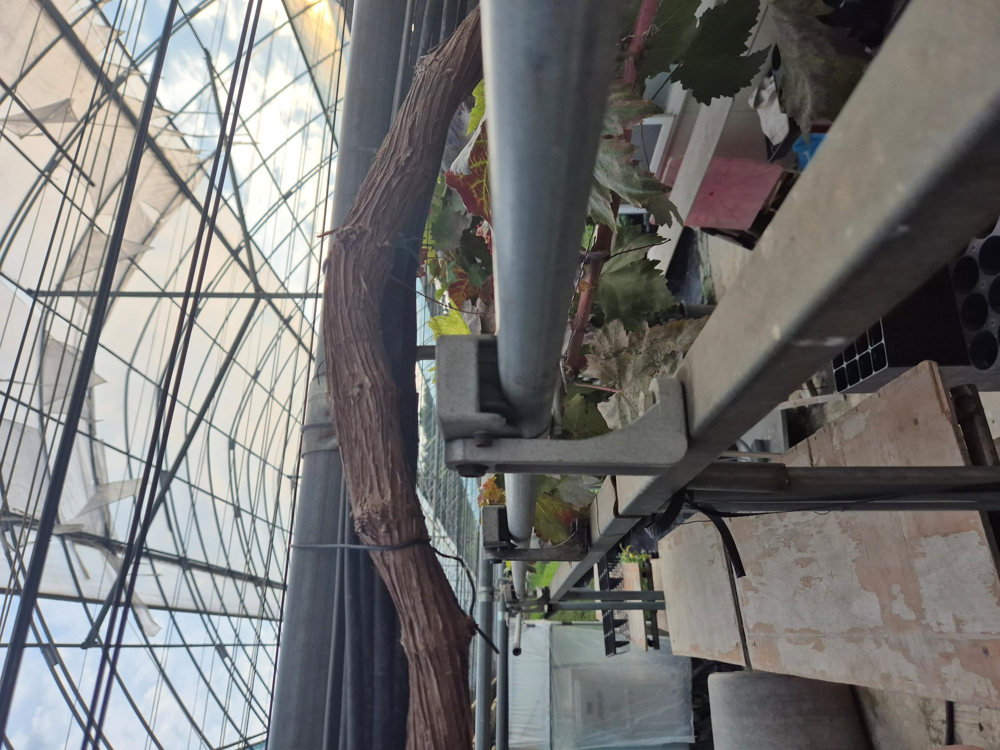

3D 모델에서는 행거와 고정대를 각각 통과할 수 있는지만 살펴봤다. 실제 환경에서는 두 장애물이 독립적으로 놓인다는 보장이 없었다. 행거가 고정대와 겹친 위치에서는 관절을 접거나 펼칠 공간이 동시에 제한됐다. 행거 두 개가 가까이 붙어 있을 때도 롤러 사이의 간격이 좁아 다음 구동부를 다시 레일에 올릴 여유가 부족했다.

따라서 다관절 구조로 행거 하나를 넘는 동작만 검증해서는 실제 레일을 안정적으로 통과할 수 없었다. 모든 배치 조합을 넘으려면 관절 수와 이동 가능한 방향을 늘리거나, 장애물을 감지한 뒤 자세를 바꾸는 제어가 필요했다. 구조가 복잡해지면 무게와 고장 가능성도 늘고, 한쪽 구동부만 레일을 잡는 동안 로봇 전체를 지탱할 수 있는지도 별도로 검증해야 한다. 기존 레일을 그대로 사용해 시설 변경을 줄인다는 장점이 로봇 자체의 복잡도로 옮겨가는 셈이었다.

이 결과를 바탕으로 행거를 넘는 방법보다 행잉 트롤리가 있는 구간을 피하는 방법을 다시 검토했다.

## 행거 극복에서 경로 회피로 변경

온실의 레일은 전체 동을 잇는 메인 레일과 각 동의 재배대에 접근하는 서브 레일로 나뉜다.

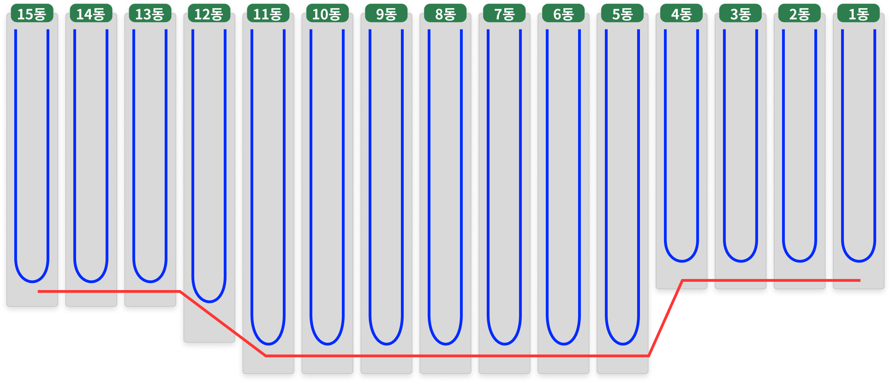

메인 레일은 동 사이와 서브 레일 사이를 이동할 때 사용한다. 서브 레일은 각 동 안에서 재배대에 접근하기 위한 경로다. 사용하지 않는 행잉 트롤리는 주로 메인 레일에 놓이므로, 로봇이 메인 레일을 지나면 행거와 마주칠 가능성이 커진다.

따라서 로봇이 메인 레일을 공유하지 않도록 각 서브 레일의 끝을 별도 레일로 연결하는 방식을 구상했다.

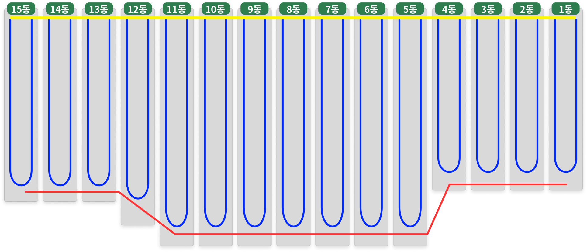

그림의 노란색 구간처럼 연결 레일을 추가하면 로봇은 기존 서브 레일을 이용하면서 동 사이를 이동할 수 있다. 각 재배대 위에서는 이미 설치된 서브 레일을 사용하고, 서브 레일 사이를 옮길 때만 새 연결 구간을 사용하는 구조다. 온실 전체의 레일을 새로 설치하지 않고도 모니터링 범위를 확보하고, 메인 레일의 행잉 트롤리를 통과해야 하는 조건도 줄일 수 있다.

이 변경은 장애물을 통과하는 책임을 로봇의 관절 구조에서 이동 경로 설계로 옮긴 것이다. 행거를 만날 때마다 복잡한 동작을 수행하는 대신, 처음부터 행거가 모이는 구간을 주행 경로에서 제외한다. 추가 레일 설치가 필요하다는 비용은 생기지만 로봇이 통과해야 하는 장애물의 종류와 배치를 줄일 수 있다. 현재 온실의 모든 설비를 바꾸지 않으면서 로봇의 기계적 복잡도를 낮출 수 있는 절충안으로 생각된다.

다만 이 글을 작성하는 시점에는 로봇의 기계적 복잡도를 낮추면서 서로 다른 레일 사이를 전환하는 구조까지 확정하지 못했다. 구조가 구체화되면 Fusion 360에서 간섭과 동작 가능성을 검토하고, 그 결과를 바탕으로 다음 글을 작성해보려한다.
