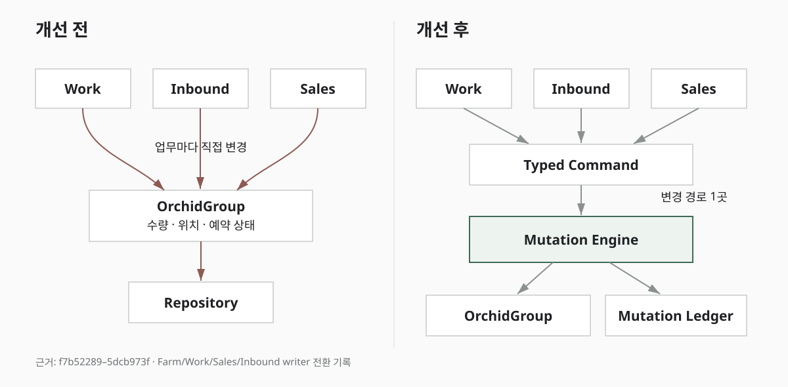
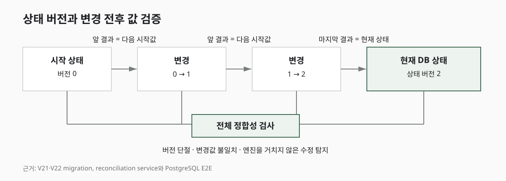

농장 관리 시스템의 베타 버전을 만들 때는 필요한 기능을 빠르게 구현하는 데 집중했다.

이 시스템은 화분 하나하나가 아니라 같은 품종과 비슷한 상태의 화분을 묶은 `난 묶음`을 기본 단위로 사용한다. 하나의 난 묶음에는 수량, 품종, 화분 크기와 농장 안의 배치 위치가 저장된다.

처음에는 난 묶음과 위치를 관리하는 기능만 있었지만 이후 작업, 입고, 판매, 경매와 정산 기능을 차례로 추가했다. 백엔드는 하나의 서버로 운영하되 코드는 농장 재고를 담당하는 `Farm`, 작업을 담당하는 `Work`, 입고를 담당하는 `Inbound`, 판매를 담당하는 `Sales`처럼 업무별 모듈로 나누었다.

기능이 적을 때는 이 구분만으로도 충분해 보였다. 하지만 실제 운영을 시작하고 난 묶음의 수량이나 구성이 바뀌는 작업이 늘어나면서 문제가 드러났다.

분갈이와 폐기는 `Work` 모듈에서 실행하지만 `Farm` 모듈이 관리하는 난 묶음의 수량을 바꾼다. 입고한 모종을 화분에 옮겨 심으면 `Inbound` 모듈에서 새로운 난 묶음을 만든다. 판매를 예약하거나 출고하면 `Sales` 모듈에서 판매할 수 있는 수량을 확인하고 예약 수량을 변경한다.

하나의 난 묶음이 여러 업무의 결과로 바뀌는데, 각 업무 모듈이 상태를 바꾸는 방법까지 따로 구현하고 있었다.

## 변경할 때마다 함께 확인해야 하는 것들

예를 들어 새로운 작업 유형 하나를 추가하려면 화면에서 받은 값만 검증해서는 끝나지 않았다.

* 실제 수량을 어느 코드에서 변경하는지
* 판매를 위해 예약한 수량과 충돌하지 않는지
* 여러 난 묶음을 동시에 수정해도 값이 꼬이지 않는지
* 작업 이력과 재고 변경 이력을 어떤 순서로 저장하는지
* 중간에 실패하면 일부 변경만 남지 않는지
* 같은 요청이 다시 들어와도 수량이 두 번 바뀌지 않는지

를 함께 확인해야 했다.

코드가 업무별 모듈로 나뉘어 있어도 실제 경계는 분명하지 않았다. `Work`와 `Sales`는 `Farm`의 JPA Entity를 직접 참조했고, 통계를 담당하는 `Analytics`는 여러 모듈의 QueryDSL 타입과 데이터 구조를 알고 있었다. 즉, 폴더 이름만 나뉘었을 뿐 한 모듈의 내부 구현이 다른 모듈까지 그대로 노출된 상태였다.

문제는 특정 파일이 길다는 데 있지 않았다. 기능 하나를 변경했을 때 어디까지 확인해야 하는지 예측하기 어렵다는 것이 더 큰 문제였다.



## 엔진 도입만으로 해결되지 않은 문제

처음에는 난 묶음의 변경을 처리하는 `상태 변경 엔진(Mutation Engine)`을 만들면 대부분 해결될 것이라고 생각했다.

하지만 상태 변경만 한곳으로 모아도 `Work`가 `Farm`의 내부 Entity를 사용하고 `Analytics`가 다른 모듈의 DB 구조를 직접 조회한다면 기존의 얽힌 관계는 그대로 남는다. 새로운 엔진 위에 예전 호출 구조가 한 겹 더 생길 뿐이었다.

따라서 상태 변경 엔진을 만드는 작업과 함께 모듈 사이의 의존 관계도 정리하기로 했다. 기준은 다음과 같이 잡았다.

```text
새로운 기능을 추가할 때
기존 핵심 코드의 수정 범위를 줄인다.

업무 규칙을 어느 영역에서 관리하는지 분명하게 한다.

경계를 나누기 위해
필요하지 않은 계층까지 추가하지 않는다.
```

이 기준은 새로운 구조를 만들 때뿐 아니라 이미 만든 구조를 다시 제거할 때도 사용했다.

## 업무 모듈에 남겨 둔 변경 이유

상태 변경을 한곳에 모을 때 가장 조심한 부분은 엔진이 모든 업무 규칙을 아는 거대한 서비스가 되지 않도록 하는 것이었다.

폐기 작업을 실행할 수 있는지는 `Work` 모듈이 판단해야 한다. 주문을 출고할 수 있는지와 예약을 취소할 수 있는지는 `Sales` 모듈의 규칙이다. 입고를 완료할 수 있는지는 `Inbound` 모듈이 알고 있어야 한다.

반면 각 업무가 내린 결정을 실제 난 묶음에 반영하는 과정에는 공통된 규칙이 있었다.

* 같은 데이터를 동시에 바꾸지 못하도록 잠근다.
* 작업을 시작할 때 읽은 값이 아직 최신인지 확인한다.
* 보유 수량과 판매 예약 수량의 관계를 검증한다.
* 상태가 바뀔 때마다 버전 번호를 하나 올린다.
* 변경 전후의 값과 변경 이유를 함께 저장한다.

따라서 업무 판단과 실제 데이터 변경을 다음처럼 분리했다.

```text
작업 / 판매 / 입고
        │
        │  왜 바꾸는가
        ▼
변경 목적과 필요한 값
        │
        ▼
상태 변경 엔진
        │
        │  어떻게 안전하게 바꾸는가
        ▼
난 묶음 + 변경 원장
```

각 업무 모듈은 변경 이유와 필요한 값을 엔진에 전달한다. 엔진은 `Work`나 `Sales`의 세부 규칙을 알지 않고, 결정된 내용을 난 묶음에 안전하게 반영하는 일만 담당한다.

상태를 바꾸는 방법을 한곳에 모으는 것과 모든 업무 판단을 한곳에 모으는 것은 다른 문제였다.

## 목적이 드러나는 변경 요청

초기에는 변경할 필드와 값을 받아 한 번에 처리하는 범용 기능도 검토했다.

```text
수량 = 100
위치 = 3동 오른쪽 2번 구역
예약 수량 = 20
```

구현은 편하지만 이 값만으로는 왜 수량이나 위치가 바뀌었는지 알 수 없다. 시간이 지나면 무엇이든 원하는 값으로 수정하는 기능이 되어 업무 규칙을 우회할 가능성이 있었다.

대신 엔진이 받을 수 있는 요청을 목적별로 구분했다.

```text
난 묶음 생성
위치 이동
일부 수량 폐기
분갈이·분주·합식 결과 반영
판매 수량 예약
예약 수량 출고
잘못된 상태 보정
```

새로운 변경 방법이 필요하면 그 목적을 나타내는 요청을 추가해야 한다. 코드가 조금 늘더라도 난 묶음이 어떤 이유로 변경될 수 있는지를 시스템 안에 분명하게 남길 수 있다.

## Farm 모듈이 소유하는 상태 변경 엔진

상태 변경 엔진을 완전히 독립된 모듈로 만드는 방법도 생각했다. 그러나 이 엔진은 그 자체로 별도의 업무가 아니라 `Farm`이 관리하는 `OrchidGroup`의 상태를 바꾸는 장치다.

엔진은 난 묶음의 현재 수량, 판매 예약 수량과 허용되는 상태 변화를 알아야 한다. 이를 `Farm`과 억지로 분리하면 `Farm ↔ Mutation`처럼 양쪽이 서로를 참조하거나 그 사이에서 값을 옮기는 코드만 늘어날 가능성이 컸다.

그래서 `Mutation Engine`과 변경 이력은 난 묶음을 관리하는 `Farm` 모듈 안에 두었다.

```text
farm
└─ orchid
   ├─ OrchidGroup          # 난 묶음의 현재 상태
   ├─ Mutation Engine      # 상태 변경 실행
   ├─ Mutation Ledger      # 변경 이력
   ├─ Reservation          # 판매 예약 수량
   └─ State Policy         # 허용되는 상태 변화
```

나중에 별도 서비스로 분리할 필요가 생긴다면 엔진만 떼어 내기보다 난 재고 전체를 하나의 기능으로 분리하는 편이 자연스럽다고 판단했다.

## 현재 상태와 변경 이력의 역할 분리

변경 이력이 중요해지면서 모든 과거 기록을 차례로 재생해 현재 상태를 계산하는 방식도 검토했다. 하지만 현재 시스템에는 그만한 구조가 필요하지 않았다.

농장 현황과 작업 화면에서는 현재 수량과 위치를 빠르게 조회해야 했다. 동시에 현재 값이 어떤 변경을 거쳐 만들어졌는지 확인하고, 엔진을 거치지 않은 변경을 발견할 수 있으면 충분했다.

따라서 기존 난 묶음 테이블은 현재 상태를 저장하는 기준으로 유지했다. 별도의 변경 원장은 현재 상태를 대신하지 않고, 상태가 바뀐 과정을 설명하고 검사하는 역할을 맡았다.

```text
난 묶음 테이블
= 현재 수량·위치·상태

변경 원장
= 변경 이유와 변경 전후의 값
```

각 난 묶음에는 상태 버전 번호를 추가했다. 처음 등록된 상태가 0이라면 한 번 변경될 때 1, 다시 변경될 때 2가 된다.

앞 변경의 결과는 다음 변경의 시작 값과 같아야 한다. 마지막 변경 결과는 현재 DB에 저장된 난 묶음과 일치해야 한다.

누군가 엔진을 거치지 않고 현재 값만 직접 수정하면 마지막 변경 기록과 현재 상태가 달라진다. 전체 정합성 검사는 이 차이를 찾아낸다.

단순한 작업 로그가 누가 무엇을 요청했는지를 남긴다면, 변경 원장은 현재 데이터가 기록된 변경의 결과인지까지 확인하기 위한 장치다.



## 모듈 경계와 상태 변경 엔진의 역할

이번 구조 변경의 핵심은 새로운 엔진을 추가한 데 있지 않았다.

`Work`, `Sales`, `Inbound`는 각자의 업무 규칙을 판단한다. `Farm`은 난 묶음을 변경할 수 있는 방법과 변경 기록의 일관성을 관리한다. `Analytics`는 다른 모듈의 DB 구조를 직접 조회하지 않고, 각 모듈이 제공하는 집계 결과를 사용한다.

상태를 바꾸는 방법을 한곳에 모으면서도 변경 이유는 각 업무 모듈에 남겼다. 덕분에 새로운 작업을 추가할 때 데이터 잠금과 이력 저장을 다시 구현하지 않아도 되고, 상태 변경 엔진도 새로운 작업의 세부 규칙을 알 필요가 없어졌다.

다만 이 구조에 도달하는 과정에서 코드를 많이 나누는 것 자체가 목표가 된 시기도 있었다. 다음 글에서는 값을 옮기기 위한 작은 파일들이 오히려 이해를 어렵게 만든 과정과, 과거 이력 및 안전한 전환을 위해 만든 구조를 다시 제거한 이유를 정리한다.
