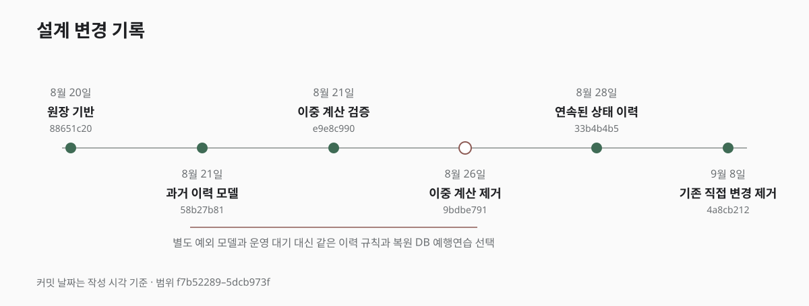

난 묶음의 상태 변경을 `Mutation Engine`으로 통합하면서 백엔드 모듈의 경계도 함께 정리했다.

`Work`나 `Sales` 모듈이 `Farm`의 JPA Entity를 직접 사용하지 않게 하고, 필요한 값만 명시적인 계약을 통해 주고받도록 했다. 방향 자체는 맞다고 생각했지만 처음 만든 결과가 곧바로 이해하기 쉬운 구조가 된 것은 아니었다.

오히려 한 시점에는 리팩터링 전보다 파일과 호출 단계가 더 많아졌다.

## 의존성 감소 뒤에 늘어난 파일

초기에는 모듈 사이의 직접 의존을 없애는 데 집중했다.

Entity를 그대로 전달하던 자리에 작은 `wrapper`, `command`, `result` 객체를 만들었다. 호출 관계를 끊기 위해 `adapter`와 `interface`도 추가했다. 각각을 따로 보면 역할이 있었고 모듈 경계도 이전보다 분명해 보였다.

하지만 하나의 업무가 실행되는 과정을 처음부터 끝까지 따라가면 다른 문제가 나타났다.

값 하나를 `wrapper`에 넣고 다음 계층에서 바로 꺼냈다. 실제 구현이 하나뿐인데도 `interface`를 거쳐야 했다. 메서드 하나를 그대로 전달하기 위한 `adapter`도 생겼다.

그 결과 한 시점에는 실제 서비스에서 사용하는 Java 코드가 약 276줄 증가했고 파일 수도 562개에서 576개로 늘어났다. 줄 수와 파일 수의 증가 자체가 실패를 의미하지는 않는다. 하지만 같은 업무를 이해하기 위해 열어야 하는 파일과 따라가야 하는 호출이 많아졌다는 점은 문제였다.

처음에는 다음 질문을 가장 중요하게 봤다.

```text
다른 모듈에 대한 직접 의존이 줄었는가?
```

이후에는 판단 기준을 더 늘렸다.

```text
하나의 업무를 이해하려면 몇 파일을 봐야 하는가?

실제 데이터 변경까지 몇 단계를 따라가야 하는가?

새로운 기능을 추가할 때 기존 코드를 얼마나 수정하는가?

이 중간 계층이 앞으로 다른 구현으로 바뀔 가능성이 있는가?
```

이 기준으로 ID 하나만 감싸는 `wrapper`, 단순히 호출을 전달하는 `adapter`와 구현이 하나뿐인 `interface`를 제거했다. 메서드 하나로 충분한 부분은 별도 클래스로 만들지 않았다.

모듈 경계를 지키는 데 필요한 계약은 남겼지만, 계층이 많다는 이유만으로 좋은 구조라고 판단하지 않게 되었다.

## 과거 이력을 위한 예외의 증가

새로운 `Mutation Engine`을 적용한 뒤 발생하는 변경은 처음부터 같은 규칙으로 기록할 수 있었다. 더 어려운 문제는 이미 운영 DB에 저장된 난 묶음과 작업 이력이었다.

가장 단순한 방법은 전환 시점의 현재 상태를 `BASELINE revision 0`, 즉 이력의 시작 상태로 기록하고 이후 변경부터 `Mutation Ledger`에 쌓는 것이었다. 하지만 이렇게 하면 엔진 도입 이전 작업과 현재 상태가 어떻게 연결되는지 설명할 수 없다.

처음에는 과거 작업을 별도로 표현하는 `HistoricalEvidence` 모델을 만들었다. 구조가 복잡해지자 과거 이력을 뜻하는 `HISTORICAL` Entry 하나로 다시 합쳤다.

그러나 이름을 줄인 뒤에도 예외는 사라지지 않았다.

```text
HISTORICAL에도 revision이 있어야 하는가?

snapshot을 복원할 수 없으면 어떻게 기록하는가?

reconciliation, 즉 전체 정합성 검사에 포함해야 하는가?

일반 CHANGE와 다른 규칙을 어디까지 허용하는가?
```

과거 데이터를 설명하기 위한 기록 하나 때문에 변경 원장 전체의 규칙이 두 갈래로 나뉘기 시작했다.

결국 `HISTORICAL`을 제거했다. 복원할 수 있는 과거 이력은 현재와 같은 연속된 상태 변경으로 변환하고, Entry 종류도 다음 네 가지로 제한했다.

```text
BASELINE  # 시작 상태
CREATE    # 생성
CHANGE    # 변경
DELETE    # 삭제
```

과거라는 이유로 별도의 규칙을 계속 유지하기보다 복원할 수 있는 범위와 그렇지 않은 범위를 데이터 이전 과정에서 분명하게 다루기로 했다.

처음 만든 모델을 유지하는 것보다 예외 규칙이 계속 늘어나는지를 보는 편이 더 중요했다.

## Shadow Mode 대신 운영 백업을 이용한 검증

기존 변경 방식 대신 `Mutation Engine`을 운영에 바로 적용하기에는 위험이 크다고 생각했다. 그래서 한때 기존 코드와 새 엔진이 같은 요청의 결과를 각각 계산하는 `Shadow Mode`를 구현했다.

```text
Legacy 코드
→ 실제 데이터 변경

Mutation Engine
→ 별도 객체에서 같은 결과 계산

두 결과
→ 비교
```

실제 데이터는 기존 코드만 변경하므로 운영에 미치는 영향을 줄이면서 새 엔진의 결과를 비교할 수 있다고 판단했다.

사용량이 많은 서비스라면 유효한 방식이다. 하지만 이 농장 관리 시스템은 사용자 수와 난 묶음의 구조를 변경하는 작업 횟수가 많지 않다. 충분한 사례가 쌓이기를 기다리면 검증 기간이 지나치게 길어지고, 자주 하지 않는 분주나 합식은 오랫동안 검증되지 않을 수도 있었다.

코드가 이미 만들어져 있었지만 `Shadow Mode`를 제거했다. 대신 운영 DB 백업을 별도 PostgreSQL에 복원하고 필요한 작업을 직접 실행하는 전환 예행연습(rehearsal)을 선택했다.

```text
운영 DB 백업 복원
→ 주요 작업 직접 실행
→ Mutation Engine 결과 확인
→ 전체 데이터 reconciliation
```

실제 사용을 기다리는 대신 통제된 환경에서 폐기, 분갈이, 판매 예약과 출고 같은 시나리오를 실행했다. 현재 시스템의 사용량에서는 이 방식이 더 짧은 시간 안에 다양한 실패 조건을 확인할 수 있었다.



## 서로 다른 단계에서 막아야 했던 중복 실행

같은 요청이 반복돼도 결과를 한 번만 반영하는 성질을 `멱등성`이라고 한다.

처음에는 사용자 요청부터 난 묶음 변경까지 하나의 중복 방지 키로 처리할 수 있을지 검토했다. 하지만 사용자가 저장 버튼을 두 번 누르는 문제와 이미 만들어진 작업 결과가 다시 적용되는 문제는 발생 시점이 달랐다.

```text
사용자 요청
    ↓
    WorkOperation
    ↓
    WorkAppliedEffect
    ↓
    OrchidGroupMutation
    ↓
    MutationEntry
```

사용자 요청이 네트워크 재시도로 다시 들어오면 `Command` 단위에서 작업 기록이 중복 생성되지 않도록 막아야 한다. 반면 생성된 `WorkAppliedEffect`가 다시 처리된다면 `Effect` 단위에서 난 묶음의 수량이 두 번 바뀌지 않도록 별도로 막아야 한다.

두 문제는 발생 시점과 확인할 데이터가 달라 하나의 키로 합치지 않았다. 사용자 요청 단계와 작업 결과 적용 단계에서 각각 중복을 확인했다.

`Command` 단계에서는 `work_command_receipts`로 요청을 보호하고, `Effect` 단계에서는 operation과 effect key를 별도로 확인했다. 또 같은 idempotency key라도 요청 내용의 fingerprint가 다르면 이전 결과를 돌려주지 않고 충돌로 처리했다.

fingerprint를 만드는 과정에서는 같은 ID 집합도 `Set`의 순회 순서에 따라 서로 다른 문자열이 될 수 있다는 문제를 발견했다. 비교 전에 ID를 정렬하는 canonicalization을 적용해 내용이 같으면 항상 같은 fingerprint가 만들어지도록 했다.

겉으로는 중복 실행이라는 하나의 문제처럼 보였지만 실제로 보호해야 하는 대상은 달랐다. 단순화는 비슷해 보이는 코드를 합치는 것이 아니라, 실패가 발생하는 지점을 구분한 뒤 필요 없는 부분을 없애는 일에 가까웠다.

## 구현한 코드를 제거한 기준

이번 리팩터링에서는 문서에서만 검토한 것이 아니라 실제로 만든 구조를 여러 번 제거했다.

* 모듈 경계를 나누기 위해 추가했던 `wrapper`와 `adapter`를 줄였다.
* 과거 이력을 표현하던 `HistoricalEvidence`와 `HISTORICAL` Entry를 없앴다.
* 운영 검증을 위해 만든 `Shadow Mode`를 전환 예행연습으로 바꿨다.
* 하나로 합치려던 중복 실행 방지는 실패가 발생하는 단계에 따라 다시 나눴다.

공통된 기준은 사용한 설계 방식이 일반적으로 좋은지가 아니었다. 현재 시스템에서 변경 비용과 검증 비용을 실제로 줄이는지를 확인했다.

다만 구조가 단순해졌다는 판단만으로 운영 전환을 승인할 수는 없었다. 난 묶음의 변경 경로가 달라지고, 기존 데이터에도 상태 버전과 변경 이력을 추가해야 했기 때문이다.

다음 글에서는 실제 운영 환경과 같은 PostgreSQL에서 동시에 들어오는 요청을 검증한 이유와, 운영 백업을 이용해 데이터 전환을 미리 실행한 과정을 정리한다.
