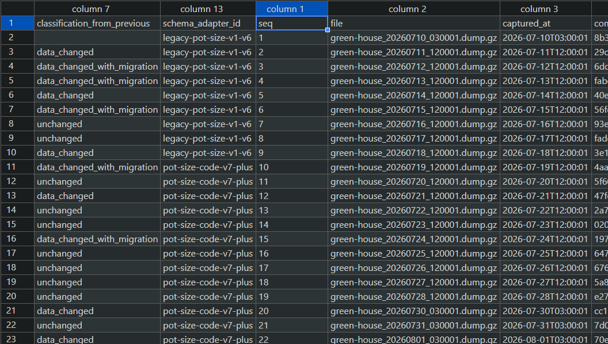
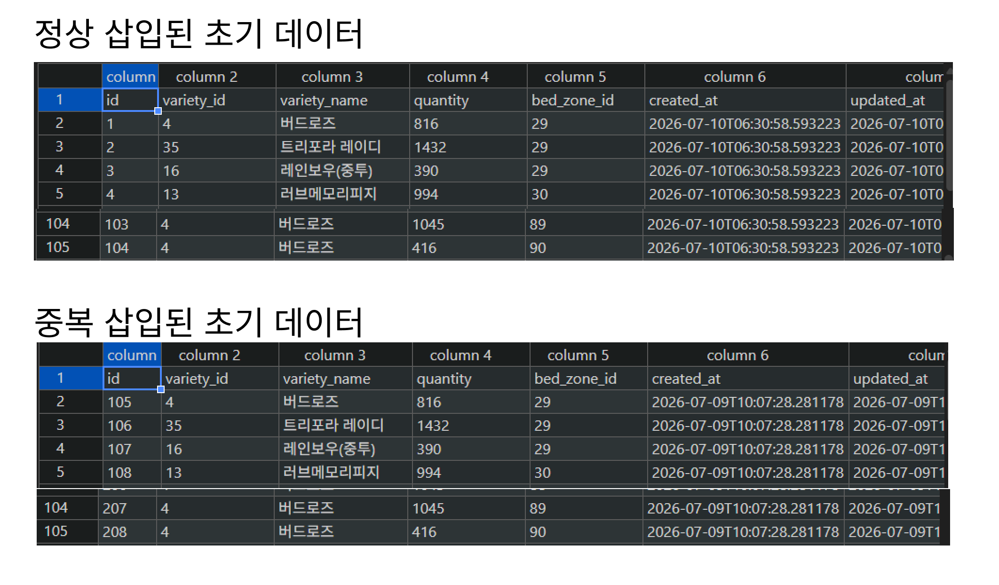
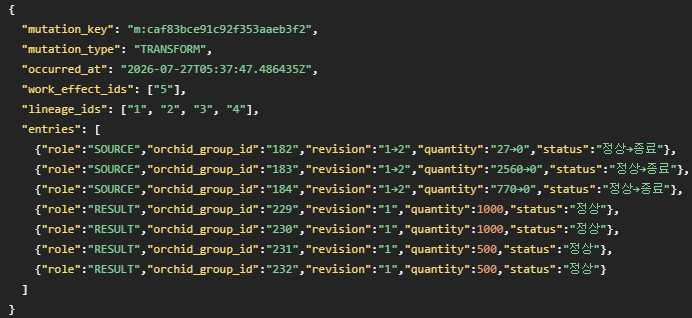
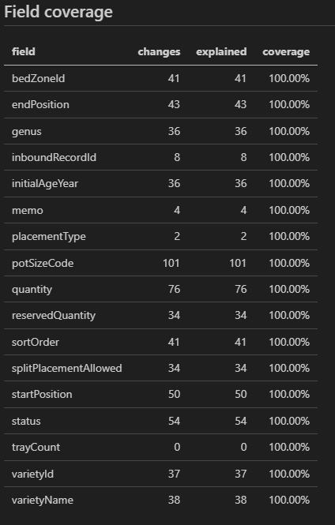
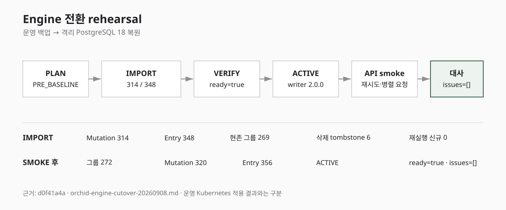
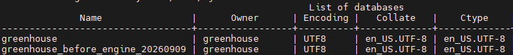
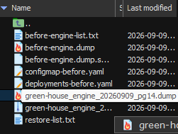
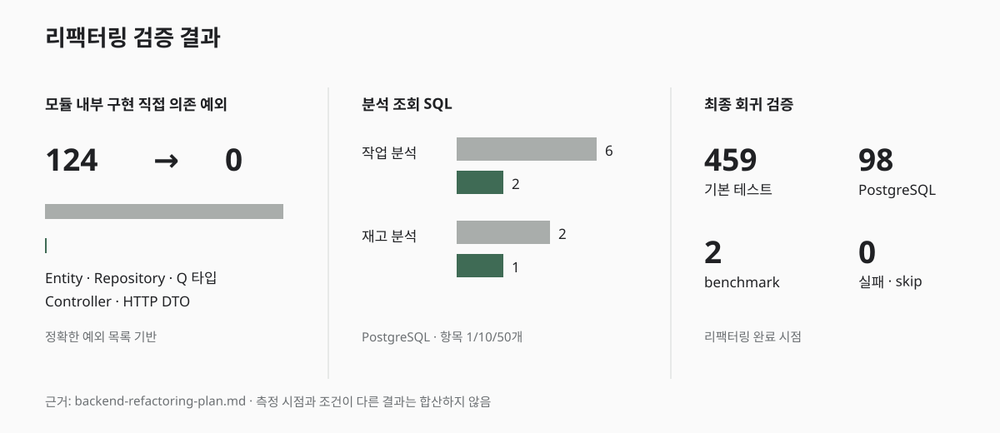
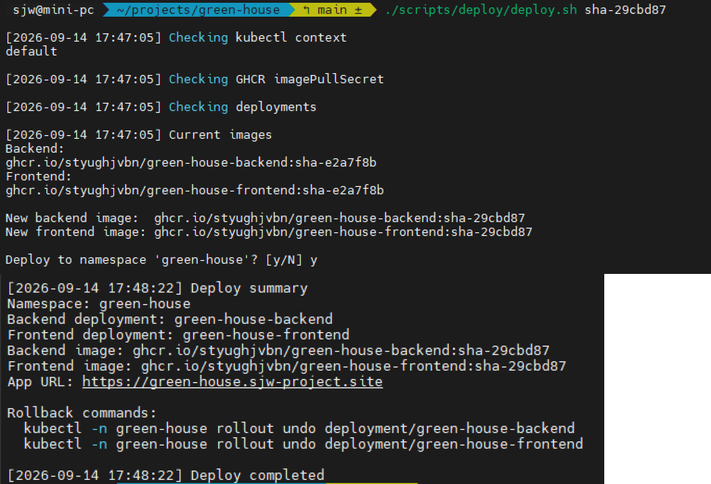

난 묶음의 수량과 위치를 바꾸는 경로를 `Mutation Engine`으로 통합하고 단위 테스트도 추가했다. 하지만 코드 테스트가 통과했다는 이유만으로 실제 운영 DB를 새로운 구조로 바꿀 수는 없었다.

이번 작업에서는 기존 난 묶음에 `revision`이라는 상태 버전 번호를 부여하고, 과거 변경을 `Mutation Ledger`로 옮겨야 했다. 전환 이후에는 엔진을 거치지 않고 난 묶음을 직접 수정하는 코드도 차단해야 했다.

따라서 세 가지를 함께 확인했다.

* 운영과 같은 PostgreSQL에서 동시에 들어오는 요청을 안전하게 처리하는가
* 기존 운영 데이터로 과거의 state chain을 만들 수 있는가
* 새 이력을 적재한 DB를 실제 운영 DB로 안전하게 전환할 수 있는가

코드 안의 구조를 바꾸는 일과 운영 데이터를 그 구조에 맞게 옮기는 일은 별개의 작업이었다.

## PostgreSQL 동시성 검증

기존 테스트에서 사용하던 가벼운 테스트용 DB만으로는 데이터 잠금과 제약 조건을 충분히 확인하기 어려웠다.

리팩터링 과정에서는 다음과 같은 문제가 발견됐다.

* `Settlement` 최초 설정을 동시에 만들면 두 요청이 같은 데이터를 생성하며 UNIQUE 제약 조건과 충돌했다.
* 품종과 자재 코드를 동시에 발급하면 같은 번호를 선택할 가능성이 있었다.
* 하나의 `Mutation`에서 여러 난 묶음을 만들 때 변경 정보를 보관하는 write context가 서로 섞였다.
* 동일한 `Work Command`가 동시에 실행될 수 있었다.
* 이미 적용한 `Work Effect`가 다시 실행돼 수량이 두 번 바뀔 수 있었다.

이 문제들은 메서드를 한 번씩 순서대로 호출하는 테스트에서는 나타나지 않았다. 테스트용 DB와 PostgreSQL은 잠금, transaction과 UNIQUE constraint를 처리하는 방식에도 차이가 있었다.

따라서 PostgreSQL을 사용하는 별도 테스트 환경에서 다음 조건을 직접 검증했다.

* 같은 행을 바꾸는 병렬 요청이 row lock으로 한 요청씩 처리되는지
* 여러 난 묶음을 함께 바꿀 때 항상 같은 lock 순서를 사용하는지
* UNIQUE constraint 충돌을 올바르게 처리하는지
* 작업 중간에 실패하면 전체 transaction이 rollback되는지
* 같은 `Command`와 `Effect`가 동시에 들어와도 멱등성이 보장되는지

중요한 것은 테스트의 개수가 아니라 운영 DB의 동작을 테스트에서도 같은 조건으로 검증하는 것이었다.

## 운영 백업에서 시작한 과거 이력 복원

PostgreSQL 테스트가 통과해도 기존 난 묶음의 과거 상태가 저절로 생기지는 않는다. 최신 백업 하나만 보면 현재 수량과 위치는 알 수 있지만, 그 값이 어떤 변경을 거쳐 만들어졌는지는 알 수 없었다.

그래서 운영 백업을 시간순으로 비교하고, 실제 변화가 있는 백업을 임시 PostgreSQL에 복원해 업무 기록과 연결하는 profiler를 만들었다.

여기서 `Audit`은 난 묶음을 생성하거나 직접 보정할 때 작업 종류와 변경 전후 값을 `audit_events` 테이블에 남긴 기록이다. 현재 상태만 저장하는 `OrchidGroup` 행과 달리 어떤 값에서 어떤 값으로 바뀌었는지를 확인할 수 있었다. 다만 최초 운영 이후 추가된 기능이기 때문에 데이터 기록에 한계가 있다.

```text
운영 PostgreSQL dump 백업
→ compare_backups.py로 인접 백업 비교
→ 변경된 백업을 임시 PostgreSQL에 복원
→ SchemaAdapter로 canonical state 생성
→ Work·Audit·Lineage와 백업 상태 결합
→ Mutation과 group revision chain 재구성
→ 모든 백업 checkpoint와 replay 결과 비교
→ migration_manifest.json 생성
```

역사 재구성에는 48개 백업을 사용했다. 이후 추가된 백업까지 데이터 동일성 비교를 마친 파일은 총 62개였다.



`compare_backups.py`는 압축 파일의 hash가 아니라 `pg_restore --data-only` 결과와 Flyway 이력을 기준으로 인접 백업을 분류했다.

```text
unchanged
= 업무 데이터와 Flyway 모두 동일

data_changed
= 업무 데이터만 변경

migration_only
= Flyway만 변경

data_changed_with_migration
= 업무 데이터와 Flyway 모두 변경
```

변화가 없는 백업은 직전 분석 결과를 재사용하고, 실제 데이터나 스키마가 바뀐 백업만 PostgreSQL에 복원했다.

## 시점마다 달랐던 DB 스키마

역사 재구성에 사용한 48개 백업의 Flyway 버전은 v2부터 v20까지 섞여 있었다. 같은 난 묶음이라도 백업 시점에 따라 컬럼과 값의 표현이 달랐다.

대표적인 차이는 화분 크기였다. 초기 백업은 `pot_size`를 사용했고 이후 백업은 `pot_size_code`를 사용했다. 판매 예약 수량을 저장하는 `reserved_quantity`도 중간 migration에서 추가됐다.

스키마가 다른 행을 그대로 비교하면 업무상 변경이 아닌 컬럼 변경까지 난 묶음의 상태 변화로 인식한다. 이를 막기 위해 백업의 Flyway 버전에 따라 두 개의 `SchemaAdapter`를 적용했다.

```text
Flyway v2·v3·v4·v6
→ legacy-pot-size-v1-v6

Flyway v8 이후
→ pot-size-code-v7-plus
```

각 adapter는 시점별 DB 행을 `Mutation Engine`이 사용하는 하나의 canonical state로 변환했다. 변환값도 추측하지 않고 실제 Flyway SQL을 기준으로 정했다. 화분 크기 역시 코드가 예상했던 `6_INCH`가 아니라 V8 데이터에 저장된 `POT_6`을 계약으로 삼았다.

오래된 스키마를 최신 스키마처럼 보이게 만드는 것이 목적은 아니었다. 어느 시점의 백업을 읽더라도 같은 의미의 상태를 같은 값으로 비교하기 위한 과정이었다.

## 백업 주기와 복원 한계

여기서 snapshot은 특정 시점의 상태를 그대로 복사해 둔 값을 뜻한다. 사진 한 장이 촬영 순간의 모습만 담는 것과 비슷하다.

이 글에서는 두 종류의 snapshot을 다룬다. 운영 백업의 snapshot은 새벽 3시 당시 DB에 있던 모든 난 묶음의 상태다. `Mutation Entry`의 `beforeState`와 `afterState`는 하나의 난 묶음이 변경되기 직전과 직후에 가진 수량, 위치, 품종과 상태 등을 통째로 저장한 값이다.

운영 백업은 매일 새벽 3시에 한 번 생성됐다. 따라서 인접한 두 백업을 비교하면 하루 동안 난 묶음의 상태가 달라졌다는 사실은 알 수 있지만, 그 사이의 모든 상태를 직접 볼 수는 없다.

예를 들어 같은 날 오전에 분갈이를 하고 오후에 위치를 옮겼다면 다음 날 백업에는 두 작업이 모두 끝난 결과만 남는다. 백업만으로는 중간 상태와 실행 순서를 나눠 각각의 `Mutation`으로 복원하기 어렵다.

과거 체인을 구성할 수 있었던 이유는 상태를 바꾼 업무 기록이 DB에 별도로 남아 있었기 때문이다. `WorkAppliedEffect`의 실행 결과, `Audit`의 변경 전후 값과 `Lineage`의 난 묶음 연결 관계를 백업 사이의 차이와 결합하면, 하루 사이에 일어난 여러 변경을 각각의 업무 사건으로 나눌 수 있었다.

다만 업무 기록에도 전체 snapshot이나 정확한 순서가 남아 있지 않은 경우가 있었다. 이때는 전후 상태가 맞는다는 이유만으로 중간 과정을 자동 생성하지 않았다. 데이터로 설명할 수 없는 변경은 별도로 막아 두고, 시스템 사용자에게 당시 어떤 작업을 했는지 직접 물어 근거를 확인한 뒤에만 `CORRECTION`이나 `DELETE Mutation`으로 연결했다.

## 기본키 기준 비교의 오류

첫 분석에서는 7월 10일과 11일 사이에 삭제 198건, 생성 104건과 변경 10건이 발생한 것으로 나왔다. 두 백업에서 같은 ID를 가진 행끼리 비교한 결과였다.

하지만 원본 행을 직접 대조하자 7월 10일에는 상태가 완전히 같은 난 묶음이 104쌍 존재했다.

```text
105 ↔ 209
106 ↔ 210
...
208 ↔ 312
```

각 쌍은 ID와 입력 시각만 다르고 품종, 수량, 위치를 비롯한 나머지 상태는 같았다. 데이터 입력 중 같은 난 묶음이 두 번 생성된 결과였다. 7월 11일에는 중복이 제거돼 각 상태가 한 번씩만 남았고, 이후 백업에서도 같은 중복은 나타나지 않았다.

처음 집계한 312건은 업무상 변경이 아니라 중복 입력을 정리한 데이터 정비였다. 이 구간을 `ACCIDENTAL_DUPLICATE_INPUT_CLEANUP`으로 분류하고 일반 상태 변경과 `Mutation` 재구성에서 제외했다. 다만 원본 행과 매칭 결과는 근거로 보존했다.



제외 규칙도 다음 조건이 모두 일치할 때만 적용했다.

```text
정비 전 원본 208행
정비 후 원본 114행
정비 전 중복 104쌍
정비 후 중복 0건
복수 이전 후보 104건
새로운 상태 10건
```

조건이 하나라도 달라지면 분석을 중단한다. 데이터 정비를 이력에서 숨긴 것이 아니라 업무 변경과 분리해 해석한 것이다. 과거 이력은 중복이 정리된 7월 11일 백업을 최초로 신뢰할 수 있는 baseline으로 삼아 재구성했다.

## 현재 상태만 담긴 manifest의 한계

초기 `migration_manifest.json`은 전환 기준 백업에 존재하는 난 묶음 269개를 각각 `ORIGIN`으로 만들었다.

```text
269 ORIGIN Mutation
269 Entry
각 OrchidGroup의 revision 1
```

이 manifest는 전환 시점의 현재 상태에서 새 이력을 시작하는 용도로는 충분했다. 하지만 과거 이력을 복원하는 입력으로는 부족했다. 과거 `CHANGE`, `TRANSFORM`, `CORRECTION`이 하나도 없었고 작업 전후의 중간 snapshot도 담겨 있지 않았다.

파일의 checksum은 manifest가 변조되지 않았다는 사실만 증명한다. 빠진 이력까지 만들어 주지는 않는다.

```text
cutover baseline
= 현재 상태에서 새로운 revision 시작

historical reconstruction
= 과거 업무 사건을 revision chain으로 복원
```

필요한 것은 두 번째였다. 8월 26일 운영 백업은 마지막 결과가 맞는지 확인하는 기준으로만 사용하고, `Work`, `Audit`, `Lineage`와 백업별 상태를 다시 결합했다.

## 업무 사건과 전체 snapshot의 결합

백업 사이에서 값이 달라졌다는 사실만으로 `Mutation`을 만들지는 않았다. 다음 원본 기록이 같은 변경을 설명하는지 함께 확인했다.

* `WorkAppliedEffect`의 command와 result
* `WorkEffectOrchidGroup`의 `SOURCE`와 `RESULT`
* 난 묶음 사이의 관계를 기록한 `OrchidGroupLineage`
* `OrchidGroup Audit`의 변경 전후 값
* 인접 백업에서 확인한 `OrchidGroup` 전체 상태

분주나 합식처럼 여러 난 묶음이 함께 바뀌는 작업은 하나의 `WorkAppliedEffect`를 하나의 `TRANSFORM Mutation`으로 구성했다.

```text
TRANSFORM Mutation
├─ SOURCE A: CHANGE
├─ SOURCE B: CHANGE
├─ RESULT C: CREATE
└─ RESULT D: CREATE
```



각 Entry에는 변경된 필드만 넣지 않고 그 시점의 전체 상태를 저장했다. 업무 기록에서 확인한 변경을 순서대로 적용해 백업 사이에서 직접 관찰할 수 없었던 중간 상태를 구성했다. 다음 Entry의 `beforeState`는 이전 Entry의 `afterState`와 같아야 하고, 각 백업 시점까지 Mutation을 replay한 결과는 실제 `OrchidGroup` 행과 같아야 한다.

```text
이전 afterState = 다음 beforeState
마지막 afterState = 해당 백업의 OrchidGroup
```

처음에는 checkpoint 불일치가 1,221건 발생했다. 모든 구간의 N:M 작업을 먼저 재구성한 뒤 일반 변경을 처음 구간부터 처리하면서, 뒤쪽 구간의 revision이 앞쪽 구간보다 먼저 배정된 profiler의 순서 버그가 원인이었다.

처리를 백업 구간 단위로 바꾸고 같은 구간의 N:M 작업과 일반 변경을 함께 정렬하자 checkpoint 불일치는 0건이 됐다. 분석 도구가 만든 결과도 실제 snapshot과 대조하지 않으면 또 하나의 추측에 불과했다.

## 근거가 없는 변경의 중단 조건

Work, Audit과 Lineage를 연결한 뒤에도 원본 사건으로 설명할 수 없는 직접 변경이 22건 남았다.

* 품종명 변경 3건
* 수량·메모 변경 2건
* 품종 FK 변경 2건
* 삭제 6건
* 위치·화분·수량 변경 8건
* 그룹 266의 품종 변경 1건

값의 전후만 보면 모두 `CORRECTION`으로 만들 수 있었다. 하지만 근거가 없다는 사실까지 없앨 수는 없었다. profiler가 임의로 이력을 만들지 않고 22건을 `blocking_issues`에 남겼으며, 이 상태에서는 `migration_ready=false`가 되도록 했다.

사용자에게 당시 변경 내용을 하나씩 확인한 결과 그룹 219부터 224까지는 서로 독립적으로 실행한 삭제 6건이었다. 나머지 16건도 사용자가 실제 보정 작업이었다고 설명했다. 이 답변을 근거로 각각 `DELETE`와 `CORRECTION`으로 기록했다.

사용자의 답변만으로 임의의 이력을 만들지는 않았다. 답변에서 확인한 작업 종류가 대상 그룹, 백업 구간과 전체 before/after 상태에 모두 들어맞을 때만 적용하고, DB 기록만으로 확인한 사건과 신뢰 수준을 구분했다.

```text
원본 Work·Audit와 snapshot으로 확인
→ DETERMINISTIC

원본 사건은 없지만 사용자의 설명과 전후 상태가 일치
→ ATTESTED
```

확인 근거가 없는 상태를 그럴듯한 이력으로 채우는 것보다 migration을 멈추는 편이 안전했다.

## 운영 이관에 사용할 manifest

사용자에게 확인한 변경 사항까지 반영한 최종 state chain은 다음과 같았다.

| 항목 | 결과 |
|---|---:|
| 재구성한 Mutation | 377개 |
| 재구성한 Entry·revision | 411개 |
| 연결한 상태 변경 Work 효과 | 42개 |
| 연결한 Lineage | 16개 |
| 최초 baseline origin | 114개 |
| 최초 생성 기록이 없는 synthetic origin | 133개 |
| 사용자 확인 CORRECTION | 17개 |
| 사용자 확인 DELETE | 6개 |
| 폐기 Work | 16개 |
| 이동 | 76개 |
| N:M Transform | 10개 |
| Multi-create | 4개 |

`Work` 효과 55개 가운데 농약 살포나 잎 정리처럼 난 묶음의 상태를 바꾸지 않는 기록용 효과 13개는 `Mutation`으로 만들지 않았다. 작업 기록이 있다는 이유만으로 상태 변경 이력을 늘리지 않고 실제 `OrchidGroup` 상태가 달라진 경우만 원장에 포함했다.

최종 manifest에는 각 Mutation의 source, 전체 before/after snapshot, 결정된 순서와 연결할 Work Effect 및 Lineage ID를 담았다. 같은 manifest를 다시 실행해도 새로운 행이 생기지 않도록 `mutationKey`를 기준으로 중복 실행을 막았다.

```text
migration_ready = true
checkpoint assertions = 10,336
checkpoint mismatches = 0
unresolved changes = 0
errors = 0
field coverage = 전 필드 100%
```



실제 importer에 전달하는 파일은 `migration_manifest.json`과 적재 규칙을 설명하는 `MIGRATION_MANIFEST_USAGE.md` 두 개로 제한했다. profiler의 중간 산출물은 원인 조사와 재현을 위해 별도로 보관했다.

최종 manifest의 SHA-256은 `5786c1993b9263bb311b2f328fa17f8458ee713edbcf745ca6c18dfbfb4a0723`이었다. 분석에 사용한 백업과 설정, 결과 파일의 hash도 evidence bundle에 묶어 `bundle_valid=true`, `migrator_ready=true`를 확인했다.

이후 추가된 2026년 8월 28일부터 9월 9일 08:54:50까지의 백업에서도 업무 데이터와 Flyway 변경은 없었다. 최종 manifest의 기준 상태가 최신 백업과도 같다는 것을 확인한 뒤 실제 전환을 진행했다.

## manifest를 이용한 전환 예행연습

최종 manifest를 바로 운영 DB에 적재하지 않았다. 운영 DB의 백업을 별도 PostgreSQL에 복원해 전환 후보 DB를 만들고, 실제 전환과 같은 순서로 migration rehearsal을 진행했다.

```text
운영 백업 복원
→ Flyway migration
→ migration manifest 적재
→ schema·row·ledger 검증
→ Engine ACTIVE 전환
→ DB write fence 적용
→ 주요 작업 실행
→ UI·API smoke test
→ reconciliation
```

importer는 profiler가 확정한 순서대로 `Mutation`과 `Entry`를 하나의 transaction에서 적재했다. 적재 과정에서 과거의 원인을 다시 추론하지 않고 manifest를 실행 계약으로 사용했다.

검사 결과가 다음 조건을 만족해야만 새 엔진을 활성화했다.

```text
ready=true
issues=[]
```

문제가 하나라도 남아 있으면 다음 단계로 진행하지 않았다.



## Engine 전환과 직접 쓰기 경로

전환 예행연습에서는 단위 테스트에서 발견하지 못한 기존 데이터 변경 경로도 확인됐다.

기존 `Inbound` 코드는 난 묶음을 먼저 INSERT한 뒤 일부 값을 UPDATE했다. Legacy 구조에서는 정상적으로 동작했지만, Engine-only 상태에서 직접 UPDATE를 차단하는 DB write fence와 충돌했다.

처음 INSERT할 때 필요한 값을 모두 넣도록 변경해 두 번의 쓰기를 하나의 INSERT로 정리했다.

이 문제는 manifest나 migration SQL의 오류가 아니었다. 새로운 보호 규칙을 실제 운영 흐름에 적용하면서 기존 코드에 남아 있던 우회 경로가 드러난 경우였다.

운영 백업을 이용한 예행연습은 과거 데이터를 변환할 수 있는지만 확인하는 과정이 아니었다. 새 구조에서 허용되지 않는 애플리케이션의 쓰기 경로까지 찾는 역할을 했다.

## 실제 운영 DB 전환

예행연습이 끝난 뒤 실제 전환은 다음 순서로 진행했다.

```text
Backend 중지
→ 운영 DB 최종 backup
→ Engine candidate DB 복원
→ Flyway migration과 manifest 적재
→ schema·row·ledger 검증
→ 기존 운영 DB 이름 변경
→ candidate DB를 production 이름으로 변경
→ writer version ConfigMap 갱신
→ 새 Backend 이미지 시작
→ smoke test
→ reconciliation
```

기존 운영 DB는 바로 삭제하지 않고 다른 이름으로 보존했다. 전환 직전 DB 백업과 당시의 deployment, ConfigMap도 함께 남겨 애플리케이션과 데이터의 조합을 다시 만들 수 있도록 했다.





## Engine ACTIVE 이후의 복구 전략

일반적인 애플리케이션 배포에서는 새 버전에 문제가 생기면 이전 이미지를 다시 실행해 복구할 수 있다.

하지만 DB를 `Engine ACTIVE` 상태로 전환한 뒤에는 예전 애플리케이션만 다시 실행해서는 안 된다. Legacy writer는 난 묶음의 현재 값만 바꾸고 `Mutation Ledger`를 남기지 않기 때문이다.

```text
DB는 Engine ACTIVE
+
애플리케이션은 Legacy writer
= 현재 상태와 Mutation Ledger가 어긋날 수 있음
```

따라서 ACTIVE 이후에는 수정한 새 버전을 다시 배포하는 roll-forward를 기본 대응으로 정했다. DB까지 되돌려야 한다면 애플리케이션 이미지뿐 아니라 전환 직전의 DB와 당시 배포 설정을 함께 복원해야 했다.

## 코드량보다 책임과 조회 비용

이번 리팩터링은 전체 코드 줄 수를 줄이기 위한 작업은 아니었다. 자동 코드 정리의 영향을 제외하면 전체 코드량이 크게 감소했다고 보기도 어렵다.

대신 여러 책임이 섞여 있던 코드와 반복 조회에서는 변화가 있었다.

`WorkOperationDetailService`는 408줄에서 89줄로 줄었고, `AnalyticsQueryService`는 201줄에서 156줄로 책임을 줄였다.

```text
사용자 난 묶음 그룹 목록 50건
101 SQL → 약 3 SQL

작업 종류별 통계
6 SQL → 2 SQL

품종별 재고 통계
2 SQL → 1 SQL
```

반면 일부 `Analytics` 조회는 다른 모듈의 QueryDSL 타입을 직접 사용하지 않도록 경계를 나누면서 SQL 실행 횟수가 증가했다. 모든 결과를 성능 개선이라고 묶지 않고 모듈 경계와 조회 비용 사이의 trade-off도 함께 기록했다.



## 단계별 검증 결과

작업을 시작할 때는 기본 테스트 190개가 통과하고 49개는 실행되지 않는 상태였다.

구조 리팩터링을 마친 시점에는 기본 테스트 459개, PostgreSQL 테스트 98개와 benchmark 2개가 통과했다. 이후 `Mutation Engine` 전환 예행연습 시점에는 기본 테스트 460개와 PostgreSQL 테스트 96개가 통과했다. 두 종류를 합친 백엔드 테스트는 556개였다.

테스트 수가 늘어난 것만으로 구조의 안전성을 증명할 수는 없었다. 서로 다른 단계가 서로 다른 실패를 확인하도록 검증 범위를 나눴다.

```text
업무 규칙 테스트
→ PostgreSQL 통합·동시성 테스트
→ 운영 백업 48개의 과거 이력 재구성
→ manifest 적재 rehearsal
→ UI·API smoke test
→ 전체 데이터 reconciliation
```

최종적으로 실제 운영 PostgreSQL을 Legacy writer에서 `Engine-only` 구조로 전환했고, 전환 후 `ACTIVE`, `ready=true`, `issues=[]`를 확인했다.

## Audit 식별자 연결 누락

운영 전환이 끝난 뒤 이력의 근거를 다시 확인하던 중 이상한 점이 있었다. 백업 차이뿐 아니라 `Work`와 `Audit`도 재구성에 사용했는데, 일부 변경이 여전히 사용자 확인을 뜻하는 `OPERATOR_ATTESTATION`이나 최초 관찰 상태를 바탕으로 만든 `SYNTHETIC_FIRST_OBSERVED`를 근거로 삼고 있었다.

원본 `audit_events`에는 난 묶음과 관련된 사건 5건이 남아 있었다. profiler도 이 행을 읽었지만 `entity_id`를 `OrchidGroup` ID로 해석하지 못했다. 5건은 모두 `UNSCOPED`로 분류됐고 `Mutation` 후보를 만드는 과정에서 제외됐다.

```text
audit_events.entity_id
→ OrchidGroup ID로 연결하지 못함
→ UNSCOPED
→ state chain 재구성에서 제외
```

Audit 데이터가 사라진 것은 아니었다. 원본은 운영 DB에 그대로 있었지만 재구성한 이력의 근거로 사용하지 못한 문제였다. 영향도는 사건마다 달랐다.

| Audit 대상 난묶음ID | 원본 사건 | 기존 state chain의 상태 |
|---:|---|---|
| 267 | 생성 | 실제 CREATE 대신 synthetic origin 사용 |
| 272 | 재배 연수와 화분 크기 변경 | Audit 이전 상태와 revision 누락 |
| 256 | 수량 변경 | 상태 전이는 맞지만 사용자 확인으로 분류 |
| 252 | 수량 변경 | 상태 전이는 맞지만 사용자 확인으로 분류 |
| 266 | 품종 변경 | 품종과 메모 변경을 하나의 보정으로 구성 |

252와 256은 변경 전후 상태가 이미 정확했다. 267도 백업에서 처음 관찰한 상태 자체는 맞았다. 이 세 건은 값보다 원본 사건과의 연결이 부정확한 경우였다.

266의 기존 `CORRECTION`에는 품종 변경과 메모 삭제가 함께 들어 있었다. Audit이 증명하는 것은 품종 변경뿐이므로, Audit을 연결한 뒤에도 메모 삭제까지 같은 사건이 입증한다고 보지는 않았다. 품종 변경에만 Audit을 보조 근거로 연결하고 메모는 기존 snapshot과 사용자 확인을 근거로 남겼다.

272는 달랐다. 기존 체인은 생성 시점부터 변경 후 값으로 시작했다.

```text
기존
rev1: ageYear=2, potSize=POT_3_5

원본 사건
rev1: ageYear=null, potSize=POT_2
→ Audit CORRECTION
rev2: ageYear=2, potSize=POT_3_5
```

최종 값은 같았지만 Audit 이전의 상태 전이 하나가 빠져 있었다. 단순한 링크 누락으로만 처리하면 state chain이 잘못된 최초 상태를 계속 주장하게 된다.

## 현재 상태와 이력의 정확성 분리

문제를 발견했을 때 state chain은 이미 운영 DB에 적용된 상태였다. 먼저 현재 업무 데이터와 과거 이력의 문제를 나눠 확인했다.

```text
현재 OrchidGroup 상태          정상
백업 checkpoint 재생 결과       정상
Work 기반 Mutation             정상
Audit 원본                     존재
Audit 원본 근거 연결           5건 누락
272의 중간 revision            1건 누락
```

기존 manifest는 백업 snapshot을 기준으로 마지막 상태를 맞췄다. 따라서 수량, 품종, 위치와 같은 현재 값은 모든 checkpoint와 일치했다. 부족했던 것은 일부 상태 전이의 원본 근거와 272의 중간 상태였다.

이 상황에서 전체 migration을 롤백하거나 manifest를 다시 적재하면 이미 정상인 현재 상태와 Work·Lineage 연결까지 다시 바꿔야 했다. 처음에는 기존 revision을 수정하지 않고 Audit만 기존 Mutation에 연결한 뒤 272의 누락은 annotation으로 남기는 방법을 검토했다. 운영 전환 이후 새로운 revision이 생겼다면 과거 상태를 앞에 삽입하기 위해 이후 revision과 참조를 모두 이동해야 했기 때문이다.

최신 운영 백업을 추가해 9월 10일부터 14일까지의 데이터를 비교하자 이 기간의 업무 데이터 SHA는 모두 같았다. state chain 전환 이후 새로운 사용자 변경, Work와 Audit이 없었다. 272에도 후속 revision이 생기지 않았기 때문에 기존 이력을 연쇄적으로 이동할 필요가 없었다.

이 확인을 근거로 Audit 연결만 보완하는 방식에서 272의 실제 상태 전이까지 복원하는 방식으로 결정을 바꿨다.

## 기존 원장을 보존한 V27 보정

보정은 `V27__repair_orchid_group_audit_provenance.sql`이라는 Flyway migration으로 작성했다. `audit_events`에는 `mutation_id`를 추가하고 `orchid_group_mutations.id`를 참조하는 외래 키와 partial index를 만들었다. 애플리케이션 Entity에는 JPA 연관관계 대신 scalar ID만 추가했다. Audit 모듈이 원본 사건을 계속 소유하면서 Mutation을 근거로 가리키는 구조였다.

Audit 1, 3, 4, 5는 검증된 기존 Mutation에 연결했다. Audit 2만 그룹 272의 새로운 `CORRECTION Mutation`과 Entry를 만들었다.

```text
기존 Work CREATE Mutation 203
rev1 snapshot을 Audit 이전 상태로 보정

신규 Audit CORRECTION Mutation
rev1 → rev2 상태 전이 추가

현재 OrchidGroup
업무 필드는 그대로 유지
state_revision만 1 → 2
```

기존 원장을 수정할 수 없다는 원칙과 충돌하는 지점도 있었다. 272의 CREATE Entry를 그대로 두면 잘못된 역사적 상태가 유지되지만, 일반 애플리케이션 기능에서 과거 Entry 수정을 허용하면 원장의 의미가 사라진다. 그래서 검토한 운영 DB와 정확히 같은 상태에서만 실행되는 일회성 corrective migration으로 예외 범위를 제한했다.

기존 CREATE Mutation의 ID, Work source, operation key와 `Work Effect`·`Lineage` 연결은 유지했다. CREATE snapshot이 달라져 재계산이 필요한 command fingerprint만 갱신했다. 전체 Work 연결 42건과 Lineage 연결 16건도 migration 전후에 같은지 확인했다.

V27은 대상 행을 대략적인 조건으로 찾지 않았다. 실행 전 Mutation 314개, Entry 348개, OrchidGroup 269개, Audit 5개와 revision 분포를 확인했다. 각 Audit의 ID, 대상, action과 before/after payload도 검증했다. 기존 Mutation의 type과 snapshot까지 예상값과 다르면 migration을 중단하도록 했다.

보정 결과는 다음과 같았다.

| 항목 | V27 전 | V27 후 |
|---|---:|---:|
| OrchidGroup | 269 | 269 |
| Mutation | 314 | 315 |
| Entry | 348 | 349 |
| Mutation과 연결된 Audit | 0 | 5 |

revision 1인 그룹은 123개에서 122개로 줄었고 revision 2인 그룹은 36개에서 37개로 늘었다. 그룹 272 하나의 revision만 이동한 결과였다.

## V27 정상·실패 경로 검증

V27 실행 전후에 269개 OrchidGroup의 canonical snapshot을 각각 계산했다. 수량, 예약 수량, 상태, 메모, 품종, 재배 연수, 화분 크기, 위치와 배치 속성을 포함한 SHA-256은 양쪽 모두 다음 값이었다.

```text
417874b922df95ab3fd108ca6576b56f484d68dc97eafc1b2eb864f5344fa66a
```

현재 업무 상태는 바뀌지 않았고 과거 state chain과 `state_revision` metadata만 보정됐다는 근거였다.

별도의 rehearsal script는 최신 운영 백업을 PostgreSQL 14에 복원하고 release code를 시작해 Flyway를 실행했다. 이후 독립된 검증 SQL과 reconciliation을 차례로 수행했다.

```text
운영 백업 복원
→ migration 전 canonical SHA 계산
→ Flyway V27 실행
→ migration 후 SHA 비교
→ 원장 불변조건 검증
→ orchidLedgerReconcile
```

검증에서는 모든 revision이 연속인지, 이전 `afterState`와 다음 `beforeState`가 같은지, 현재 `state_revision`이 마지막 Entry와 일치하는지 확인했다. 예상하지 않은 Mutation과 Entry가 바뀌지 않았는지도 비교했다. 결과는 Mutation 315개, Entry 349개, Audit 연결 5개였고 reconciliation은 `ACTIVE`, `ready=true`, `issues=[]`였다.

성공 경로만으로는 fail-fast 조건을 확인할 수 없었다. 운영 백업 복사본에서 Audit 2의 수량을 의도적으로 810에서 811로 바꾼 뒤 다시 실행했다. V27은 payload 불일치로 실패했고 Flyway transaction 전체가 rollback됐다. `mutation_id` 컬럼은 생성되지 않았고 272의 `state_revision`도 1로 유지됐다. 중간 단계까지만 반영된 DB가 남지 않는다는 점을 실제 PostgreSQL에서 확인할 수 있었다.

rehearsal과 실패 경로 검증을 마친 뒤 V27이 포함된 Backend 이미지를 배포했다. 배포 스크립트에서 새 이미지와 배포 완료 상태를 확인했다.



## 운영 데이터 전환에서 남은 기준

이번 작업에서 가장 크게 수정한 것은 코드보다 전환에 대한 판단 기준이었다.

최신 snapshot이 맞는 것과 과거 이력이 맞는 것은 다른 문제였다. Audit 연결 누락에서도 현재 상태, 중간 state chain과 원본 근거의 연결은 각각 확인해야 했다. checkpoint와 마지막 상태가 모두 일치해도 원본 사건이 잘못 분류되거나 중간 revision이 빠질 수 있었다.

특히 하루 한 번의 백업은 상태를 확인하는 checkpoint일 뿐, 하루 동안 발생한 모든 Mutation을 기록한 로그가 아니었다. checksum이 일치하는 manifest도 필요한 사건이 빠져 있다면 충분하지 않았다. 자동화한 profiler도 업무 기록을 함께 사용하고, 모든 백업 시점의 상태와 replay 결과를 비교해야 신뢰할 수 있었다. 여기에 원본 Work와 Audit이 재구성 결과에 빠짐없이 연결됐는지도 확인해야 했다.

DB 기록만으로 설명할 수 없는 변경은 자동으로 그럴듯한 이력을 만들지 않았다. 사용자에게 당시 변경 내용을 묻고 그 설명이 실제 전후 상태와 일치하는지 확인하기 전까지 migration 자체를 중단했다. 반대로 오래된 데이터 정비처럼 업무 변경이 아닌 사건은 근거를 남기되 state chain에서는 분리했다.

구조 개선의 성공 여부도 테스트 개수나 패턴의 수만으로 판단하기 어렵다. 앞으로 새로운 작업 유형을 추가할 때는 다음 항목을 계속 확인하려 한다.

* 새로운 Handler만 추가하면 되는가
* 기존 switch와 조건문이 다시 길어지는가
* Mutation Engine의 공통 처리까지 수정해야 하는가
* 다른 모듈의 내부 구현을 알아야 하는가
* 기존 파일을 몇 개나 함께 수정하는가

Mutation API의 p50과 p95, transaction 시간과 lock wait도 측정하고, reconciliation은 전환 시점의 일회성 검사에서 끝내지 않고 정기적인 invariant 검사로 이어갈 예정이다.

좋은 아키텍처인지는 사용한 설계 패턴보다 다음 변경에서 확인해야 한다. 이번 작업은 새로운 구조를 완성한 기록이라기보다, 코드와 운영 데이터가 같은 규칙을 지키는지 계속 측정할 수 있는 출발점을 만든 과정에 가깝다.
