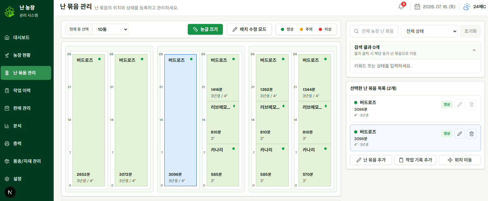

6개월 동안 농장에서 직접 일하며 느낀 문제를 바탕으로, 난 농장 관리 시스템의 베타 버전을 개발했다.

이번 베타 버전의 목표는 완성도 높은 상용 서비스를 만드는 것이 아니었다.
우선 실제 농장의 구조와 운영 흐름을 웹 시스템 안에 옮겨보고, 실제로 사용할 수 있는 최소한의 기반을 만들고 개선해 나가는 것이 목표였다.

## 실제 농장

농장은 여러 동으로 나뉘어 있고, 각 동 안에는 여러 개의 다이가 있다.
하나의 다이는 다시 좌측과 우측처럼 실제 작업자가 구분해서 이해하는 구역으로 나뉜다.

처음에는 단순히 "어느 위치에 어떤 난이 있다" 정도만 기록하면 된다고 생각했다.
하지만 직접 일을 해보니 위치, 품종, 수량, 작업 이력, 판매 상태가 계속 연결되어 있었다.


## 시스템으로 표현된 농장

베타 버전에서는 실제 농장의 구조를 `동 → 다이 → 구역 → 난 묶음`으로 표현했다.

개별 화분 하나하나를 모두 관리하기보다는, 실제 농장에서 자주 사용하는 단위인 "난 묶음"을 기준으로 관리했다.
같은 품종과 비슷한 상태의 난들이 함께 이동하고 작업되는 경우가 많았기 때문이다.



## 베타 버전에서 구현한 것

베타 버전에서는 실제 운영에 필요한 기본 흐름을 우선 구현했다.

```text
농장 현황
  → 동, 다이, 구역, 난 묶음 조회

난 묶음 관리
  → 난 묶음 등록, 수정, 이동, 위치 이력 기록

작업 관리
  → 농약, 비료, 분갈이, 상태 기록, 위치 이동 이력 관리

품종/입고 관리
  → 품종 기준 정보와 외부 입고 기록 관리

판매 관리
  → 일반 판매 전표와 거래처 관리

경매 추적
  → 경매 출하 lot, 낙찰, 유찰, 반환 상태 관리

정산/입금
  → 낙찰 결과 기준 정산 묶음 생성과 입금 확인 흐름 연결
```

## 베타 버전의 의미

이번 베타 버전은 완성된 시스템이라기보다, 실제 농장 운영을 데이터로 쌓기 위한 첫 번째 버전이다.

아직 부족한 부분도 많다.
화면 UX도 더 다듬어야 하고, 경매 정산과 입금 처리도 더 정확하게 개선해야 한다.
작업 이력도 실제 사용해보면서 더 편한 방식으로 바꿔야 한다.

하지만 베타 버전을 통해 최소한 다음 기반은 만들 수 있었다.

```text
실제 농장 구조를 시스템에 표현하기
난 묶음 단위로 위치와 수량 관리하기
작업 이력을 데이터로 남기기
판매와 경매 흐름을 추적하기
운영 데이터를 쌓을 수 있는 기반 만들기
```

베타 버전 이후에는 실제 운영하면서 발견한 문제들을 하나씩 개선해나갈 예정이다.
