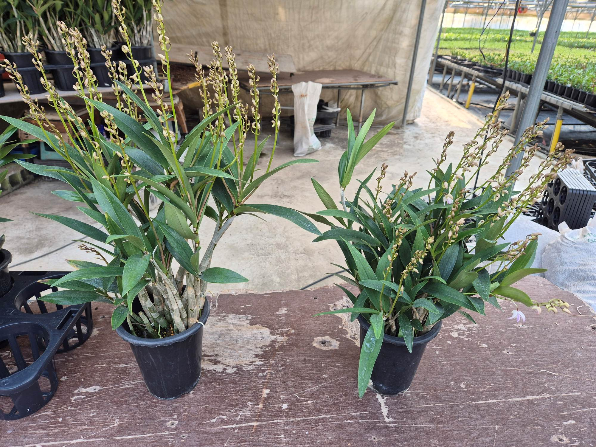
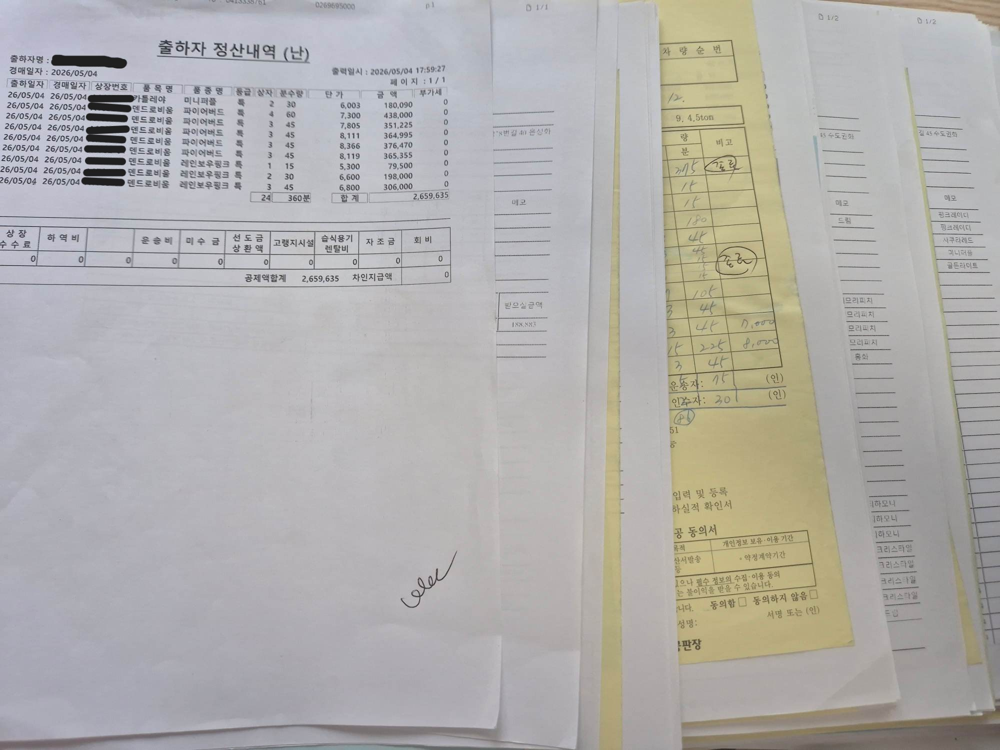
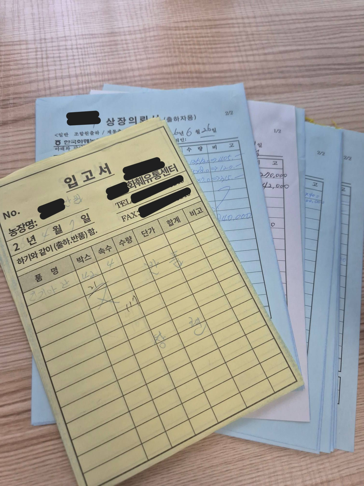
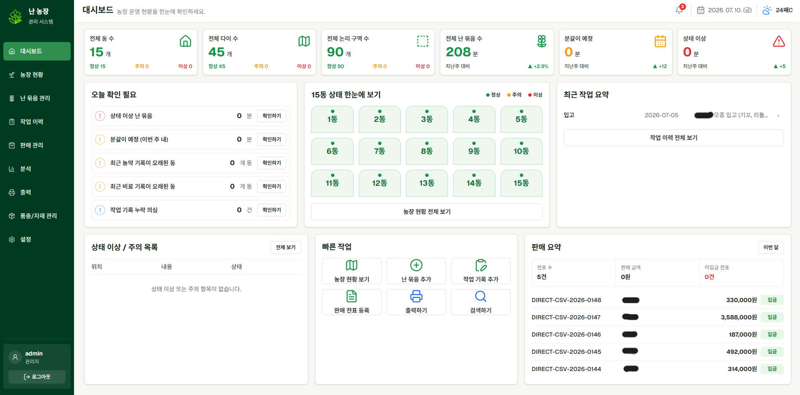

2025년, 취업 준비가 뜻대로 풀리지 않으면서 본가의 난 농장 일을 본격적으로 돕게 되었다.

본가에서는 20년 전부터 난 농장을 운영하고 있었다.
이전에도 종종 농장 일을 도운 적은 있었지만, 이번처럼 오전 8시에 나가 오후 6시까지, 주말 없이 일을 해본 것은 처음이었다.


내가 본가에 내려온 12월은 그동안 자란 난들이 꽃을 피우고 본격적으로 판매되는 시기였다.
단화, 풀뽑기, 잎정리, 달팽이 약 살포 같은 관리 작업부터 물건 선별, 등급 구별, 4구 포장, 상차, 자리 정리, 바닥 청소, 분갈이, 분주 작업까지 거의 매일 반복됐다.

예전에는 농장 일을 도왔다고 생각했지만, 하루 종일 농장 안에서 일해보니 느낌이 달랐다.
겉으로 보기에는 단순 반복처럼 보이는 일도 많았지만, 실제로는 타이밍과 순서가 중요했다.
어떤 작업을 먼저 해야 하는지, 어떤 난을 선별해야 하는지, 어느 위치에 어떤 품종이 있는지는 대부분 부모님의 경험과 기억에 의존하고 있었다.



## 판매 방식

농장의 판매는 크게 두 가지 방식으로 이루어졌다.

1. 경매장에 출하하는 방식
2. 도매상이나 소매상에게 직접 판매하는 방식

경매 출하는 양재, 음성, 고양, 부산 경매장에 물건을 직접 출하하거나 차량을 불러 올리는 방식이었다.
이후 경매장에서 낙찰이 이루어지면 정산을 통해 돈이 입금된다.

다만 경매장에 보낸 물건이 항상 바로 판매되는 것은 아니었다.
어떤 물건은 유찰되어 경매장에 대기했다가 다음 경매에 다시 올라가기도 했고, 끝내 팔리지 않으면 농장으로 다시 돌아오기도 했다.

```text
경매 출하
  ↓
경매 진행
  ├─ 낙찰
  ├─ 부분 낙찰
  ├─ 유찰 후 재경매 대기
  └─ 반환
```

일반 판매는 도매상이나 소매상과 직접 거래하는 방식이었다.
많은 양을 원하는 거래처에는 직접 물건을 가져다주기도 했고, 반대로 거래처가 농장을 방문해 물건을 보고 사가기도 했다.

도매 거래는 정산이 조금 늦어지는 경우도 있었지만, 방문 판매는 대부분 바로 입금되는 편이었다.



## 기존 운영 방식

부모님께서는 20년 동안 농장을 운영하면서 대부분의 정보를 머릿속으로 기억하셨다.
중요한 내용은 농정일지에 수기로 남겼고, 일정과 판매 흐름도 오랜 경험을 바탕으로 관리해오셨다.

부모님 입장에서는 크게 헷갈릴 것이 없었다.
실제로 농장은 원활하게 운영되고 있었다.

하지만 6개월 동안 직접 일을 해보니 다른 관점이 보이기 시작했다.

농장에는 기록하고 싶은 정보가 많았다.

```text
어느 동, 어느 다이에 어떤 난이 있는지
어떤 품종이 얼마나 남아 있는지
최근 어떤 구역에 어떤 작업을 했는지
어떤 물건이 경매장에 나갔는지
그중 무엇이 팔렸고, 무엇이 유찰되었는지
어떤 정산은 입금되었고, 어떤 정산은 아직 남아 있는지
```

기존 방식으로도 농장은 운영될 수 있었다.
하지만 정보가 머릿속과 종이 위에 흩어져 있다 보니, 나중에 데이터를 기준으로 다시 확인하거나 분석하기는 어려웠다.



## 기록은 있었지만 데이터는 아니었다

농장에 기록이 없었던 것은 아니다.
농정일지도 있었고, 판매 전표도 있었고, 부모님의 기억도 있었다.

문제는 이 기록들이 서로 연결되어 있지 않다는 점이었다.

예를 들어 어떤 품종이 많이 팔렸는지 알고 싶다면 판매 기록을 다시 봐야 했다.
어떤 품종이 현재 어느 동에 얼마나 남아 있는지 알고 싶다면 부모님의 기억에 의존해야 했다.

즉, 운영은 가능했지만 데이터로 쌓이고 있지는 않았다.

특히 부모님께서는 품종별로 어떤 난이 가장 수익을 많이 내는지, 품종별 가격 변화가 어떻게 되는지, 현재 농장에 어떤 품종이 얼마나 있는지를 더 쉽게 알고 싶어 하셨다.

이 부분이 프로젝트를 시작하게 된 가장 큰 계기였다.

## 만들고 싶었던 것

처음부터 거창한 자동화 시스템을 만들고 싶었던 것은 아니었다.
농장의 모든 일을 자동으로 처리하는 시스템은 현실적이지도 않았고, 당장 필요한 것도 아니었다.

우선 목표는 단순했다.

**현장에서 실제로 꾸준히 사용할 수 있는 관리 시스템을 만드는 것.**

종이 전표와 수기 기록의 흐름을 무리하게 없애기보다는, 기존 운영 방식을 유지하면서도 중요한 데이터가 자연스럽게 쌓이도록 만들고 싶었다.

그래서 난 농장 운영을 웹에서 관리할 수 있는 시스템을 만들기 시작했다.

내가 만들고 싶었던 것은 단순한 메모장이 아니었다.
농장 위치, 난 묶음, 작업 이력, 품종, 판매, 경매, 정산, 입금 흐름이 서로 연결되는 시스템이었다.

```text
농장 위치
  → 동 / 다이 / 구역 / 난 묶음

작업 기록
  → 농약 / 비료 / 분갈이 / 잎정리 / 위치 이동 / 메모

판매와 경매
  → 일반 판매 / 경매 출하 / 유찰 / 반환 / 정산 / 입금

품종 관리
  → 품종 정보 / 보유 수량 / 가격 변화 / 판매 성과
```


## 정리

이 프로젝트는 단순히 농장 일을 편하게 하기 위한 것은 아니다.

20년 동안 머릿속과 종이 위에서 관리되던 농장 운영 흐름을 직접 경험하고, 그 흐름을 데이터로 쌓을 수 있는 시스템으로 옮겨보는 과정이었다.

이번 글에서는 프로젝트를 시작하게 된 계기와 문제의식을 정리했다.
다음 글에서는 실제 농장의 구조를 어떻게 `동 → 다이 → 구역 → 난 묶음` 모델로 바꿨는지 정리해보려 한다.
