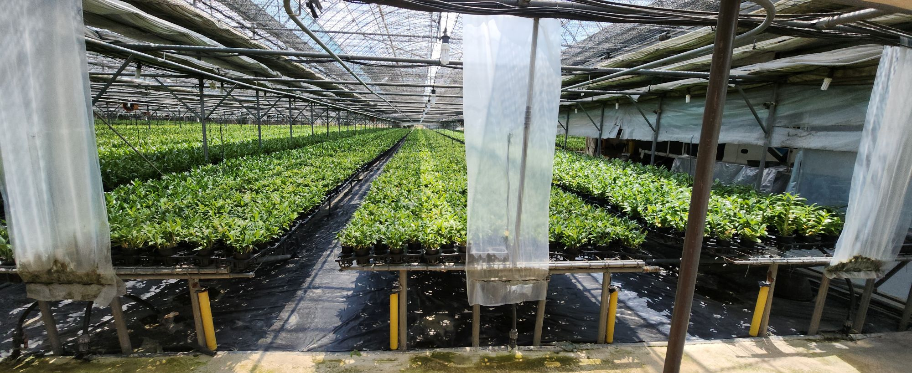
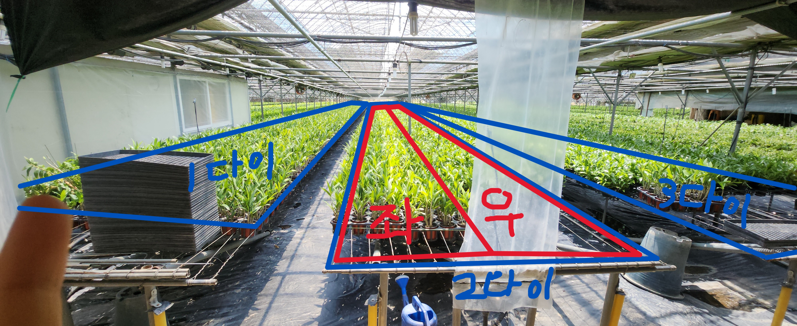
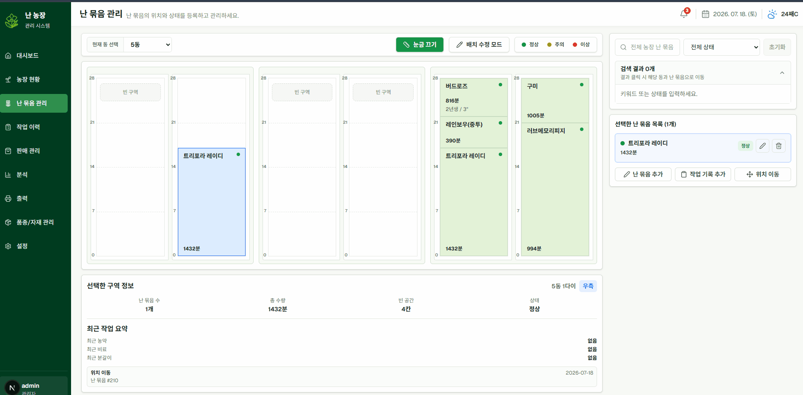
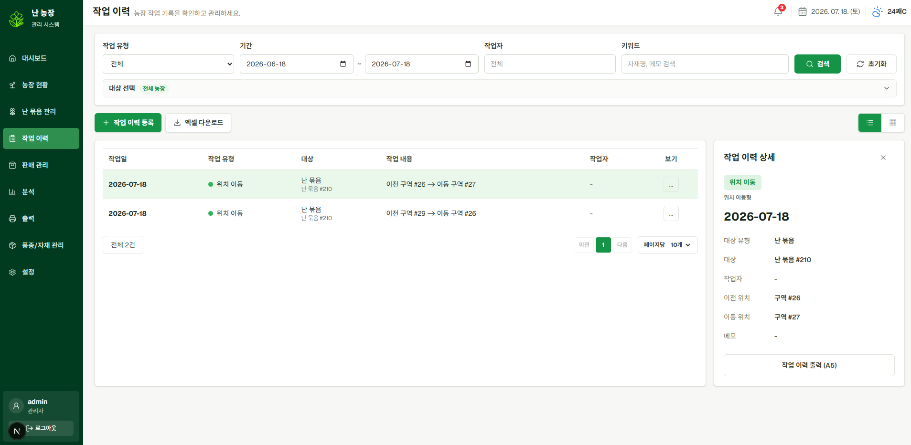
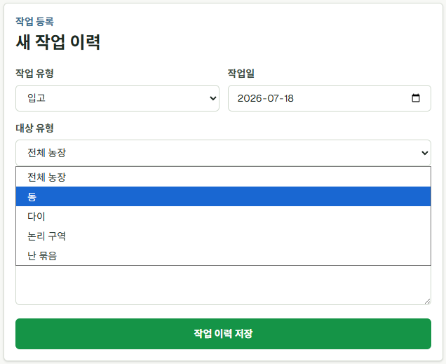
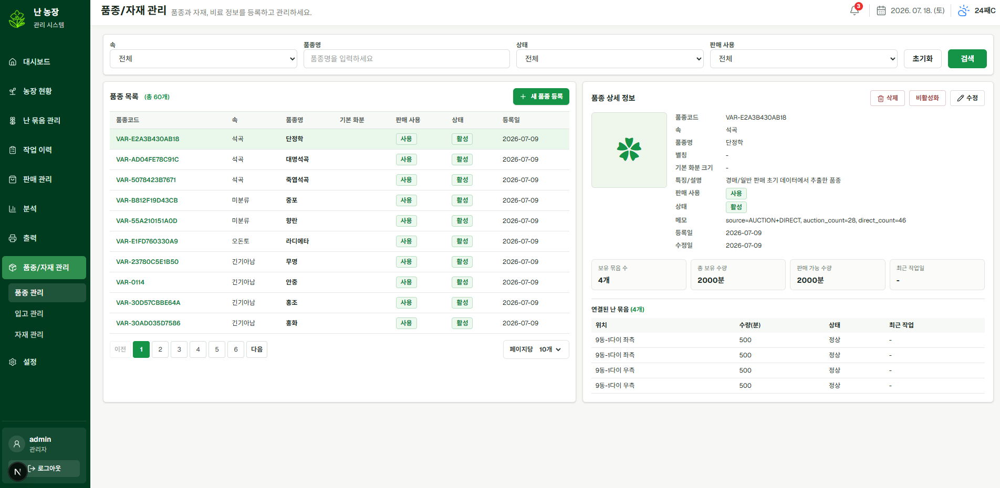
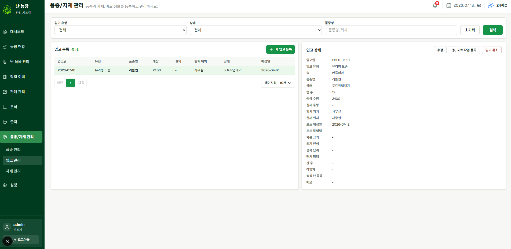

지난 글에서는 난 농장 관리 시스템을 만들게 된 계기를 정리했다.

부모님께서는 20년 동안 농장을 운영하면서 대부분의 정보를 머릿속과 농정일지로 관리해오셨다.
실제로 농장은 문제없이 운영되고 있었지만, 직접 일을 해보니 데이터를 기준으로 다시 확인하거나 분석하기 어려운 지점들이 보였다.

이번 글에서는 실제 농장의 구조를 어떻게 시스템의 데이터 모델로 바꿨는지 정리해보려 한다.

## 처음에는 단순해 보였다

처음에는 단순히 "어디에 어떤 난이 있는지"만 기록하면 된다고 생각했다.

예를 들면 이런 식이다.

```text
1동 1다이 좌측에 덴드로비움 파이어버드 30분
3동 2다이 우측에 온시디움 해피스윙클 50분
5동 1다이 좌측에 카틀레야 20분
```

하지만 실제 농장에서는 이것만으로는 부족했다.

같은 품종이라도 여러 위치에 나뉘어 있을 수 있고, 같은 위치 안에서도 상태가 다른 난들이 섞여 있을 수 있다.
또 농장 일을 하다 보면 난의 위치가 계속 바뀐다. 판매 준비를 위해 옮기기도 하고, 분갈이나 분주 후에 다시 배치하기도 하고, 공간을 확보하기 위해 자리를 정리하기도 한다.

즉, 위치는 고정된 값이 아니라 계속 변하는 운영 정보였다.



## 실제 농장의 위치 단위

우리 농장은 여러 동으로 나뉘어 있고, 각 동 안에는 여러 개의 다이가 있다.
그리고 하나의 다이는 작업자가 실제로 구분해서 이해하는 좌측, 우측 같은 구역으로 나뉜다.

처음에는 이 구조를 단순히 `동 → 다이 → 난` 정도로 생각했다.

```text
동
└─ 다이
    └─ 난
```

하지만 실제로는 다이 전체를 하나의 위치로 보면 너무 넓었다.
작업자는 "1동 2다이"라고만 말하지 않고, 보통 "1동 2다이 좌측", "3동 1다이 우측"처럼 더 작은 단위로 위치를 기억하고 있었다.

그래서 베타 버전에서는 농장의 위치 구조를 다음처럼 나누었다.

```text
동
└─ 물리 다이
    └─ 논리 구역
        └─ 난 묶음
```

여기서 `물리 다이`는 실제 농장에 존재하는 다이다.
그리고 `논리 구역`은 그 다이를 운영상 나눈 단위다. 기본적으로는 좌측과 우측으로 나누었지만, 이후에는 커스텀 구역이나 행잉 구역도 확장할 수 있도록 했다.



## 왜 개별 화분이 아니라 난 묶음인가

처음 고민했던 것 중 하나는 개별 화분 단위로 관리할지, 묶음 단위로 관리할지였다.

개발자 입장에서는 개별 화분마다 QR을 붙이고 하나씩 추적하는 방식이 더 정교해 보인다.
하지만 실제 농장 운영에는 맞지 않았다.

농장에는 수많은 화분이 있고, 같은 품종과 같은 상태의 화분들이 한꺼번에 이동하는 경우가 많다.
작업도 개별 화분 하나하나보다 "이 구역의 이 품종들"을 기준으로 이루어지는 경우가 많았다.

예를 들면 다음과 같다.

```text
1동 2다이 좌측에 있는 파이어버드 30분 잎정리
3동 1다이 우측의 상품분 50분 선별
5동 2다이 좌측의 3.5치 포트묘 자리 이동
```

이런 흐름에서는 개별 화분보다 "난 묶음"이 더 자연스러운 관리 단위였다.

그래서 베타 버전의 핵심 관리 단위는 개별 화분이 아니라 **난 묶음**으로 정했다.

난 묶음은 다음과 같은 정보를 가진다.

```text
품종
속
수량
예약 수량
화분 크기
연차
상태
배치 위치
메모
```

특히 판매와 연결되면서 `예약 수량`이 필요해졌다.
전표를 작성했다고 바로 실제 수량을 차감하면 안 되고, 출고가 완료되기 전까지는 "판매 예정으로 잡힌 수량"을 따로 관리해야 했기 때문이다.

## 위치는 이력으로 남아야 했다

난 묶음은 계속 이동한다.

자리 정리를 하면서 옮기기도 하고, 판매 준비를 위해 모으기도 하고, 분갈이 후 다른 구역에 배치하기도 한다.
따라서 단순히 현재 위치만 저장하면 이전에 어디에 있었는지 알 수 없다.

처음에는 현재 위치만 바뀌면 충분하다고 생각했지만, 실제 운영을 생각하면 위치 이동 자체도 중요한 작업이었다.

```text
이동 전 위치
이동 후 위치
이동일
작업자
메모
```

이 정보가 남아야 나중에 "언제 왜 이 난이 여기로 왔는지"를 확인할 수 있다.

그래서 난 묶음을 이동하면 위치 정보만 바꾸는 것이 아니라, 위치 이동 작업 이력이 자동으로 생성되도록 했다.



작업 이력이 자동으로 등록된다.




## 작업 이력의 대상 정하기

농장 작업은 항상 난 묶음 하나에만 발생하지 않는다.

어떤 작업은 농장 전체에 해당하고, 어떤 작업은 특정 동에만 해당한다.
또 어떤 작업은 다이 단위로 이루어지고, 어떤 작업은 특정 구역이나 난 묶음에만 해당한다.

예를 들면 다음과 같다.

```text
농장 전체 달팽이 약 살포
3동 전체 물 주기
2동 1다이 좌측 잎정리
특정 난 묶음 분갈이
특정 난 묶음 위치 이동
```

그래서 작업 이력은 하나의 대상만 고정해서 설계하면 안 됐다.

베타 버전에서는 작업 이력이 다음 대상 중 하나를 가리킬 수 있도록 했다.

```text
농장
동
물리 다이
논리 구역
난 묶음
```

이렇게 하면 작업의 크기에 맞춰 기록할 수 있다.
너무 세밀하게 기록해야 하는 작업은 난 묶음 단위로 남기고, 넓은 범위의 작업은 동이나 구역 단위로 남길 수 있다.



## 품종과 난 묶음을 분리하기

처음에는 난 묶음에 품종명을 문자열로 바로 저장해도 된다고 생각했다.

```text
품종명: 파이어버드
속: 덴드로비움
수량: 30
```

하지만 이렇게 하면 문제가 생긴다.

같은 품종명이 여러 방식으로 입력될 수 있고, 나중에 품종별 총 보유 수량이나 판매 성과를 분석하기 어려워진다.
예를 들어 같은 품종인데 어떤 곳에는 `파이어버드`, 어떤 곳에는 `화이어버드`, 어떤 곳에는 `Firebird`로 입력되면 같은 품종으로 묶기 어렵다.

그래서 품종은 별도의 기준 정보로 분리했다.

```text
품종
  └─ 난 묶음
```

품종에는 속, 품종명, 별칭, 기본 화분 크기, 판매 사용 여부 같은 기준 정보를 저장한다.
난 묶음은 반드시 하나의 품종과 연결되도록 했다.

이렇게 하면 품종별로 다음과 같은 정보를 조회할 수 있다.

```text
연결된 난 묶음 수
총 보유 수량
판매 가능 수량
최근 입고일
최근 작업일
```



## 입고와 분주는 다르게 봐야 했다

농장에 새로운 난이 생기는 경우는 크게 두 가지가 있다.

첫 번째는 외부에서 새로 들어오는 경우다.
예를 들어 유리병 모종, 포트 모종, 상품분, 샘플 등이 들어오는 경우다.

두 번째는 기존에 있던 난을 분주해서 새 묶음으로 나누는 경우다.

처음에는 둘 다 "새 난 묶음 생성"으로 처리할 수도 있다고 생각했다.
하지만 실제 의미는 달랐다.

외부에서 들어온 난은 입고 기록이 필요하다.

```text
입고일
입고 유형
품종
수량
임시 보관 위치
포트 작업 예정일
초기 배치 위치
```

반면 분주는 외부 유입이 아니다.
이미 농장에 있던 난을 나누는 작업이다.
따라서 입고가 아니라 작업 이력에 가깝다.

그래서 베타 버전에서는 입고와 분주를 구분하기로 했다.

```text
입고
  → 외부에서 새로 들어온 난

분주
  → 기존 난 묶음에서 나뉘어 생긴 난
```

특히 유리병 모종은 입고 시점에 바로 다이에 올라가지 않는 경우가 많다.
일주일 정도 임시 공간에 보관한 뒤 포트 작업을 하는 경우도 있다.

그래서 유리병 모종은 입고 시점에는 난 묶음을 만들지 않고, 포트 작업이 완료되어 실제 배치될 때 난 묶음을 생성하는 흐름으로 잡았다.

```text
유리병 모종 입고
  ↓
임시보관
  ↓
포트 작업
  ↓
난 묶음 생성
  ↓
다이에 배치
```



## 결국 핵심은 현실의 작업 단위였다

이번 모델링에서 가장 중요했던 것은 개발자 입장에서 가장 정교한 구조를 만드는 것이 아니었다.

실제 농장에서 부모님과 작업자가 이해하는 단위를 시스템에 반영하는 것이 더 중요했다.

그래서 개별 화분 단위 대신 난 묶음 단위를 선택했고, 실제 다이를 좌우 구역으로 나누었고, 작업 이력은 농장 전체부터 난 묶음까지 여러 대상에 남길 수 있도록 했다.

정리하면 베타 버전의 핵심 구조는 다음과 같다.

```text
농장 위치
  → 동 / 물리 다이 / 논리 구역 / 난 묶음

작업 기록
  → 농장 / 동 / 다이 / 구역 / 난 묶음 중 하나를 대상으로 기록

품종 관리
  → 품종 기준 정보와 난 묶음을 분리

입고 관리
  → 외부 유입은 입고로, 기존 난 분주는 작업으로 구분

위치 이동
  → 현재 위치 변경뿐 아니라 이동 이력도 함께 기록
```

## 정리

처음에는 농장 위치를 단순히 기록하는 기능으로 시작했다.
하지만 실제로는 위치, 품종, 수량, 작업 이력, 입고 흐름이 서로 연결되어 있었다.

이 과정을 거치면서 단순 CRUD보다 먼저 해야 할 일은 현실의 업무 단위를 제대로 이해하는 것이라는 점을 느꼈다.

베타 버전의 데이터 모델은 완벽한 정답이라기보다는, 실제 농장에서 꾸준히 사용할 수 있는 단위를 찾는 과정이었다.

다음 글에서는 일반 판매와 경매 판매를 어떻게 다르게 모델링했는지, 그리고 왜 경매를 lot 단위로 추적해야 했는지 정리해보려 한다.
