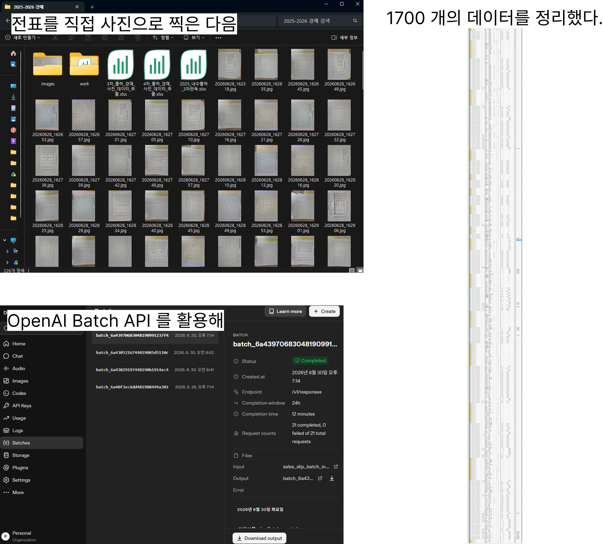
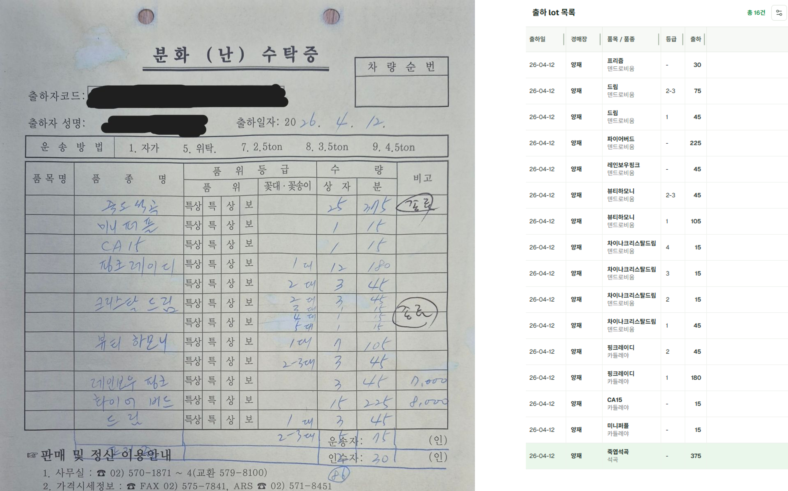
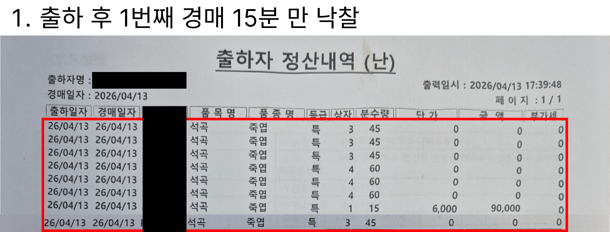
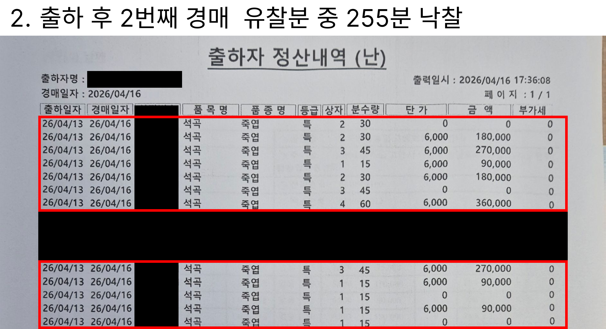
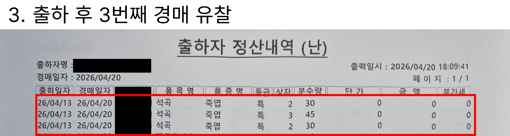
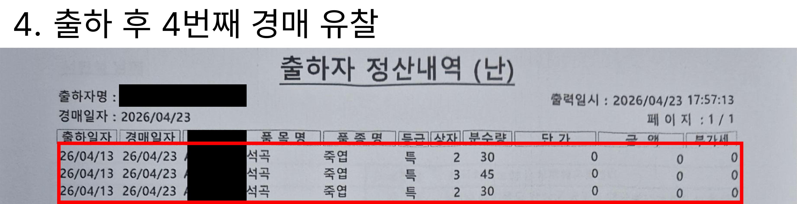
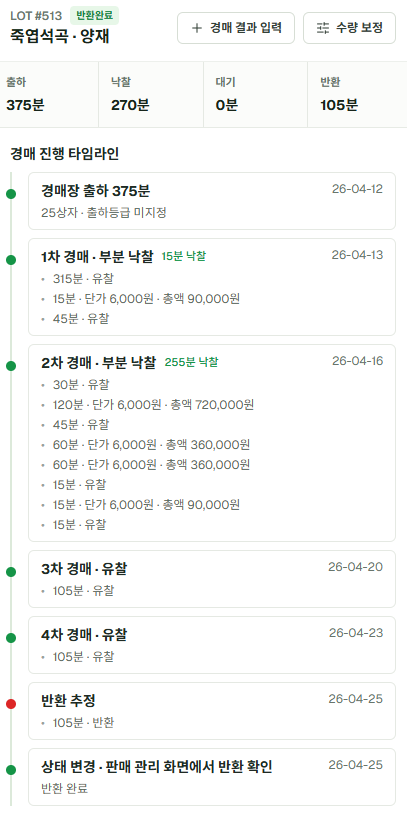
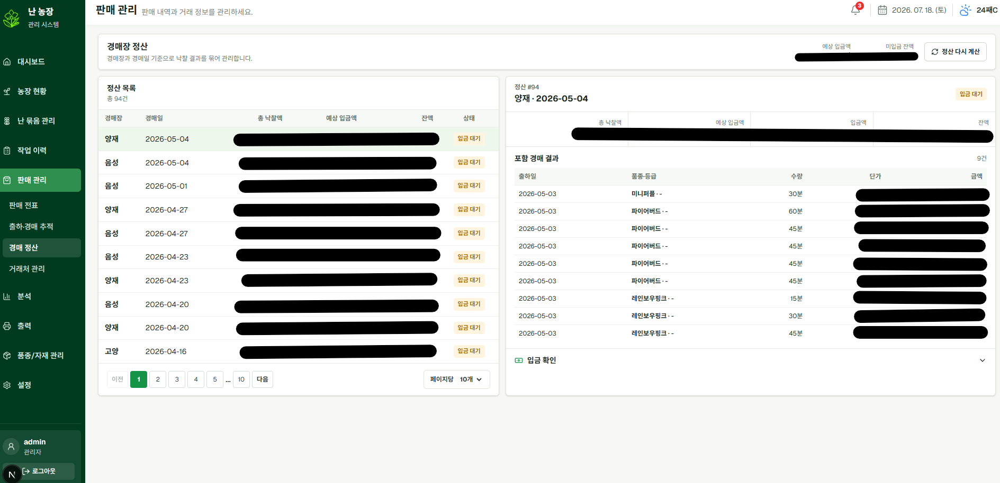

지난 글에서는 실제 난 농장의 위치와 작업을 어떻게 데이터 모델로 바꿨는지 정리했다.

처음에는 단순히 "어디에 어떤 난이 있는지"를 기록하면 된다고 생각했지만, 실제로는 동, 다이, 구역, 난 묶음, 품종, 입고, 작업 이력이 서로 연결되어 있었다.

이번 글에서는 판매 관리, 그중에서도 경매 출하를 어떻게 모델링했는지 정리해보려 한다.

## 판매는 단순하지 않았다

농장의 판매 방식은 크게 두 가지였다.

```text
1. 일반 판매
2. 경매 판매
```

일반 판매는 비교적 직관적이었다.
거래처가 농장에 방문하거나, 우리가 직접 물건을 가져다주고, 판매 전표를 작성한 뒤 입금을 확인하면 된다.

```text
일반 판매
  ↓
판매 전표 작성
  ↓
출고
  ↓
입금 확인
```

물론 일반 판매도 거래처, 판매 품목, 수량, 단가, 입금 상태를 기록해야 한다.
하지만 흐름 자체는 비교적 단순했다.

문제는 경매 판매였다.

경매 판매는 물건을 보낸다고 바로 판매가 끝나는 구조가 아니었다.
경매장에 출하한 뒤, 실제 경매가 진행되고, 낙찰 여부가 결정되고, 이후 정산과 입금까지 이어진다.

```text
경매 판매
  ↓
경매장 출하
  ↓
경매 진행
  ↓
낙찰 / 유찰 / 부분 낙찰 / 반환
  ↓
경매 정산
  ↓
입금 확인
```

처음에는 경매도 판매 전표 하나로 관리하면 된다고 생각했다.
하지만 실제 경매 데이터를 정리하다 보니 그렇게 단순하게 처리할 수 없었다.



## 경매는 판매 시점이 분리된다

일반 판매에서는 판매 전표를 작성하는 시점과 실제 판매가 거의 붙어 있다.
하지만 경매는 그렇지 않다.

농장에서 물건을 출하한 날짜와 실제 경매가 진행되는 날짜가 다를 수 있다.
또 경매가 진행되었다고 해서 모두 판매되는 것도 아니다.

예를 들어 이런 상황이 생긴다.

```text
2026-03-01
  파이어버드 특 30분 출하

2026-03-02
  20분 낙찰
  10분 유찰

2026-03-05
  유찰된 10분 재경매
  5분 낙찰
  5분 반환
```

이 경우 처음 출하한 수량은 30분이지만, 한 번의 경매 결과로 모든 상태가 결정되지 않는다.
일부는 판매되고, 일부는 대기하고, 일부는 다시 경매에 올라가고, 일부는 농장으로 돌아올 수 있다.

즉, 경매 판매는 다음 값들이 계속 바뀐다.

```text
출하 수량
판매 수량
대기 수량
반환 수량
현재 상태
정산 대상 수량
```

그래서 경매를 단순히 "판매 전표의 한 줄"로만 저장하면 이후 흐름을 추적하기 어렵다.

## lot 단위가 필요했다

경매장에 출하한 물건은 품목, 품종, 등급, 수량을 기준으로 묶인다.
이 묶음은 경매 이후에도 계속 추적되어야 한다.

그래서 경매 판매는 전표 항목이 아니라 **lot 단위**로 추적하기로 했다.

```text
경매장 출하 전표
  └─ 경매 lot
       ├─ 경매 시도
       ├─ 경매 결과 행
       └─ 상태 이력
```

lot는 "경매장에 보낸 하나의 추적 단위"다.

예를 들면 다음과 같다.

```text
출하일: 2026-03-01
경매장: 양재
품목: 덴드로비움
품종: 파이어버드
등급: 특
출하 수량: 30
```

이 lot는 이후 경매 결과에 따라 상태가 바뀐다.

```text
30분 출하
  ↓
20분 낙찰
10분 재경매 대기
  ↓
5분 추가 낙찰
5분 반환
```

이런 흐름을 저장하려면 단순히 최종 결과만 저장해서는 안 된다.
경매 시도와 상태 변경 과정을 같이 남겨야 한다.

아래는 실제 경매 출하 문서와 매핑된 출하 lot 목록이다.




## 경매 상태 흐름

경매 lot에는 여러 상태가 필요했다.

처음 출하되었을 때, 경매 진행 중일 때, 판매되었을 때, 일부만 판매되었을 때, 유찰되었을 때, 재경매 대기 중일 때, 반환이 추정되었을 때, 실제 반환이 확인되었을 때가 모두 다르다.

베타 버전에서는 경매 lot 상태를 다음과 같이 관리했다.

```text
출하
  ↓
대기
  ↓
경매 진행
  ├─ 판매 완료
  ├─ 부분 판매
  ├─ 유찰
  ├─ 재경매 대기
  ├─ 반환 추정
  └─ 반환 완료
```

조금 더 실제 업무 흐름에 가깝게 보면 다음과 같다.

```text
경매 lot 생성
  ↓
경매 결과 입력
  ├─ 낙찰
  │    └─ 판매 수량 증가
  │
  ├─ 부분 낙찰
  │    ├─ 판매 수량 증가
  │    └─ 잔여 수량 대기
  │
  ├─ 유찰
  │    └─ 재경매 대기
  │
  └─ 반환 추정
       └─ 반환 확인
```

여기서 중요한 점은 "상태가 바뀌었다"는 사실만 저장하는 것이 아니라, 왜 바뀌었는지도 남기는 것이다.

```text
이전 상태
새 상태
변경일
변경 사유
작업자
메모
```

경매 결과는 사람이 나중에 입력하거나 보정할 수 있기 때문에, 상태 이력을 남기는 것이 중요했다.

## 유찰과 반환은 단순 실패가 아니다

경매에서 유찰은 단순한 실패가 아니었다.

유찰된 물건은 바로 끝나는 것이 아니라, 경매장에 남아 다음 경매를 기다릴 수 있다.
그래서 유찰은 "판매 실패"라기보다 "아직 판매되지 않은 대기 상태"에 가깝다.

```text
유찰
  ↓
재경매 대기
  ↓
다음 경매
```

반환도 마찬가지다.

경매 결과만 보고 바로 실제 반환이 확정되는 것은 아니다.
시스템상으로는 반환이 추정되지만, 실제로 물건이 농장으로 돌아왔는지 확인하는 단계가 필요하다.

그래서 반환은 두 단계로 나누었다.

```text
반환 추정
  ↓
반환 확인
```

이렇게 나눈 이유는 현장 운영에서는 "데이터상으로는 반환일 것 같지만 아직 실제 물건을 확인하지 않은 상태"가 존재하기 때문이다.

이 상태를 구분하지 않으면, 시스템에는 반환 완료로 보이지만 실제 농장에는 아직 물건이 도착하지 않은 상황이 생길 수 있다.

결과적으로 lot 추적은 아래와 같은 흐름을 참고하여 구현했다.






그 다음 경매에서 유찰 내역이 보이지 않으므로 반환으로 추정한다.



## 정산은 출하 전표가 아니라 낙찰 결과를 기준으로 만들어진다

경매는 낙찰되었다고 바로 모든 흐름이 끝나는 것이 아니다.

경매장별로 그날 경매가 끝난 뒤, 실제로 낙찰된 물건들을 기준으로 정산 대상이 만들어진다.
여기서 중요한 점은 정산이 경매 출하 전표 전체와 바로 연결되는 것이 아니라는 점이다.

처음에는 경매 출하 전표 하나가 있고, 그 전표에 포함된 lot들이 한 번에 경매되고, 그 결과가 그대로 하나의 정산으로 이어진다고 생각하기 쉽다.
하지만 위에서 언급했던 것처럼 실제 경매 흐름은 그렇지 않았다.

같은 날 출하한 lot들이 모두 같은 날 판매되는 것은 아니다.
어떤 lot는 바로 낙찰될 수 있고, 어떤 lot는 유찰되어 다음 경매로 넘어갈 수 있다.
또 하나의 lot 중 일부만 낙찰되고 나머지는 대기하거나 반환될 수도 있다.

즉, 정산의 기준은 "처음 만든 경매 출하 전표"가 아니라 **해당 경매일에 실제로 낙찰된 결과**다.

그래서 경매 정산은 별도의 데이터로 관리했다.

```text
AuctionSettlement
  └─ AuctionSettlementLine
```

정산 묶음은 경매장과 경매일을 기준으로 생성된다.
그리고 정산 행은 해당 날짜에 낙찰된 lot의 결과 행과 연결된다.

이렇게 분리하면 하나의 출하 전표에 포함된 lot들이 서로 다른 날짜에 판매되더라도 자연스럽게 처리할 수 있다.

```text
출하 전표
  → 출하 기준 기록

경매 lot
  → 출하 물량 추적 단위

경매 결과 행
  → 실제 낙찰 결과

경매 정산
  → 특정 경매일에 낙찰된 결과들의 묶음
```

베타 버전에서는 이 정산 구조를 우선 "낙찰 결과를 묶어두는 단위"로 구현했다.
즉, 경매가 끝난 뒤 해당 경매일에 낙찰된 결과 행들을 정산 묶음으로 생성하고, 이후 입금 확인이나 금액 대조로 이어질 수 있는 기반을 만든 것이다.

다만 아직 수수료, 공제 금액, 세금, 실제 입금 내역과의 자동 대조, 주기적인 스케줄 처리까지 구현한 것은 아니다.
이 부분은 실제 운영 데이터를 쌓으면서 개선해나갈 영역으로 남겨두었다.

현재 기준으로 정산에서 우선 관리하는 것은 다음에 가깝다.

```text
경매장
경매일
정산 대상 낙찰 결과
정산 묶음 상태
입금 확인 여부
메모
```

나중에는 여기에 다음 기능을 추가할 수 있다.

```text
수수료 입력
공제 금액 입력
예상 입금액 계산
실제 입금 내역과 대조
부분 입금 처리
금액 불일치 검토
정산 재계산 이력
세금 관련 항목 관리
```

> 사진 추천: 경매 정산 목록 또는 정산 상세 화면
> 예시 파일명: `auction-settlement.png`



## 입금 처리는 이후 확장할 영역으로 남겼다

입금은 돈과 관련된 기록이기 때문에 삭제보다 보존이 중요하다.

일반 판매 전표나 경매 정산에 대해 입금 확인을 할 수 있는 흐름은 필요했다.
하지만 베타 버전에서 입금 관리를 완전한 회계 기능처럼 만들지는 않았다.

예를 들어 다음 기능들은 아직 본격적으로 다루지 않았다.

```text
은행 입금 내역 가져오기
입금자명 자동 매칭
부분 입금 자동 처리
초과 입금 처리
금액 불일치 자동 검출
주기적인 입금 확인 스케줄
세금 계산
```

대신 베타 버전에서는 판매와 경매 흐름이 입금 확인으로 이어질 수 있도록 최소한의 연결 구조를 마련하는 데 집중했다.

```text
일반 판매 전표
  → 전표 단위 입금 확인

경매 정산
  → 정산 묶음 단위 입금 확인
```

이렇게 해두면 당장은 수동으로 입금 여부를 확인하더라도, 이후 은행 입금 내역을 가져오거나 자동 매칭 기능을 붙일 때 기존 판매·정산 데이터와 연결할 수 있다.

즉, 베타 버전의 입금 관리는 완성된 정산 시스템이라기보다 **판매와 경매 결과가 돈의 흐름으로 이어질 수 있도록 연결 지점을 만들어둔 단계**에 가깝다.

## 일반 판매와 경매 판매를 나눈 이유

처음에는 판매를 하나의 테이블로 단순하게 관리하고 싶었다.

하지만 실제로 정리해보니 일반 판매와 경매 판매는 흐름이 달랐다.

```text
일반 판매
  → 전표 중심
  → 판매와 출고가 비교적 가까움
  → 전표 단위 입금 확인

경매 판매
  → lot 중심
  → 출하, 경매, 정산, 입금 시점이 분리됨
  → 유찰, 재경매, 반환 상태가 필요함
  → 정산은 출하 전표가 아니라 낙찰 결과 기준으로 생성됨
  → 정산 묶음 단위로 입금 확인 흐름을 연결함
```

그래서 판매라는 큰 흐름은 공유하되, 경매는 별도의 추적 구조를 두었다.

베타 버전의 기본 흐름은 다음과 같다.

```text
일반 판매
  → 판매 전표
  → 출고 완료
  → 입금 확인

경매 판매
  → 경매장용 판매 전표
  → 출하 완료
  → 경매 lot 생성
  → 경매 결과 입력
  → 낙찰 결과 기준 정산 생성
  → 입금 확인
```

이렇게 나누니 일반 판매는 단순하게 유지하면서도, 경매 판매의 복잡한 흐름을 따로 추적할 수 있었다.

## 정리

경매 판매를 설계하면서 가장 크게 느낀 점은, 현실의 업무는 단순한 CRUD로 끝나지 않는다는 것이었다.

처음에는 판매 전표를 만들고 금액만 계산하면 될 것 같았다.
하지만 실제 경매 흐름에는 출하, 유찰, 재경매, 반환, 정산, 입금이라는 여러 단계가 있었다.

그래서 경매 판매는 전표가 아니라 lot 단위로 추적해야 했다.

```text
출하한 물건을 lot로 만들고
경매 시도와 결과를 남기고
상태 변경 이력을 기록하고
낙찰 결과를 기준으로 정산 묶음을 만든다
```

베타 버전에서는 수수료, 공제금, 세금, 자동 입금 대조까지 완성하지는 않았다.
대신 출하 전표, lot, 경매 결과, 정산 묶음, 입금 확인이 이어질 수 있는 기본 구조를 먼저 만들었다.

이 구조 덕분에 단순히 "얼마를 팔았는지"뿐만 아니라, "어떤 물건이 어디까지 진행되었는지"를 추적할 수 있게 되었다.

다음 글에서는 베타 버전에서 실제로 구현한 화면과 기능들을 정리해보려 한다.
농장 현황, 난 묶음 관리, 작업 이력, 품종/입고 관리, 판매/경매/입금 관리가 어떤 식으로 연결되었는지 화면 중심으로 살펴볼 예정이다.
