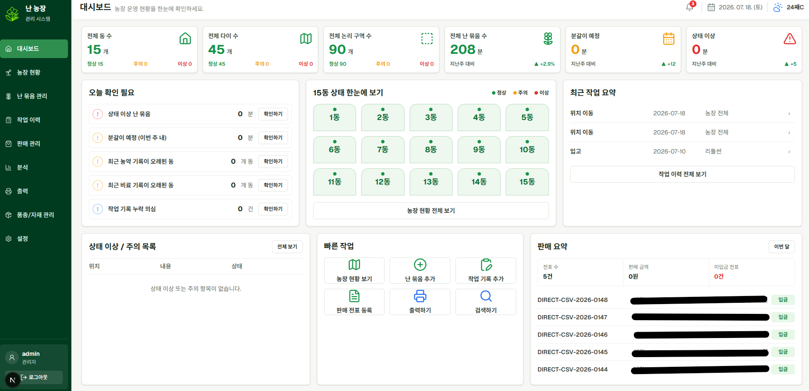
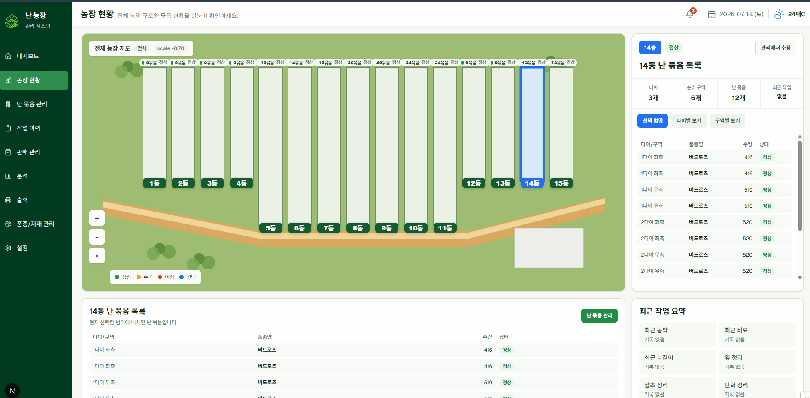
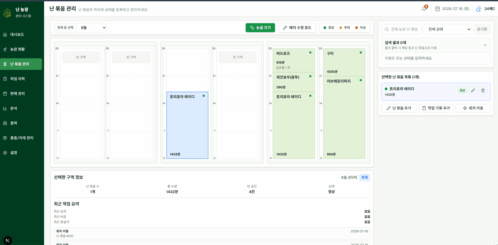
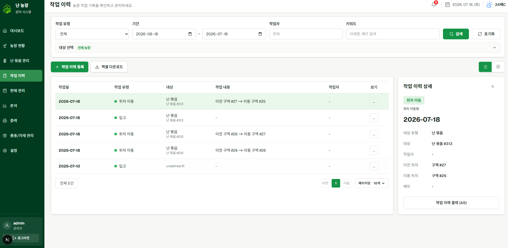
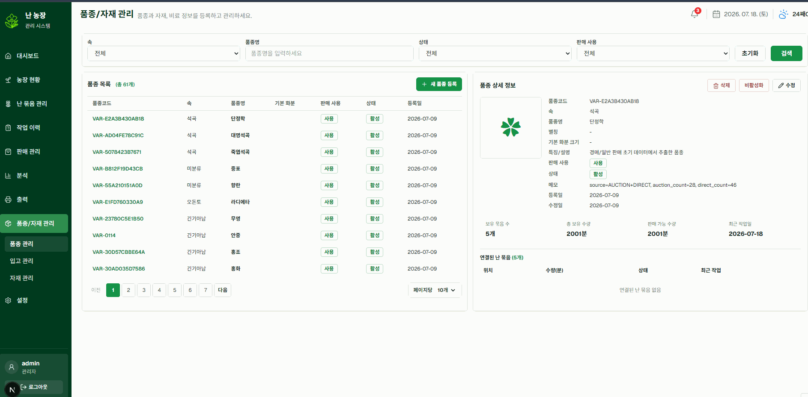
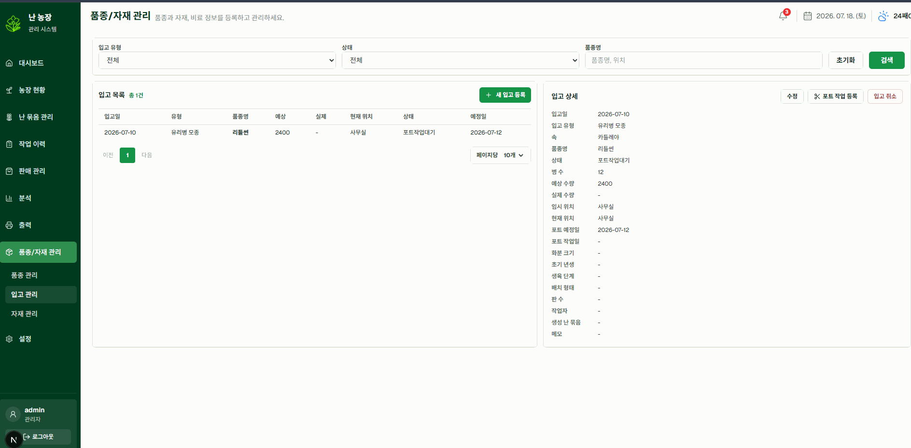
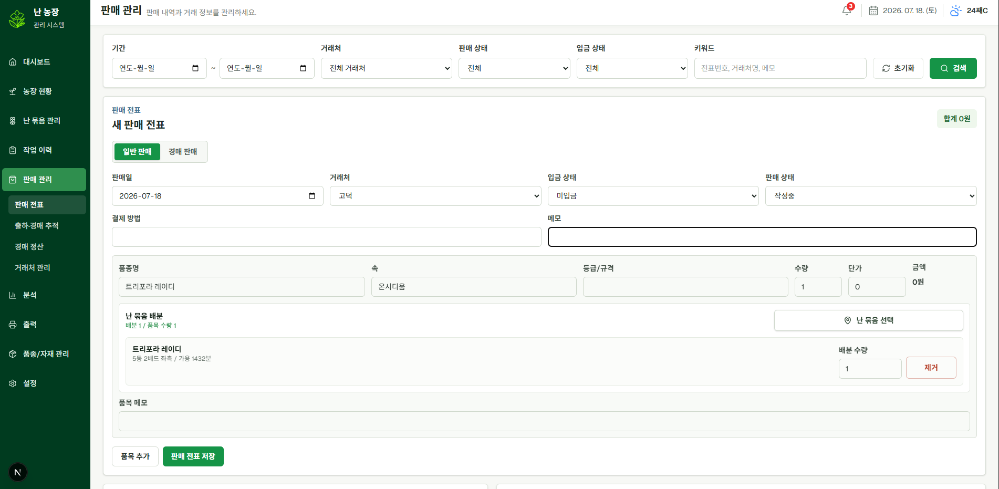
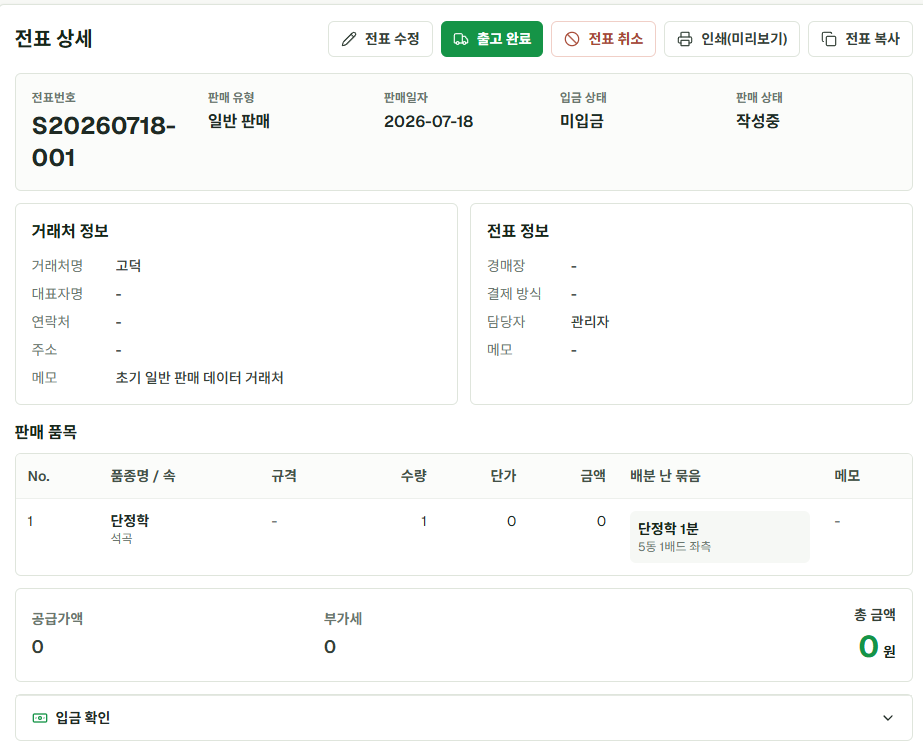
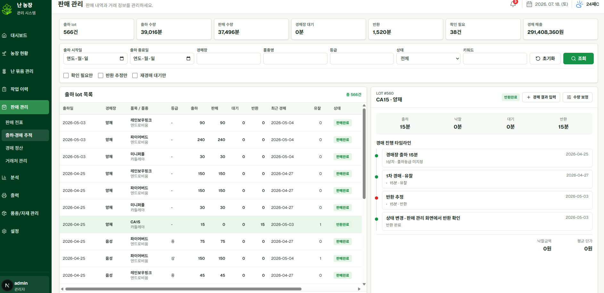

지난 글에서는 일반 판매와 경매 판매를 어떻게 다르게 모델링했는지 정리했다.

일반 판매는 전표 중심으로 관리할 수 있었지만, 경매 판매는 출하, 낙찰, 유찰, 재경매, 반환이 서로 다른 시점에 발생했다.

그래서 경매는 단순한 판매 전표가 아니라 lot 단위로 추적하도록 설계했다.

이번 글에서는 베타 버전에서 실제로 구현한 기능들을 화면 중심으로 정리해보려 한다.

## 베타 버전의 목표

베타 버전의 목표는 모든 기능을 완성하는 것이 아니었다.

우선 실제 농장에서 사용해볼 수 있는 기본 운영 흐름을 만드는 것이 목표였다.

```text
1. 농장 위치를 확인할 수 있어야 한다.
2. 난 묶음을 등록하고 이동할 수 있어야 한다.
3. 작업 이력을 남길 수 있어야 한다.
4. 품종과 입고 기록을 관리할 수 있어야 한다.
5. 일반 판매 전표를 작성할 수 있어야 한다.
6. 경매 출하 lot를 추적할 수 있어야 한다.
7. 낙찰 결과를 정산 묶음으로 생성할 수 있어야 한다.
```

기능의 수보다 실제 업무 흐름이 중간에 끊기지 않는 것을 우선했다. 주요한 기능들만 소개하려고 한다. 

## 전체 메뉴 구조

베타 버전의 주요 메뉴는 다음과 같이 구성했다.

```text
대시보드
농장 현황
난 묶음 관리
작업 이력
판매 관리
분석
출력
품종/자재 관리
설정
```

농장 현황은 전체 상태를 확인하는 화면이고, 난 묶음 관리는 실제 데이터를 변경하는 작업 화면이다.

작업 이력에서는 농장에서 수행한 작업을 기록하고, 판매 관리에서는 일반 판매와 경매 출하, 경매 결과, 정산 묶음을 관리한다.



## 농장 현황

농장 현황은 전체 농장을 조회하는 화면이다.

```text
전체 농장
  ↓
동 선택
  ↓
물리 다이 선택
  ↓
논리 구역 선택
  ↓
해당 위치의 난 묶음 확인
```

단순한 표보다 실제 농장의 위치 구조를 화면에 반영하는 것이 중요했다.

부모님은 난의 위치를 "3동 2다이 우측"과 같은 방식으로 기억하고 있기 때문에, 시스템에서도 비슷한 방식으로 위치를 찾을 수 있도록 구성했다.



농장 현황은 조회 중심으로 두었다.

난 묶음을 생성하거나 수정하고 이동하는 작업은 별도의 난 묶음 관리 화면에서 처리하도록 분리했다.

## 난 묶음 관리

난 묶음 관리는 실제 데이터를 변경하는 작업 화면이다.

```text
난 묶음 등록
난 묶음 수정
난 묶음 삭제
같은 동 내부 이동
다른 동으로 이동
위치 이동 이력 생성
```

개별 화분을 모두 관리하기보다, 같은 품종과 상태를 가진 화분을 하나의 난 묶음으로 관리했다.

실제 농장에서도 여러 화분이 함께 이동하거나 같은 작업을 받는 경우가 많았기 때문이다.



난 묶음을 이동하면 현재 위치만 바꾸는 것이 아니라 위치 이동 이력도 함께 남긴다.

```text
이동 전 위치
이동 후 위치
이동일
작업자
메모
```

## 작업 이력

작업 이력에서는 농장에서 수행한 작업을 기록한다.

```text
농약
비료
분갈이
상태 기록
일반 메모
잎 정리
잡초 정리
단화
위치 이동
```

작업은 난 묶음 하나에만 발생하지 않는다.

농장 전체, 특정 동, 다이, 구역 또는 개별 난 묶음을 대상으로 작업을 기록할 수 있도록 구성했다.

```text
농장
동
물리 다이
논리 구역
난 묶음
```


운영 과정에서 발생한 기록은 가능하면 삭제하지 않는 방향을 잡았다.

잘못 입력한 기록도 바로 지우기보다 취소나 보정 방식으로 남기는 것이 이후 상황을 확인하기에 더 안전하다고 판단했다.

## 품종과 입고 관리

품종/자재 관리 메뉴에는 품종, 입고, 자재를 함께 배치했다.

```text
품종/자재 관리
  ├─ 품종
  ├─ 입고
  └─ 자재
```

품종은 난 묶음에 문자열로 직접 입력하지 않고 별도의 기준 정보로 관리했다.

```text
속
품종명
별칭
기본 화분 크기
판매 사용 여부
상태
```

이렇게 해야 같은 품종이 서로 다른 이름으로 입력되는 것을 줄이고, 나중에 품종별 보유 수량이나 판매 성과를 집계할 수 있다.



입고에서는 외부에서 농장으로 들어온 모종이나 상품분을 기록한다.

```text
유리병 모종
포트 모종
상품분
샘플
기타 외부 유입
```

유리병 모종은 바로 다이에 배치되지 않는 경우가 있기 때문에, 임시보관 후 포트 작업을 거쳐 난 묶음으로 생성되는 흐름을 따로 두었다.

```text
유리병 모종 입고
  ↓
임시보관
  ↓
포트 작업
  ↓
난 묶음 생성
  ↓
다이에 배치
```



## 일반 판매

일반 판매에서는 거래처와 판매 품목을 기준으로 전표를 작성한다.

```text
거래처 선택
판매일 입력
판매 품목 입력
수량과 단가 입력
전표 저장
출고 완료
입금 확인
```

전표를 저장했다고 바로 난 묶음의 실제 수량을 차감하지는 않았다.

출고 전에는 예약 수량으로 관리하고, 실제 출고가 완료될 때 수량을 차감하도록 했다.

```text
전표 저장
  → 예약 수량 증가

출고 완료
  → 실제 수량 차감
  → 예약 수량 해제
```




## 경매 추적

경매 판매는 일반 판매처럼 전표 하나로 끝나지 않는다.

출하한 물건이 바로 낙찰될 수도 있지만, 일부만 낙찰되거나 유찰 후 다시 경매에 올라갈 수도 있다. 끝내 판매되지 않으면 반환될 수도 있다.

그래서 경매장에 출하한 물건은 lot 단위로 추적했다.

```text
경매 lot
  ├─ 출하 수량
  ├─ 판매 수량
  ├─ 대기 수량
  ├─ 반환 수량
  ├─ 현재 상태
  ├─ 경매 시도
  └─ 상태 이력
```

경매 결과에서는 다음과 같은 상태를 기록했다.

```text
낙찰
부분 낙찰
유찰
재경매 대기
반환 추정
반환 확인
수량 보정
```



이 기능을 통해 단순히 판매 금액만 확인하는 것이 아니라, 어떤 물건이 아직 경매장에 남아 있고 어떤 물건이 반환되어야 하는지도 확인할 수 있도록 했다.

## 경매 정산

경매 정산은 경매 출하 전표 전체를 기준으로 만들지 않았다.

같은 출하 전표에서 생성된 lot들도 서로 다른 경매일에 판매될 수 있기 때문이다.

정산은 해당 경매일에 실제로 낙찰된 결과를 기준으로 별도로 생성했다.

```text
경매 출하 전표
  ↓
경매 lot
  ↓
경매 결과
  ↓
낙찰 결과 기준 정산 생성
```

베타 버전에서는 다음 구조까지 구현했다.

```text
경매장
경매일
정산 대상 낙찰 결과
정산 묶음
정산 행
입금 확인 여부
```


아직 수수료, 공제금, 세금 계산이나 은행 입금 내역 자동 수집은 구현하지 않았다.

실제 입금 내역과의 자동 대조, 부분입금 처리, 정산 재계산도 이후 운영 데이터를 쌓으면서 개선할 예정이다.

현재 베타 버전의 정산은 완성된 회계 기능이라기보다, 낙찰 결과를 경매일 단위로 묶어 관리하기 위한 기반에 가깝다.

## 베타 버전에서 하지 않은 것

베타 버전에서는 일부 기능을 의도적으로 제외했다.

```text
개별 화분 전수 관리
정밀 CAD 수준의 위치 편집
은행 입금 내역 자동 수집
입금 자동 매칭
경매 수수료와 공제금 자동 계산
세금 계산
스케줄러 기반 정산 처리
완전 자동 재고 관리
AI 진단
```

처음부터 모든 기능을 넣으면 시스템이 복잡해지고 실제 사용까지 도달하기 어려울 수 있다.

그래서 베타 버전에서는 "정교하지만 쓰기 어려운 시스템"보다 "부족하더라도 실제로 사용해볼 수 있는 시스템"을 우선했다.

## 정리

베타 버전에서는 다음과 같은 기본 흐름을 구현했다.

```text
농장 위치 확인
난 묶음 등록과 이동
작업 이력 기록
품종과 입고 관리
일반 판매 전표 작성
경매 lot 추적
낙찰 결과 기준 정산 생성
```

아직 완성되지 않은 부분도 많다.

하지만 실제 농장의 운영 데이터를 쌓고, 이후 부족한 기능을 개선할 수 있는 기본 구조는 만들 수 있었다.

다음 글에서는 이 시스템을 어떤 기술 스택과 아키텍처로 구현했는지 정리해보려 한다.