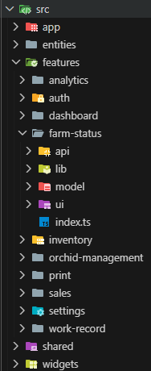
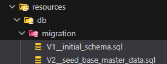
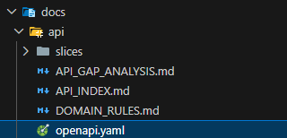

지난 글에서는 Green-house 베타 버전에서 실제로 구현한 기능들을 정리했다.

농장 현황, 난 묶음 관리, 작업 이력, 품종과 입고, 일반 판매, 경매 lot 추적, 낙찰 결과 기준 정산 생성까지 실제 운영에 필요한 기본 흐름을 우선 구현했다.

이번 글에서는 이 시스템을 어떤 기술 스택과 아키텍처로 구현했는지 정리해보려 한다.

## 전체 구조

프로젝트는 프론트엔드와 백엔드를 분리하고, 문서와 배포 설정을 같은 저장소에서 관리하도록 구성했다.

```text
green-house/
  ├─ backend/
  ├─ frontend/
  ├─ docs/
  └─ docker-compose.yml
````

프로젝트에는 서로 연결된 여러 도메인이 존재한다.

```text
농장 구조
난 묶음
작업 이력
품종
입고
거래처
판매 전표
경매 lot
경매 결과
경매 정산
입금 확인
```

예를 들어 판매 전표는 난 묶음의 예약 수량에 영향을 주고, 경매 정산은 경매일의 낙찰 결과들과 연결된다.

따라서 단순히 화면별 CRUD를 나열하는 구조보다, 도메인 간 연결을 관리할 수 있는 구조가 필요했다.

## 프론트엔드: Next.js

프론트엔드는 Next.js, TypeScript, Tailwind CSS를 사용했다.

```text
Next.js
TypeScript
Tailwind CSS
```

화면 수가 많고 메뉴별 라우팅이 명확했기 때문에 Next.js를 선택했다.

```text
대시보드
농장 현황
난 묶음 관리
작업 이력
판매 관리
분석
출력
품종/자재 관리
설정
```

TypeScript는 도메인 데이터의 구조를 명확히 관리하기 위해 사용했다.

난 묶음 하나만 해도 다음과 같은 값을 가진다.

```text
난 묶음 ID
품종
수량
예약 수량
화분 크기
연차
상태
위치
메모
```

경매 lot는 출하 수량과 현재 상태뿐 아니라 여러 번의 경매 결과와 상태 이력을 함께 다뤄야 했다.

이런 데이터를 JavaScript 객체만으로 관리하면 기능이 늘어날수록 실수가 발생하기 쉽다고 판단했다.

## 기능 중심 프론트엔드 구조

프론트엔드는 기능 중심으로 구성했다.

```text
src/
  ├─ app/
  ├─ features/
  ├─ entities/
  ├─ shared/
  └─ widgets/
```

```text
app
  → 라우트 진입점

features
  → 기능별 UI, 상태, API 요청

entities
  → 공통 도메인 타입

shared
  → 공통 UI와 유틸

widgets
  → 앱 전체에서 사용하는 큰 레이아웃
```

`app/*/page.tsx`에는 가능한 한 많은 로직을 넣지 않았다.

실제 화면과 상태 처리는 `features` 내부에 배치하고, `page.tsx`는 해당 기능을 호출하는 진입점 역할만 하도록 했다.



## 백엔드: Spring Boot

백엔드는 Spring Boot와 Java를 사용했다.

```text
Spring Boot
Java 21
Spring Data JPA
Bean Validation
PostgreSQL
Flyway
```

농장 관리 시스템에서는 화면보다 서버에서 지켜야 할 규칙이 많았다.

```text
판매 전표 저장 시 예약 수량 반영
출고 완료 시 실제 수량 차감
경매 결과 입력 시 lot 수량과 상태 변경
낙찰 결과를 경매일 정산 묶음에 연결
난 묶음 이동 시 위치 이력 생성
```

이런 기능은 여러 데이터가 함께 변경되므로 트랜잭션 안에서 처리해야 했다.

예를 들어 경매 결과를 입력하는 과정에는 다음 작업이 포함된다.

```text
경매 lot 조회
경매 시도 생성
경매 결과 행 생성
판매 수량 계산
대기 수량 계산
현재 상태 변경
상태 이력 생성
```

정산 생성도 출하 전표 전체를 가져오는 것이 아니라, 해당 경매장과 경매일의 낙찰 결과를 조회해 정산 묶음과 정산 행으로 연결하는 흐름이 필요했다.

```text
경매장과 경매일 선택
  ↓
해당 날짜의 낙찰 결과 조회
  ↓
정산 묶음 생성
  ↓
낙찰 결과별 정산 행 생성
```

베타 버전에서는 여기까지를 하나의 정산 생성 기능으로 구현했다.

수수료, 공제금, 세금 계산이나 은행 입금 내역 자동 대조는 별도의 후속 기능으로 남겨두었다.

## MSA 대신 모듈러 모놀리스

판매와 경매, 입금 기능을 별도의 서비스로 나누는 방식도 생각했다.

특히 경매 기능은 출하, 경매 결과, 유찰, 반환, 정산까지 별도의 흐름을 가지고 있었다.

하지만 베타 버전에서는 MSA로 분리하지 않았다.

대신 하나의 애플리케이션 안에서 도메인 경계를 나누는 모듈러 모놀리스 구조를 선택했다.

```text
common
farm
work
partner
sales
auction
payment
print
```

각 모듈의 역할은 다음처럼 나누었다.

```text
common
  → 공통 응답, 예외 처리, 검증

farm
  → 동, 다이, 구역, 난 묶음, 품종, 입고, 자재

work
  → 작업 유형, 작업 이력, 위치 이동 이력

partner
  → 거래처

sales
  → 일반 판매 전표, 판매 품목, 출력 데이터

auction
  → 경매 lot, 경매 시도, 결과 행, 반환, 정산 묶음

payment
  → 판매 전표와 경매 정산의 수동 입금 확인

print
  → A5 전표 출력
```

`payment` 모듈은 완성된 금융·회계 시스템이 아니다.

베타 버전에서는 판매 전표나 경매 정산에 대해 입금 여부를 수동으로 확인할 수 있는 연결 지점을 두는 정도로 구현했다.

다음 기능들은 아직 포함하지 않았다.

```text
은행 거래 내역 가져오기
입금자명 자동 매칭
부분입금 자동 분배
초과입금 처리
금액 불일치 자동 검출
정산 처리 스케줄러
세금 계산
```

이 기능들은 실제 운영 방식과 입금 데이터를 확인한 뒤 별도로 확장할 예정이다.

## PostgreSQL과 Flyway

운영 데이터는 PostgreSQL에 저장했다.

농장 위치와 작업 이력뿐 아니라 판매, 경매 결과, 정산과 같은 데이터도 다루기 때문에 데이터 정합성이 중요했다.

데이터베이스 스키마 변경은 Flyway로 관리했다.

```text
난 묶음에 품종 연결 추가
입고 기록 추가
경매 lot 추가
경매 결과 추가
경매 정산 추가
```

기능을 추가할 때마다 데이터베이스 구조가 바뀌었기 때문에, 변경 내역을 마이그레이션 파일로 남겨 반복 가능한 배포 흐름을 만들었다.



## OpenAPI 문서화

프론트엔드와 백엔드 사이의 요청과 응답은 OpenAPI를 기준으로 관리했다.

판매 전표 생성, 경매 결과 입력, 정산 생성 같은 API는 요청 필드와 검증 규칙이 많았다.

문서 없이 기억에만 의존하면 프론트엔드와 백엔드 구현이 쉽게 어긋날 수 있었다.
또한 AI Agents 에게 컨텍스트로써 전달해줄 수 있다.



## 정리

Green-house 베타 버전은 익숙하고 검증된 기술을 사용해 실제 운영까지 이어질 수 있는 구조를 만드는 데 집중했다.

```text
Frontend
  → Next.js / TypeScript / Tailwind CSS

Backend
  → Spring Boot / Java 21 / JPA

Database
  → PostgreSQL / Flyway

Architecture
  → 모듈러 모놀리스

Documentation
  → OpenAPI / Markdown
```

기술 자체보다 각 기술을 선택한 이유와 현재 구현 범위를 명확히 하는 것이 중요했다.

특히 정산과 입금은 처음부터 완성된 회계 시스템으로 만들지 않고, 낙찰 결과와 정산 묶음을 연결하고 수동으로 입금 여부를 확인할 수 있는 단계까지만 구현했다.

다음 글에서는 이 시스템을 실제 서버에 배포한 과정을 정리해보려 한다.
