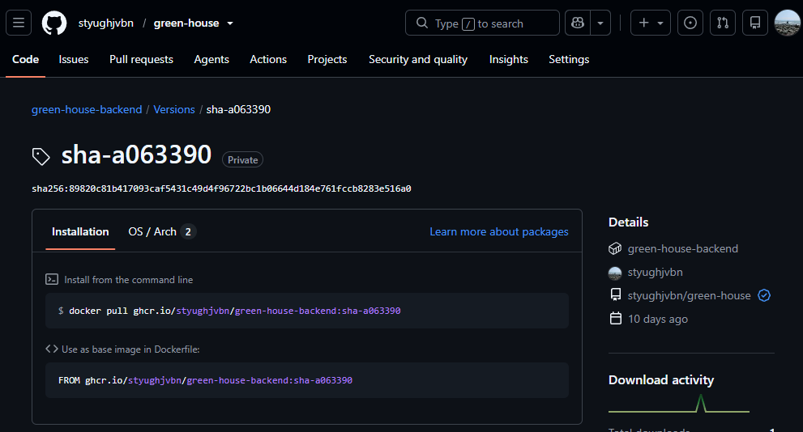
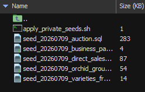
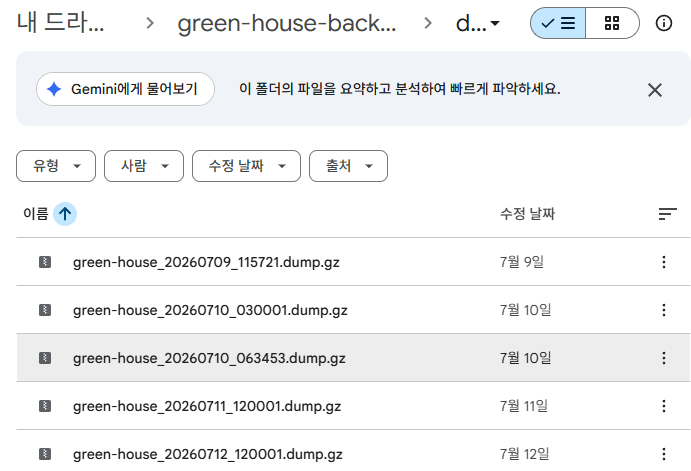

지난 글에서는 Green-house 베타 버전을 어떤 기술 스택과 아키텍처로 구현했는지 정리했다.

프론트엔드는 Next.js, 백엔드는 Spring Boot, 데이터베이스는 PostgreSQL을 사용했다. 백엔드는 여러 서비스로 나누지 않고, 하나의 애플리케이션 안에서 농장, 작업, 판매, 경매 도메인의 경계를 구분하는 모듈러 모놀리스 구조로 구성했다.

이번 글에서는 개발한 베타 버전을 실제 서버에 배포하고, 운영 데이터를 다시 복원할 수 있는 구조를 만든 과정을 정리한다.

## 배포 목표

이번 배포의 목표는 완벽한 무중단 배포 환경을 만드는 것이 아니었다.

실제 농장에서 운영을 시작하기 위해 다음 조건을 우선했다.

* 프론트엔드와 백엔드가 실제 서버에서 동작할 것
* 외부에서 HTTPS로 접속할 수 있을 것
* PostgreSQL 데이터가 서버 재시작 후에도 유지될 것
* 같은 방법으로 배포를 반복할 수 있을 것
* 장애 발생 시 이전 버전과 백업 데이터로 복구할 수 있을 것

화려한 인프라보다는 실제 데이터를 안전하게 쌓을 수 있는 운영 기반을 만드는 것이 목표였다.

## 컨테이너 이미지 배포

프론트엔드와 백엔드는 각각 컨테이너 이미지로 빌드했다.

GitHub에 코드를 push하면 GitHub Actions가 이미지를 만들고 `GHCR`에 업로드한다. 운영 서버에서는 소스 코드를 직접 빌드하지 않고, 만들어진 이미지를 받아 실행한다.

```text
GitHub push
  ↓
GitHub Actions
  ↓
Frontend / Backend 이미지 빌드
  ↓
GHCR 업로드
  ↓
운영 서버 배포
```

운영 서버에서 직접 코드를 내려받아 빌드하는 방식보다 운영 서버에 무리가 가지 않고, 배포 결과를 반복하기 쉬우며, 어떤 커밋으로 만들어진 이미지인지 확인하기도 편했다.

운영에서는 `latest`에만 의존하지 않고 커밋을 식별할 수 있는 이미지 태그를 사용했다.

`ghcr.io/<owner>/green-house-backend:sha-<commit>`   
`ghcr.io/<owner>/green-house-frontend:sha-<commit>`



## 운영 서버 구성

운영 서버는 미니 PC에 구성했다. 운영 서버에는 [홈서버-클라우드 구축](../../../../article/홈서버/클러스터-구축) 를 통해 k3s 가 구축되어 데모 서비스들이 운영되고 있다.

프론트엔드와 백엔드는 k3s에서 실행하고, PostgreSQL은 미니 PC 호스트에 직접 설치했다.

```text
사용자
  ↓
HTTPS
  ↓
Traefik Ingress
  ├─ /api → Backend
  └─ /    → Frontend
              ↓
        Host PostgreSQL
```

외부 접속 주소에는 HTTPS를 적용했다. Traefik의 DNS Challenge를 사용해 인증서를 발급하고 갱신하도록 구성했다. 이에 대한 글을 추후 작성 예정이다.

###  StatefulSet DB 대신 host db를 선택한 이유
1. DB 장애와 k3s 장애를 분리할 수 있다.
2. 백업과 복구가 단순하다.
3. 단일 노드 k3s에서의 statefulset 이점이 크지 않다.

## 헬스체크와 롤아웃

프로세스가 실행 중이라는 사실만으로 애플리케이션이 정상이라고 판단할 수는 없다.

백엔드에는 Spring Boot Actuator 헬스체크를 사용했다.   
클러스터 내부에서 백엔드 Service가 실제로 정상 연결되는지 체크한다.

```bash
kubectl -n green-house run curl-test \
  --rm -it \
  --image=curlimages/curl \
  --restart=Never -- \
  curl -i http://green-house-backend:8080/actuator/health
```

정상 상태에서는 다음 응답을 확인할 수 있다.

```json
{
  "status": "UP"
}
```

프론트엔드와 백엔드 Deployment에는 readinessProbe와 livenessProbe도 설정했다.

```text
readinessProbe 실패
→ 준비되지 않은 Pod를 서비스 트래픽에서 제외

livenessProbe 실패
→ 같은 이미지의 컨테이너 재시작
```

다만 Probe가 실패한다고 이전 이미지로 자동 롤백되는 것은 아니다.

새 버전 배포가 실패했을 때는 롤아웃 상태를 확인하고, 필요하면 이전 Revision으로 되돌린다.

```bash
kubectl -n green-house rollout undo deployment/green-house-backend
kubectl -n green-house rollout undo deployment/green-house-frontend
```

DB 마이그레이션이 포함된 배포는 애플리케이션 이미지만 되돌려도 DB 스키마까지 복구되지는 않는다. 따라서 마이그레이션이 있는 배포 전에는 반드시 DB 백업을 남기도록 했다.

## 초기 데이터 구조 개편

배포를 준비하면서 초기 데이터를 관리하는 방식도 변경했다.

처음에는 테이블 생성뿐 아니라 모든 초기 데이터를 Flyway Migration으로 관리하려고 했다.

하지만 실제 판매와 경매 데이터를 넣기 시작하자 몇 가지 문제가 생겼다.

* 실제 농장 데이터가 Git 저장소에 포함될 수 있음
* 개발 DB 초기화 후 초기 데이터를 다시 생성할 방법이 필요함
* 화면에서 수정한 난 묶음 상태를 SQL에 계속 수동 반영하기 어려움

따라서 구조 데이터와 실제 운영 데이터를 분리했다.

### Base Seed

모든 환경에서 동일하게 필요한 기준 데이터는 Flyway로 관리한다.

```text
농장 구조
기본 작업 유형
```

```text
V1__initial_schema.sql
V2__seed_base_master_data.sql
```

새 개발 환경을 만들거나 DB를 초기화하면 항상 같은 구조가 생성된다.

### Private Seed

실제 농장에서 사용하는 데이터는 Git에 포함하지 않는다.

```text
실제 품종 목록
일반 판매 데이터
경매 출하와 결과 데이터
현재 운영 중인 난 묶음 데이터
```

이 데이터는 `scripts/seed_tools` 아래에서 원본을 가공해 SQL로 생성한다.

```text
scripts/
└── seed_tools/
    ├── raw/
    ├── generated-private/
    └── 생성 스크립트
```

사람이 대량의 SQL을 직접 작성하거나 수정하지 않고, 정리된 CSV나 현재 DB 상태를 기준으로 다시 생성할 수 있게 했다.

## 초기 데이터 생성 흐름

### 초기 데이터 원본 
* `2025-2026-경매출하.csv`  

| 분류 (출하, 경매) | 일자         | 출하일자 | 유찰횟수 | 품목명   | 품종명   | 등급 | 상자 | 분수량 | 단가 | 금액 |  경매장 | 
| ----------- | ---------- | ---- | ---- | ----- | ----- | -- | -: | --: | -: | -: |  --- |
| 출하          | 2025-05-04 |      |      | 덴드로비움 | 파이어버드 |    | 10 | 150 |    |    |  음성  |    |
|  |  |      |      | |...이하 1724 행 |    |  |  |    |    |    |   |    |

* `2024-2026-일반판매.csv`  

| 구매자명 | 일자         | 품목명  | 품종명   | 등급 | 수량 | 단가 |     금액 | 비고 |
| ---- | ---------- | ---- | ----- | -- | -: | -: | -----: | -- |
| --   | 2024-11-29 | 석곡 | 죽엽석곡 |    | 15 |  6 | 90000 |    |
|    |  |  | ...이하 869 행 |    |  |  |  |    |


### 품종
경매 CSV와 일반 판매 CSV에서 후보 목록을 추출한다.

```text
경매 CSV + 일반 판매 CSV
        ↓
varieties.json
        ↓
seed_varieties_from_sales_sources.sql
```

중간에 JSON을 둔 이유는 자동으로 추출된 품종을 사람이 한 번 검토할 수 있게 하기 위해서다.

```json
    {
      "code": "VAR-5078423B7671",
      "genus": "석곡",
      "name": "죽엽석곡",
      "alias": null,
      "defaultPotSize": null,
      "description": "경매/일반 판매 초기 데이터에서 추출한 품종",
      "saleEnabled": true,
      "active": true,
      "memo": null,
      "reviewRequired": false,
      "reviewNote": null,
      "source": {
        "labels": [
          "AUCTION",
          "DIRECT"
        ],
        "auctionCount": 9,
        "directCount": 12,
        "firstSeen": "2024-11-29",
        "lastSeen": "2026-04-26"
      }
    }
```

JSON에서는 다음 항목을 수정할 수 있다.

```text
품종명
속
품종 코드
활성 상태
새로운 품종 추가
```

### 거래처, 일반 판매와 경매 데이터

CSV를 기준으로 각각 Seed SQL을 생성한다.

```text
일반 판매 CSV
        ↓
seed_business_partners.sql

일반 판매 CSV
        ↓
seed_direct_sales.sql

경매 CSV
   ↓
seed_auction.sql
```

난 묶음은 CSV에서 직접 관리하지 않았다.

실제 배치 위치와 수량은 개발된 화면에서 입력하는 것이 가장 정확했기 때문이다.

```text
난 묶음 관리 화면에서 입력
        ↓
현재 DB 상태 확인
        ↓
seed_orchid_groups.sql 추출
```

Seed SQL에서는 DB의 숫자 ID에 직접 의존하지 않는다.

```text
품종 → varieties.code
위치 → 동 번호 + 물리 배드 번호 + 좌/우 구역
```

이 기준으로 다시 연결하기 때문에 DB를 새로 만들면서 ID가 달라져도 같은 상태를 복원할 수 있다.

최종적으로 초기화 순서는 다음과 같이 정리했다.

```text
Base Seed
  ↓
품종
  ↓
거래처
  ↓
일반 판매
  ↓
경매 데이터
  ↓
난 묶음
```


이 구조를 통해 실제 농장 운영 데이터가 GitHub에 노출되는 것을 막으면서도, 필요할 때 같은 데이터를 다시 생성할 수 있게 되었다.

## 백업과 복구 테스트

배포에서 가장 중요하게 본 부분은 데이터 백업이었다.

코드는 GitHub와 컨테이너 이미지에서 다시 가져올 수 있지만, 실제 운영 DB 데이터는 사라지면 복구하기 어렵다. 때문에 구글 드라이브에 `rclone` 을 이용하여 백업이 되도록 구성했다.

PostgreSQL은 매일 새벽 자동으로 백업한다.

```text
cron
  ↓
pg_dump
  ↓
gzip
  ↓
로컬 백업 보관
  ↓
rclone
  ↓
Google Drive 업로드
```

```cron
0 3 * * * /opt/green-house/scripts/backup-greenhouse-db.sh
```



백업 파일이 존재하는 것만으로는 충분하지 않다.

실제 테스트 DB를 생성하고 백업 파일을 복원한 뒤, 테이블과 주요 데이터가 정상적으로 조회되는지도 확인했다.

```bash
pg_restore \
  -d greenhouse_restore_test \
  --clean \
  --if-exists \
  greenhouse.dump
```

백업은 생성 여부가 아니라 복원 가능 여부까지 확인해야 의미가 있다는 점을 알게 되었다.

## 운영 전 검증

배포 후에는 단순히 첫 화면이 열리는지만 확인하지 않았다.

실제 농장 업무 흐름을 기준으로 주요 기능을 검증했다.

```text
로그인
농장 현황 조회
품종과 입고 등록
난 묶음 생성과 이동
작업 이력 등록
판매 전표 생성
경매 출하 lot 생성
경매 결과 입력
정산 묶음 생성
입금 여부 수동 확인
백업 생성
서버 재시작 후 데이터 유지
```

경매 정산은 낙찰 결과를 경매장과 경매일 기준으로 묶고, 입금 여부를 수동으로 기록할 수 있는 범위까지만 확인했다.

```text
경매 결과 입력
  ↓
정산 묶음 생성
  ↓
입금 여부 수동 확인
```

수수료, 공제금, 세금, 은행 입금 내역 자동 대조는 베타 버전의 범위에 포함하지 않았다.

실제 경매장별 정산 자료와 예외를 충분히 확인하지 않은 상태에서 자동화를 먼저 구현하면 잘못된 규칙을 시스템에 고정할 가능성이 있었기 때문이다.

## 장애 대응 원칙

운영 데이터가 들어간 이후에는 DB를 직접 수정하는 작업을 최대한 줄이려고 했다.

1. 운영 DB 직접 수정 최소화
2. DB 수정 전 수동 백업
3. 작업 이력과 상태 이력 보존
4. 판매 전표와 정산 데이터 물리 삭제 최소화
5. 오류 데이터는 취소, 보정, 비활성화로 처리

특히 판매 전표, 경매 lot, 결과 행과 정산 묶음은 서로 연결되어 있다.

한 테이블만 직접 수정하면 수량이나 상태가 맞지 않을 수 있으므로 가능한 한 애플리케이션의 기능을 통해 변경하도록 했다.

## 배포 후 느낀 점

로컬에서 기능이 동작하는 것과 실제 서버에서 운영하는 것은 다른 문제였다.

1. 환경 변수가 올바르게 분리되었는지
2. DB 마이그레이션이 정상적으로 실행되는지
3. 이미지를 반복해서 빌드할 수 있는지
4. 서버 재시작 후 데이터가 유지되는지
5. 헬스체크가 정상적으로 동작하는지
6. 이전 이미지로 롤백할 수 있는지
7. 백업 데이터를 실제로 복원할 수 있는지

기능을 개발할 때는 화면과 API 구현에 집중하기 쉽다.

하지만 실제 운영에서는 배포, 데이터 복원, 백업과 장애 대응도 시스템 기능만큼 중요했다.

시드 데이터 역시 단순한 테스트 데이터가 아니었다. 실제 운영 DB를 다시 만들 수 있는 복구 수단의 일부였다.

구조 데이터는 Flyway에 남기고, 실제 운영 데이터는 원본 CSV와 DB에서 다시 생성하도록 분리하면서 배포와 복구 과정도 명확해졌다.

## 정리

Green-house 베타 버전을 실제 서버에 배포하면서 다음 기반을 마련했다.

1. k3s 기반 프론트엔드와 백엔드 배포
2. Traefik을 통한 HTTPS 외부 접속
3. GitHub Actions 기반 이미지 빌드
4. GHCR private 이미지 관리
5. PostgreSQL 운영과 Flyway 마이그레이션
6. readinessProbe와 livenessProbe
7. Revision 기반 롤백
8. DB 자동 백업과 복구 테스트
9. Base Seed와 Private Seed 분리
10. CSV와 운영 DB 기반 Seed 재생성

이번 글까지가 Green-house 베타 버전 개발 시리즈의 마지막 글이다.

이후에는 실제 농장에서 사용하면서 운영 데이터를 쌓고 발견한 문제와 기능을 개선한 과정을 하나씩 기록하려 한다.
