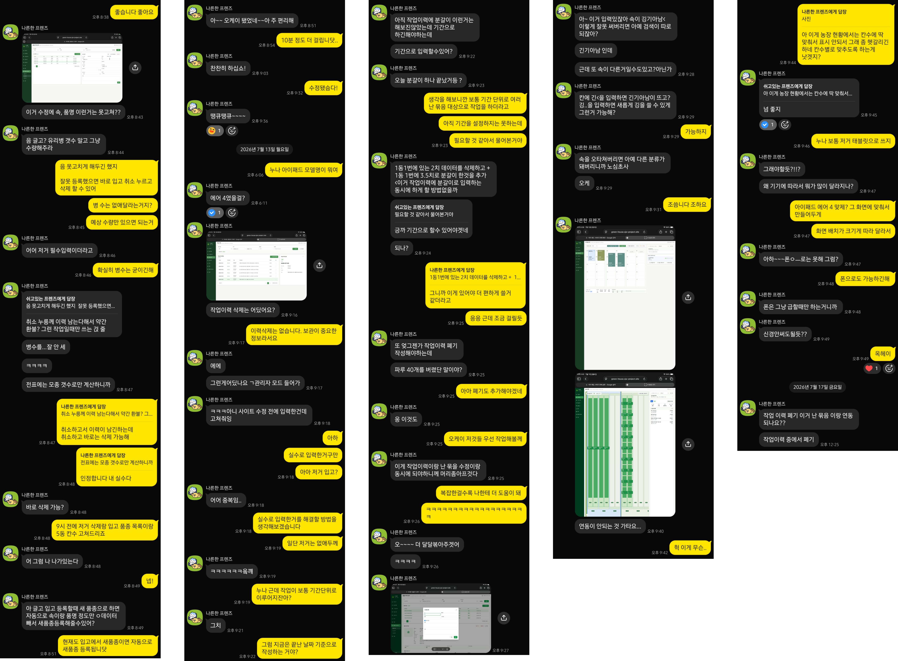

베타 버전을 배포한 뒤 실제 농장 업무에 시스템을 사용하기 시작했다.

기능을 구현할 때는 충분하다고 생각했던 화면도 현장에서 직접 사용해 보니 입력이 번거롭거나, 실제 작업 방식과 맞지 않는 부분이 있었다. 반대로 사용자의 요청에는 없었지만 데이터가 쌓이기 전에 구조를 바꿔야 하는 문제도 발견했다.

이 시리즈에서는 베타 버전 이후 받은 피드백과 실제 사용 과정에서 확인한 문제를 바탕으로 시스템을 개선한 과정을 정리한다.

단순히 화면을 편리하게 다듬는 것뿐만 아니라, 작업 기록과 난 묶음의 현재 상태가 서로 연결되도록 데이터 구조와 작업 흐름을 함께 개선했다.

현장에서 꾸준히 사용할 수 있는 시스템에 가까워지기 위해 무엇을 바꾸었고, 그 과정에서 어떤 판단을 했는지를 기록해 보려 한다.

