7월 9일 베타 버전을 배포한 뒤 열흘이 지났다.

베타 버전에는 농장의 난 묶음과 위치, 작업 이력, 품종과 입고 기록을 관리하기 위한 기본 기능이 구현되어 있었다. 하지만 기능이 존재하는 것과 실제 현장에서 불편 없이 사용하는 것은 다른 문제였다.

배포 이후 실제 사용자인 가족에게 시스템을 사용해 달라고 요청했고, 입력 과정에서 불편한 부분과 기존 농장 업무 방식에 맞지 않는 부분을 전달받을 수 있었다.

피드백에는 작은 입력 폼 수정부터 난 묶음의 수량과 위치를 변경하는 작업 흐름까지 다양한 내용이 포함되어 있었다.

이번 글에서는 요청받아 수정한 내용과, 실제 사용 흐름을 다시 검토하면서 별도로 개선한 기능을 정리한다.

## 피드백을 통해 개선한 기능

### 1. 난 묶음 입력 폼 정리

난 묶음 등록 화면에는 수량, 년생, 트레이 수처럼 숫자만 입력되는 항목이 존재한다.

기존에는 일부 항목이 일반 문자열 입력 필드로 구현되어 있어 문자나 불필요한 기호도 입력할 수 있었다. 숫자만 필요한 필드는 입력값을 제한하고, 태블릿에서는 숫자 키패드가 표시되도록 입력 방식을 정리했다.

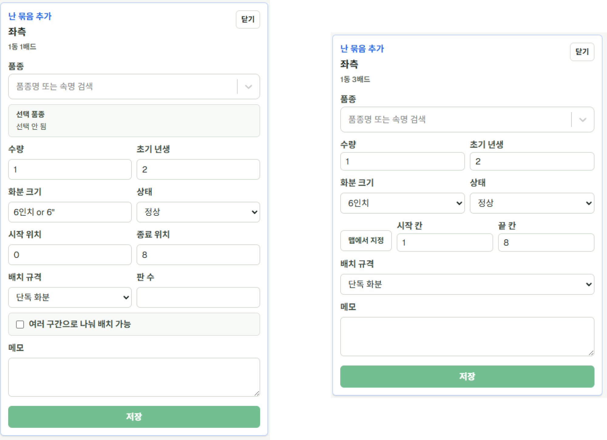

작은 변경이지만 잘못된 형식의 데이터가 저장되는 것을 입력 단계에서 줄일 수 있게 되었다.

### 2. 기존 난 묶음 복사 등록

농장에서는 품종, 년생, 화분 크기가 같은 난 묶음이 여러 위치에 나누어 배치되는 경우가 많다.

기존에는 새로운 난 묶음을 등록할 때마다 동일한 정보를 반복해서 입력해야 했다. 이를 줄이기 위해 선택한 난 묶음의 정보를 바탕으로 새로운 난 묶음을 등록하는 복사 기능을 추가했다.

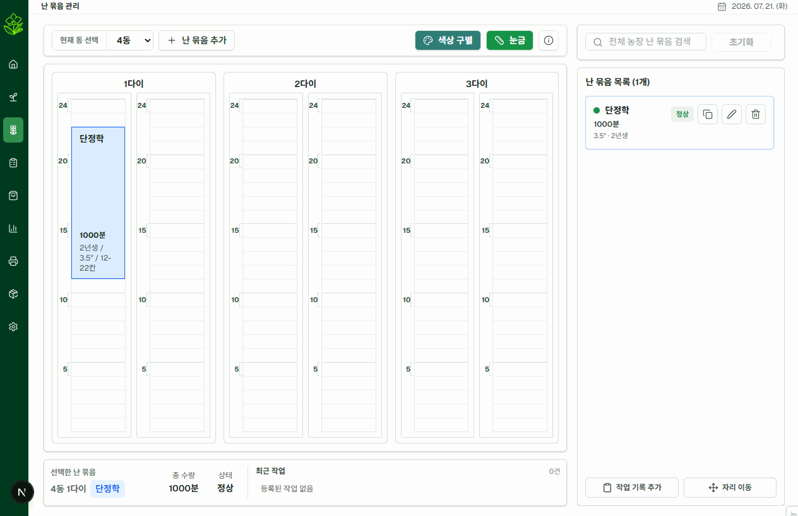

복사 시에는 다음 정보가 기본값으로 입력된다.

* 품종
* 수량
* 년생
* 화분 크기
* 상태
* 배치 규격

사용자는 배치 위치처럼 새로 결정해야 하는 정보만 수정하면 된다.

### 3. 시작 위치와 끝 위치 입력 방식 변경

초기에는 난 묶음의 위치를 개발에서 사용하는 구간 계산 방식에 맞춰 처리했다.

예를 들어 시작 위치를 0, 끝 위치를 4로 입력하면 내부적으로는 1번부터 4번 칸까지 차지하는 방식이었다. 실제 사용자는 시작 위치와 끝 위치를 모두 난이 놓이는 실제 칸으로 이해했다.

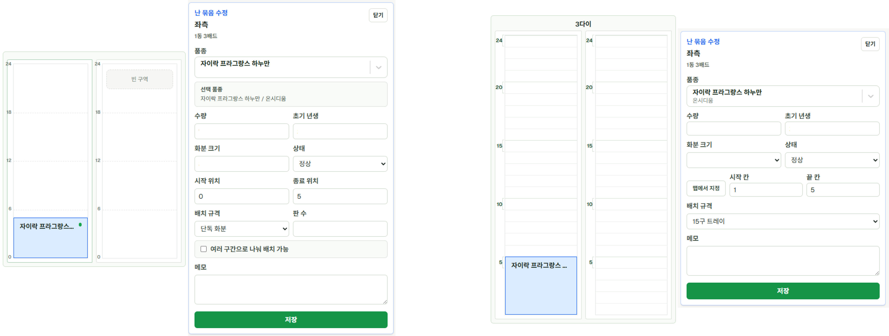

따라서 시작 위치와 끝 위치가 각각 실제 칸을 의미하도록 변경했다. 그에 맞춰 눈금 표시 또한 명확하게 칸을 식별할 수 있도록 수정했다.

이제 1번부터 4번까지 입력하면 네 칸을 차지한다. 내부 계산 방식보다 사용자가 실제 농장을 바라보는 방식을 우선한 변경이다.

### 4. 입고 등록에서 품종 검색 지원

입고 등록 화면에서는 품종 목록을 직접 내려가며 원하는 품종을 선택해야 했다.

품종이 적을 때는 큰 문제가 없었지만, 등록된 품종이 계속 늘어나면서 목록에서 원하는 항목을 찾기 어려워졌다.

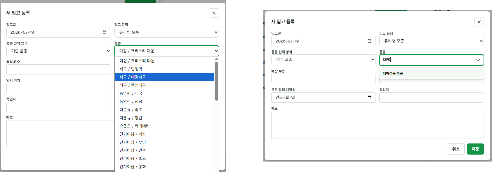

품종명이나 속 이름을 입력해 기존 품종을 검색할 수 있도록 변경했다. 이제 전체 이름을 정확하게 기억하지 않아도 일부 글자만으로 원하는 품종을 찾을 수 있다.

### 5. 품종 관리의 속 검색 오류 수정

품종 관리 화면에는 속을 기준으로 품종을 필터링하는 기능이 있었다.

하지만 서버 페이지네이션을 적용한 이후 현재 페이지에 불러온 품종의 속만 검색 목록에 나타나는 문제가 발생했다. 첫 번째 페이지에 카틀레야 품종만 있다면, 다른 페이지에 존재하는 덴드로비움은 필터에서 선택할 수 없었다.

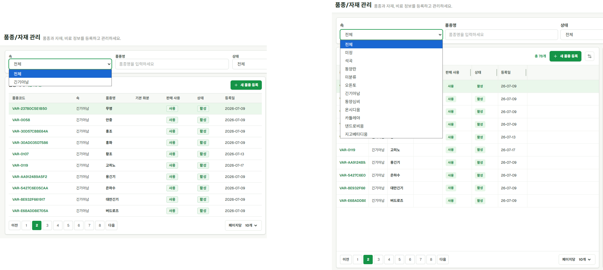

속 필터가 현재 페이지의 조회 결과가 아니라 전체 품종 기준 정보를 사용하도록 수정했다.

### 6. 입고 등록 폼에서 병수 제거

유리병 형태로 들어오는 모종을 관리하기 위해 초기에는 병수를 별도 항목으로 입력하도록 설계했다.

하지만 실제 사용 과정에서는 병수보다 예상 수량과 포트 작업 결과가 더 중요했다. 병수를 별도 데이터로 유지할 필요성이 크지 않았고, 오히려 입력해야 하는 항목만 늘어나고 있었다.

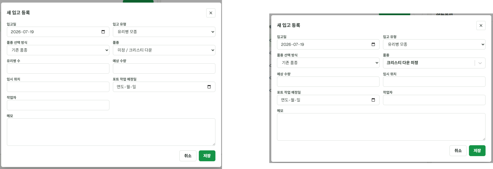

병수 입력을 제거하고 다음과 같이 실제 관리에 필요한 정보에 집중하도록 폼을 단순화했다.

* 입고일
* 품종
* 예상 수량
* 임시 보관 위치
* 포트 작업 예정일
* 메모

기능을 추가하는 것뿐 아니라 실제로 사용하지 않는 입력을 덜어내는 것도 중요한 개선이었다.

### 7. 분갈이 작업과 난 묶음 변경 연결

기존 작업 이력은 어떤 작업을 했는지 기록하는 기능에 가까웠다.

분갈이 작업을 기록해도 실제 난 묶음의 수량, 년생, 화분 크기와 위치는 난 묶음 관리 화면에서 다시 수정해야 했다. 작업 기록과 실제 데이터 변경이 서로 분리되어 있었던 것이다.

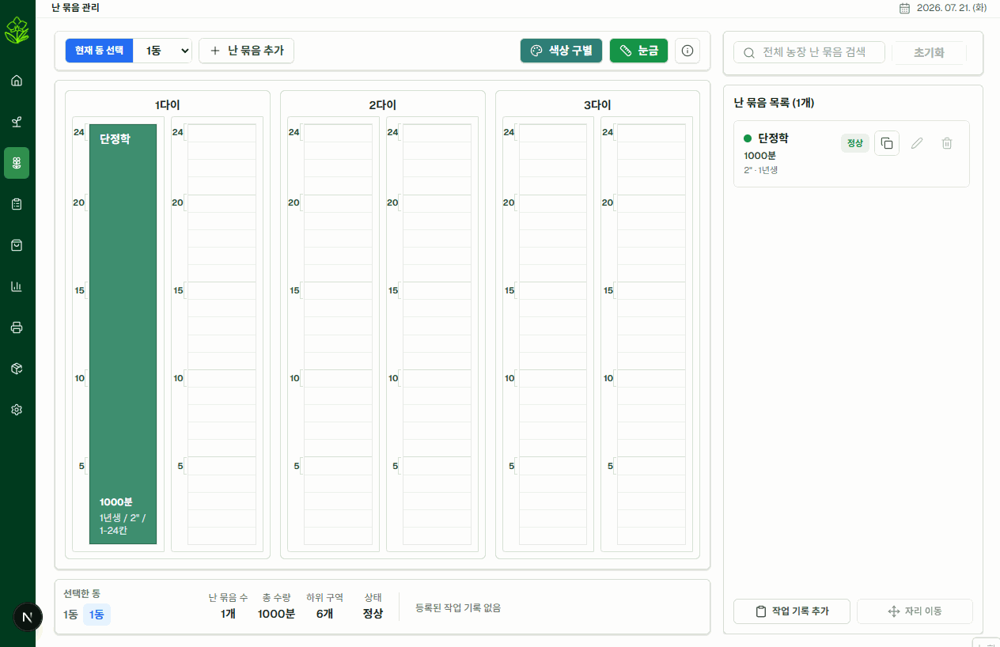

분갈이를 작업으로 실행하면 다음 과정을 한 번에 처리하도록 변경했다.

1. 분갈이할 난 묶음을 선택한다.
2. 모든 원본 수량이 작업될 때까지 작업 회차를 반복한다.
   1. 원본에서 작업된 수량을 입력한다.
   2. 결과 난 묶음의 수량, 년생과 화분 크기를 입력한다.
   3. 결과 난 묶음이 배치될 위치를 선택한다.
   4. 결과 난 묶음이 생성된다.
3. 원본과 결과의 관계 및 작업 이력을 저장한다.

이제 분갈이 기록은 단순한 메모가 아니라 실제 농장 상태를 변경한 원인이 된다.
사진에는 안나왔지만 원본 수량 중 일부를 분주 후보로 남길 수 있도록 하였다.

### 8. 폐기 작업 추가

난이 고사하거나 상품성이 없어져 폐기하는 경우에도 기존에는 난 묶음의 수량과 상태를 직접 수정한 뒤 작업 이력을 별도로 작성해야 했다.

이를 하나의 작업으로 처리할 수 있도록 폐기 기능을 추가했다.

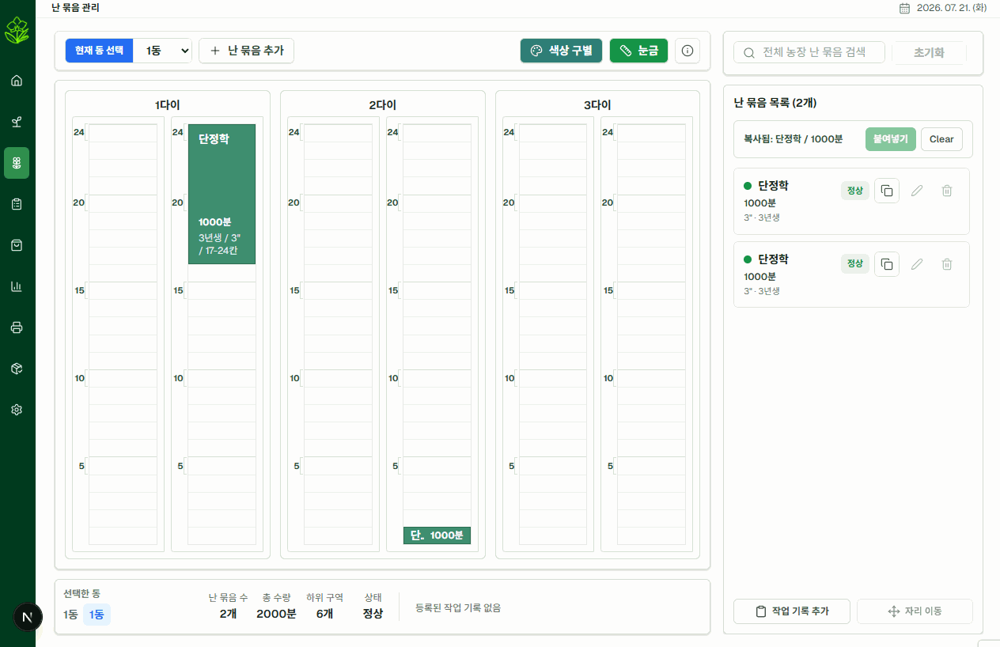

일부 수량만 폐기하면 기존 난 묶음의 수량을 줄이고 남은 수량으로 계속 관리한다.

전체 수량을 폐기하면 다음과 같이 처리한다.

* 수량을 0으로 변경한다.
* 난 묶음의 상태를 폐기로 변경한다.
* 폐기 수량과 작업일을 이력으로 저장한다.

폐기된 난 묶음을 삭제하지 않고 상태와 이력을 남기기 때문에, 기존에 존재했던 난 묶음이 어떤 이유로 사라졌는지 확인할 수 있다.

### 9. 품종 등록을 Creatable Select 방식으로 변경

품종을 등록할 때 속과 품종명을 일반 문자열로 입력하면 오타나 표기 차이로 중복 데이터가 생성될 수 있다.

반대로 기존 값만 선택하도록 제한하면 새로운 속이나 품종이 들어올 때마다 별도의 관리 화면으로 이동해야 한다.

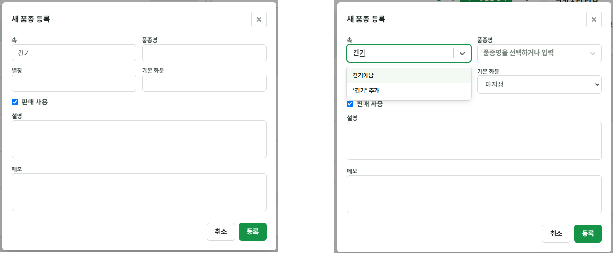

기존 값은 검색해 선택하고, 존재하지 않는 값은 현재 입력 화면에서 바로 생성할 수 있는 방식으로 변경했다.

이를 통해 기존 기준 정보는 최대한 재사용하면서도 매년 새로운 품종이 들어오는 농장의 특성을 반영할 수 있게 되었다.

### 10. 농장 현황을 실제 배치 기준으로 변경

초기 농장 현황 화면은 동과 배드별로 어떤 난 묶음이 존재하는지를 확인하는 데 초점을 맞추고 있었다.

하지만 같은 논리 구역 안에서도 난 묶음이 어느 칸에 배치되어 있는지는 한눈에 확인하기 어려웠다.

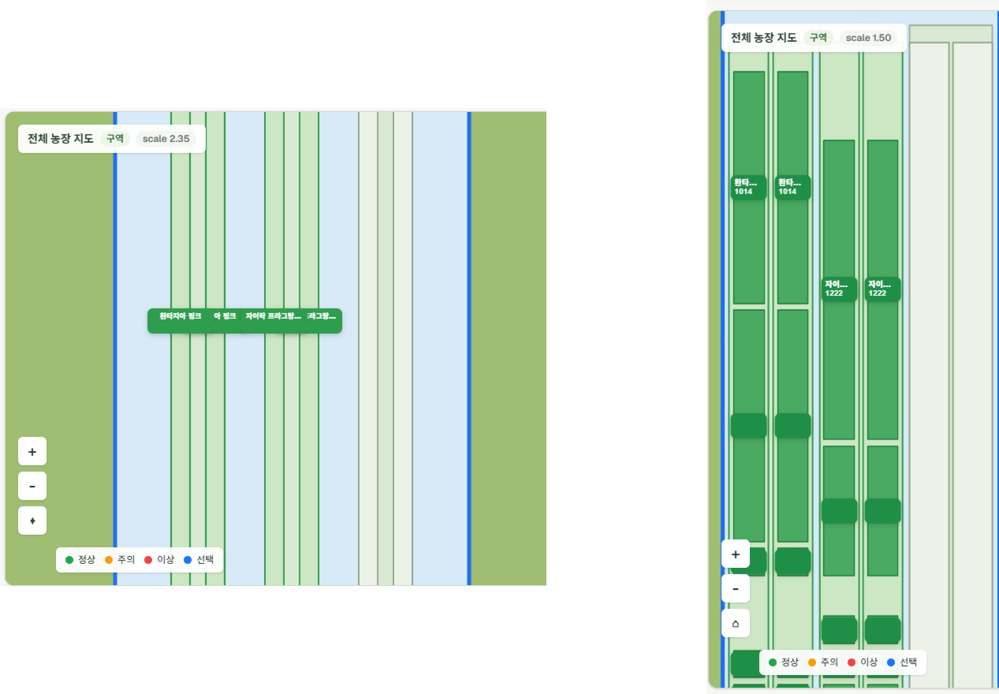

각 난 묶음의 시작 칸과 끝 칸을 기준으로 실제 위치에 가깝게 표시하도록 변경했다.

농장 현황에서는 편집 기능을 최소화했지만 다음 정보는 빠르게 확인할 수 있도록 했다.

* 현재 사용 중인 칸
* 비어 있는 칸
* 난 묶음이 차지하는 범위
* 같은 구역 안에서의 배치 순서

### 11. 아이패드 에어 4 대응

실제 사용자는 데스크톱뿐 아니라 아이패드를 이용해 농장 안에서 시스템을 확인한다.

기존 화면은 넓은 PC 화면을 기준으로 작성되어 있어 아이패드 가로 화면에서는 표와 상세 패널이 지나치게 좁아지거나 버튼이 여러 줄로 나뉘는 문제가 있었다.

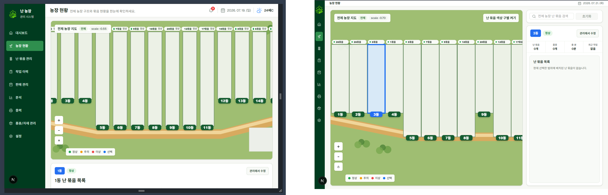
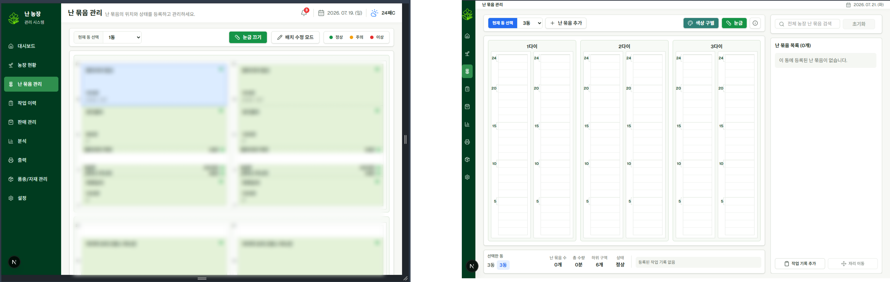
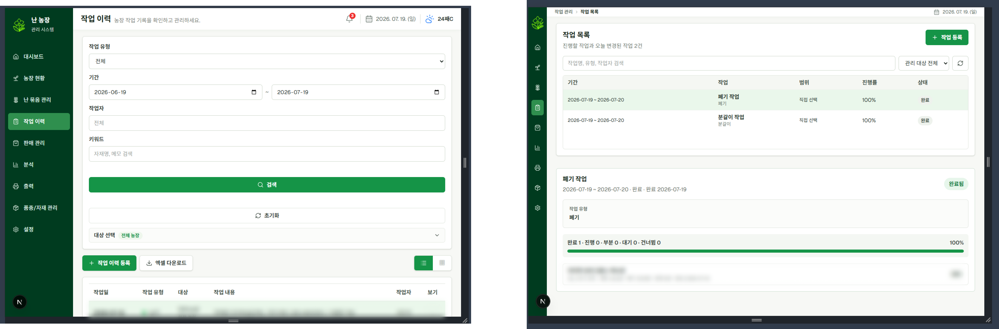
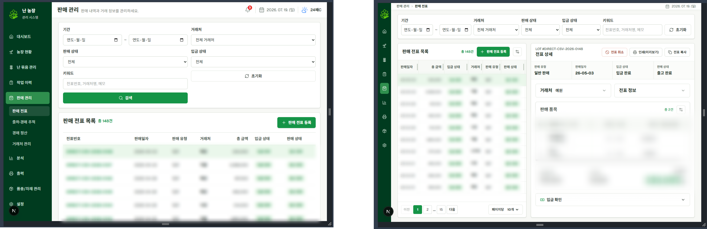
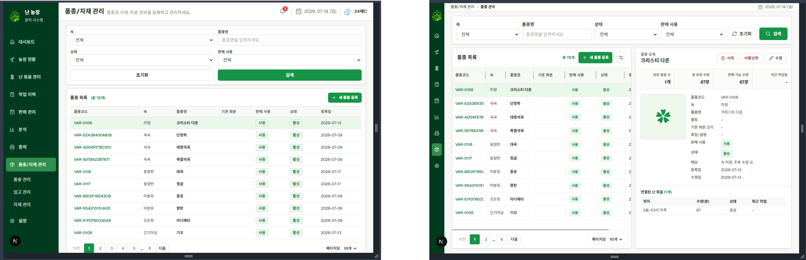

아이패드 에어 4의 화면 크기를 기준으로 다음 요소를 조정했다.

* 상단 헤더 높이 축소
* 왼쪽 메뉴 기본 접힘
* 메뉴를 오버레이 방식으로 표시
* 표와 상세 패널의 배치 전환
* 버튼 그룹 접기
* 터치 선택 영역 확대
* 중요도가 낮은 보조 정보 축소

반응형 UI를 단순히 화면 크기에 맞춰 줄이는 것이 아니라, 좁은 화면에서 어떤 정보와 기능을 먼저 보여줄지 다시 정리했다.

## 별도로 진행한 개선

피드백으로 직접 요청받은 내용 외에도 실제 데이터가 쌓이고 작업 기능이 확장되었을 때 문제가 될 수 있는 부분을 별도로 개선했다.

### 1. 맵에서 배치 칸 직접 지정

난 묶음을 등록하거나 이동할 때 시작 칸과 끝 칸을 숫자로만 입력하면 현재 배치와 겹치거나 잘못된 위치를 지정하기 쉬웠다.

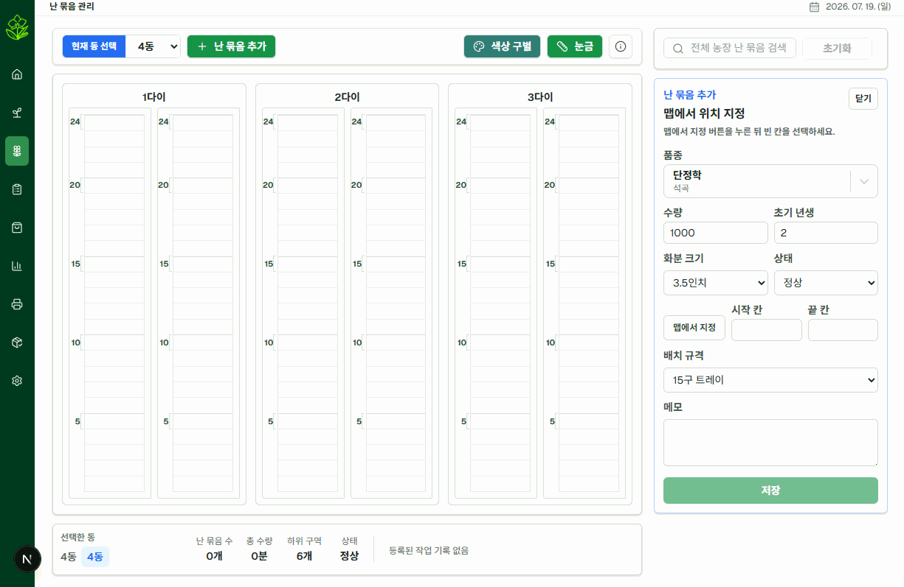

농장 배치 화면에서 원하는 구간을 직접 선택하면 시작 칸과 끝 칸이 자동으로 입력되도록 변경했다.

사용자는 숫자를 계산하지 않고 실제 난을 놓으려는 위치를 보면서 선택할 수 있다. 기존 난 묶음과 겹치는 위치나 배드 범위를 벗어난 선택도 입력 과정에서 확인할 수 있다.

### 2. 품종별 색상 구분

난 묶음이 많아지면서 모든 묶음을 같은 색상으로 표시하면 위치는 확인할 수 있지만 품종 분포를 파악하기 어려웠다.

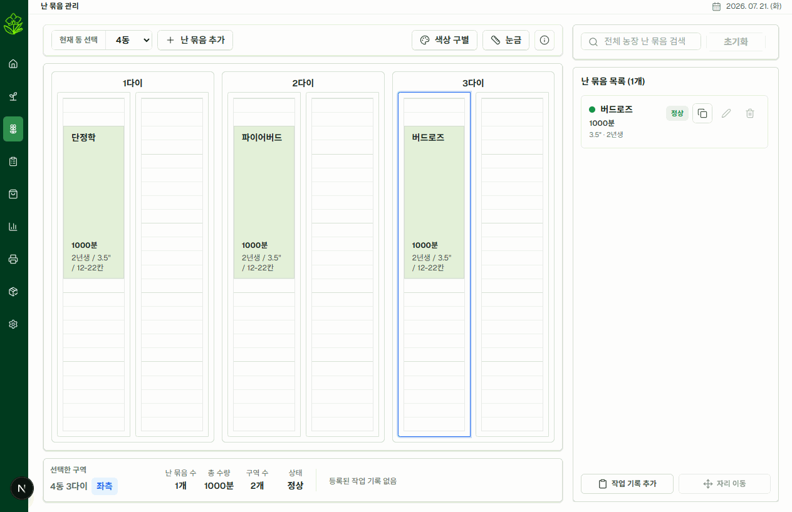

품종에 따라 난 묶음의 색상을 구분해 표시하는 기능을 추가했다.

기본 화면에서는 위치와 배치를 중심으로 보여주고, 품종별 분포가 필요할 때 색상 구분을 활성화할 수 있도록 했다.

이를 통해 다음 내용을 빠르게 확인할 수 있다.

* 같은 품종이 여러 동에 분산되어 있는지
* 특정 배드에 어떤 품종이 모여 있는지
* 서로 다른 품종이 한 구역에 섞여 있는지

### 3. 여러 날 이어지는 기간 작업

분갈이처럼 작업량이 많은 업무는 하루에 끝나지 않는다.

작업을 진행하다가 다른 업무를 처리한 뒤 며칠 후 다시 이어서 진행하는 경우도 있다. 기존의 하루 단위 작업 이력만으로는 하나의 작업이 여러 개의 독립된 기록으로 나뉘게 된다.

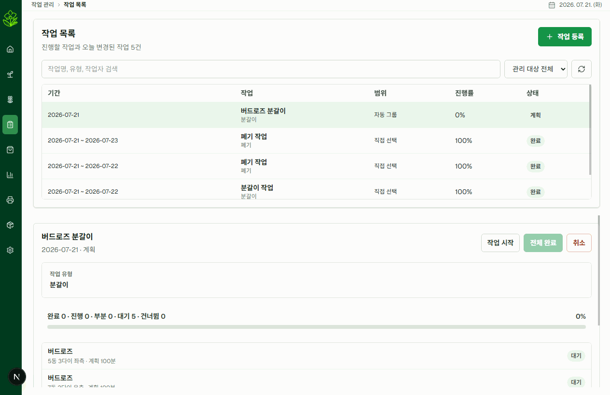

작업에 기간과 진행 상태를 추가하고 다음 흐름을 지원하도록 했다.

1. 작업을 계획한다.
2. 작업을 시작한다.
3. 일부 난 묶음의 작업을 완료한다.
4. 필요한 경우 작업을 일시중지한다.
5. 작업을 다시 시작한다.
6. 나머지 대상을 처리한다.
7. 전체 작업을 완료한다.

매일 작업 이력을 새로 입력하도록 강제하지 않고, 하나의 작업 안에서 대상별 진행 상태를 관리한다.

작업 목록에서는 진행 중인 작업과 완료된 수량을 확인할 수 있고, 월간 캘린더에서는 작업의 전체 기간을 확인할 수 있다.

### 4. 자동 그룹과 사용자 그룹

기존에는 작업 대상을 선택하려면 난 묶음을 하나씩 선택하거나 동과 배드 같은 위치 전체를 지정해야 했다.

반복적으로 함께 관리되는 난 묶음을 효율적으로 선택하기 위해 자동 그룹과 사용자 그룹을 추가했다.

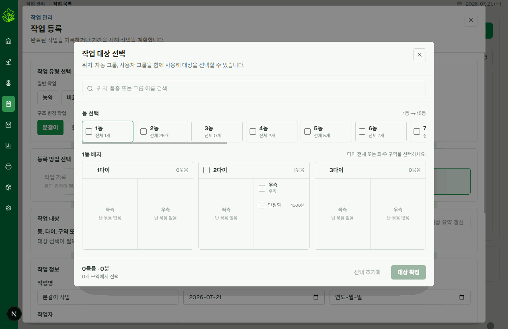

#### 자동 그룹

자동 그룹은 다음 조건이 같은 활성 난 묶음을 조회 시점에 계산한다.

* 품종
* 현재 년생
* 화분 크기

난 묶음의 년생이나 화분 크기가 변경되면 다음 조회부터 기존 그룹에서 빠지고 새로운 조건의 그룹에 포함된다.

별도의 그룹 데이터를 저장하는 것이 아니라 현재 난 묶음의 상태를 기준으로 계산한다.

#### 사용자 그룹

사용자 그룹은 사용자가 목적에 따라 직접 난 묶음을 묶는 기능이다.

예를 들어 다음과 같은 그룹을 만들 수 있다.

* 이번 주 분갈이 대상
* 내년 출하 후보
* 우량주 관리
* 별도 관찰 대상

사용자 그룹은 난 묶음의 위치나 년생이 변경되어도 자동으로 해제되지 않는다. 사용자가 직접 제거하기 전까지 소속이 유지된다.

자동 그룹과 사용자 그룹은 난 묶음을 대체하는 새로운 관리 단위가 아니라, 여러 난 묶음을 한 번에 선택하고 작업하기 위한 수단으로 사용한다.

### 5. 구조 변경 작업 도입

기존 작업 이력은 대부분 기록만 남기면 되는 작업을 기준으로 설계되어 있었다.

#### 기록형 작업

* 농약
* 비료
* 상태 기록
* 일반 메모
* 잎/잡초/꽃 정리

이러한 작업은 난 묶음 자체의 구조를 변경하지 않는다.

반면 다음 작업은 수량, 위치, 상태 또는 난 묶음의 구성 자체를 변경한다.

#### 구조 변경 작업

* 위치 이동
* 분갈이
* 분주
* 합식
* 폐기
* 포트 작업

이러한 작업을 단순한 작업 이력으로만 저장하면 현재 농장 상태와 작업 기록이 서로 어긋날 수 있다.

따라서 구조 변경 작업은 작업 완료와 실제 데이터 변경을 하나의 과정으로 처리하도록 했다.

분갈이와 분주처럼 기존 난 묶음에서 새로운 난 묶음이 만들어지는 경우에는 기존 데이터를 새 값으로 덮어쓰지 않는다.

* 원본 난 묶음은 원본 상태와 수량을 보존한다.
* 결과 난 묶음은 별도로 생성한다.
* 어떤 작업으로 결과가 만들어졌는지 연결한다.
* 부분 작업이면 원본의 남은 수량을 계속 관리한다.
* 전체 작업이면 원본을 종료 상태로 보존한다.

이를 통해 현재 난 묶음의 상태뿐 아니라 어떤 원본에서 어떤 작업을 거쳐 만들어졌는지도 확인할 수 있게 되었다.

### 6. Nav 구조 개선

화면과 기능이 계속 추가되면서 왼쪽 메뉴가 차지하는 공간과 메뉴 항목의 수가 함께 증가했다.

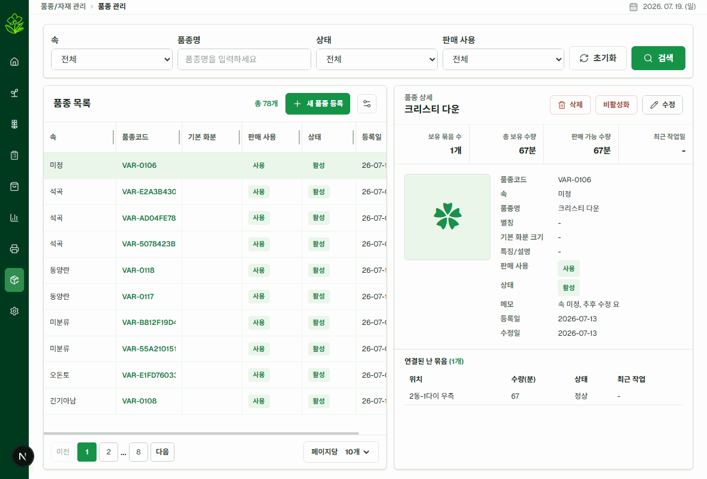

메뉴를 기본적으로 접힌 상태로 두고 필요할 때 오버레이로 펼치도록 변경했다.

기존처럼 메뉴를 펼칠 때 본문 영역이 좁아지는 방식이 아니라, 메뉴가 본문 위에 표시되도록 구성했다. 따라서 메뉴의 열림 여부와 관계없이 농장 맵과 표가 사용하는 영역은 유지된다.

접힌 상태에서도 현재 위치와 주요 메뉴를 확인할 수 있도록 아이콘, 선택 상태와 툴팁을 함께 제공했다.

### 7. 표 컴포넌트 개선

품종, 입고, 작업과 판매 화면에서 모두 표를 사용하고 있었지만 각 화면마다 페이지네이션, 로딩 상태와 행 선택 방식을 별도로 구현하고 있었다.

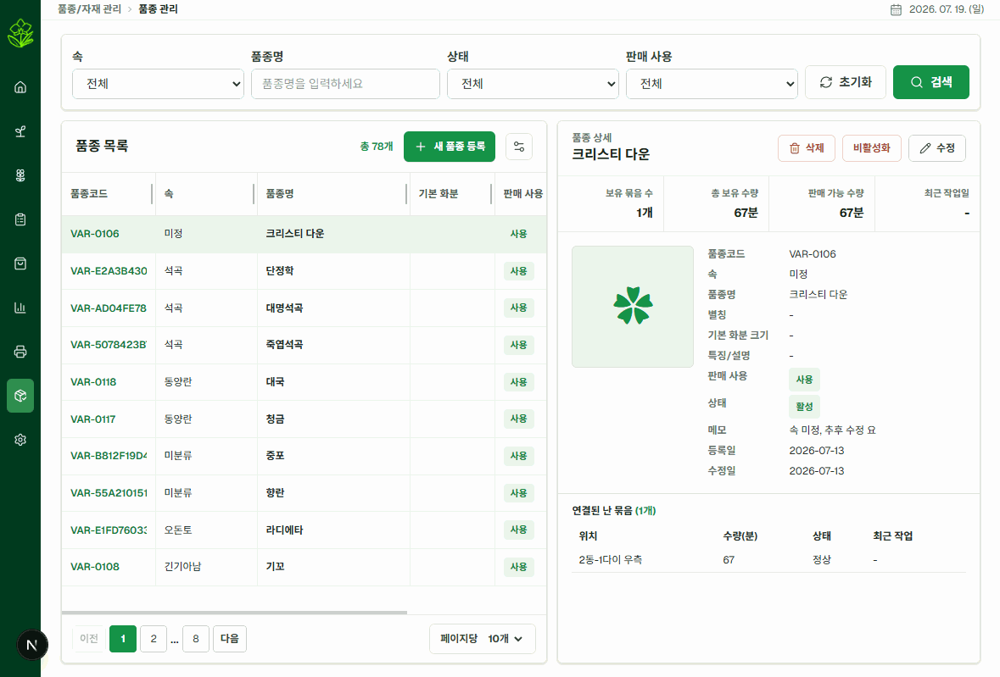

공통 표 컴포넌트를 정리하고 다음 요소를 일관되게 적용했다.

* 서버 페이지네이션
* 로딩 상태
* 조회 결과가 없을 때의 안내
* 행 선택
* 상세 화면 이동
* 긴 문자열 말줄임과 툴팁
* 열 순서 설정
* 칸 너비 자동 맞춤
* 태블릿 화면 대응

표의 모양만 통일한 것이 아니라 데이터를 조회하고 사용자가 조작하는 방식도 각 표마다 설정할 수 있도록 했다.

## 기록은 있었지만 데이터는 아니었다

베타 버전에서도 작업 이력을 입력할 수는 있었다.

하지만 분갈이를 기록한 뒤 실제 난 묶음은 별도로 수정해야 했고, 폐기 작업을 기록한 뒤 현재 수량이 제대로 변경되었는지도 사용자가 직접 확인해야 했다.

입력된 작업 기록과 현재 농장 상태 사이에 직접적인 연결이 부족했던 것이다.

시스템 안에 기록은 존재했지만 그 기록이 현재 상태를 만든 원인으로 활용되지는 못하고 있었다.

이번 개선에서는 작업을 단순한 메모로 저장하는 것에서 벗어나 다음 정보를 함께 보존하도록 구조를 변경했다.

* 어떤 작업을 했는가
* 어떤 난 묶음을 대상으로 했는가
* 작업 당시 대상의 상태는 무엇이었는가
* 작업으로 수량이나 위치가 어떻게 변경되었는가
* 어떤 새로운 난 묶음이 만들어졌는가
* 원본 난 묶음과 결과 난 묶음은 어떤 관계인가

동 전체나 그룹을 대상으로 작업하더라도 저장 시점의 실제 난 묶음 목록을 확정해 보존한다.

이후 난 묶음이 다른 동으로 이동하거나 자동 그룹의 조건이 변경되더라도 과거 작업 대상은 달라지지 않는다. 상위 범위 작업을 난 묶음마다 복제하지 않고, 하나의 작업과 실제 대상 난 묶음의 연결을 저장하는 방식으로 처리했다.

이를 통해 작업 이력은 단순히 사람이 작성한 기록에서 현재 농장 상태와 과거의 변화 과정을 설명할 수 있는 데이터로 바뀌기 시작했다.

아직 모든 기능이 완성된 것은 아니다. 실제 사용 과정에서 입력 부담이 크거나 농장의 작업 방식과 맞지 않는 부분도 계속 발견될 것이다.

그래도 이번 개선을 통해 기능을 먼저 만들고 사용을 요청하는 단계에서 벗어나, 실제 사용자의 피드백을 기준으로 시스템의 구조와 흐름을 다시 설계하는 첫 번째 과정을 경험할 수 있었다.