이전 개선 기록을 작성한 뒤 두 달가량이 지났다.

그동안 어학 자격증을 준비하고 오전 9시부터 오후 6시까지 진행되는 교육을 듣기 시작하면서 농장 관리 시스템에 많은 시간을 쓰지는 못했다. 그래도 실제 사용 과정에서 발견한 불편을 조금씩 정리하며 개선을 이어 왔다.

두 달 동안 화면 구성부터 검색과 작업 흐름까지 크고 작은 변경이 많이 쌓였다. 모든 변경을 하나씩 정리하면 글이 지나치게 길어질 것 같아, 이번 글에서는 그중 사용 흐름에 영향을 준 굵직한 개선을 중심으로 간략하게 정리한다.

첫 번째 개선에서는 작업 기록과 실제 난 묶음의 상태를 연결하는 데 집중했다. 기능이 늘어난 이후에는 다른 문제가 보이기 시작했다. 좁은 태블릿 화면에서 메뉴가 콘텐츠를 가렸고, 농장 전체를 보려면 화면을 자주 이동해야 했으며, 여러 난 묶음에 같은 작업을 하더라도 하나씩 선택해야 했다.

이번 개선에서는 다음 세 가지를 중심으로 화면과 작업 흐름을 다시 정리했다.

* 메뉴를 오가는 데 필요한 조작 줄이기
* 농장 전체와 필요한 난 묶음을 더 쉽게 확인하기
* 여러 난 묶음에 대한 작업을 한 번에 처리하기

## 1. 사이드바와 상단 바 개선

### 사이드바 전환을 자연스럽게 변경

기존 사이드바는 펼친 상태와 접힌 상태를 전환할 때 아이콘의 가로 위치도 함께 이동했다. 메뉴 너비뿐 아니라 사용자가 보고 있던 기준점까지 바뀌기 때문에 짧은 전환에서도 화면이 흔들리는 것처럼 보였다.

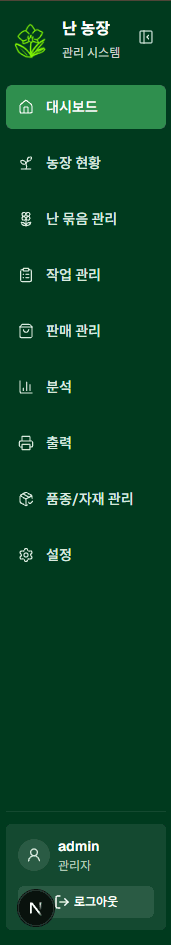

펼친 상태의 메뉴 아이콘과 접힌 상태의 아이콘이 같은 위치에 오도록 배치를 정리했다. 이제 사이드바가 열리고 닫혀도 아이콘은 제자리를 유지하고, 메뉴 이름과 사용자 정보처럼 펼친 상태에서만 필요한 요소가 나타나거나 사라진다.

기능에는 영향을 주지 않는 작은 변경이지만 사이드바를 반복해서 여닫을 때 시선이 이동하지 않아 전환이 더 자연스럽게 느껴진다.

### 상단 바 높이 고정

기존에는 사이드바를 접었을 때만 상단 바가 낮아졌다. 같은 페이지에서도 사이드바 상태에 따라 콘텐츠가 아래로 밀리거나 위로 당겨졌고, 메뉴를 전환할 때마다 실제 작업 영역의 높이가 달라졌다.

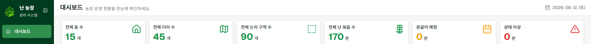
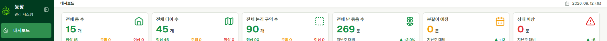

상단 바에는 현재 페이지와 날짜 정도의 보조 정보만 표시되기 때문에 많은 높이를 사용할 필요가 없었다. 사이드바 상태와 관계없이 낮은 높이를 유지하도록 변경하고, 페이지 제목과 설명은 한 줄 안에서 확인할 수 있도록 정리했다.

가로와 세로 공간이 모두 제한적인 태블릿에서 농장 맵이나 표에 사용할 수 있는 영역을 조금이라도 더 확보하기 위한 변경이다.

### 접힌 상태에서 하위 메뉴 전환

기존에는 태블릿처럼 좁은 화면에서 하위 메뉴를 바꾸려면 사이드바를 펼치고, 메뉴를 선택한 뒤 다시 접어야 했다. 펼쳐진 사이드바가 콘텐츠 위를 크게 가리기 때문에 메뉴를 한 번 이동할 때도 불필요한 조작이 반복되었다.

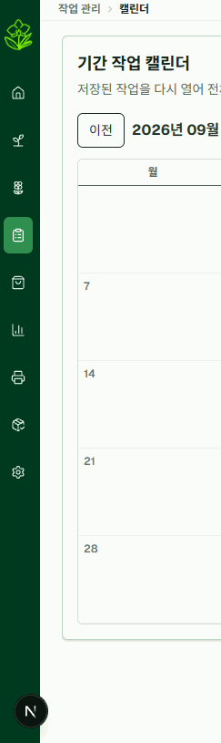
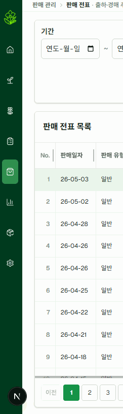

사이드바를 접은 상태에서도 하위 메뉴로 이동할 수 있도록 두 가지 방식을 추가했다.

* 상단 바에서 현재 메뉴의 하위 메뉴를 바로 선택한다.
* 사이드바 아이콘을 누르면 아이콘 옆에 하위 메뉴 목록을 표시한다.

전체 메뉴를 확인해야 할 때는 기존처럼 사이드바를 펼칠 수 있다. 펼친 뒤 일정 시간 동안 조작이 없으면 다시 접히도록 해, 사용자가 직접 닫지 않아도 작업 영역을 빠르게 확보할 수 있게 했다.

## 2. 농장 현황 개선

### 농장 맵을 페이지 전체로 확장

농장 현황은 농장에 있는 난 묶음과 배치를 한 페이지에서 파악하기 위한 화면이다. 기존 화면은 농장 맵과 난 묶음 목록을 항상 나란히 표시했기 때문에 정작 가장 중요한 맵이 사용할 수 있는 영역이 좁았다. 전체 농장을 보면 난 묶음이 너무 작아졌고, 난 묶음을 보기 위해 확대하면 농장 구조를 함께 파악하기 어려웠다.

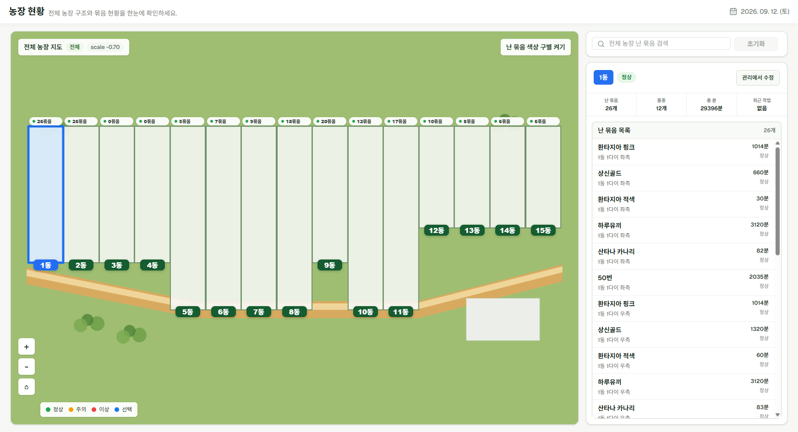
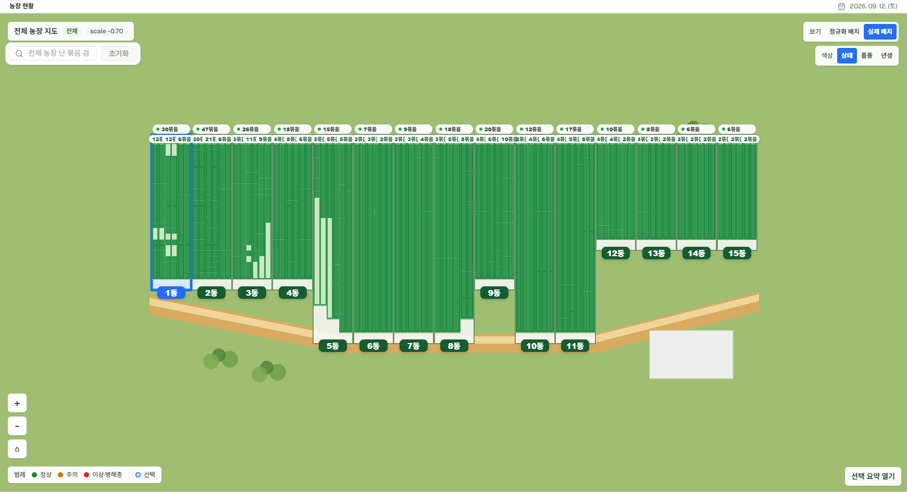

지도 서비스처럼 페이지 전체를 농장 맵으로 사용하도록 화면 구조를 변경했다. 검색, 보기 방식과 색상 설정은 맵 위에 떠 있는 형태로 배치하고, 난 묶음의 상세 정보는 대상을 선택했을 때만 오른쪽 패널로 표시한다.

항상 표시할 필요가 없는 목록과 상세 영역을 분리하면서 같은 화면 크기에서도 농장 구조와 난 묶음의 배치를 더 크게 확인할 수 있게 되었다.

### 실제 배치와 정규화 배치 제공

농장을 확인하는 목적에 따라 필요한 배치 방식이 달랐다.

실제 배치는 동의 위치와 방향 등 실제 농장 구조를 기준으로 보여준다. 어느 동이 어디에 있고 난 묶음이 실제로 어느 위치를 차지하는지 파악할 때 적합하다.

정규화 배치는 동과 다이를 일정한 크기의 격자로 정렬한다. 실제 거리와 방향보다는 여러 동의 점유 상태와 난 묶음 분포를 같은 기준으로 비교할 때 유용하다.

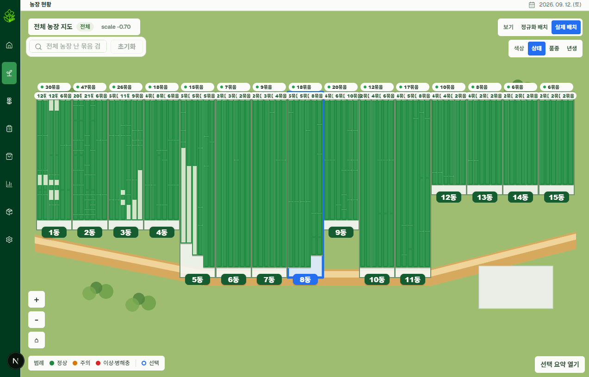

두 보기 방식을 화면에서 바로 전환할 수 있도록 하고, 색상 기준도 다음과 같이 세분화했다.

* 상태: 정상, 주의와 이상 상태 구분
* 품종: 서로 다른 품종의 분포 구분
* 년생: 난 묶음의 현재 년생 구분

또한 농장 전체가 보이는 최소 확대 단계에서도 난 묶음이 차지한 영역은 사라지지 않도록 했다. 개별 이름을 읽기 어려운 배율에서도 어느 동과 다이가 많이 차 있는지, 비어 있는 구간은 어디인지 파악할 수 있다. 필요한 위치를 찾은 뒤 확대하면 각 난 묶음의 정보까지 이어서 확인할 수 있다.

### 검색 결과를 맵과 연결

기존 검색은 일치하는 난 묶음을 목록으로 보여주는 데 가까웠다. 검색 결과가 실제 농장의 어디에 놓여 있는지 확인하려면 사용자가 다시 맵에서 위치를 찾아야 했다.

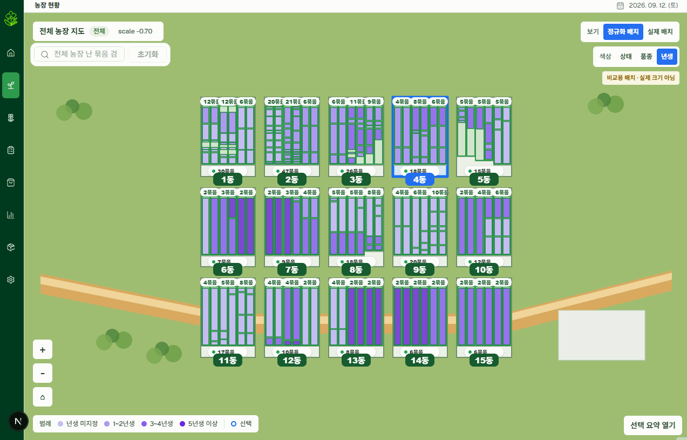

검색어를 입력하면 결과 목록과 함께 맵에서 일치하는 난 묶음을 강조하도록 변경했다. 일치하지 않는 영역은 흐리게 표시해 여러 동에 흩어진 검색 결과도 한눈에 구분할 수 있다.

결과를 선택하면 맵을 해당 위치로 포커싱하고 오른쪽 상세 패널이 열린다. 검색 결과의 수량과 위치를 확인하는 과정이 목록에서 끝나지 않고 실제 배치 확인으로 바로 이어지도록 했다.

## 3. 난 묶음 관리 개선

### 여러 다이를 연속해서 보는 방식으로 변경

기존 난 묶음 관리 화면에서는 선택 목록으로 동을 이동하고, 한 화면에 세 개의 다이를 고정해서 보여주었다. 인접한 다이를 비교하거나 다음 동으로 넘어갈 때마다 선택 목록을 다시 열어야 했고, 화면 너비가 달라도 표시되는 범위는 같았다.

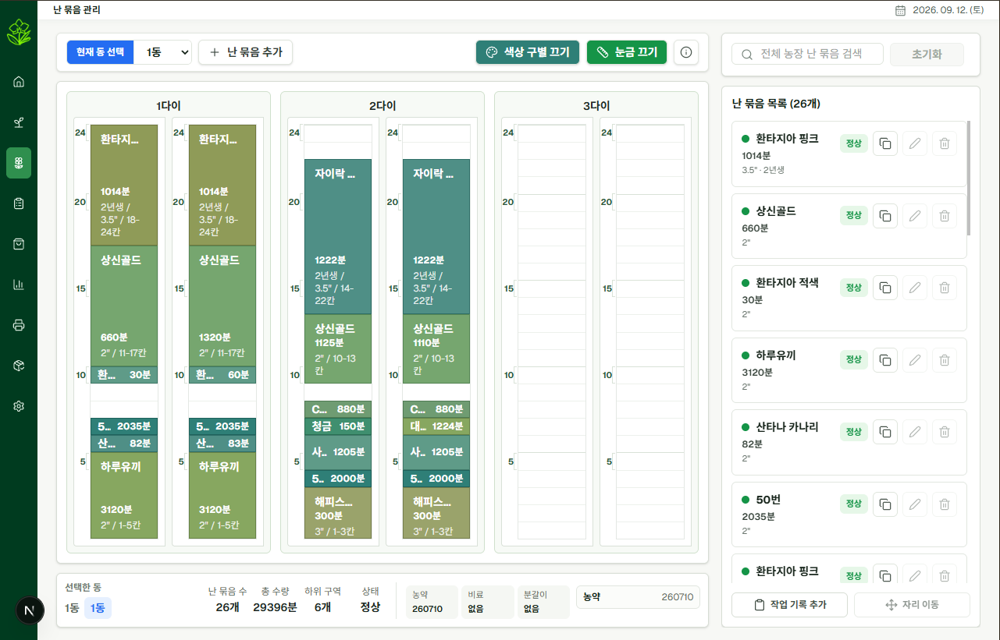
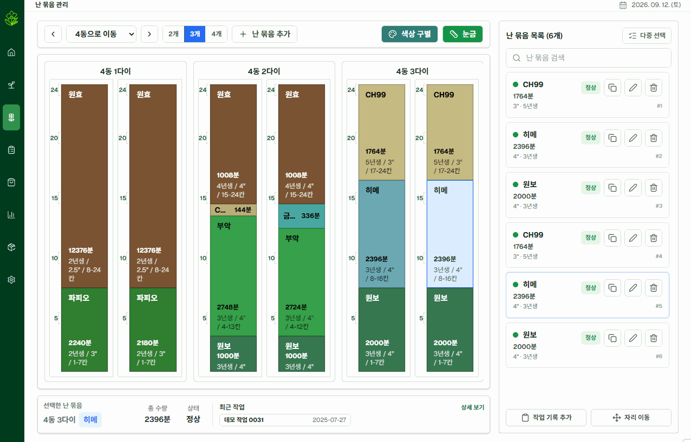

다이를 가로로 연속해서 넘겨 볼 수 있는 방식으로 변경하고, 화면에 한 번에 표시할 다이 수를 선택할 수 있도록 했다. 난 묶음의 정보를 크게 봐야 할 때는 적게 표시하고, 주변 배치를 함께 비교할 때는 표시 개수를 늘릴 수 있다.

동 선택 목록은 유지하되 이전과 다음 버튼을 추가했다. 현재 동의 마지막 다이를 확인한 뒤 다음 동으로 이동하거나, 인접한 동을 비교할 때 선택 목록을 반복해서 열지 않아도 된다.

### 화면 검색과 전체 농장 검색 구분

검색 기능은 사용자가 보고 있는 범위에 따라 결과를 다르게 확인할 수 있도록 정리했다.

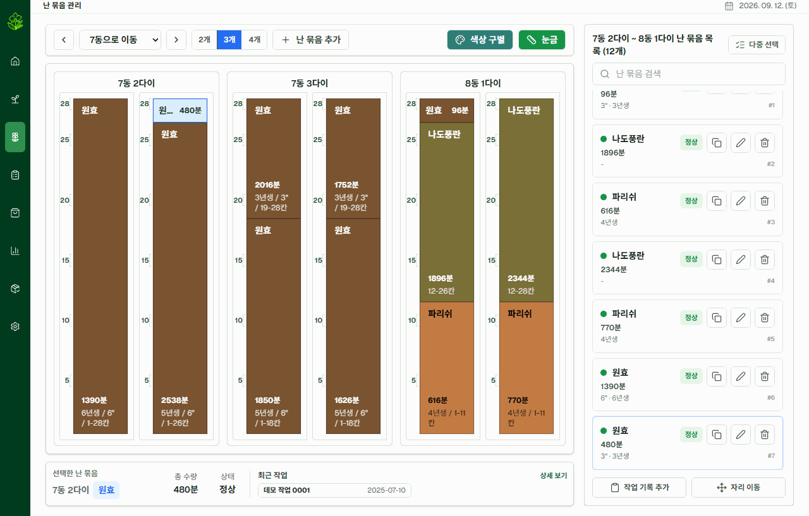

검색 범위는 다음 두 가지로 나뉜다.

* 화면: 현재 표시된 동과 다이 안에서 검색한다.
* 전체: 농장 전체의 난 묶음을 검색한다.

현재 배치 안에서 특정 난 묶음을 찾고 싶을 때는 화면 검색을 사용하고, 위치를 모르는 난 묶음을 찾을 때는 전체 검색을 사용할 수 있다. 전체 검색 결과를 선택하면 해당 난 묶음이 있는 동과 다이로 화면이 이동하고 대상이 강조된다.

개별 난 묶음뿐 아니라 자동 그룹과 사용자 그룹도 같은 검색 결과에 포함했다. 품종명처럼 난 묶음이 가진 정보로 찾는 경우와, `이번 주 분갈이 대상`처럼 사용자가 정한 관리 단위로 찾는 경우를 하나의 검색 흐름에서 처리할 수 있게 되었다.

### 여러 난 묶음 선택

같은 상태로 보정하거나 같은 작업에 포함할 난 묶음이 여러 개여도 기존에는 각각의 상세 화면에서 처리해야 했다.

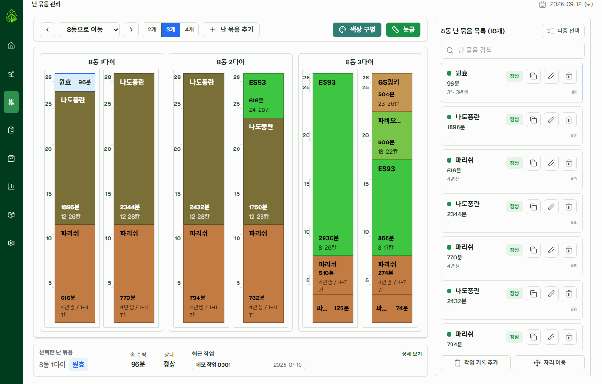

맵이나 목록에서 여러 난 묶음을 선택하고, 선택된 대상을 화면 아래에서 계속 확인할 수 있도록 다중 선택 기능을 추가했다. 선택한 난 묶음에는 다음 작업을 한 번에 실행할 수 있다.

* 보정
* 작업 등록
* 위치 이동

보정에서는 상태, 년생과 화분 크기처럼 공통으로 변경할 값만 지정한다. 작업 등록과 위치 이동에서는 선택한 난 묶음이 작업 대상으로 그대로 전달되기 때문에 다음 화면에서 대상을 다시 찾을 필요가 없다.

여러 대상을 한 번에 처리하되 사용자가 선택한 범위와 변경될 내용을 저장 전에 확인할 수 있도록 했다.

## 4. 작업 관리 개선

### 위치 이동을 작업으로 통합

기존 위치 이동은 난 묶음 관리 화면의 맵에서 수행했다. 현재 위치는 바뀌었지만 다른 구조 변경 작업과 달리 작업 관리 흐름에서 떨어져 있었고, 여러 난 묶음을 서로 다른 위치로 옮기는 경우에는 이동을 하나씩 반복해야 했다.

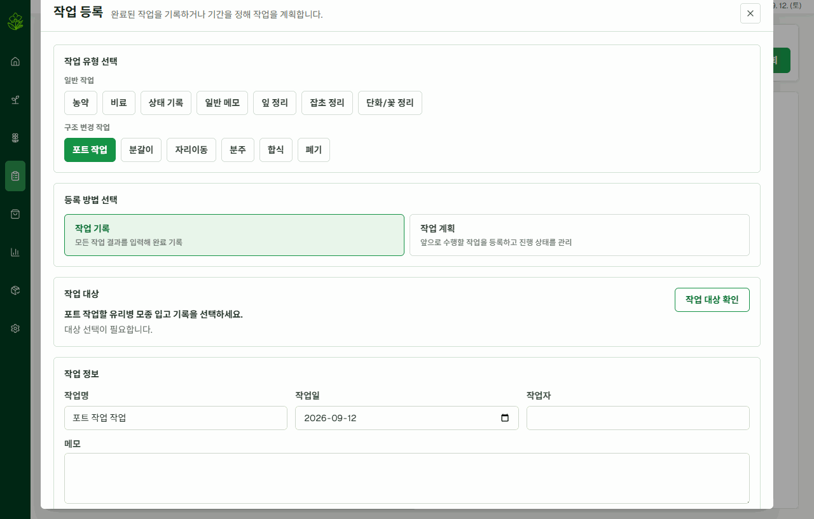

위치 이동을 작업 유형에 추가해 다른 작업과 같은 과정으로 등록하도록 변경했다.

1. 위치 이동 작업을 선택한다.
2. 이동할 난 묶음을 작업 대상으로 지정한다.
3. 원본 난 묶음에서 이동할 수량을 입력한다.
4. 이동할 동, 다이와 배치 구간을 선택한다.
5. 필요한 만큼 이동 항목을 추가한다.
6. 전체 이동 내용을 확인한 뒤 작업을 저장한다.

난 묶음마다 이동할 수량과 목적지를 지정할 수 있어 여러 위치 이동을 하나의 작업으로 처리할 수 있다. 저장된 작업에서는 대상 수, 진행 상태와 이동 결과를 함께 확인할 수 있다.

이제 위치 이동도 단순히 현재 위치를 수정하는 기능이 아니라, 언제 어떤 난 묶음을 어디로 옮겼는지 남는 구조 변경 작업으로 관리된다.

### 작업 관리 화면 통합

기존 작업 관리는 작업 목록, 캘린더와 작업 이력이 각각의 하위 메뉴로 나뉘어 있었다. 같은 작업을 다른 기준으로 확인하려 할 때마다 메뉴를 이동해야 했고, 화면마다 목록을 다루는 방식도 달랐다.

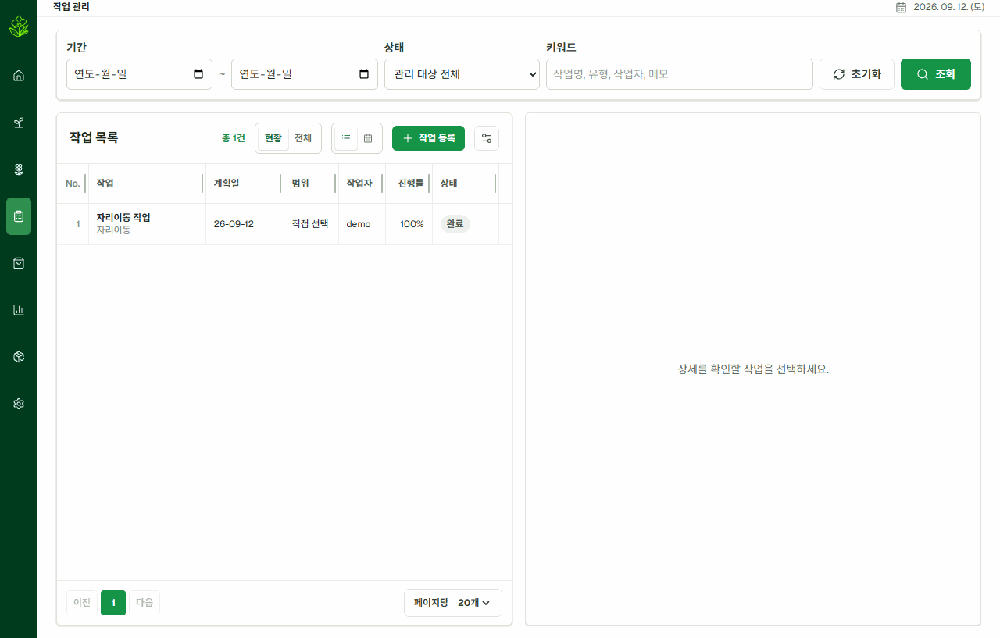

작업 관리 기능을 하나의 페이지로 통합하고 화면 안에서 보기 기준을 전환하도록 변경했다.

* 현황과 전체 작업 전환
* 목록과 캘린더 보기 전환
* 기간, 상태와 작업 유형 검색
* 공통 목록 컴포넌트를 이용한 페이지 이동과 열 설정
* 선택한 작업의 상세 정보 확인

현황에서는 진행 중인 작업과 당일 상태가 변경된 작업을 우선 확인할 수 있다. 전체 보기에서는 조건을 이용해 과거 작업까지 조회하고, 캘린더 보기에서는 기간 작업이 언제 진행되었는지 날짜 흐름으로 확인할 수 있다.

작업을 찾기 위해 메뉴를 옮기는 대신 같은 검색 조건과 선택 상태를 유지한 채 필요한 표현 방식만 바꿀 수 있도록 한 것이다.

## 화면은 넓게, 작업은 한 번에

기능이 적을 때는 메뉴를 한 번 더 열거나 난 묶음을 하나씩 처리하는 방식도 큰 문제가 되지 않았다. 하지만 관리할 데이터와 작업 유형이 늘어나면서 작은 조작의 반복이 실제 사용성을 크게 떨어뜨리기 시작했다.

이번 개선에서는 새로운 기능을 추가하는 것만큼 이미 존재하는 기능 사이의 이동을 줄이는 데 집중했다.

* 사이드바를 펼치지 않고도 하위 메뉴로 이동한다.
* 농장 현황에서는 목록에 가려지지 않는 넓은 맵을 사용한다.
* 검색 결과를 실제 배치 위치와 바로 연결한다.
* 여러 난 묶음을 선택해 보정과 작업을 함께 처리한다.
* 위치 이동을 다른 구조 변경 작업과 같은 흐름에서 관리한다.
* 작업 목록과 캘린더를 한 페이지에서 전환한다.

각 변경은 서로 다른 화면에서 시작되었지만 목적은 같다. 사용자가 시스템의 구조에 맞춰 여러 화면을 오가는 대신, 실제 농장을 보고 일하는 흐름 안에서 필요한 정보와 기능이 이어지도록 만드는 것이다.

아직 다중 작업이 현장에서 입력 부담을 충분히 줄여 주는지는 더 확인해야 한다. 앞으로도 기능의 수를 늘리는 데 그치지 않고 실제 사용 과정에서 반복되는 조작과 판단을 줄이는 방향으로 개선을 이어갈 예정이다.
