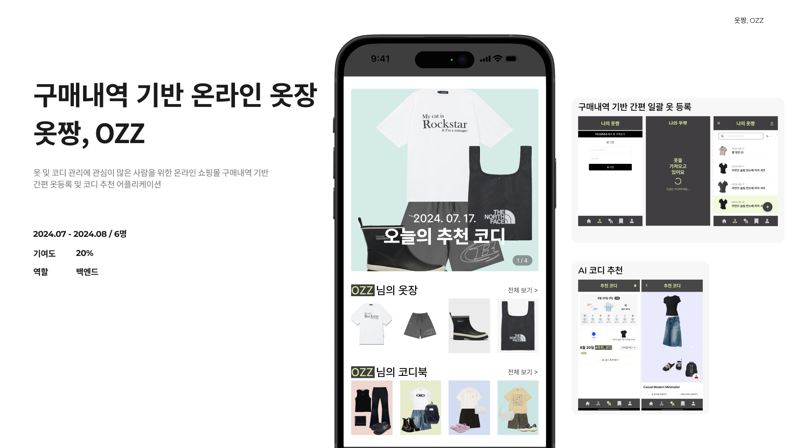

## 프로젝트 개요
- **기간 및 구성**: 24.07 - 24.08
- **주요 기술 스택**: FastAPI, OpenAI API, NextJS, SpringBoot
- **개요**: 옷 및 코디 관리에 관심이 많은 사람을 위해 간편한 옷등록을 지원하고 날씨, 취향에 맞는 코디 추천
- **담당 역할**
    - **백엔드**로써, 구매 내역 일괄 등록 기능을 위해 **의류 속성값 추출** 및 **섬네일 이미지에서 의류 객체 추출** 기능 구현
    - Spring Cloud 기반으로 **MSA를 적용**하였으며 Eureka로 **서비스 등록 및 검색**을, Spring Cloud Gateway로 클라이언트 요청의 **동적 라우팅과 API 관리**를 구현
    - 미리 정의된 의류 속성과 추출된 속성값의 비일치 문제 해결을 위해 OpenAI API에 **프롬프트 엔지니어링**과 **Temperature 조정**을 적용하여 최종적으로 96% 일치율을 달성
    - 단순 배경 제거와 세그먼테이션 모델을 결합한 방식을 적용하여, **섬네일 객체 추출 성공률을 50%에서 95%로 개선**