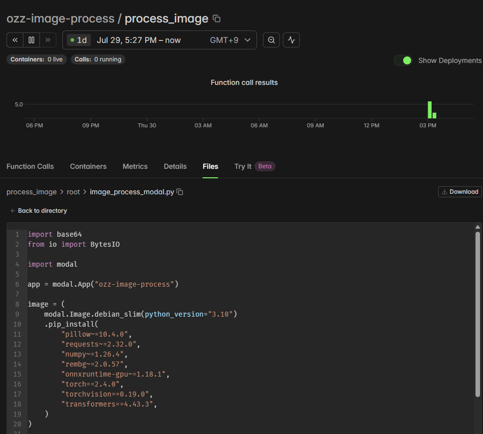
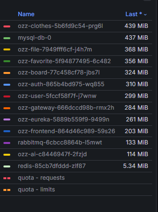
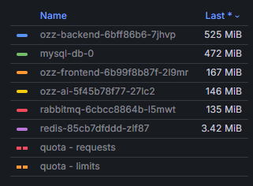
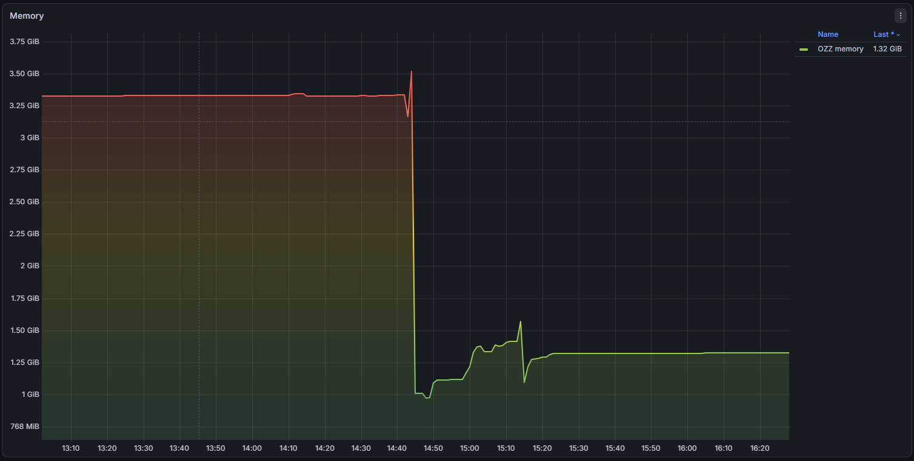

SSAFY 과정에서 진행했던 OZZ 프로젝트를 데모 환경으로 재구성해 k3s에 배포했다.

교육 과정에서 프로젝트를 개발할 당시에는 여러 백엔드 서비스를 분리한 구조로 설계했고, Docker Compose를 이용해 각각의 컨테이너를 실행했다. 데모 서버를 구축하면서는 각 서비스를 k3s의 개별 Deployment로 배포했다.

서비스마다 Deployment와 Service를 분리하니 기존 Docker Compose 환경보다 각 애플리케이션의 경계가 명확하게 보였다. 다만 이번 배포의 목적은 MSA 자체를 완벽하게 구현하는 것이 아니라, 기존 프로젝트의 주요 기능을 외부에서 확인할 수 있는 데모 환경을 유지하는 것이었다.

## 데모 환경에 맞게 기능 조정하기

운영 환경은 별도의 클라우드 서버가 아닌, 리소스가 제한된 미니 PC였다. 따라서 기존 프로젝트의 모든 구성을 그대로 옮기기보다는 데모에서 필요한 기능을 기준으로 일부 서비스를 정리했다.

### Elasticsearch 제거

Elasticsearch는 주로 옷의 시맨틱 검색 기능에 사용됐다. 프로젝트의 주요 흐름을 시연하는 데 반드시 필요한 기능은 아니었고, 메모리 사용량도 적지 않았기 때문에 데모 환경에서는 제외했다.

검색 기능 하나를 유지하기 위해 별도의 데이터 저장소와 프로세스를 계속 실행하는 것은 현재 데모 서버의 목적과 맞지 않는다고 판단했다.

### Prometheus 제거

Prometheus 역시 같은 이유로 제외했다.

모니터링은 운영 환경에서 중요한 구성 요소지만, 제한된 리소스 안에서 장기간 유지할 데모 서버에서는 애플리케이션 자체의 안정적인 실행이 우선이었다. 현재 환경에서는 상세한 메트릭 수집보다 기본적인 상태 확인과 로그 점검만으로도 충분하다고 판단했다.

### AI 추론 기능을 Modal로 이전

기존에는 이미지 세그멘테이션 모델과 배경 제거 모델의 CPU 버전을 서버에서 직접 실행했다.

하지만 모델을 상시 실행하면 실제 요청 빈도에 비해 서버의 메모리와 CPU를 계속 점유하게 된다. 이를 줄이기 위해 AI 추론 기능을 서버리스 실행 환경인 Modal로 이전했다.

Modal은 [졸업 작품의 AI 기능을 서버리스 추론](https://styughjvbn.github.io/blog/article/%EC%A1%B8%EC%97%85%EC%9E%91%ED%92%88/%EB%85%BC%EB%A6%AC-%EC%98%A4%EB%A5%98-%EC%88%98%EC%A0%95/%EC%84%9C%EB%B2%84%EB%A6%AC%EC%8A%A4-%EC%B6%94%EB%A1%A0/) 환경으로 활용중인 서비스이다.
콜드 스타트가 발생하는 경우에는 기존 CPU 서버와 체감 속도가 크게 다르지 않았고, 인스턴스가 준비된 웜 스타트 상태에서는 기존보다 더 빠르게 결과를 받을 수 있었다. 무엇보다 AI 모델을 사용하지 않는 시간에는 데모 서버가 관련 리소스를 점유하지 않는다는 점이 현재 환경에 더 적합했다.

### 소셜 로그인 제거

데모 버전에서는 일반 사용자의 가입이나 소셜 계정 연동이 필요하지 않았다.

정해진 데모 계정으로 주요 기능을 확인하는 것이 목적이었기 때문에 소셜 로그인 기능과 관련 설정을 제거했다. 데모에서 사용되지 않는 인증 흐름을 유지하면서 설정과 장애 지점을 늘릴 필요가 없다고 판단했다.

## 한 달간 운영하며 발견한 문제

이러한 기능을 정리한 뒤 약 한 달 동안 데모 서버를 유지했다.

하지만 일부 서비스를 제외했음에도 OZZ 네임스페이스 전체가 약 4GB의 메모리를 사용하고 있었다. 미니 PC에서 함께 운영 중인 다른 서비스까지 고려하면, 프로젝트의 규모와 실제 데모 사용량에 비해 부담이 큰 수준이었다.

각 서비스가 개별 프로세스로 실행되면서 애플리케이션마다 JVM과 기본 런타임 메모리가 필요했다. 여기에 각 Deployment의 리소스와 서비스 간 통신 구성이 더해지면서, 실제 기능의 규모보다 운영 비용이 커졌다.

서비스를 분리해 놓는 것만으로 MSA의 장점을 충분히 얻을 수 있는 것도 아니었다.

서비스별 독립 배포와 수평 확장, 장애 격리 같은 장점을 제대로 활용하려면 데이터와 배포 파이프라인, 장애 대응 방식까지 함께 설계해야 한다. 현재 OZZ 데모는 트래픽이 많지 않고, 대부분의 기능이 함께 변경되며, 하나의 미니 PC에서 실행되고 있었다.

이러한 조건에서는 서비스를 분리해서 얻는 이점보다 운영 복잡도와 리소스 사용량이 더 크게 나타났다.

## 모듈러 모놀리스로 전환

결국 분리돼 있던 백엔드 기능을 하나의 애플리케이션으로 통합하고, 내부적으로는 도메인별 모듈 경계를 유지하는 모듈러 모놀리스 구조로 전환했다.

코드 통합과 의존성 정리 과정에서는 Codex를 적극적으로 활용했다. 모든 코드 변경을 처음부터 직접 작성한 것은 아니며, 일부 세부 구현은 아직 완전히 이해하지 못한 부분도 있다.

다만 데모 서버의 리소스 사용량을 관찰하고, 현재 구조가 프로젝트의 규모와 운영 목적에 적합한지를 판단한 뒤 전환 방향을 결정한 것은 직접 수행한 부분이다. 자동화 도구가 코드를 변경하더라도, 어떤 구조를 선택할지와 변경 결과가 적절한지는 별도로 검토해야 했다.

전환 이후 OZZ 네임스페이스의 메모리 사용량은 약 3.3GB에서 1.3GB 수준으로 2GB 감소했다.

백엔드 애플리케이션 수가 줄어들면서 중복으로 사용되던 JVM 메모리와 애플리케이션 런타임 비용이 감소한 영향이 컸다. Deployment와 Service의 수도 줄어들어 배포 구성과 로그 확인도 이전보다 단순해졌다.

## 이번 경험에서 얻은 결론

이번 경험을 통해 MSA가 항상 더 발전된 구조는 아니라는 점을 체감했다.

MSA는 서비스별 독립 배포, 장애 격리, 선택적인 수평 확장과 같은 장점이 있다. 하지만 이러한 장점이 실제로 필요한 규모와 운영 조건이 아니라면, 서비스마다 발생하는 런타임 비용과 배포 복잡도가 더 큰 부담이 될 수 있다.

반대로 모듈러 모놀리스는 하나의 애플리케이션으로 배포하면서도 코드 내부의 책임과 경계를 나눌 수 있다. 현재 OZZ 데모처럼 트래픽이 크지 않고, 기능들이 함께 배포되며, 제한된 하드웨어에서 운영되는 환경에는 더 적합한 선택이었다.

이번 작업에서 중요했던 것은 k3s에 여러 서비스를 배포했다는 사실 자체가 아니었다.

실제로 서비스를 일정 기간 운영해 보고, 리소스 사용량과 운영 목적을 비교한 뒤, 기존 설계를 유지하는 것보다 구조를 단순화하는 편이 낫다고 판단한 과정이 더 의미 있었다.

처음 설계한 구조를 그대로 유지하는 것이 항상 정답은 아니다. 현재 시스템이 해결해야 하는 문제와 운영 환경이 달라졌다면, 아키텍처 역시 그 조건에 맞게 다시 선택해야 한다.
