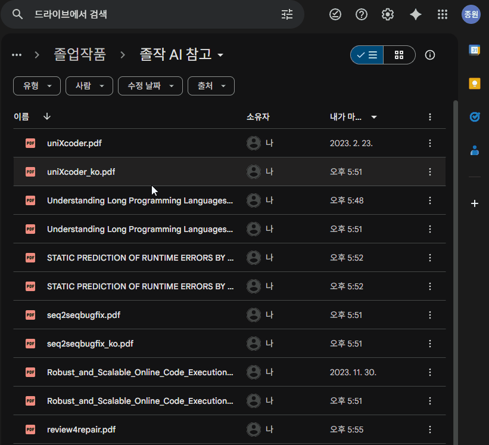

논리 오류를 고치는 AI 기능을 구현하기 위해, 다양한 코드 기반 언어 모델들을 탐색하고 학습 실험을 진행했다.  
초기에는 입력과 출력 구조를 학습자 중심으로 정의했지만, 현실적인 제약에 따라 구조를 단순화하고 기능을 재정의해야 했다.  

최종적으로는 **알고리즘 문제 설명과 오답 코드만을 입력으로 받아, 수정된 코드를 출력하는 구조**로 기능을 단순화하고,
이에 가장 적합한 모델로 **GraphCodeBERT**를 선택하게 되었다.

## 기능 정의와 실제 구현의 차이

### 초기 기능 구상

처음 기능을 설계할 때는 다음과 같은 구조를 생각했다.

**입력값**

* 알고리즘 문제 설명
* 오답 코드
* 실패한 테스트 케이스 (입력, 오답 출력, 기대 출력)

**출력값**

* 논리 오류가 수정된 코드
* 틀린 이유에 대한 설명 (예: 반복 조건 오류, 잘못된 초기화 등)

이 구조는 단순히 정답 코드를 생성하는 데 그치지 않고, 사용자가 **어디가 틀렸는지**, **왜 틀렸는지**를 파악할 수 있도록 하는 데 목적이 있었다.
결과적으로 학습적 피드백과 교육적 효과까지 포함한 설계였다.

### 구현 가능성 검토

하지만 여러 모델과 논문을 분석하고 구현 가능성을 고려하는 과정에서 다음과 같은 문제점이 드러났다:

- **다중 출력값을 생성할 수 있는 구조가 거의 없었다.**  
  대부분의 공개 모델은 코드 하나를 입력받아 하나를 출력하는 형태였다.
  
- **논문은 흥미롭지만, 코드나 학습 파이프라인이 공개되지 않은 경우가 많았다.**  
  논문만으로는 직접 구현을 시작하기 어려웠다.

- **code refinement를 다루는 학습 예제가 없는 모델이 많았다.**  
  공개된 모델 중 상당수는 코드 요약, 생성, 검색에 초점이 맞춰져 있었다.

- **알고리즘 문제를 다루기보다는 일반적인 프로그램을 대상으로 한 오류 수정 모델이 많았다.**  
  내 목적에 맞는 데이터 구조나 태스크 정의가 미비했다.

- **모델을 처음부터 설계하거나 확장하기엔 시간과 자원이 부족했다.**  
  프로젝트 일정 내에 혼자 구현 가능한 수준에서 작업을 해야 했다.

### 기능 조정

이러한 이유로 기능 정의를 **현실에 맞게 수정**했다.
최종적으로는 다음과 같은 단순한 입출력 구조로 범위를 축소했다:

**입력값**

* 알고리즘 문제 설명
* 오답 코드

**출력값**

* 논리 오류가 수정된 코드

즉, **실패한 테스트 케이스와 오류 설명은 제거하고**,  
AI가 단순히 오답 코드를 정답 코드로 수정하는 데 집중하는 구조로 기능을 단순화했다.

### 기능 조정의 배경

- **빠르게 실험 가능한 모델과 코드가 필요했기 때문**  
  학습 파이프라인이 잘 구성된 모델을 골라 내 데이터만 적용하는 것이 현실적인 방법이었다.

- **기존 모델 구조를 억지로 확장할 경우 안정성과 성능 저하가 예상됐기 때문**  
  모델이 불안정하거나 fine-tuning 자체가 어려워질 수 있었다.

- **구체적이고 좁은 태스크에 집중함으로써 실험 가능성과 구현 안정성을 확보할 수 있었기 때문**

## 모델 탐색과 실험

### 후보 모델

논리 오류 수정이라는 목적에 부합하는 모델을 찾기 위해 여러 논문과 오픈소스 프로젝트를 검토했고,  
그 중, 유의깊게 봤던 모델들이다. 

#### [CodeBERT](https://arxiv.org/pdf/2002.08155)
- 자연어와 코드를 함께 처리하는 사전학습 모델
- 다양한 downstream task를 지원
- 공개된 학습 코드와 모델이 존재하며, baseline 비교에 적합

#### [GraphCodeBERT](https://arxiv.org/pdf/2009.08366)
- CodeBERT의 확장 모델로, 코드의 data flow 정보를 활용
- [**Refinement task**를 위한 학습 구조와 코드가 함께 공개됨](https://github.com/microsoft/CodeBERT/tree/master/GraphCodeBERT/refinement)
- 코드 수정 작업과 매우 유사한 구조를 제공
- 문제 설명 + 오답 코드 → 정답 코드 형태의 학습에 적합

#### [uniXcoder](https://arxiv.org/pdf/2203.03850)
- 코드, 주석, AST를 함께 입력으로 사용하는 cross-modal encoder 모델
- 다양한 태스크(코드 요약, 검색, 생성 등)에서 강력한 성능을 보였음
- **Code refinement 작업을 위한 학습 파이프라인이 존재하지 않음**

## 최종 결정

최종적으로 선택한 모델은 **GraphCodeBERT**였다. 그 이유는 다음과 같다:

* 내가 정의한 단순화된 입력/출력 구조에 잘 부합함
* Microsoft가 공개한 refinement 학습 파이프라인을 활용할 수 있었음
* 실제 학습 및 추론이 가능했으며, 결과도 비교적 안정적으로 도출됨
* 학습 리소스도 제한적인 환경에서 충분히 실행 가능한 수준이었음

## 회고

처음에는 다양한 출력을 포함한 풍부한 기능을 구상했지만,
**모델의 실현 가능성**과 **공개된 학습 자원 유무**를 고려하며 기능 정의를 조정해야 했다.

결과적으로 기능은 단순화되었지만, 그만큼 실제 구현 가능성이 확보되었다.