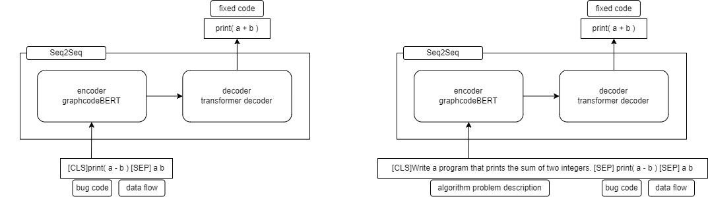

논리 오류를 자동으로 고치는 기능을 구현하기 위해, **GraphCodeBERT** 모델을 기반으로 학습을 진행했다.  
기본적으로 Microsoft가 공개한 **refinement task 학습 구조**를 활용했고,  
여기에 내가 정의한 입력 구조 (문제 설명 + 오답 코드)를 반영하기 위해 모델 입력 포맷을 수정했다.  
전체 구조는 그대로 유지하되, 학습 데이터 구성과 전처리 과정에서 필요한 변경을 적용한 형태로 학습을 진행했다.


## 사용한 모델 구조

기반 모델은 **GraphCodeBERT + Seq2Seq 구조**로, Microsoft가 공개한 [GraphCodeBERT refinement task](https://github.com/microsoft/CodeBERT/tree/master/GraphCodeBERT/refinement)를 그대로 활용했다.

- **입력 인코더**: GraphCodeBERT (CodeBERT에 data flow 정보 추가)
- **출력 디코더**: Transformer 기반 seq2seq 디코더
- **기본 목적**: 논리적 오류가 포함된 코드를 입력으로 받아 수정된 코드를 생성

### 입력 포맷 수정

기존 모델의 입력 포맷에서 알고리즘 문제 설명을 추가하였다. 

```text
"                                  "[CLS] bug code [SEP] data flow
                                    ↓  
[CLS] algorithm problem description [SEP] bug code [SEP] data flow

```

### 문제 설명 추가 이유

논리 오류는 단순히 코드만 보고 판단하기 어려운 경우가 많고,  
문제 조건(예: 입력 범위, 정렬 기준, 특수 조건 등)이 코드 수정의 핵심 단서가 되기 때문이다.  

따라서 학습 데이터에 문제 설명을 포함시켜 모델이 문맥을 고려한 수정을 하도록 유도했다.


## 학습 데이터 수집과 전처리

### 데이터 수집

- algorithm problem description
    - [CodeNet](https://github.com/IBM/Project_CodeNet)  
    IBM Research에서 만든 프로그래밍과 소프트웨어 개발에 관련된 대규모 데이터셋, 다양한 알고리즘 문제와 각 문제에 제출된 다양한 언어의 코드로 이루어져있다.

- bug code - fixed code 쌍 데이터
    - [FixEval](https://github.com/mahimanzum/FixEval)  
    CodeNet의 데이터셋중에서 파이썬으로 작성한 코드만 뽑아내고 한 유저가 한가지 문제를 풀어내기까지의 코드 변화내역을 1:m으로 엮은 데이터셋

### 데이터 전처리

학습 데이터는 아래의 과정으로 전처리하였다. 

1. FixEval 파이썬 데이터셋에서 논리적 오류가 존재하여 TC를 통과하지 못한 WA코드쌍만 추출
2. 초보자에게 쉬운, 복잡하지 않는 문제를 선별하기 위해 score가 400이상인 문제 삭제
3. 문제별로 같은 의미지만 다른 유니코드의 기호들을 변환
4. 코드쌍 추상화 - 변수와 함수의 이름을 var1 ... varX, method1 ... methodX 로 추상화
5. 코드쌍과 알고리즘 문제 설명문을 토큰화 했을 때 최대 토큰 512를 초과하는 코드쌍 삭제
6. nl + pl 코드쌍 생성

#### 학습 데이터 샘플
```json
{
    "p_name": "p03036",
    "code": {
    "buggy_code": "(var0, var1, var2) = map(int, input().split())\nfor i in
    range(10):\n\tprint(var2)\n\tvar2 = var0 * var2 - var1\nprint(var2)",
    "fixed_code": "(var0, var1, var2) = map(int, input().split())\nfor i in
    range(10):\n\tvar2 = var0 * var2 - var1\n\tprint(var2)"
    }
}
```
* 알고리즘 문제별로 최소 71쌍, 최대 8989쌍이 존재하며 평균 200개의 nl-pl 쌍이 존재.
* 결과적으로 25만개의 샘플을 가지는 데이터셋을 만들었다. 

자세한 전처리 코드는 [data_pre_process.py](https://github.com/PDA-PRO/COCO_AI/blob/main/wpc-finetuning/data_pre_process.py)에서 확인할 수 있다. 

## 모델 학습

기본적으로 GraphCodeBERT의 학습 스크립트를 수정하여 사용했다

특별한 구조 수정 없이도 학습이 가능했으며, 입력 포맷만 변경하여 기존 학습 코드와의 호환성을 유지했다.

Google Colab A100 고용량 RAM 을 사용하여 10epoch 씩 총 20epoch 학습 수행
### 모델 훈련

```bash
!python ./COCO_AI/graphcodebert_0718/run.py \\
--do_train \\
--do_eval \\
--model_type roberta \\
--model_name_or_path microsoft/graphcodebert-base \\
--tokenizer_name microsoft/graphcodebert-base \\
--config_name microsoft/graphcodebert-base \\
--train_filename /content/drive/MyDrive/coco_ai/train.json \\
--dev_filename /content/drive/MyDrive/coco_ai/val.json \\
--p_desc_path /content/drive/MyDrive/coco_ai/tmp_p_desc \\
--output_dir /content/drive/MyDrive/coco_ai/graphcodebert_256_0724/output \\
--load_model_path /content/drive/MyDrive/coco_ai/graphcodebert_256_0724/output/checkpoint-last/pytorch_model.bin \\
--max_source_length 512 \\
--max_target_length 256 \\
--beam_size 10 \\
--train_batch_size 32 \\
--eval_batch_size 32 \\
--learning_rate 5e-5 \\
--num_train_epochs 20 2>&1| tee /content/drive/MyDrive/coco_ai/graphcodebert_256_0724/output/train.log

```

### 모델 훈련 과정
```bash
***** Running evaluation *****
09/10/2023 07:43:18 - INFO - __main__ -     Num examples = 25381
09/10/2023 07:43:18 - INFO - __main__ -     Batch size = 32
09/10/2023 07:47:45 - INFO - __main__ -     eval_ppl = 1.1595
09/10/2023 07:47:45 - INFO - __main__ -     global_step = 55981
09/10/2023 07:47:45 - INFO - __main__ -     train_loss = 0.029
09/10/2023 07:47:45 - INFO - __main__ -     ********************
09/10/2023 08:08:31 - INFO - __main__ -     bleu-4 = 73.64 
09/10/2023 08:08:31 - INFO - __main__ -     xMatch = 37.0 
09/10/2023 08:08:31 - INFO - __main__ -     ********************
09/10/2023 08:08:31 - INFO - __main__ -     Best BLEU+xMatch:110.64
09/10/2023 08:08:31 - INFO - __main__ -     ********************
epoch 10 loss 0.0338: 100%|██████████| 5598/5598 [1:38:14<00:00,  1.05s/it]

***** Running evaluation *****

09/10/2023 09:46:47 - INFO - __main__ - Num examples = 25381
09/10/2023 09:46:47 - INFO - __main__ - Batch size = 32
09/10/2023 09:51:14 - INFO - __main__ - eval_ppl = 1.15586
09/10/2023 09:51:14 - INFO - __main__ - global_step = 61579
09/10/2023 09:51:14 - INFO - __main__ - train_loss = 0.0338
09/10/2023 09:51:14 - INFO - __main__ - ********************
09/10/2023 10:11:48 - INFO - __main__ - bleu-4 = 73.29
09/10/2023 10:11:48 - INFO - __main__ - xMatch = 36.8
09/10/2023 10:11:48 - INFO - __main__ - ********************
epoch 11 loss 0.0305: 80%|███████▉ | 4470/5598 [1:18:27<19:47, 1.05s/it]
```

## 학습 결과

**GraphCodeBERT**

최종 train_loss : 0.029 bleu-4 : 73.64, xMatch : 37.0


> 같은 방식으로 후보 모델이었던 CodeBERT-small 모델도 학습했던 결과이다.
>
>**CodeBERT-small**
>
>최종 train_loss : 0.0765 bleu-4 : 70.44, xMatch : 29.1

## 회고

모델을 처음부터 새로 만드는 것이 아니라, 기존 구조를 그대로 유지하면서 **입력 포맷만 수정**하는 방식은 매우 효과적이었다.  
이 방식은 기존 연구를 잘 활용하면서도, 내가 정의한 기능에 맞게 학습 데이터를 구성하는 데 집중할 수 있게 해주었다.

또한 문제 설명을 입력에 추가함으로써, 단순히 코드 패턴을 암기하는 방식이 아니라 **문제 조건을 고려한 수정**이 가능하도록 유도할 수 있었다.

다음 글에서는 학습 결과를 바탕으로 모델이 어떤 종류의 논리 오류를 잘 고쳤고, 어떤 오류에는 약했는지를 분석할 예정이다.
