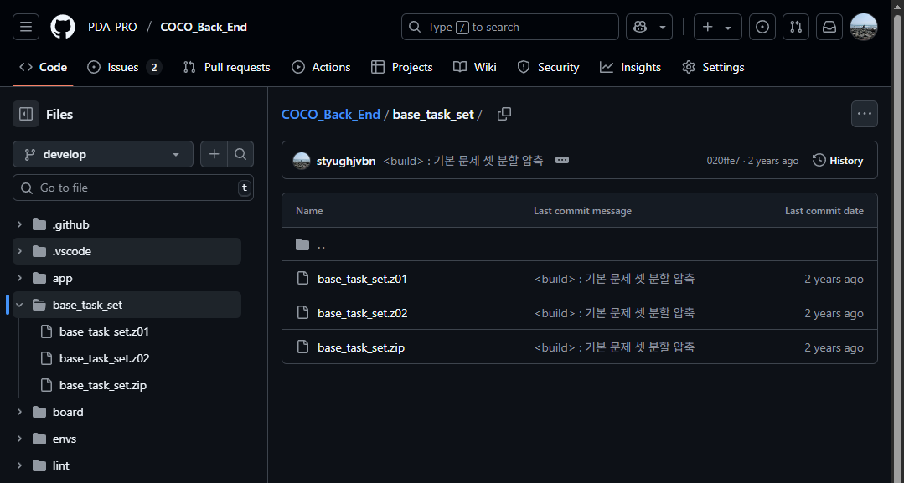
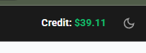
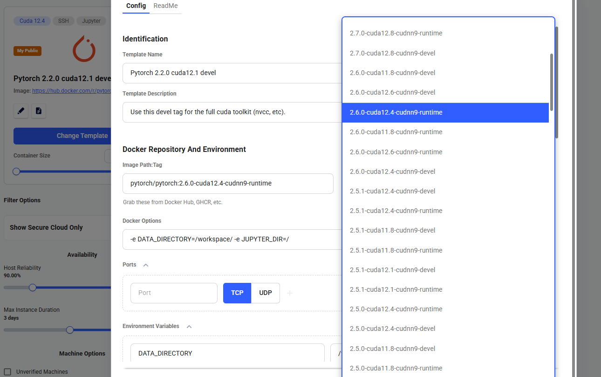
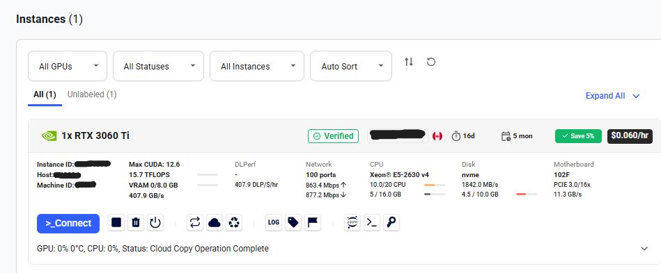
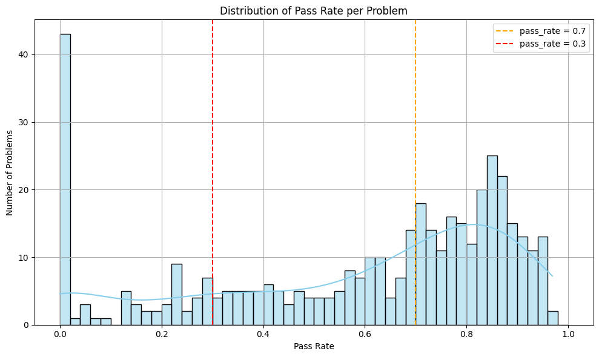
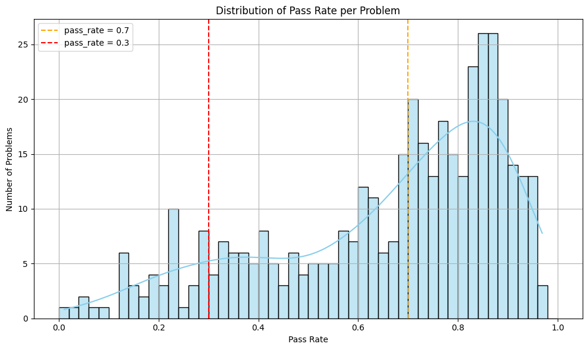

2년 전 만들어둔 AI 모델의 제대로된 성능을 수치로 이제야 측정해보기로 했다.

초기에는 단순히 BLEU, xMatch 같은 정형적인 평가 지표만 사용했었는데,
이는 알고리즘 문제에서 **논리 오류를 고치는 태스크**의 성격과는 맞지 않았다.

그래서 이번에는 다음과 같은 지표로 성능을 다시 측정하기 위해 모델 추론결과를 생성하고 채점을 진행했다.

* **pass@1**: 생성된 코드가 실제 테스트 케이스를 통과했는지 여부
* **코드 유사도**: 코드를 얼마나 최소한으로 수정했는지를 판단
    * **AST 유사도**: 수정 전·후 코드의 추상 구문 트리 유사도
    * **LineDiffRatio**: 전체 코드 대비 라인 단위 수정량을 비교

## 평가 데이터 구축

### 문제 집합 확보

모델이 생성한 코드를 채점하기 위해서는 **문제별 테스트 케이스**가 필요하다.
과거 온라인 저지 백엔드를 개발하면서 초기 문제 세트로 정리해둔 자료가 있어 이를 그대로 사용할 수 있었다.

파일 구조는 다음과 같다:

```
task_detail.json
TC/
├── <문제 번호>/
│   ├── input/
│   │   └── 1.txt
│   └── output/
│       └── 1.txt
```

GitHub에 업로드된 문제 세트로부터 쉽게 채점 환경을 구성할 수 있었다.



### bug - fixed 코드 페어 확보

모델 평가에 사용할 bug-fixed code pair는 과거 학습 데이터 생성 시 작성했던 Jupyter Notebook을 다시 활용해 재생성했다.

`base_task_set`에 존재하는 문제들만 필터링하여 총 34만개의 데이터를 구했다.

```bash
총 데이터 수: 342,556
상위 3개 문제 유형:
- p02659: 13,103개
- p02743: 7,211개
- p02761: 7,076개
하위 3개 문제 유형:
- p03635: 108개
- p03315: 110개
- p00001: 111개
문제당 평균 개수: 약 827.43개
```

다양한 문제 유형에서 오류 수정 능력을 평가할 수 있도록 구성했다.

## Fixed code 생성

기존에 만들었던 추론 모듈을 수정해, bug code에 대한 fixed code를 일괄 생성하는 과정을 구성했다.
채점은 CPU에서도 가능하지만, fixed code 생성을 위한 추론은 GPU 자원이 필요했기 때문에
**생성과 채점을 별도로 분리하여 실행**하도록 구성했다.

생성된 fixed code는 다음과 같은 형식의 `.jsonl` 파일로 저장했다:

```
{
  "pred": <생성된 코드>,
  "target": <정답 코드>,
  "source": <오답 코드>,
  "p_name": <문제 번호>
}
```

### 추론 환경 구성

처음에는 Colab 무료 인스턴스로 추론을 실행했지만, 전체 34만 건의 데이터를 처리하기에는 시간이 부족했다.
그래서 예전에 SSAFY에서 학습용으로 사용했던 **Vast.ai**를 다시 활용하기로 했다.

Vast 계정에 남아있던 $39.11 크레딧 덕분에 추가 결제 없이 사용할 수 있었다.  


모델 구조가 가볍기 때문에, 가장 저렴한 **RTX 3060 Ti 인스턴스**를 선택했다.
Colab과 동일한 PyTorch, CUDA, cuDNN 버전을 설정해 환경을 구성했다.



총 34만 건의 bug code에 대해 fixed code 생성을 완료하는 데 약 10~14일이 소요되었다.

## 코드 채점
생성된 fixed code는 앞서 확보한 테스트 케이스로 자동 채점을 수행했다.
```bash
...
💾 저장됨: 141600개까지 완료
[141601][p02717] ✅ Passed | ✅ 80016 / ❌ 61585
[141602][p02717] ✅ Passed | ✅ 80017 / ❌ 61585
[141603][p02717] ✅ Passed | ✅ 80018 / ❌ 61585
...
🎯 전체 평가 완료
```

채점 결과는 아래와 같이 저장된다:
```
[
  {
    "p_name": "p03095",
    "result": "pass",
    "pred": <생성 코드>,
    "target": <정답 코드>,
    "source": <오답 코드>
  },
  {
    "p_name": "p03095",
    "result": "fail",
    "pred": <생성 코드>,
    "target": <정답 코드>,
    "source": <오답 코드>,
    "failures": [
      {
        "test_id": 0,
        "reason": "[ERROR] Runtime Error"
      }
    ]
  }
]
```
실패한 경우에는 어떤 테스트 케이스에서 어떤 이유로 실패했는지까지 기록해 두었다.

## 문제 발생 - 잘못 채점된 데이터...

분석을 진행하기 위해 문제별로 pass_rate를 찍어보니 정답률(`pass_rate`)이 **0 \~ 0.02 사이**에 몰려 있는 문제가 유독 많다는 이상 징후를 발견했다.



```python
이상치 (pass_rate == 0) 문제 수: 37
📊 이상치 (pass_rate == 0) 문제들의 평균 오류 유형 비율 (fail 기준):
Wrong Answer                  : 0.765
Runtime Error                 : 0.212
Timeout                       : 0.023
Other Error                   : 0.000
```

특히, **정답률이 0인 문제만 37개**가 존재했으며, 그 중 **약 75%가 `Wrong Answer` 오류 유형**이었다.

이는 `Runtime Error`나 `Timeout`보다 `Wrong Answer`가 유독 많은 분포와 맞물려, **채점 로직에 오류가 있을 가능성**을 강하게 시사했다.

### 원인 조사

실제로 아래 항목들을 샘플링하여 확인했다:

* 알고리즘 문제 설명
* source (오답 코드)
* pred (모델 생성 코드)
* target (정답 코드)

그 결과, **정답 코드가 맞음에도 불구하고 `fail`로 처리된 사례들**이 다수 확인되었다. 이는 테스트 케이스의 구성과 채점 기준이 원인이었다.

### 주요 원인 사례

#### 1. 정답 출력에 **해설이 포함된 경우**

예시: `p03433`

```text {filename="expected_output.txt"}
No

1엔 동전이 없을 때 500엔 동전만 사용하여 500엔의 배수만 지불할 수 있습니다. 
2763은 500의 배수가 아니므로 이 금액을 지불할 수 없습니다.
```

→ 정답 출력은 `No` 만 있어야 했지만, **채점 기준이 전체 문자열 일치**였기 때문에 실패 처리됨.


#### 2. 줄바꿈(LF vs CRLF) 불일치

예시: `p00001`

```text {filename="expected_output.txt"}
2\r\n
3\r\n
4
```

→ 정답 파일은 Windows 스타일(CRLF)로 저장되어 있었고, 채점은 리눅스 환경(LF)에서 이루어졌다. 
이로 인해 **텍스트는 동일하지만 줄바꿈 문자 차이로 채점 실패**.

#### 3. 실수 오차를 허용하는 문제

예시: `p02380`

```text {filename="problem_description.txt"}
출력에서 절대 오차가 10^-4 이하이어야 함
```

→ 정답 출력에서 오차를 허용하지만 채점은 단순 문자열 비교로 인해 올바르게 채점이 이루어지지 않았다.

#### 4. 여러 가지 답이 허용되는 문제

예시: `p02842`

```text {filename="problem_description.txt"}
가능한 X가 여러 개이면 아무 값이나 출력하고, 없으면 :( 출력
```

→ 정답 출력에서 다양한 정답을 허용하지만 채점은 단순 문자열 비교로 인해 올바르게 채점이 이루어지지 않았다.


### 조치

* 전체 테스트 케이스 포맷을 점검하고, 줄바꿈 및 해설 포함 여부를 모두 수정
* 실수 오차 및 여러 답을 허용하는 채점 로직 추가

그 결과, **오류 가능성이 있는 약 12만 개 샘플**에 대해 재채점을 실시하였다.

### 최종 채점 결과




최종적으로 342,219개의 fixed code 샘플에 대한 채점 결과를 확보했다.

## 분석

다음 글에서:

* pass@1 비율 확인
* pass 된 코드에 대한 AST 유사도 측정
* LineDiffRatio 분석

을 수행할 예정이다.