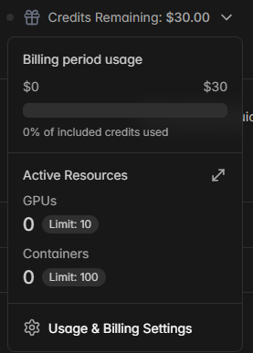
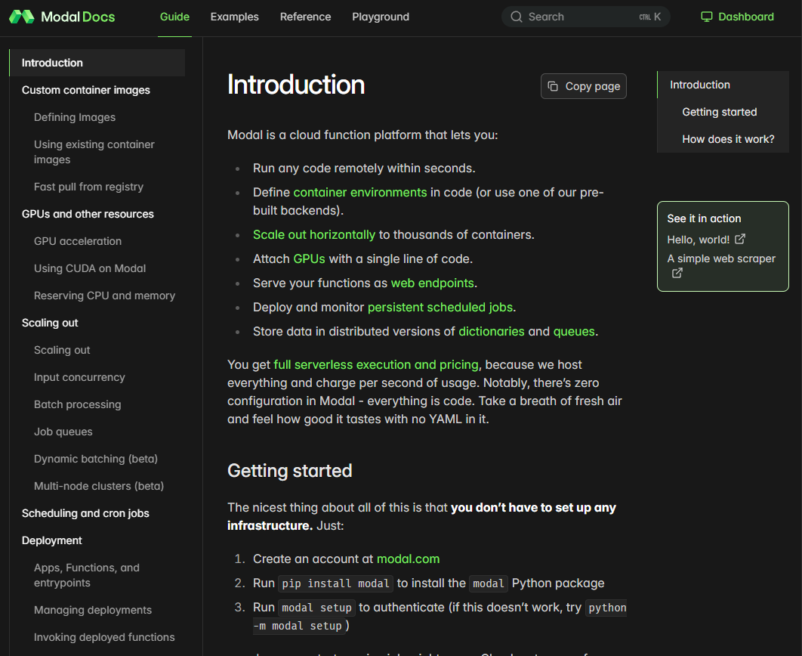
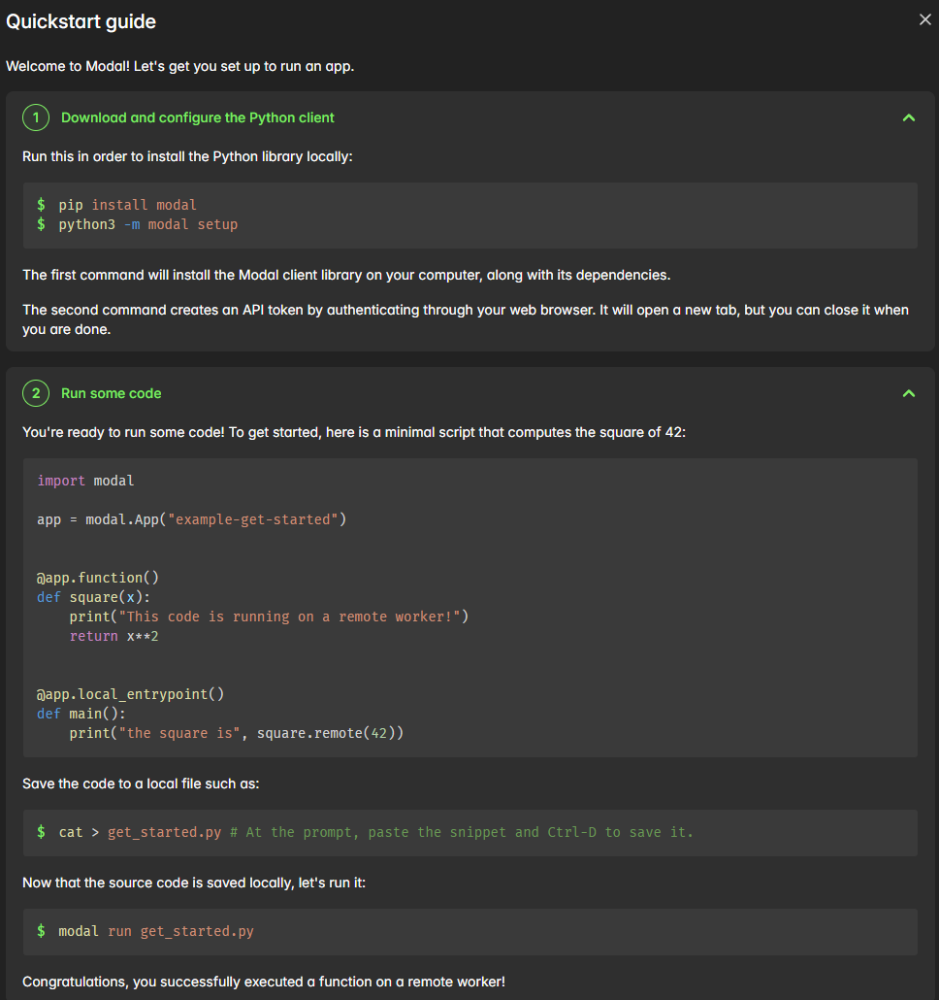
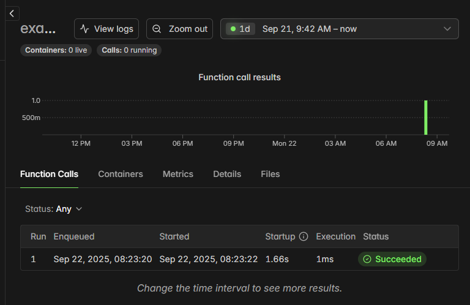
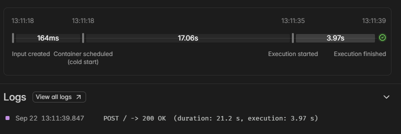
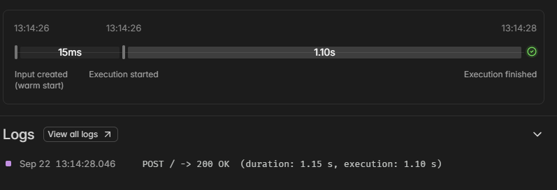
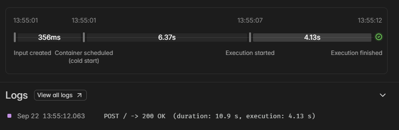

이전 글에서 다룬 **추론 최적화**에 이어 이번에는 **GPU 서버리스 추론**을 적용해 보았다.  
결과적으로  
* 콜드 스타트 포함 10초 내외 
* 콜드 스타트 제외 1초 내외  
* 요청에만 과금하여 비용 효율적 

수준의 논리 오류 수정 기능 엔드포인트를 만들 수 있었다. 

## 서버리스 추론

서버리스 추론은 인스턴스를 상시 실행하지 않고, 요청이 발생할 때 컨테이너가 동적으로 생성되어 해당 요청을 처리하는 방식이다.
내 상황에서는 AI 모델을 **데모 형태**로 활용할 예정이었기 때문에, 인스턴스를 계속 켜 두는 방식은 **비용 효율성이 떨어진다**고 판단했다.

간헐적인 요청만 처리하면 충분했기 때문에, **콜드 스타트를 포함하여 5초 이내 응답**만 보장된다면 데모로서 충분하다고 생각했다. 따라서 **요청 단위 과금형 GPU 서버리스 서비스**를 탐색했다.

### 주요 클라우드 제공 서비스 검토

* **AWS**: Lambda와 **SageMaker AI** 제공. 하지만 요청 단위 GPU 과금은 불가.
* **Google Cloud Platform**: **Vertex AI** 제공. 역시 인스턴스 단위 과금만 가능.
* **Azure**: **Azure AI Foundry** 제공. 요청 단위 GPU 과금 불가.

즉, **대형 클라우드에서는 요청 단위 GPU 서버리스**를 지원하지 않았다.

대안으로 [awesome-serverless-gpu](https://github.com/viktorfa/awesome-serverless-gpu) 레포지토리를 참고했고, 그중 **Modal.com**이 T4 GPU 가격이 저렴(초당 0.000164USD)하고 무료 크레딧을 제공해 시도해 보기로 했다.

## Modal.com 사용해보기

첫 회원가입 후 결제 수단을 등록하면 **0.5달러 추가 시 30달러 크레딧**을 제공한다.


개인, 팀, 엔터프라이즈 로 나뉘는듯하며 개인 플랜은 GPU 10개, 컨테이너 100개로 제한된다.


[문서](https://modal.com/docs/guide)또한 컨테이너, 파이썬을 어느정도 알고 있다면 무리없이 이해할 수 있도록 정리되어 있었다. 


대쉬보드 메인에는 간단한 서버리스 서비스를 만들어볼 수 있도록 안내하고 있다.  
안내하는 대로 해보았다.

### 퀵스타트 예제
```python
import modal

app = modal.App("example-get-started")

@app.function()
def square(x):
    print("This code is running on a remote worker!")
    return x**2

@app.local_entrypoint()
def main():
    print("the square is", square.remote(42))
```
안내한대로 모듈을 설치하고 파일을 만들어 `modal run get_started.py`를 실행해보자.


```powershell
PS C:\> modal run get_started.py
╭─Error─────────────────────────────────────────────────────────────────────────────────────────╮
│ Token missing. Could not authenticate client. If you have token credentials, see              │
│ modal.com/docs/reference/modal.config for setup help. If you are a new user, register an      │
│ account at modal.com, then run `modal   ││ token new`.                                        │
╰───────────────────────────────────────────────────────────────────────────────────────────────╯
```
토큰을 할당하라고 친절하게 알려준다.

```powershell
PS C:\> modal run get_started.py
✓ Initialized. View run at ---
✓ Created objects.
├── 🔨 Created mount C:\get_started.py
└── 🔨 Created function square.
This code is running on a remote worker!
the square is 1764
Stopping app - local entrypoint completed.
✓ App completed. View run at ---
```
토큰을 할당받고 다시 돌려보면 `@app.function()`가 적용된 `square()`함수가 서버리스 함수로 적용되고 `@app.local_entrypoint()`가 적용된 `main()`이 실행된 것을 볼 수 있다. 




대시보드에서도 세부실행결과를 볼수있다.

이를 통해 Modal은 요청이 들어올 때마다 **컨테이너를 실행 환경으로 띄우고 지정된 함수를 실행**하는 구조임을 확인할 수 있었다.

## 서버리스 추론 배포

### 코드 수정

* **torch.compile 비활성화**  
이전 최적화에서 사용한 **torch.compile**은 초기 지연을 증가시키는 대신 지속 지연을 줄이는 방식이다.
하지만 서버리스 환경에서는 컨테이너가 매번 새로 로드되므로, **Modal 공식 문서에서도 비활성화를 권장**한다.

### 앱 생성
Modal은 함수와 클래스를 묶어 **App 단위**로 배포한다.
기존 추론 엔드포인트가 단순했기에 App 작성은 비교적 간단했다.

```python {filename="modal_deploy.py"}
from pydantic import BaseModel
import modal

# 동작 환경 이미지를 선언 현재 파일 경로에 있는 도커파일을 통해 이미지를 만든다.
docker_image = modal.Image.from_dockerfile("Dockerfile.serverless")
# 앱 이름, 이미지를 지정
app = modal.App("coco-ai", image=docker_image)

# 추론 코드 입력 포맷
class CodeReq(BaseModel):
    code: str

# 이미지 동적 임포트, 이미지 내부에서만 임포트를 하도록 한다.
with docker_image.imports():
    from reference.wpc import WPC

# 클래스 선언
@app.cls(
    gpu="T4", # 가장 저렴한 T4를 선택했다.  
)
class Inference:

    # 컨테이너가 생성될 때 처음에만 실행되는 함수
    @modal.enter()
    def load_module(self):
        self.wpc = WPC()

    # 문제 번호와 코드를 요청받아 수정된 코드와 기존 코드를 리턴한다.
    @modal.fastapi_endpoint(method="POST")
    def run(self, p_id:str, code_req:CodeReq):
        try:
            fixed_code,generalized_code = self.wpc.process(code_req.code,p_id)
        except Exception as e:
            return {"error":e}
        return {'fixed_code':fixed_code,'bug_code':generalized_code}
```

```powershell
PS C:\> modal deploy modal_deploy.py
```
### 테스트
* 콜드스타트 포함


    이렇게 앱을 선언하고 생성한 결과 콜드스타트를 포함한 첫 요청에는 21s 장도의 응답시간이 걸렸다.

* 웜 상태


    컨테이너가 초기화된 후에 60초동안은 해당 컨테이너가 유지된다. 컨테이너가 유지될 때는 1초정도 응답시간이 걸렸다.

## 성능 최적화: 메모리/GPU 스냅샷
문서를 보니 [메모리/GPU 스냅샷](https://modal.com/docs/guide/memory-snapshot) 기능을 제공했다.
특정 시점의 메모리 및 GPU 상태를 저장해 두고, 다음 컨테이너 실행 시 이를 복원해 **콜드 스타트 시간을 단축**하는 기능이다.

```python {filename="modal_deploy.py"}
...
@app.cls(
    gpu="T4", 
    enable_memory_snapshot=True, # 메모리 스냅샷 사용
    experimental_options={"enable_gpu_snapshot": True} # gpu 스냅샷 사용
)
class Inference:
    @modal.enter(snap=True) # 해당 함수에 스냅샷 허용
    def load_module(self):
        self.wpc = WPC()
...
```


### 결과


콜드 스타트 시간이 6초로 감소하였고 콜드 스타트 시간을 포함한 첫 요청 응답시간이 10초로 단축되었다.

이 정도면 **데모 환경**에서는 충분히 실용적이라고 판단된다.