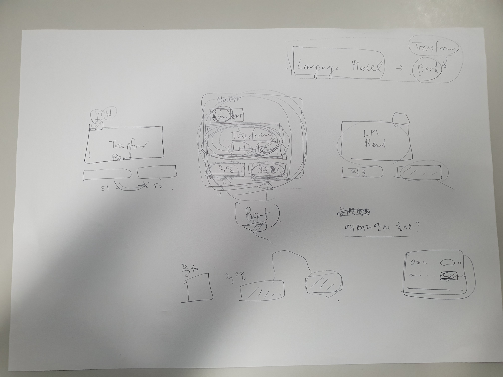

## *“코딩 초보자들은 논리적 오류를 찾기 힘들어하는구나”*

2022년 3학년 여름부터 코딩 학원에서 아르바이트를 시작했다. 주로 저학년 학생들에게 프로그래밍 언어를 가르치고, 알고리즘 문제를 함께 풀며 수업을 진행했다.

이 과정에서 느낀 점은 **학생들이 자신의 코드에서 논리적 오류를 고치는 데 큰 어려움을 겪는다**는 것이었다.
문법 오류나 런타임 오류는 에러 메시지를 통해 어느 정도 해결 방법을 제시해줄 수 있었지만, **논리적 오류는 메시지도 없고 정해진 해결 방법도 없기 때문에** 아이들이 훨씬 더 어려워했다.

이 문제를 해결해보고자, 졸업작품 주제를

> **"AI를 활용하여 논리적 오류를 찾아주는 기능을 메인으로 하는 온라인 저지 시스템 구축"**

으로 정하게 되었다.

## *“구현하기 상당히 어려운 주제인 것 같다”*

당시 인공지능 강의를 수강하고 있었기 때문에, 해당 강의 교수님에게 도움을 받아 팀 프로젝트로 이 아이디어를 구현하려고 했다.

하지만 교수님께선

> “구현하기 상당히 어려운 주제인 것 같다”

라고 조심스럽게 말씀해주셨다.  

개인적으로 꼭 하고 싶었던 주제였지만 교수님의 우려와 팀원 모두 자연어 처리에 대한 지식이 하나도 없었기 때문에 아쉬움을 뒤로한 채 주제를 **운동 플래너**로 변경하게 되었다.

> [!NOTE]
> 2025년 현재는 생성형 AI의 비약적인 발전으로, 범용 LLM API만으로도 비교적 쉽게 구현할 수 있다.  
하지만 ChatGPT가 출시된 시점이 2022년 11월이라는 점을 감안하면, 그 당시엔 **학부 수준에서 쉽게 구현할 수 있는 주제는 아니었다고 생각한다.**

## *“범위를 제한하고 최근 모델을 활용한다면 가능할 것 같다”*

운동 플래너에 대한 기획을 지도교수님께 설명드리러 갔을 때, 교수님께선

> *“이건 너무 쉬운 주제다. 다른 아이디어는 없나?”*

라고 하셨다.

마침 교수님의 연구 분야가 NLP였기에, 망설이다가 이전에 포기했던 아이디어를 조심스럽게 다시 설명드렸다.

그랬더니 예상 밖의 반응이 돌아왔다.

> *“범위를 제한하고 최근 모델을 활용한다면 가능할 것 같다”*

이 말씀에 다시 한 번 도전해볼 수 있겠다는 **희망**이 생겼다.

## *“한 번 도전해보자!”*

지도교수님께서는 활용 가능한 모델로 **BERT**를 추천해주셨다.
그리고 다음과 같은 방향으로 주제를 구체화해보라고 조언하셨다.

* 문제 유형은 **비교적 쉬운 알고리즘 문제**로 한정할 것
* 오류는 **복잡하지 않은 논리적 오류**로 좁힐 것
* 가능한 한 **많은 데이터를 수집해 학습시킬 것**

이 조언을 바탕으로,

> **COCO: COding COach – 코딩 초보자를 위한 온라인 저지 시스템**

에 대한 도전을 본격적으로 시작하게 되었다.

---

  
지도교수님께서 조언해주시면서 그려주신 그림이다.  
당시에는 이해가 잘 되지 않았었지만 지금에서야 언뜻 이해할 수 있게되었다.