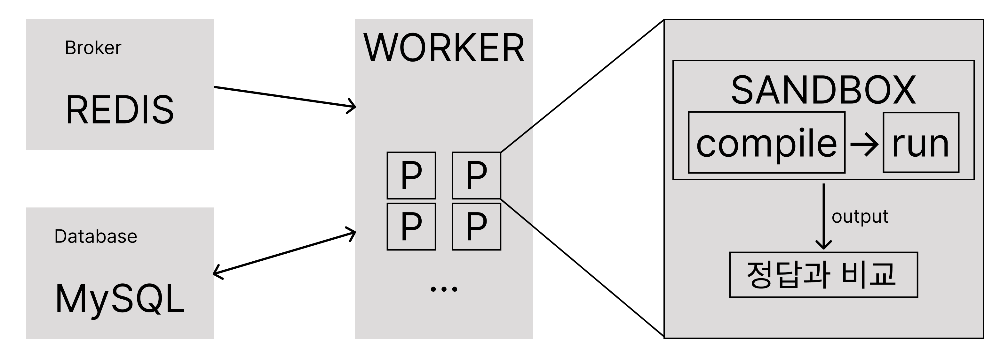

## Intro
채점 서버는 알고리즘 문제에 대해 제출된 코드를 자동으로 채점하는 중요한 서버이다.

이는 채점 서버를 설계하고 구현했던 과정을 기록한 내용이다.

## 특징
1. **다양한 언어 지원:**  
사용자의 코드가 Python, C++, Java 등 다양한 언어로 작성될 수 있기 때문에, 각 언어별로 실행 환경을 구성하고 동일한 조건에서 평가할 수 있는 체계를 갖춰야 한다.

2. **보안 격리:**  
제출된 코드가 시스템에 접근하거나 악의적인 행동을 하지 않도록, 샌드박스 환경 내에서 안전하게 실행되어야 한다.

3. **채점 정확도와 일관성:**  
테스트 케이스가 정확히 반영되어야 하며, 동일한 코드가 언제 제출되든 동일한 결과를 반환해야 한다.

4. **확장성:**  
동시 제출이 많은 경우에도 안정적인 채점이 가능하도록, 작업 큐 및 비동기 처리 기반으로 아키텍처를 설계해야 했다.