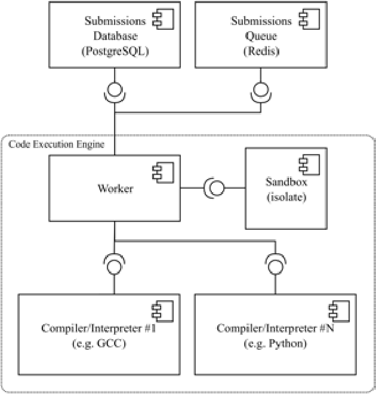

채점 서버 설계를 위해 온라인 저지 시스템 오픈소스중 하나인 `Judge0`을 중점적으로 살펴보고 다음과 같은 구조를 알 수 있었다.
1. **메인 서버**
    1.  **DB(PostgreSQL)에 제출 정보 저장 및 Job큐(Redis)에 Push**
2. **채점 서버**
    1. **Job큐(Redis)에서 Pop한 후에 제출 정보 조회 및 상태 변경**
    2.  **isolate 내에서 컴파일 → isolate 내에서 실행 파일 실행**
    3. **작업 결과 저장 및 상태 완료로 변경**

## 오픈 소스 선택

온라인 저지 시스템은 이미 다양한 오픈소스가 존재한다.

1. Judge0 https://github.com/judge0/judge0  
Judge0는 Ruby와 Docker를 활용하여 구축되었으며 자체 서버를 통해 백엔드를 구성할 수 있는 오픈소스입니다.
2. OnlineJudge https://github.com/QingdaoU/OnlineJudge  
OnlineJudge은 Vue, Django, Docker 를 활용하여 구축되었으며 프론트엔드와 백엔드 모두 제공하는 오픈소스입니다.

대표적으로 이러한 오픈소스들이 있다. 이 중 `Judge0` 오픈소스의 채점 서버 구조를 벤치마킹하였다.

## Judge0 훑어보기

### 소개

> [Judge0](https://ce.judge0.com/) (pronounced like "judge zero") is a robust, scalable, and [open-source](https://github.com/judge0/judge0) **online code execution system**. You can use it to build a wide range of applications that need online code execution features. Some examples include competitive programming platforms, e-learning platforms, candidate assessment and recruitment platforms, online code editors, online IDEs, and many more.
> 
> 
> In our research paper [Robust and Scalable Online Code Execution System](https://paper.judge0.com/), we present Judge0's modern modular architecture that can be easily deployed and scaled. We study its design, comment on the various challenges in building such systems, and compare it with other available online code execution systems and online judge systems.
> 
> To see Judge0 in action, try [Judge0 IDE](https://ide.judge0.com/) - our free and open-source online code editor.
> 

`judge0`의 설명에는 **강력하고 확장 가능한 오픈 소스 온라인 코드 실행 시스템** 이라고 설명이 되어있으며 [Robust and Scalable Online Code Execution System](https://paper.judge0.com/) 연구 논문에 `Judge0` 의 구조를 나타내고 있다. [Judge0 IDE](https://ide.judge0.com/)에서 작동 모습을 확인해 볼 수 있지만 지금 필요한 것은 내부 작동 구조의 이해이기 때문에 생략하겠다.

### 특징

> - Quick and easy [installation](https://judge0.com/#pricing)
> - Rich and verbose [API documentation](https://ce.judge0.com/)
> - Scalable architecture
> - Sandboxed compilation and execution
> - Support for [60+ languages](https://github.com/judge0/judge0#supported-languages)
> - Compilation and execution of multi-file programs
> - Support for additional files alongside the user's program
> - Support for custom user-defined compiler options, command-line arguments, and time and memory limits
> - Detailed execution results
> - Webhooks (HTTP callbacks)
> 
> For more information about these and other features, please [read the documentation](https://ce.judge0.com/).
> 

여러 특징들이 있지만 **샌드박스 컴파일 및 실행 부분**을 중점으로 구조를 파악했다.

## Judge0 설치하기

`Judge0` repo에서 제공하는 [설치 문서](https://github.com/judge0/judge0/blob/master/CHANGELOG.md#deployment-procedure)를 참고하여 설치하였다.

```bash
wget https://github.com/judge0/judge0/releases/download/v1.13.0/judge0-v1.13.0.zip
unzip judge0-v1.13.0.zip
cd judge0-v1.13.0
docker-compose up -d db redis
docker-compose up -d
```


설치가 완료된다면 http://localhost:2358/docs 에 접속하여 API문서를 확인해볼 수 있다.


## Judge0 살펴보기

### 샌드박스 컴파일 및 실행 부분

https://ce.judge0.com/dummy-client.html API문서에서 자체 Dummy Client를 제공해준다. 이 더미 클라이언트를 사용해서 한 개의 **Submission** 을 보내보고 컨테이너들의 로그를 살펴보도록 하겠다.

오른쪽 하단의 `run`을 눌러보면 요청이 보내진다.


#### server-1 컨테이너의 로그

```bash
# Submissions 생성 요청이 들어왔을 때 
 INFO -- : [cff6884a-70c5-4b7f-840c-9b066eec9391] Started POST "/submissions" for 172.19.0.1 at 2023-12-28 12:21:45 +0000
 INFO -- : [cff6884a-70c5-4b7f-840c-9b066eec9391] Processing by SubmissionsController#create as */*
 INFO -- : [cff6884a-70c5-4b7f-840c-9b066eec9391]   Parameters: {"source_code"=>"#include <stdio.h>\n\nint main(void) {\n  char name[10];\n  scanf(\"%s\", name);\n  printf(\"hello, %s\", name);\n  return 0;\n}", "language_id"=>"50", "number_of_runs"=>nil, "stdin"=>"Judge0", "expected_output"=>"hello, Judge0", "cpu_time_limit"=>nil, "cpu_extra_time"=>nil, "wall_time_limit"=>nil, "memory_limit"=>nil, "stack_limit"=>nil, "max_processes_and_or_threads"=>nil, "enable_per_process_and_thread_time_limit"=>nil, "enable_per_process_and_thread_memory_limit"=>nil, "max_file_size"=>nil, "enable_network"=>nil, "submission"=>{"source_code"=>"#include <stdio.h>\n\nint main(void) {\n  char name[10];\n  scanf(\"%s\", name);\n  printf(\"hello, %s\", name);\n  return 0;\n}", "language_id"=>"50", "stdin"=>"Judge0", "expected_output"=>"hello, Judge0", "number_of_runs"=>nil, "cpu_time_limit"=>nil, "cpu_extra_time"=>nil, "wall_time_limit"=>nil, "memory_limit"=>nil, "stack_limit"=>nil, "max_processes_and_or_threads"=>nil, "enable_per_process_and_thread_time_limit"=>nil, "enable_per_process_and_thread_memory_limit"=>nil, "max_file_size"=>nil, "enable_network"=>nil}}
DEBUG -- : [cff6884a-70c5-4b7f-840c-9b066eec9391]    (0.3ms)  BEGIN
# 요청한 언어의 정보를 조회
DEBUG -- : [cff6884a-70c5-4b7f-840c-9b066eec9391]   Language Load (0.5ms)  SELECT  "languages".* FROM "languages" WHERE "languages"."id" = $1 LIMIT $2  [["id", 50], ["LIMIT", 1]]
# 요청했던 Submissions 인지 확인
DEBUG -- : [cff6884a-70c5-4b7f-840c-9b066eec9391]   Submission Exists (0.8ms)  SELECT  1 AS one FROM "submissions" WHERE "submissions"."token" = $1 LIMIT $2  [["token", "1b69e068-9faf-4127-b97a-10b6dedd9fd3"], ["LIMIT", 1]]
# DB에 Submissions 요청 저장
DEBUG -- : [cff6884a-70c5-4b7f-840c-9b066eec9391]   Submission Create (0.5ms)  INSERT INTO "submissions" ("source_code", "language_id", "stdin", "expected_output", "status_id", "created_at", "token", "number_of_runs", "cpu_time_limit", "cpu_extra_time", "wall_time_limit", "memory_limit", "stack_limit", "max_processes_and_or_threads", "enable_per_process_and_thread_time_limit", "enable_per_process_and_thread_memory_limit", "max_file_size", "redirect_stderr_to_stdout", "enable_network") VALUES ($1, $2, $3, $4, $5, $6, $7, $8, $9, $10, $11, $12, $13, $14, $15, $16, $17, $18, $19) RETURNING "id"  [["source_code", "I2luY2x1ZGUgPHN0ZGlvLmg+CgppbnQgbWFpbih2b2lkKSB7CiAgY2hhciBu\nYW1lWzEwXTsKICBzY2FuZigiJXMiLCBuYW1lKTsKICBwcmludGYoImhlbGxv\nLCAlcyIsIG5hbWUpOwogIHJldHVybiAwOwp9\n"], ["language_id", 50], ["stdin", "SnVkZ2Uw\n"], ["expected_output", "aGVsbG8sIEp1ZGdlMA==\n"], ["status_id", 1], ["created_at", "2023-12-28 12:21:45.258220"], ["token", "1b69e068-9faf-4127-b97a-10b6dedd9fd3"], ["number_of_runs", 1], ["cpu_time_limit", "5.0"], ["cpu_extra_time", "1.0"], ["wall_time_limit", "10.0"], ["memory_limit", 128000], ["stack_limit", 64000], ["max_processes_and_or_threads", 60], ["enable_per_process_and_thread_time_limit", false], ["enable_per_process_and_thread_memory_limit", false], ["max_file_size", 1024], ["redirect_stderr_to_stdout", false], ["enable_network", false]]
DEBUG -- : [cff6884a-70c5-4b7f-840c-9b066eec9391]    (2.8ms)  COMMIT
# worker서버의 Job큐에 제출 push
 INFO -- : [cff6884a-70c5-4b7f-840c-9b066eec9391] [ActiveJob] Enqueued IsolateJob (Job ID: e6afd0bd-8ea6-438e-9785-f0731650facb) to Resque(1.13.0) with arguments: 3
 INFO -- : [cff6884a-70c5-4b7f-840c-9b066eec9391] [active_model_serializers] Rendered SubmissionSerializer with ActiveModelSerializers::Adapter::Attributes (0.46ms)
 INFO -- : [cff6884a-70c5-4b7f-840c-9b066eec9391] Completed 201 Created in 68ms (Views: 1.9ms | ActiveRecord: 17.2ms)

# Submissions 조회 요청이 들어왔을 때 
 INFO -- : [941ed383-bf7e-4748-a809-d6e5db3d0b06] Started GET "/submissions/1b69e068-9faf-4127-b97a-10b6dedd9fd3" for 172.19.0.1 at 2023-12-28 12:21:46 +0000
 INFO -- : [941ed383-bf7e-4748-a809-d6e5db3d0b06] Processing by SubmissionsController#show as */*
 INFO -- : [941ed383-bf7e-4748-a809-d6e5db3d0b06]   Parameters: {"token"=>"1b69e068-9faf-4127-b97a-10b6dedd9fd3"}
# 요청한 토큰에 맞는 Submissons 정보를 조회하여 응답
DEBUG -- : [941ed383-bf7e-4748-a809-d6e5db3d0b06]   Submission Load (0.4ms)  SELECT  "submissions".* FROM "submissions" WHERE "submissions"."token" = $1 ORDER BY "submissions"."created_at" DESC LIMIT $2  [["token", "1b69e068-9faf-4127-b97a-10b6dedd9fd3"], ["LIMIT", 1]]
 INFO -- : [941ed383-bf7e-4748-a809-d6e5db3d0b06] [active_model_serializers] Rendered SubmissionSerializer with ActiveModelSerializers::Adapter::Attributes (4.23ms)
 INFO -- : [941ed383-bf7e-4748-a809-d6e5db3d0b06] Completed 200 OK in 19ms (Views: 4.7ms | ActiveRecord: 0.4ms)
```

#### worker-1 컨테이너의 로그

```bash
# Job 큐에서 제출을 Pop 하여 작업
  INFO -- : [ActiveJob] [IsolateJob] [e6afd0bd-8ea6-438e-9785-f0731650facb] Performing IsolateJob (Job ID: e6afd0bd-8ea6-438e-9785-f0731650facb) from Resque(1.13.0) with arguments: 3
# Submissions 정보 조회
 DEBUG -- : [ActiveJob] [IsolateJob] [e6afd0bd-8ea6-438e-9785-f0731650facb]   Submission Load (0.5ms)  SELECT  "submissions".* FROM "submissions" WHERE "submissions"."id" = $1 ORDER BY "submissions"."created_at" DESC LIMIT $2  [["id", 3], ["LIMIT", 1]]
 DEBUG -- : [ActiveJob] [IsolateJob] [e6afd0bd-8ea6-438e-9785-f0731650facb]    (0.2ms)  BEGIN
# 제출 언어 정보 조회
 DEBUG -- : [ActiveJob] [IsolateJob] [e6afd0bd-8ea6-438e-9785-f0731650facb]   Language Load (0.5ms)  SELECT  "languages".* FROM "languages" WHERE "languages"."id" = $1 LIMIT $2  [["id", 50], ["LIMIT", 1]]
# Submissions 상태 진행중으로 변경
 DEBUG -- : [ActiveJob] [IsolateJob] [e6afd0bd-8ea6-438e-9785-f0731650facb]   Submission Update (0.5ms)  UPDATE "submissions" SET "status_id" = $1 WHERE "submissions"."id" = $2  [["status_id", 2], ["id", 3]]
 DEBUG -- : [ActiveJob] [IsolateJob] [e6afd0bd-8ea6-438e-9785-f0731650facb]    (10.4ms)  COMMIT
# isolate 내에서 컴파일
 Compiling submission 1b69e068-9faf-4127-b97a-10b6dedd9fd3 (3):
 isolate --cg -s -b 3 -M /var/local/lib/isolate/3/metadata.txt --stderr-to-stdout -i /dev/null -t 15.0 -x 0 -w 20.0 -k 128000 -p120 --cg-timing --cg-mem=512000 -f 4096 -E HOME=/tmp -E PATH="/usr/local/sbin:/usr/local/bin:/usr/sbin:/usr/bin:/sbin:/bin" -E LANG -E LANGUAGE -E LC_ALL -E JUDGE0_HOMEPAGE -E JUDGE0_SOURCE_CODE -E JUDGE0_MAINTAINER -E JUDGE0_VERSION -d /etc:noexec --run -- /bin/bash compile > /var/local/lib/isolate/3/compile_output.txt 
# isolate 내에서 컴파일된 실행파일 실행 
 [2023-12-28T12:21:45+00:00] Running submission 1b69e068-9faf-4127-b97a-10b6dedd9fd3 (3):
 isolate --cg -s -b 3 -M /var/local/lib/isolate/3/metadata.txt -t 5.0 -x 1.0 -w 10.0 -k 64000 -p60 --cg-timing --cg-mem=128000 -f 1024 -E HOME=/tmp -E PATH="/usr/local/sbin:/usr/local/bin:/usr/sbin:/usr/bin:/sbin:/bin" -E LANG -E LANGUAGE -E LC_ALL -E JUDGE0_HOMEPAGE -E JUDGE0_SOURCE_CODE -E JUDGE0_MAINTAINER -E JUDGE0_VERSION -d /etc:noexec --run -- /bin/bash run < /var/local/lib/isolate/3/stdin.txt > /var/local/lib/isolate/3/stdout.txt 2> /var/local/lib/isolate/3/stderr.txt 

 DEBUG -- : [ActiveJob] [IsolateJob] [e6afd0bd-8ea6-438e-9785-f0731650facb]    (0.2ms)  BEGIN
# Submissions 작업 결과 저장 및 상태 완료로 변경
 DEBUG -- : [ActiveJob] [IsolateJob] [e6afd0bd-8ea6-438e-9785-f0731650facb]   Submission Update (0.6ms)  UPDATE "submissions" SET "status_id" = $1, "stdout" = $2, "finished_at" = $3, "time" = $4, "memory" = $5, "exit_code" = $6, "wall_time" = $7 WHERE "submissions"."id" = $8  [["status_id", 3], ["stdout", "aGVsbG8sIEp1ZGdlMA==\n"], ["finished_at", "2023-12-28 12:21:45.835727"], ["time", "0.003"], ["memory", 816], ["exit_code", 0], ["wall_time", "0.003"], ["id", 3]]
 DEBUG -- : [ActiveJob] [IsolateJob] [e6afd0bd-8ea6-438e-9785-f0731650facb]    (2.7ms)  COMMIT
  INFO -- : [ActiveJob] [IsolateJob] [e6afd0bd-8ea6-438e-9785-f0731650facb] Performed IsolateJob (Job ID: e6afd0bd-8ea6-438e-9785-f0731650facb) from Resque(1.13.0) in 437.49ms
```

server-1 과 worker-1 의 로그들을 살펴본 결과 **Submissions** 이 제출되었을 때 

1. **메인 서버에서 DB에 제출 정보 저장 및 Job큐에 Push**
2. **채점 서버에서 Job큐에서 Pop한 후에 제출 정보 조회 및 상태 변경**
3. **isolate 내에서 컴파일 → isolate 내에서 실행 파일 실행**
4. **채점 서버에서  작업 결과 저장 및 상태 완료로 변경**

대략적으로 위의 순서로 진행되는 것을 알 수 있었다.

이는 오픈소스의 연구논문인 [Robust and Scalable Online Code Execution System](https://paper.judge0.com/) 을 통해서도 확인할 수 있다.




## 정리

위 내용들을 정리하면 `judge0`에서는 제출이 생성되었을 때 내부에서 아래와 같은 순서로 동작하게된다.

1. **메인 서버**
    1.  **DB(PostgreSQL)에 제출 정보 저장 및 Job큐(Redis)에 Push**
2. **채점 서버**
    1. **Job큐(Redis)에서 Pop한 후에 제출 정보 조회 및 상태 변경**
    2.  **isolate 내에서 컴파일 → isolate 내에서 실행 파일 실행**
    3. **작업 결과 저장 및 상태 완료로 변경**

이를 통해 `Judge0` 에서 제출이 생성되었을 때 내부에서 어떻게 동작하는지 알 수 있었다.

이 구조를 참고하여 채점 서버 설계를 하였다.