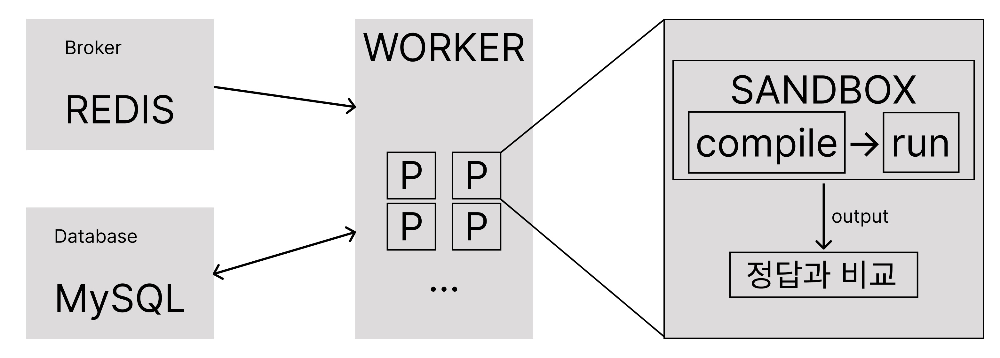

## 1. 아키텍처 설계

`judge0` 분석을 통해 **샌드박스 컴파일 및 실행** 부분의 실마리를 얻었다.

1. **메인 서버**
    1.  **DB(PostgreSQL)에 제출 정보 저장 및 Job큐(Redis)에 Push**
2. **채점 서버**
    1. **Job큐(Redis)에서 Pop한 후에 제출 정보 조회 및 상태 변경**
    2.  **isolate 내에서 컴파일 → isolate 내에서 실행 파일 실행**
    3. **작업 결과 저장 및 상태 완료로 변경**

이를 통해 간단하게 구조를 설계했다.



이 구조에서 구현하기 위해 필요한 도구(오픈소스, 패키지)들이 있다.

|  | DB | worker | sandbox | borker |
| --- | --- | --- | --- | --- |
| Judge | PostgreSQL | Ruby on Rails Active job | Isolate | Redis |
| COCO | MySQL | Celery | Isolate | Redis |

sandbox와 broker는 같은 도구를 사용하도록 했으며 DB는 익숙한 **MySQL**을 사용, worker의 경우 Python의 Job Queue 도구인 **Celery**를 사용하여 구현하기로 했다.

## 2. 데이터베이스 설계

`judge0`의 DB스키마를 참조하여 데이터베이스를 설계하도록 하겠다.

`judge0`의 DB스키마 정보는 [API문서](https://ce.judge0.com/#submissions-submission)에 잘 설명이 되어있다.

| 1 | source_code | text | Program’s source code. |
| --- | --- | --- | --- |
| 2 | language_id | integer | Language ID. |
| 3 | compiler_options | string (max. 512 chars) | Options for the compiler (i.e. compiler flags). |
| 4 | command_line_arguments | string (max. 512 chars) | Command line arguments for the program. |
| 5 | stdin | text | Input for program. |
| 6 | expected_output | text | Expected output of program. Used when you want to compare with stdout. |
| 7 | cpu_time_limit | float | Default runtime limit for every program. Time in which the OS assigns the processor to different tasks is not counted. |
|  |  | … |  |
| 33 | memory | float | Memory used by the program after execution. |

`judge0`에서는 총 33개의 속성이 존재한다.

- 1 ~ 20 : 새로운 제출을 생성할 때 사용
- 21 ~ 33 : 제출 실행 후 결과에 대한 자세한 정보에 사용
- 7 ~ 18 : [*구성 변수*](https://ce.judge0.com/#system-and-configuration-configuration-info) 라고 하며 시간 및 메모리 제한과 같은 제출 런타임 제약 조건을 구성하는 데 사용

이처럼 코드 채점에 필요한 속성뿐만이 아니라 다른 도메인에서의 확장성을 생각해서 다양한 속성을 가지고 있다는 것을 알 수 있다. 

하지만 **COCO**에서는 채점에 필요한 속성만 존재하면 되기 때문에 이러한 여러가지 속성 중에서 꼭 필요하다고 생각되는 속성들만 가져와서 스키마를 구성했다.

```sql
/* 초기 스키마 설계 */
CREATE TABLE IF NOT EXISTS `submissions` (
  `id` int NOT NULL AUTO_INCREMENT,
  `status_id` int DEFAULT NULL,
  `code` text,
  `time` datetime DEFAULT NULL,
  `message` varchar(45) DEFAULT NULL,
  `num_of_tc` tinyint DEFAULT NULL,
  `status` tinyint DEFAULT NULL,
  `stdout` text DEFAULT NULL,
  `stderr` text DEFAULT NULL,
  `lang` int DEFAULT NULL,
  `used_memory` int DEFAULT NULL,
  `used_time` float DEFAULT NULL,
  PRIMARY KEY (`id`)
)

/* 틀린 TC정보 조회 기능 추가 후 스키마 설계 */
CREATE TABLE IF NOT EXISTS `submissions` (
  `id` int NOT NULL AUTO_INCREMENT,
  `status_id` int DEFAULT NULL,
  `code` text,
  `time` datetime DEFAULT NULL,
  `message` varchar(45) DEFAULT NULL,
  `num_of_tc` tinyint DEFAULT NULL,
  `status` tinyint DEFAULT NULL,
  `lang` int DEFAULT NULL,
  `used_memory` int DEFAULT NULL,
  `used_time` float DEFAULT NULL,
  PRIMARY KEY (`id`)
)
CREATE TABLE IF NOT EXISTS `sub_detail` (
  `sub_id` int NOT NULL,
  `tc_num` int NOT NULL,
  `status` tinyint NOT NULL,
  `stdout` text DEFAULT NULL,
  `stderr` text DEFAULT NULL,
  PRIMARY KEY (`sub_id`,`tc_num`)
)
```

초기 스키마 설계 이후에 틀린 TC정보 조회 기능이 추가되면서 스키마가 약간 수정되었다. 틀린 TC정보 조회 기능에 대한 포스트는 나중에 작성하려 한다.

## 3. 정리

### 아키텍처


### DB

```jsx
/* 초기 스키마 설계 */
CREATE TABLE IF NOT EXISTS `submissions` (
  `id` int NOT NULL AUTO_INCREMENT,
  `status_id` int DEFAULT NULL,
  `code` text,
  `time` datetime DEFAULT NULL,
  `message` varchar(45) DEFAULT NULL,
  `num_of_tc` tinyint DEFAULT NULL,
  `status` tinyint DEFAULT NULL,
  `stdout` text DEFAULT NULL,
  `stderr` text DEFAULT NULL,
  `lang` int DEFAULT NULL,
  `used_memory` int DEFAULT NULL,
  `used_time` float DEFAULT NULL,
  PRIMARY KEY (`id`)
)
```

기본적인 초기 설계는 이처럼 마무리하고 구현에 들어갔다.