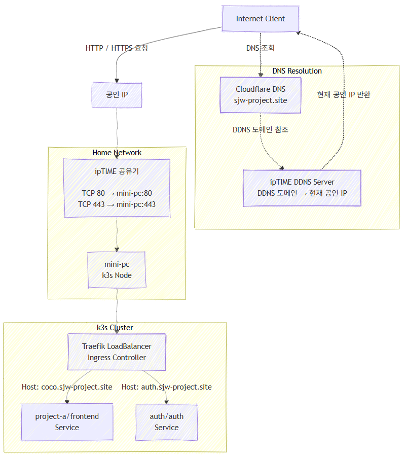
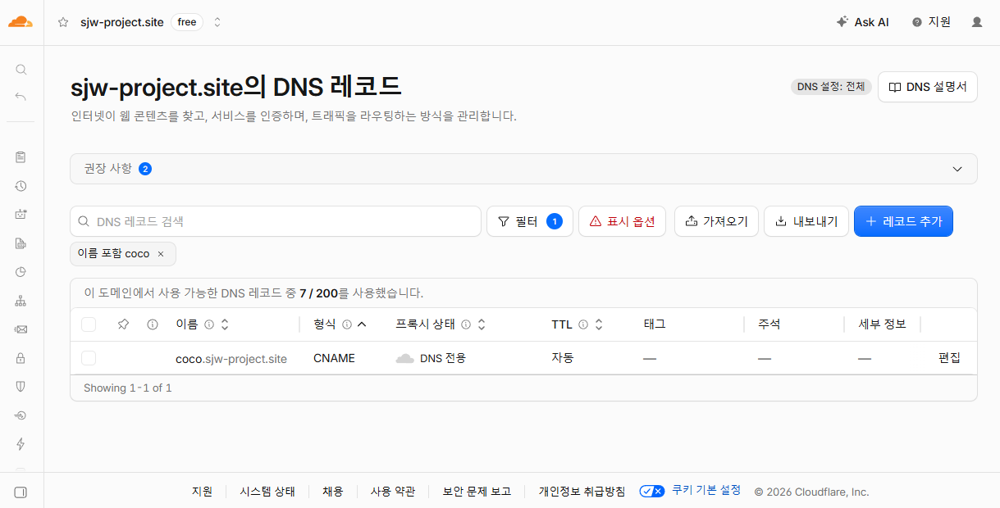
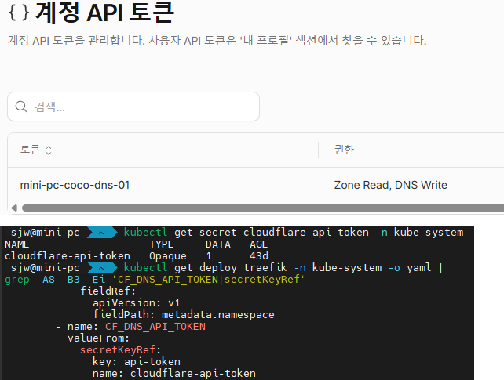
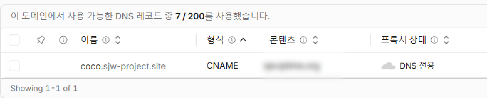

## 들어가며

졸업 작품인 [coco.sjw-project.site](https://styughjvbn.github.io/blog/article/%ED%99%88%EC%84%9C%EB%B2%84/%EC%A1%B8%EC%97%85%EC%9E%91%ED%92%88-%EB%B0%B0%ED%8F%AC/)는 처음에 k3s 클러스터에서 HTTP로만 서비스하고 있었다.

외부 요청은 공유기 포트포워딩을 통해 프런트엔드의 NodePort로 직접 전달했으며, 주소로 서비스에 접근했다.

기능 확인에는 문제가 없었지만 다음과 같은 한계가 있었다.

* HTTPS를 지원하지 않음
* 보안 경고가 브라우저에서 표시됨
* 새로운 서브도메인을 추가할 때 동일한 구성을 재사용하기 어려움

이 문제를 해결하기 위해 외부 트래픽의 진입점을 Traefik으로 통일하고, Let’s Encrypt 인증서를 자동으로 발급·갱신하도록 구성했다.

처음에는 HTTP-01 방식으로 인증서를 발급하려 했지만 공유기의 해외 IP 차단 때문에 검증에 실패했다. 해외 IP 차단을 포기하고 싶지 않았기 때문에 다른 방법을 알아봤고 이후 Cloudflare DNS API를 이용하는 DNS-01 방식으로 전환했다.

이 글에서는 다음 과정을 정리한다.

* NodePort 직접 노출 구조를 Traefik 중심 구조로 변경
* HTTP-01 인증서 발급 실패 원인 분석
* Cloudflare DNS-01 방식으로 전환
* Cloudflare API Token을 Kubernetes Secret으로 관리
* Traefik에서 인증서 자동 발급 및 갱신 구성
* HTTP 요청을 HTTPS로 리다이렉트
* DNS, 인증서, Traefik 설정 검증

## 1. 기존 서비스 구조

초기 외부 접속 구조는 다음과 같았다.

```text
Internet
  |
  | coco.sjw-project.site
  v
Gabia DNS
  |
  | ddns domain
  v
ipTIME DDNS server
  |
  | <공인 IP>
  v
ipTIME 공유기
  |
  | TCP 80 -> <mini-pc IP>:30081
  v
mini-pc / k3s node
  |
  v
frontend NodePort
```

공유기의 외부 80번 포트가 이 NodePort로 직접 전달되기 때문에 외부 요청은 Traefik을 거치지 않았다.

이 구조는 서비스 하나를 빠르게 공개하기에는 단순하지만 다음 문제가 있다.

* 도메인별 라우팅을 Traefik에서 관리할 수 없음
* TLS 종료 지점을 구성하기 어려움
* 서비스가 늘어날수록 포트포워딩 규칙이 증가함
* 별도의 HTTPS 를 적용해도 인증서 자동 발급을 Ingress 계층에 일관되게 적용하기 어려움

NodePort는 내부 점검용으로 유지하되, 운영 트래픽은 Traefik으로 통일하기로 했다.


## 2. 변경된 구조

변경 후 구조는 다음과 같다.



외부 운영 트래픽은 모두 Traefik의 80번과 443번 포트로 들어오도록 구성했다.

프런트엔드 NodePort `30081`은 내부 확인용으로만 유지했다.

이 구조에서 각 구성 요소의 역할은 다음과 같다.

* 공유기
  * 외부 80, 443 포트를 k3s 노드로 전달
* Traefik
  * 도메인별 라우팅
  * HTTP에서 HTTPS로 리다이렉트
  * TLS 종료
  * Let’s Encrypt 인증서 발급 및 갱신
* Cloudflare
  * DNS 레코드 관리
  * DNS-01 검증용 TXT 레코드 생성
* Kubernetes Ingress
  * 호스트와 Service 연결


## 3. 첫 번째 시도: HTTP-01 인증서 발급

외부 트래픽을 Traefik으로 통일한 뒤 Let’s Encrypt HTTP-01 방식으로 인증서를 발급하려 했다.

HTTP-01 방식은 Let’s Encrypt 검증 서버가 다음 경로로 직접 접근해 소유권을 확인한다.

```text
http://coco.sjw-project.site/.well-known/acme-challenge/...
```

그러나 인증서 발급은 실패했다.

Traefik 로그에서 다음과 같은 내용을 확인했다.

```bash
Unable to obtain ACME certificate
Timeout during connect
Fetching http://coco.sjw-project.site/.well-known/acme-challenge/...
```

처음에는 다음 항목들을 의심했다.

* 공유기 80번 포트포워딩 오류
* 방화벽 차단
* Traefik Ingress 라우팅 오류
* DNS 레코드 불일치
* 애플리케이션 Service 연결 오류

하지만 80번 포트와 Traefik 라우팅 자체는 정상적으로 동작하고 있었다.

원인은 공유기에서 설정한 **해외 IP 접속 차단**이었다.

### HTTP-01 방식의 문제

해외 IP 접속 차단을 해제한다면 인증서 발금은 가능하지만 여러 문제가 존재했다.

* 인증서 발급과 갱신을 위해 외부 80번 포트 접근이 필요함
* 해외 IP 차단을 유지하면 검증 요청이 실패할 수 있음
* 갱신 시점마다 차단을 수동으로 해제하는 방식은 자동화라고 보기 어려움
* Let’s Encrypt 검증 서버 IP를 고정된 allowlist로 관리하기 어려움

이 때문에 HTTP-01 대신 DNS-01 방식을 사용하기로 했다.

## 4. DNS-01 방식으로 전환

DNS-01 방식에서는 Let’s Encrypt가 웹 서버에 직접 접속하지 않는다.

대신 도메인의 DNS에 다음과 같은 TXT 레코드가 존재하는지 확인한다.

```text
_acme-challenge.coco.sjw-project.site
```

전체 과정은 다음과 같다.

1. Traefik이 Let’s Encrypt에 인증서를 요청한다.
2. Traefik이 Cloudflare API를 호출한다.
3. Cloudflare DNS에 `_acme-challenge` TXT 레코드가 생성된다.
4. Let’s Encrypt가 TXT 레코드를 조회한다.
5. 검증이 완료되면 인증서가 발급된다.
6. Traefik이 TXT 레코드를 정리한다.
7. 인증서 정보는 `/data/acme.json`에 저장된다.

DNS-01 방식의 장점은 다음과 같다.

* 외부 80번 포트 접근이 필요하지 않음
* 공유기의 해외 IP 차단 정책과 충돌하지 않음
* 인증서 자동 갱신 가능
* 와일드카드 인증서에도 사용할 수 있음
* 웹 애플리케이션의 상태와 인증서 검증이 분리됨

이번 구성에서는 도메인 등록은 기존 등록 업체에 유지하고, 권한 있는 네임서버만 Cloudflare로 변경했다.

```bash
sjw@mini-pc  ~  dig +short NS sjw-project.site
quentin.ns.cloudflare.com.
eve.ns.cloudflare.com.
```



## 5. Cloudflare API Token 생성

Traefik이 DNS-01 검증을 수행하려면 Cloudflare DNS 레코드를 생성하고 삭제할 권한이 필요하다.

Global API Key 대신 권한 범위를 제한할 수 있는 API Token을 사용했다.

필요한 권한은 다음과 같이 구성했다.

* Zone: Read
* DNS: Edit
* Zone Resource: `sjw-project.site`

권한 범위를 특정 Zone으로 제한해 다른 도메인의 DNS 레코드에는 접근할 수 없도록 했다.

API Token은 Git 저장소나 Traefik 설정 파일에 직접 작성하지 않았다. Kubernetes Secret으로 생성했다.

```bash
sjw@mini-pc  ~  kubectl create secret generic cloudflare-api-token \
  -n kube-system \
  --from-literal=api-token='CLOUDFLARE_API_TOKEN'
```

생성 여부 확인:

```bash
sjw@mini-pc  ~  kubectl get secret cloudflare-api-token -n kube-system
```

Secret의 원문은 출력하지 않고 Traefik Deployment의 참조 관계만 확인했다.

```bash
sjw@mini-pc  ~  kubectl get deploy traefik -n kube-system -o yaml |
grep -A8 -B3 -Ei 'CF_DNS_API_TOKEN|secretKeyRef'
```




## 6. Traefik DNS-01 설정

k3s 기본 Traefik의 설정은 `HelmChartConfig`를 통해 관리했다.

핵심 설정은 다음과 같다.

```yaml
apiVersion: helm.cattle.io/v1
kind: HelmChartConfig
metadata:
  name: traefik
  namespace: kube-system
spec:
  valuesContent: |-
    additionalArguments:
      - --certificatesresolvers.default.acme.email=<ACME 이메일>
      - --certificatesresolvers.default.acme.storage=/data/acme.json
      - --certificatesresolvers.default.acme.dnschallenge.provider=cloudflare
      - --certificatesresolvers.default.acme.dnschallenge.resolvers=1.1.1.1:53,1.0.0.1:53

      - --entrypoints.websecure.http.tls=true
      - --entrypoints.websecure.http.tls.certresolver=default

      # 모든 HTTP 요청을 HTTPS로 리다이렉트
      - --entrypoints.web.http.redirections.entrypoint.to=:443
      - --entrypoints.web.http.redirections.entrypoint.scheme=https
      - --entrypoints.web.http.redirections.entrypoint.permanent=true
```

각 항목의 역할은 다음과 같다.

* `certificatesresolvers.default`

  * 인증서 Resolver 이름을 `default`로 정의한다.
* `acme.email`

  * ACME 계정에 사용할 이메일 주소다.
* `acme.storage`

  * 인증서와 ACME 계정 데이터를 저장할 경로다.
* `dnschallenge.provider=cloudflare`

  * Cloudflare DNS API를 이용해 DNS-01 검증을 수행한다.
* `dnschallenge.resolvers`

  * TXT 레코드 전파를 확인할 DNS Resolver다.

Cloudflare API Token은 같은 설정에서 Secret으로 주입했다.

## 7. HTTPS Ingress 설정

`coco.sjw-project.site`의 HTTPS Ingress 전체 구조는 다음과 같다.

```yaml
apiVersion: networking.k8s.io/v1
kind: Ingress
metadata:
  name: frontend-https
  namespace: project-a
  annotations:
    traefik.ingress.kubernetes.io/router.entrypoints: websecure
spec:
  ingressClassName: traefik
  rules:
    - host: coco.sjw-project.site
      http:
        paths:
          - path: /
            pathType: Prefix
            backend:
              service:
                name: frontend
                port:
                  number: 80
```

## 9. Cloudflare Proxy가 활성화된 레코드

Cloudflare 네임서버로 전환한 직후 DNS 레코드 구성 과정에서 문제가 발생했다.

`coco.sjw-project.site`는 Cloudflare Proxy가 활성화된 CNAME 상태로 남아 있었다.

이 경우 요청 흐름은 다음과 같이 바뀐다.

```text
사용자
  → Cloudflare Edge
  → 원본 Traefik
```

하지만 현재 공유기는 해외 IP 접근을 차단하고 있다.

Cloudflare Proxy를 사용하면 원본 서버에는 사용자의 실제 IP가 아니라 Cloudflare 서버 IP에서 요청이 들어오는 것처럼 보일 수 있다. 이 요청이 해외 IP 차단 정책에 의해 막히면서 접속 문제가 발생했다.

따라서 현재 환경에서는 Cloudflare Proxy를 사용하지 않고 DNS 관리 기능만 사용하기로 했다.

### Cloudflare Proxy와 DNS-01의 관계

Cloudflare Proxy를 끈다고 해서 DNS-01 인증서 발급이 중단되는 것은 아니다.

두 기능은 서로 다르다.

* Cloudflare Proxy

  * 사용자 트래픽을 Cloudflare Edge를 통해 전달
* Cloudflare DNS API

  * DNS 레코드 생성·수정·삭제
* DNS-01

  * `_acme-challenge` TXT 레코드로 도메인 소유권 검증




## 10. HTTPS 및 인증서 검증

브라우저의 자물쇠 아이콘만으로는 인증서 설정을 충분히 검증할 수 없다.

다음 항목을 명령어로 확인했다.

* 인증서 발급자
* 인증서 유효기간
* Subject Alternative Name
* HTTP 응답 코드
* TLS 검증 결과
* 실제 접속 IP

### OpenSSL로 인증서 확인

```bash
sjw@mini-pc  ~  DOMAIN=coco.sjw-project.site

echo | openssl s_client \
  -connect "$DOMAIN:443" \
  -servername "$DOMAIN" 2>/dev/null |
openssl x509 -noout \
  -subject \
  -issuer \
  -startdate \
  -enddate \
  -ext subjectAltName

subject=CN = coco.sjw-project.site
issuer=C = US, O = Let's Encrypt, CN = YR1
notBefore=Jun 15 21:36:00 2026 GMT
notAfter=Sep 13 21:35:59 2026 GMT
X509v3 Subject Alternative Name:
    DNS:coco.sjw-project.site
```

확인 항목:

* issuer가 Let’s Encrypt 계열인지
* SAN에 `coco.sjw-project.site`가 포함되는지
* 만료일이 지나지 않았는지
* `TRAEFIK DEFAULT CERT`가 아닌지

### curl로 TLS 검증

```bash
sjw@mini-pc  ~  curl -sS -o /dev/null \
  -w 'HTTP=%{http_code}\nTLS=%{ssl_verify_result}\n' \
  https://coco.sjw-project.site
HTTP=200
TLS=0
```

## 11. 적용 결과

기존에는 `coco.sjw-project.site`가 HTTP만 지원했다.

```text
http://coco.sjw-project.site
```

변경 후에는 HTTP 요청이 HTTPS로 리다이렉트되고, Traefik이 Let’s Encrypt 인증서를 제공한다.

```text
http://coco.sjw-project.site
  → https://coco.sjw-project.site
```

서비스가 추가될 때마다 다음 항목만 구성하면 동일한 HTTPS 구조를 재사용할 수 있다.

1. Cloudflare DNS CNAME 레코드
2. HTTPS Ingress
3. `websecure` EntryPoint

인증서는 서비스별로 직접 발급하거나 수동 교체하지 않는다.

Traefik이 다음 작업을 담당한다.

* 인증서 최초 발급
* DNS-01 Challenge 수행
* 인증서 저장
* 인증서 갱신
* HTTPS 요청 처리


## 12. 배운 점

### 보안 정책이 자동화 방식과 충돌할 수 있다

해외 IP 차단은 원본 서버 보호에는 도움이 됐지만 HTTP-01 검증과 충돌했다.

보안 정책을 단순히 해제하는 대신 인증서 검증 방식을 DNS-01로 변경했다.

문제를 우회한 것이 아니라 운영 요구사항에 맞는 방식으로 구조를 변경한 것이다.

### Cloudflare Proxy와 Cloudflare DNS API는 다른 기능이다

Cloudflare Proxy를 사용하지 않더라도 Cloudflare DNS API는 사용할 수 있다.

현재 구성에서 Cloudflare는 다음 역할만 담당한다.

* 권한 있는 DNS 서버
* CNAME 레코드 관리
* DNS-01 TXT 레코드 생성과 삭제

사용자 HTTPS 트래픽은 Cloudflare Edge를 거치지 않고 직접 Traefik으로 들어온다.

### 인증서가 현재 정상이라는 것만으로 자동 갱신을 증명할 수는 없다

OpenSSL에서 유효한 인증서가 보인다는 것은 현재 인증서가 있다는 의미다.

자동 갱신이 가능한 구조인지 판단하려면 다음 항목을 함께 확인해야 한다.

* ACME Resolver 설정
* Cloudflare DNS Provider 설정
* API Token Secret 연결
* Ingress의 `certresolver`
* `/data/acme.json` 영구 저장
* Traefik ACME 오류 로그

## 마무리

이번 작업은 단순히 HTTP 주소를 HTTPS로 변경하는 과정이 아니었다.

기존에는 공유기의 외부 포트가 프런트엔드 NodePort로 직접 연결되어 있었다. 이를 Traefik 중심 구조로 바꾸고, HTTP-01 인증서 발급 실패 원인을 분석한 뒤 Cloudflare DNS-01 방식으로 전환했다.

최종 구조는 다음과 같다.


이 과정에서 다음 내용을 직접 확인했다.

* 공유기 포트포워딩과 Ingress 경로의 관계
* HTTP-01 검증과 해외 IP 차단의 충돌
* Cloudflare DNS-01 Challenge 구성
* Kubernetes Secret을 이용한 API Token 주입
* Traefik ACME Resolver와 Ingress 연결
* OpenSSL과 curl을 이용한 인증서 검증
* 인증서 저장소의 영속성

결과적으로 새로운 서비스를 추가할 때마다 인증서를 수동 발급하지 않고, 공통 Traefik 설정과 Ingress annotation을 이용해 HTTPS를 적용할 수 있는 구조를 만들었다.
