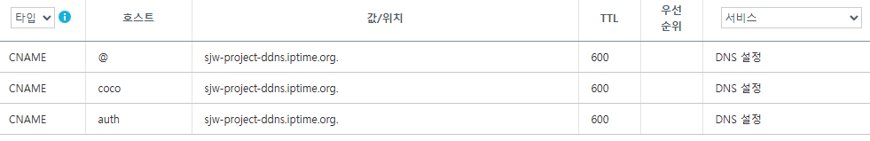
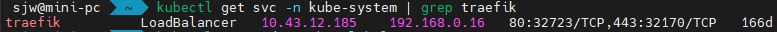

## 1. 적용 전 상황

### 1.1 인프라 환경

- 개인 홈서버 (mini-pc)
- k3s 단일 노드 클러스터
- 공유기: iptime
- 외부 DNS: 가비아
- DDNS: iptime 제공 도메인 사용
- 서비스 목적: 프로젝트 데모 운영

### 1.2 네트워크 흐름 (적용 전)

```

브라우저
↓
sjw-project.site (DNS)
↓
iptime DDNS
↓
공유기 포트포워딩
↓
mini-pc:30071
↓
k8s NodePort Service (frontend)

```

- 외부 포트 `80` → mini-pc `30071`로 포워딩
- demo-a 프로젝트의 frontend가 NodePort로 직접 노출됨
- 서브도메인(`coco.sjw-project.site`)을 추가하더라도
  **포트 기준 포워딩 한계로 인해 서비스 분기 불가능**

### 1.3 k8s Service 구성 (project-a 네임스페이스)

```

frontend   NodePort   80:30071

```

### 1.4 문제점 요약

- NodePort 직접 노출 구조
- 외부 80 포트가 특정 서비스에 고정
- 다중 데모 서비스, SSO, 서브도메인 기반 접근 불가
- HTTP 레벨에서 요청 분기 불가능

## 2. 설계 목표

1. 외부 80/443 포트를 Ingress로 집중
2. Host 기반(`*.sjw-project.site`) 서비스 분기
3. 기존 NodePort 서비스는 유지 (백업 경로)
4. 이후 SSO, 통합 로그인 확장을 고려한 구조 확보

## 3. 적용 과정

### 3.1 가비아 DNS 서브도메인 등록

졸업프로젝트 전용 서브 도메인을 등록함

### 3.2 포트포워딩 구조 전환

#### 변경 전
```

외부 80 → mini-pc:30071 (frontend NodePort)

```

#### 변경 후
```

외부 80   → mini-pc:80    (Ingress)
외부 443  → mini-pc:443   (Ingress)
외부 30071 → mini-pc:30071 (기존 frontend 유지)

```

- 외부 80/443을 Traefik Ingress가 수신하도록 전환
- 기존 demo 접근 경로는 `:30071`로 유지하여 무중단 전환

### 3.2 Ingress Controller 확인



- k3s 기본 Traefik 사용
- `kube-system` 네임스페이스에서 Traefik Pod 및 Service 확인
- Traefik이 80/443 포트를 리슨 중임을 확인


### 3.3 Ingress 전용 ClusterIP Service 추가

기존 NodePort Service는 변경하지 않고,  
Ingress가 참조할 **내부 전용 Service**를 추가함.

#### frontend-ingress Service

```yaml
apiVersion: v1
kind: Service
metadata:
  name: frontend-ingress
  namespace: project-a # 졸업프로젝트 네임스페이스
spec:
  type: ClusterIP
  selector:
    app: frontend
  ports:
  - port: 80
    targetPort: 80
```

* 역할 분리:

  * NodePort: 직접 접근/백업
  * ClusterIP: Ingress 전용

### 3.4 Ingress 리소스 생성

#### coco.sjw-project.site → demo-a frontend

```yaml
apiVersion: networking.k8s.io/v1
kind: Ingress
metadata:
  name: frontend
  namespace: project-a
spec:
  rules:
  - host: coco.sjw-project.site
    http:
      paths:
      - path: /
        pathType: Prefix
        backend:
          service:
            name: frontend-ingress
            port:
              number: 80
```

## 4. 적용 후 구조

### 4.1 네트워크 흐름 (적용 후)

```
브라우저
  ↓
coco.sjw-project.site
  ↓
iptime DDNS
  ↓
공유기 포트포워딩 (80/443)
  ↓
Traefik Ingress
  ↓
Host 기준 라우팅
  ↓
frontend-ingress (ClusterIP)
  ↓
frontend Pod
```

### 4.2 접근 경로 정리

| 경로                                                             | 용도             |
| -------------------------------------------------------------- | -------------- |
| [http://coco.sjw-project.site](http://coco.sjw-project.site)   | 메인 데모 접근       |
| [http://sjw-project.site:30071](http://sjw-project.site:30071) | 기존 NodePort 백업 |

## 5. 구조적 장점

### 5.1 확장성

* demo-b, demo-c 추가 시 Ingress rule만 추가
* 포트포워딩 추가 불필요
* 서브도메인 단위 서비스 분리 가능

### 5.2 안정성

* NodePort 백업 경로 유지
* Ingress 장애 시 즉시 우회 가능

### 5.3 향후 SSO/통합 로그인 확장 용이

* `auth.sjw-project.site` 추가 가능
* Cookie 기반 인증 공유 구조 설계 가능
* 상단바 Inject, 통합 네비게이션 구현 가능


## 6. 이후 확장 아이디어

* auth 서버 (OIDC or 자체 토큰)
* Traefik Middleware로:

  * 공통 Header 주입
  * 인증 여부 체크
* 블로그 → 데모 접근 시 임시 티켓 발급
* 데모 간 빠른 이동 UI 제공


## 7. 핵심 정리

* **외부 포트는 하나(Ingress)로 모은다**
* **서비스 분기는 HTTP 레벨에서 처리한다**
* **NodePort는 제거가 아니라 역할 분리다**
* 개인 홈서버 환경에서는

  > 단순함 + 되돌릴 수 있음
  > 이 가장 중요한 설계 기준이다