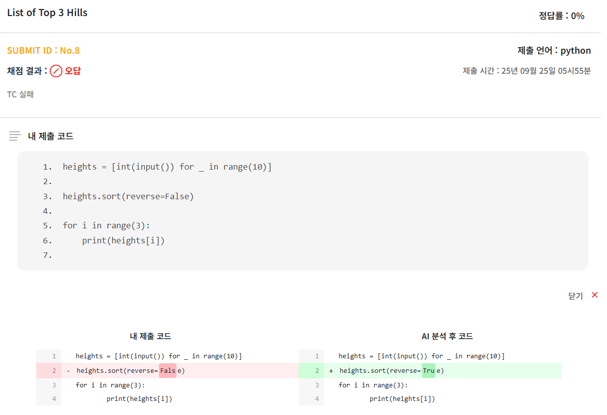
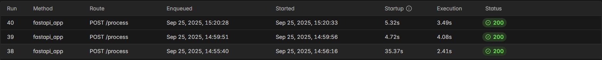

이번에는 저번에 논리 오류 수정 모델을 [서버리스 추론으로 적용시켰던 것](../../../../article/졸업작품/논리-오류-수정/서버리스-추론)을 데모사이트에 연결해보았다.
이로써 졸업작품 데모 사이트를 완성할 수 있었다. 다시 배포하며 개선할 점이 많이 보이기도 했으니 차차 개선해 나갈 생각이다.

## 적용 방법

과거에 AI 기능을 붙였던 방식과 동일하게 접근했다.

먼저, 프로젝트 내부에서 논리 오류 수정 기능을 담당하는 **WPC 폴더를 FastAPI 파드의 `hostPath`로 지정된 plugin 폴더에 옮겨** 주었다.

이 기능은 외부 서버로 요청을 보내고 응답을 받아오는 구조이므로, 모델이 서빙되는 URL을 설정 파일에 추가한다.

```python {base_url="https://github.com/PDA-PRO/COCO-plugin/blob/main/wpc/",filename="config.py"}
WPC_URL="https://----"
```

플러그인 동작을 살펴보면 `/hello`에서 테스트를, `/process`에서 실제 추론을 담당한다. 따라서 서버리스 추론 쪽에서도 동일하게 엔드포인트를 만들어주어야 한다.

```python {base_url="https://github.com/PDA-PRO/COCO-plugin/blob/main/wpc/",filename="main.py"}
...

class Plugin(AbstractPlugin):
    router_path='/wpc'
    feature_docs='TC 판별 중 틀린 코드에 대해, 틀린 부분을 찾아 고쳐주는 AI'
    base='GraphCodeBERT기반 제작 WPC AI 모델'
    
    class TableModel(AbstractPlugin.AbstractTable):
        __key__='sub_id'
        __tablename__='wpc'
        sub_id:int
        status:int
        result:str
        raw_code:str
        
    @staticmethod
    def test():
        res=None
        try:
            res= requests.get(config.WPC_URL+'/hello')
            print(res.content)
        except:
            return False
        
        return 1
        
    @staticmethod
    def endpoint_main(sub_id:int,task_id:int, ...):
            ... 
                wpc_result=requests.post(config.WPC_URL+'/process',params={"p_id":wpc_desc_id},json={"code":sub_data[0]["code"]})
                wpc_result=wpc_result.json()
            ...
```


## 추론 엔드포인트 수정

기존에는 루트 엔드포인트 하나에서만 추론을 담당하도록 작성해 두었다.

```python {filename="modal_deploy.py"}
class Inference:
    ...
    @modal.fastapi_endpoint(method="POST")
    def run(self, p_id:str, code_req:CodeReq):
        ...
```

이를 `/hello`와 `/process`로 나누어 좀 더 명확하게 분리했다.

```python
class Inference:
    ...
    @modal.asgi_app()
    def fastapi_app(self):
        from fastapi import FastAPI, HTTPException

        web_app = FastAPI()

        @web_app.post("/process")
        def run(p_id:str, code_req:CodeReq):
            ...
        
        @web_app.get('/hello')
        def test():
            ...

        return web_app
```

`@modal.asgi_app()`을 활용하면 FastAPI를 그대로 적용할 수 있다. 이렇게 구조를 수정한 뒤 다시 modal에 배포를 진행했다.


## 결과



데모 사이트에서 기능이 정상적으로 동작하는 것을 확인할 수 있었다.



GPU 메모리 스냅샷이 생성되는 **첫 요청 이후에는**, 콜드 스타트가 포함되더라도 응답 속도가 **10초 이내**로 안정적으로 유지된다.

## 정리

이로써 **졸업작품을 직접 체험할 수 있는 데모 페이지**가 완성되었다. 1년이 넘은 프로젝트를 새로운 환경에 배포하다 보니 신경 써야 할 부분이 많았다. 코드를 다시 들여다보면서 *“그때는 왜 이렇게밖에 구현하지 못했을까”* 하는 생각도 많이 들었다. 앞으로는 이러한 부분들을 하나씩 개선해 나갈 예정이다.
