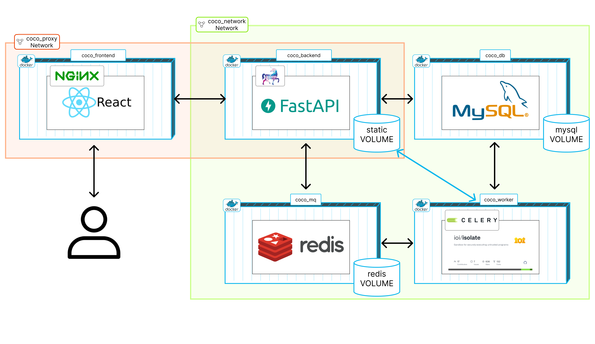

Docker Compose로 패키징되어 있던 것을 k3s를 통해 쿠버네티스 환경에 맞도록 변경시켜 적용해보았다.  
어느 정도 비슷한 맥락의 리소스들이 많았기 때문에 기본적인 변환은 문제없이 성공했다.

## 기존 Docker Compose 파악

  

기존의 Docker Compose는 사진과 같이 구성되어 있다.

{}

```yaml {base_url="https://github.com/PDA-PRO/COCO-deploy/blob/main/",filename="docker-compose.yml"}
version: "3"
name: "coco"
services:
  frontend:
    image: styughjvbn/coco_frontend
    container_name: coco_frontend
    build:
      context: ./coco/
      dockerfile: Dockerfile
    ports:
      - "80:80"
    stdin_open: true
    networks:
      - coco_proxy

  mysql:
    image: styughjvbn/coco_db
    container_name: coco_db
    platform: linux/x86_64
    build: ./mysql/
    volumes:
      - mysql:/var/lib/mysql
    ports: #host 3307과 컨테이너의 3306포트 연결
      - "3307:3306"
    env_file: # 설정에 필요한 환경변수
      - ./envs/mysql.env
    tty: true
    restart: always
    networks:
      - coco_network

  fastapi:
    image: styughjvbn/coco_backend
    depends_on:
      - mysql
    container_name: coco_backend
    platform: linux/x86_64
    build: ./
    restart: always
    tty: true
    volumes: # static 볼륨과 연결
      - static:/static
      - type: bind
        source: ./plugin
        target: /home/app/plugin
        volume:
          nocopy: false
    ports: #host 1000과 컨테이너의 8000포트 연결
      - 1000:8000
    env_file:
      - ./envs/common.env
      - ./envs/backend.env
    networks:
      - coco_network
      - coco_proxy

  # celery broker
  redis:
    image: styughjvbn/coco_mq
    container_name: coco_mq
    volumes:
      - mq:/data
    tty: true
    networks:
      - coco_network

  #celery worker
  celery_worker:
    image: styughjvbn/coco_worker
    container_name: coco_worker
    depends_on:
      - redis
    build:
      context: ./
      dockerfile: celeryworker.dockerfile
    volumes: # static 볼륨과 연결
      - static:/static
    env_file:
      - ./envs/common.env
      - ./envs/celeryworker.env
    privileged: true # isolate의 sandbox마다 컴퓨터 자원 제한을 하기 위해 필요한 설정값
    networks:
      - coco_network

volumes: # task의 test case와 같이 유지되는 파일들을 저장하는 볼륨
  static:
  mysql:
  mq:

networks:
  coco_network:
    name: coco_network
    attachable: true
  coco_proxy:
    name: coco_proxy
    attachable: true
```

{}

총 5개의 컨테이너로 구성되며 리액트로 빌드된 웹 정적파일을 서빙하며 리버스 프록시를 담당하는 `coco_frontend`, api 서버를 담당하는 `coco_backend`, 영속성을 담당하는 `coco_db`, 제출 코드 채점에 활용되는 `coco_mq`, 제출 코드 채점을 수행하는 `coco_worker`로 이루어져 있다.

coco_db, coco_mq는 데이터를 지속적으로 유지해야하기 때문에 볼륨을 지정하였으며 coco_backend 에는 알고리즘 문제에 대한 테스트 케이스가 존재하는 static 볼륨을 지정하였다. 이 static 볼륨은 코드 채점에도 사용되므로 coco_worker도 바인딩을 해두었다. 

docker 네트워크 설정의 경우 coco_frontend의 nginx 를 통해 정적 파일 서빙과 리버스 프록시가 가능하도록 coco_backend과 coco_frontend를 같은 네트워크로 구성하였다. 또한 나머지 백엔드의 기능이 원활히 동작하고 외부와의 접근 차단을 위해 coco_frontend를 제외한 나머지 4개의 컨테이너를 같은 네트워크로 구성하였다.

## k3s 매니페스트로 변환

### PersistentVolumeClaim (PVC)

* **역할:** 데이터 영속성 보장 (Pod 재시작/삭제 후에도 유지).
* **적용 대상:** `static`, `mysql`, `mq` volumes
* **스토리지:** K3s 기본 `local-path` StorageClass 사용 → 호스트 로컬 디렉토리에 저장.

**전**
```yaml {filename="docker-compose.yml"}
...
volumes: 
  static:
  mysql:
  mq:
...
```
**후**
```yaml
apiVersion: v1
kind: PersistentVolumeClaim
metadata:
  name: mysql-pvc
  namespace: project-a
spec:
  accessModes:
  - ReadWriteOnce
  resources:
    requests:
      storage: 5Gi
...
```

### ConfigMap

* **역할:** 애플리케이션에 필요한 일반 환경변수/설정 관리.
* **적용 대상:** .env로 관리하던 DB 접속 호스트, static 파일 경로 등
* **관리 방식:** .env를 이미지에 포함시키지 않고, ConfigMap/Secret에서 주입.

**전**
```yaml {base_url="https://github.com/PDA-PRO/COCO-deploy/blob/main/",filename="common.env"}
# Folder path where persistent static files will be stored.
TASK_PATH=/static/task/
NOTICE_PATH=/static/notice/
...

# db information
DATABASE_HOST=coco_db
...

# redis config
REDIS_HOST=coco_mq
...
```
**후**
```yaml
apiVersion: v1
kind: ConfigMap
metadata:
  name: fastapi-env
  namespace: project-a
data:
  DB_HOST: mysql
  REDIS_HOST: redis
  TASK_PATH: /static/task/
  NOTICE_PATH: /static/notice/
  ...
```

### Service

* **역할:** Pod 집합에 안정적인 접근 주소 제공 (DNS, 로드밸런싱).
* **종류와 적용 대상:**

  * **ClusterIP (기본값):** 클러스터 내부 통신용 (DB, Redis, 내부 API).
  * **NodePort:** 외부 접근 허용. 프론트엔드 서비스를 NodePort로 노출.
  * (추후 Ingress로 대체 가능).

**전**
```yaml {filename="docker-compose.yml"}
...
  fastapi:
    networks:
      - coco_network
...
networks:
  coco_network:
    name: coco_network
    attachable: true
  coco_proxy:
    name: coco_proxy
    attachable: true
...
```
**후**
```yaml
apiVersion: v1
kind: Service
metadata:
  name: fastapi-service
  namespace: project-a
spec:
  type: ClusterIP
  selector:
    app: fastapi
  ports:
  - port: 8000
    targetPort: 8000
```

### Secret

* **역할:** 민감정보 관리 (DB 비밀번호, API Key).
* **특징:** base64 인코딩 저장. kubectl로 생성 시 자동 처리.

```yaml
apiVersion: v1
kind: Secret
metadata:
  name: project-a-secret
  namespace: project-a
type: Opaque
data:
  DB_PASSWORD: cGFzc3dvcmQ=   # "password"의 base64
```


### Deployment

* **역할:** 컨테이너 실행과 라이프사이클 관리. 선언적 업데이트, 스케일링, 롤백 지원.
* **적용 대상:**

  * 프론트엔드(Nginx), 백엔드(FastAPI), Celery 워커, Redis, MySQL 각각을 `Deployment`로 생성.  * Stateless한 서비스(Nginx, FastAPI, Celery)는 Deployment로 충분.
  * MySQL 같은 Stateful 서비스도 초기엔 Deployment 사용 → 추후 **StatefulSet** 고려 가능.

**전**
```yaml {filename="docker-compose.yml"}
...
  fastapi:
    image: styughjvbn/coco_backend:prod
    depends_on:
      - mysql
    container_name: coco_backend
    platform: linux/x86_64
    build: ./
    restart: always
    tty: true
...
```
**후**
```yaml
apiVersion: apps/v1
kind: Deployment
metadata:
  name: fastapi
  namespace: project-a
spec:
  replicas: 1
  selector:
    matchLabels:
      app: fastapi
  template:
    metadata:
      labels:
        app: fastapi
    spec:
      containers:
      - name: fastapi
        image: styughjvbn/coco_backend:prod
        ports:
        - containerPort: 8000
        # configMap 주입
        envFrom:
        - configMapRef:
            name: fastapi-env
        volumeMounts:
        - mountPath: /static
            name: static-storage
    volumes:
    - name: static-storage
        # pvc 주입
        persistentVolumeClaim:
        claimName: static-pvc
```

## 정리

* **Deployment** → Pod 관리 및 스케일링
* **Service** → 네트워크 연결 안정화 (ClusterIP/NodePort)
* **PVC** → 데이터 영속성
* **ConfigMap** → 일반 설정값 관리
* **Secret** → 민감정보 관리
* **ConfigMap(volumes)** → 설정파일 직접 주입