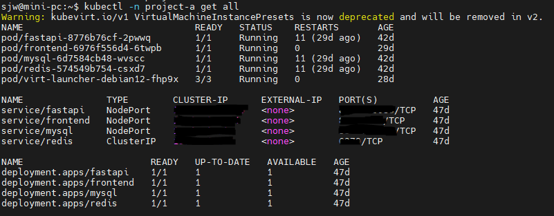
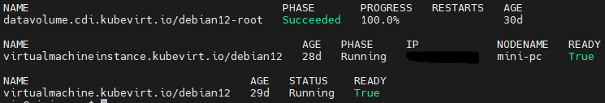
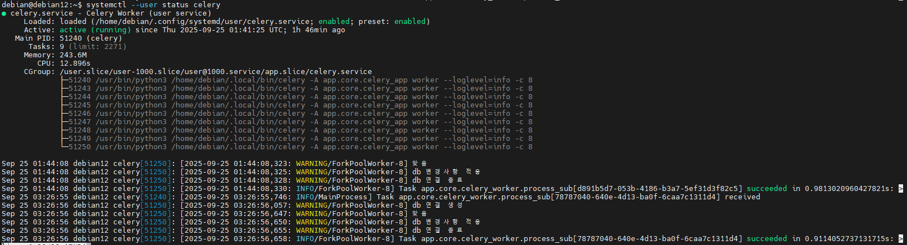

이번에는 본격적으로 홈서버에 배포를 진행했으며, 여러 시행착오를 거쳐 **AI 관련 기능을 제외한 나머지는 모두 정상적으로 배포**할 수 있었다.



## 예상치 못한 문제: Isolate 동작 실패

처음에는 단순히 매니페스트를 적용하기만 하면 Docker Compose 환경과 동일하게 동작할 것이라 생각했다. 하지만 실제로는 문제가 발생했다.
**작업 워커 역할을 하는 Pod에서 `isolate`가 정상적으로 동작하지 않는 것**이었다.
```bash
message:Cannot run proxy, clone failed: No space left on device
```

도커 환경에서는 동일한 실행이 문제없이 돌아갔으므로, 문제는 쿠버네티스의 보안 및 권한 제약에서 비롯된 것으로 보였다. 기본 컨테이너 런타임에서는 리눅스 컨테이너 기능에 대한 권한이 제한적이어서, isolate 실행이 차단되는 것이다.

더 큰 문제는 `--cg` 옵션이었다.

* 이 옵션은 샌드박스의 자원을 구체적으로 제한하고 실행 시간을 측정하는 핵심 기능이다.
* 하지만 도커조차도 이 기능을 제대로 지원하지 않아, 메모리·시간 사용량 측정에 신뢰성을 확보하기 어려웠다.

공식 문서에서도 다음과 같이 경고하고 있었다.

> Running Isolate in containers is not recommended, since container managers usually do not delegate control groups properly.
> If you still want to use containers, you are on your own and you probably have to make them privileged.

즉, 컨테이너 환경에서는 cgroup 제어를 위임받지 못할 수도 있으며, 정확한 동작을 보장할 수 없다는 의미다. 

## 해결책: VM으로 분리하기

결국 접근 방식을 바꿔 **VM을 별도로 띄우고 그 안에서 워커를 실행**하는 방식을 선택했다. 이렇게 하면 cgroup 제어를 온전히 활용할 수 있어 isolate가 의도한 대로 작동한다.

이를 위해 쿠버네티스 환경에 VM을 통합할 수 있는 **KubeVirt**를 도입했다. 여러 시행착오 끝에 다음과 같은 매니페스트로 VM을 구성했다.

```yaml
apiVersion: kubevirt.io/v1
kind: VirtualMachine
metadata:
  name: debian12
  namespace: project-a
spec:
  runStrategy: Manual
  template:
    metadata:
      labels:
        kubevirt.io/domain: debian12
    spec:
      domain:
        cpu:
          cores: 2
          model: host-passthrough
        resources:
          requests:
            memory: 2Gi
        devices:
          rng: {}
          interfaces:
            - name: default
              masquerade: {}
              ports:
                - name: ssh
                  port: 22
          disks:
            - name: rootdisk
              disk:
                bus: virtio
            - name: cloudinit
              disk:
                bus: virtio
          filesystems:
            - name: testcases
              virtiofs: {}
      networks:
        - name: default
          pod: {}
      volumes:
        - name: rootdisk
          persistentVolumeClaim:
            claimName: debian12-root
        - name: cloudinit
          cloudInitNoCloud:
            userData: |
              #cloud-config
              datasource_list: [ NoCloud ]
              users:
                - name: debian
                  sudo: ALL=(ALL) NOPASSWD:ALL
                  shell: /bin/bash
                  lock_passwd: false
                  ssh_authorized_keys:
                    - <ssh key>
              ssh_pwauth: false
              package_update: true
              packages:
                - openssh-server
                - qemu-guest-agent
              chpasswd:
                list: |
                  <userId>:<userPW>
                expire: false
              runcmd:
                - [ systemctl, enable, --now, ssh ]
                - [ systemctl, enable, --now, qemu-guest-agent ]
        - name: testcases
          persistentVolumeClaim:
            claimName: static-pvc


```

여기서 핵심은 **테스트 케이스가 저장된 PVC를 VM 내부에 마운트**하여 isolate가 `--cg` 옵션을 포함해 정상적으로 동작하도록 한 것이다.

## Celery Worker 실행

VM 내부에서는 채점 워커를 **systemd 서비스로 등록**해 안정적으로 실행되도록 했다.

```ini
[Unit]
Description=Celery Worker (user service)
After=network-online.target
Wants=network-online.target

[Service]
Type=simple
WorkingDirectory=%h

# 환경변수 지정
Environment=CELERY_CONCURRENCY=8

ExecStart=/home/debian/.local/bin/celery -A app.core.celery_app worker --loglevel=info -c ${CELERY_CONCURRENCY}

Restart=always
RestartSec=3

TimeoutStopSec=30
KillMode=process

StandardOutput=journal
StandardError=journal

[Install]
WantedBy=default.target

```
서비스 등록 및 실행 과정:

```bash
sudo systemctl daemon-reload
sudo systemctl enable celery
sudo systemctl start celery
```

## 결과

이제 isolate 기반의 채점 워커가 VM 환경에서 안정적으로 실행되고, 자원 제약과 실행 시간 측정도 올바르게 동작한다.




## 마무리

정리하면, 컨테이너 환경에서는 isolate가 기대한 대로 동작하지 않았고, 결국 VM을 통한 분리로 문제를 해결할 수 있었다.
이번 경험을 통해 **컨테이너와 VM의 장단점을 체감**할 수 있었고, 쿠버네티스와 KubeVirt의 조합이 특정 워크로드에서 얼마나 유용할 수 있는지도 확인했다. 다음 시간에는 핵심 기능인 논리 오류 수정 기능을 적용해보도록 하겠다.