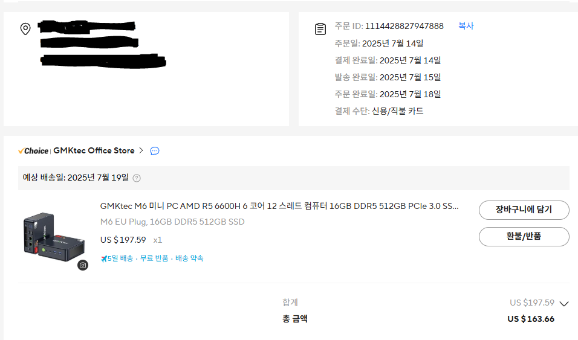

  

클라우드와 홈서버 중에서 어떤 것을 선택해야 할지 고민한 과정을 정리해보았다.  
결국 하드웨어를 직접 구매하고, SSH 접속 환경을 구성하는 단계까지 진행했다.


## 클라우드 VS 홈서버

프로젝트들을 데모 사이트 형태로 배포하려면 서버가 필요하다.  
예전에는 팀원들과 함께 AWS EC2를 사용하면서 비용을 분담했지만, 이제는 혼자 부담해야 했다.  

그렇다면 선택지는 두 가지다.  

1. 클라우드 서비스 (AWS, GCP, Azure, Naver Cloud 등)  
2. 홈서버 구축  

클라우드는 관리가 편리하고 확장성도 뛰어나지만, **비용이 문제**였다.  
 
EC2 t3.xlarge(8 vCPU, 16GB RAM)를 기준으로 월간 요금을 계산해 보니 약 30만 원 수준이었다.  

eks 같은 서비스를 이용하더라도 결국 만족스러운 환경을 구성하기 위해서는 최소 월 5만 원 이상은 지출해야 한다는 결론에 이르렀다.  

### 장점 & 단점
반면 미니 PC를 구매하면 초기 비용은 20여만 원이 들지만, 이후에는 전기료 외에 별도의 비용이 없다.  
게다가 데모 서버 용도뿐만 아니라 개인적인 테스트 환경으로도 자유롭게 활용할 수 있다는 장점이 있었다.  

물론 단점도 있었다.  
자취방 인터넷이 빌라 전체 공유망을 쓰는 구조라면, 외부에서 접속하기 위한 네트워크 설정이 번거로워질 수 있었다.  

### 네트워크 확인
그래서 예전부터 미뤄왔던 WOL기능을 적용해보면서 외부 접속이 가능한지 확인해봤다.  

공유기와 메인 PC에 **WOL(Wake on LAN)**을 설정하고 외부 네트워크에서 접속이 가능한지 실험해 본 결과, 문제없이 접속이 가능했다.  
이 과정을 통해 홈서버 구축으로 방향을 확정할 수 있었다.  


## 하드웨어 구매

홈서버로 많이 사용하는 미니 PC 중에는 n100과 같은 저전력 모델도 있었지만, 여러 프로젝트를 쿠버네티스로 운영하려면 조금 더 여유 있는 성능이 필요하다고 판단했다.  



최종적으로 **GMKtec M6**을 선택했다.  
사양은 6코어 12스레드 CPU, 16GB RAM, 512GB SSD 정도였고, 저전력 설계라서 24시간 구동해도 부담이 크지 않았다.  

## 환경 구축

미니 PC에는 처음에 윈도우 11이 설치되어 있었다.  
잠깐은 "새로운 개인용 PC" 같은 기분을 즐겼지만, 곧바로 서버 용도로 맞춰 **Ubuntu 22.04 LTS Server** 버전으로 재설치를 진행했다.  

```bash
sjw@mini-pc:~$ lsb_release -a
No LSB modules are available.
Distributor ID: Ubuntu
Description:    Ubuntu 22.04.5 LTS
Release:        22.04
Codename:       jammy
```

그 후에는 외부에서 SSH 접속이 가능하도록 공유기와 SSH 설정을 구성했다.

### 공유기 설정

* **DDNS**
  
* **포트포워딩**
  
* **내부 고정 IP 할당**
  

### SSH 설정

1. **OpenSSH 설치 및 활성화**

   ```bash
   sudo apt update
   sudo apt install openssh-server -y
   sudo systemctl enable ssh
   sudo systemctl start ssh
   ```

   이후 보안을 위해 비밀번호 로그인 해제, 포트 변경 등을 진행했다.

2. **포트포워딩 & 외부 접속 테스트**  
     
   공유기에서 포트포워딩을 설정하고 외부 네트워크에서 접속을 시도해 본 결과, 문제없이 접속이 가능했다.  
   

## 정리

클라우드와 홈서버 사이에서 고민했지만, 비용 대비 유연성을 고려했을 때 홈서버가 더 매력적인 선택이었다.
특히 미니 PC를 직접 세팅하고 SSH 접속까지 가능하게 만들면서, 서버 관리의 기본기를 익힐 수 있었다는 점이 큰 수확이었다.

앞으로는 이 환경 위에서 쿠버네티스를 활용하여 프로젝트들을 하나씩 올릴 예정이다. 